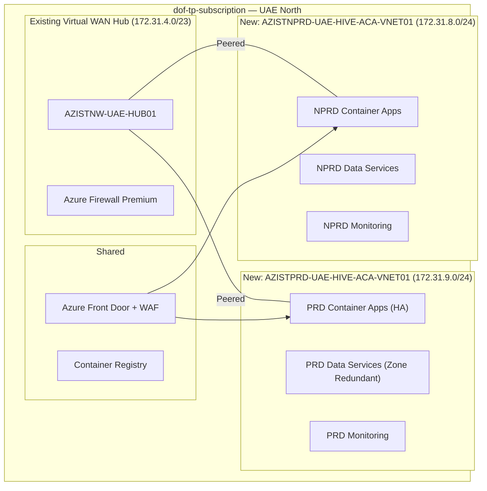
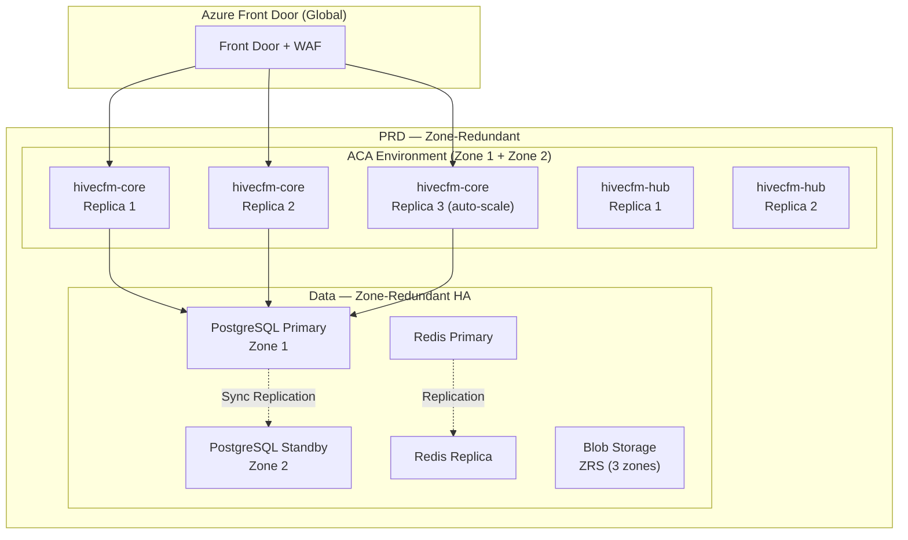

# HiveCFM Azure Environment Setup — NPRD & PRD

**Subscription:** dof-tp-subscription (ce8d1d77-7bc4-4e74-8795-0a75acbb20d5)
**Region:** UAE North
**Network:** 172.31.8.0/23 (new subnet within existing VWAN hub-spoke)
**Domain:** hivecfm.io

---

## Architecture Overview

---

## Network Architecture

### Subnet Allocation (172.31.8.0/23 = 512 IPs split into NPRD + PRD)

| Subnet | CIDR | Purpose | Environment |
|--------|------|---------|-------------|
| `AZISTNPRD-UAE-HIVE-ACA-SNET01` | 172.31.8.0/25 | Container Apps Environment | NPRD |
| `AZISTNPRD-UAE-HIVE-PVT-SNET02` | 172.31.8.128/26 | Private Endpoints (PostgreSQL, Redis, Blob) | NPRD |
| `AZISTNPRD-UAE-HIVE-MON-SNET03` | 172.31.8.192/26 | Monitoring (Grafana, Loki) | NPRD |
| `AZISTPRD-UAE-HIVE-ACA-SNET01` | 172.31.9.0/25 | Container Apps Environment | PRD |
| `AZISTPRD-UAE-HIVE-PVT-SNET02` | 172.31.9.128/26 | Private Endpoints (PostgreSQL, Redis, Blob) | PRD |
| `AZISTPRD-UAE-HIVE-MON-SNET03` | 172.31.9.192/26 | Monitoring (Grafana, Loki) | PRD |

---

## Resource Groups

| Resource Group | Purpose | Resources |
|----------------|---------|-----------|
| `AZISTNPRD-UAE-HIVECFM-RG01` | Non-production HiveCFM platform | ACA, PostgreSQL, Redis, Blob, KV, Monitoring |
| `AZISTPRD-UAE-HIVECFM-RG01` | Production HiveCFM platform (HA) | ACA, PostgreSQL, Redis, Blob, KV, Monitoring |
| `AZIST-UAE-HIVECFM-SHARED-RG01` | Shared resources | ACR, Front Door, WAF, DNS |

---

## Non-Production (NPRD) Environment

### Container Apps

| Azure Resource Name | Container App Name | Service | Image | CPU | Memory | Replicas | Tags |
|--------------------|--------------------|---------|-------|-----|--------|----------|------|
| **Container Apps Environment** | | | | | | | |
| `AZISTNPRD-UAE-HIVE-CEAPP01` | — | Container Environment | — | — | — | — | `project:hivecfm` `env:nprd` `managed-by:azure-devops` |
| **Container Apps** | | | | | | | |
| `azistnprd-uae-hive-capp01` | hivecfm-core | HiveCFM Core (Next.js) | `hivecfmacr.azurecr.io/hivecfm-core:latest` | 1 vCPU | 2 GB | 1 | `project:hivecfm` `env:nprd` `service:hivecfm-core` |
| `azistnprd-uae-hive-capp02` | hivecfm-hub | HiveCFM Hub API (Go) | `hivecfmacr.azurecr.io/hivecfm-hub:latest` | 0.5 vCPU | 1 GB | 1 | `project:hivecfm` `env:nprd` `service:hivecfm-hub` |
| `azistnprd-uae-hive-capp03` | n8n | n8n Workflow Automation | `n8nio/n8n:latest` | 0.5 vCPU | 1 GB | 1 | `project:hivecfm` `env:nprd` `service:n8n` |
| `azistnprd-uae-hive-capp04` | superset | Apache Superset Analytics | `apache/superset:3.1.0` | 0.5 vCPU | 1 GB | 1 | `project:hivecfm` `env:nprd` `service:superset` |
| `azistnprd-uae-hive-capp05` | grafana | Grafana (Logs Dashboard) | `grafana/grafana:11.0.0` | 0.25 vCPU | 0.5 GB | 1 | `project:hivecfm` `env:nprd` `service:grafana` |
| `azistnprd-uae-hive-capp06` | loki | Grafana Loki (Log Aggregation) | `grafana/loki:3.0.0` | 0.25 vCPU | 0.5 GB | 1 | `project:hivecfm` `env:nprd` `service:loki` |
| `azistnprd-uae-hive-capp07` | promtail | Promtail (Log Collector) | `grafana/promtail:3.0.0` | 0.25 vCPU | 0.5 GB | 1 | `project:hivecfm` `env:nprd` `service:promtail` |

### Data Services

| Azure Resource Name | Type | SKU | Details | Tags |
|--------------------|------|-----|---------|------|
| `azistnprd-uae-hivecfm-psql01` | PostgreSQL Flexible Server | Burstable B2s | v17, 64GB, no HA | `project:hivecfm` `env:nprd` `service:postgresql` |
| `azistnprd-uae-hivecfm-redis01` | Azure Cache for Redis | Basic C1 (1GB) | No replication | `project:hivecfm` `env:nprd` `service:redis` |
| `azistnprduaehivecfmst01` | Storage Account (Blob) | Standard_LRS | StorageV2, Containers: `hivecfm-uploads` | `project:hivecfm` `env:nprd` `service:blob-storage` |

### Security & Monitoring

| Azure Resource Name | Type | Details | Tags |
|--------------------|------|---------|------|
| `AZISTNPRD-UAE-HIVECFM-KV01` | Key Vault | Standard, Soft delete enabled | `project:hivecfm` `env:nprd` `service:keyvault` |
| `AZISTNPRD-UAE-HIVECFM-LAW01` | Log Analytics Workspace | 30-day retention | `project:hivecfm` `env:nprd` `service:log-analytics` |

### Private Endpoints (NPRD)

| Resource | Private Endpoint Name | Private DNS Zone |
|----------|----------------------|------------------|
| PostgreSQL | `azistnprd-uae-hivecfm-psql01-pe` | `privatelink.postgres.database.azure.com` |
| Redis | `azistnprd-uae-hivecfm-redis01-pe` | `privatelink.redis.cache.windows.net` |
| Blob Storage | `azistnprduaehivecfmst01-pe` | `privatelink.blob.core.windows.net` |
| Key Vault | `AZISTNPRD-UAE-HIVECFM-KV01-pe` | `privatelink.vaultcore.azure.net` |

---

## Production (PRD) Environment — HA / Zone-Redundant

### Container Apps

| Azure Resource Name | Container App Name | Service | Image | CPU | Memory | Min Replicas | Max Replicas | Tags |
|--------------------|--------------------|---------|-------|-----|--------|-------------|-------------|------|
| **Container Apps Environment** | | | | | | | | |
| `AZISTPRD-UAE-HIVE-CEAPP01` | — | Container Environment | — | — | — | — | — | `project:hivecfm` `env:prd` `managed-by:azure-devops` |
| **Container Apps** | | | | | | | | |
| `azistprd-uae-hive-capp01` | hivecfm-core | HiveCFM Core (Next.js) | `hivecfmacr.azurecr.io/hivecfm-core:latest` | 2 vCPU | 4 GB | **2** | **4** | `project:hivecfm` `env:prd` `service:hivecfm-core` |
| `azistprd-uae-hive-capp02` | hivecfm-hub | HiveCFM Hub API (Go) | `hivecfmacr.azurecr.io/hivecfm-hub:latest` | 1 vCPU | 2 GB | **2** | **3** | `project:hivecfm` `env:prd` `service:hivecfm-hub` |
| `azistprd-uae-hive-capp03` | n8n | n8n Workflow Automation | `n8nio/n8n:latest` | 1 vCPU | 2 GB | **2** | **2** | `project:hivecfm` `env:prd` `service:n8n` |
| `azistprd-uae-hive-capp04` | superset | Apache Superset Analytics | `apache/superset:3.1.0` | 1 vCPU | 2 GB | **2** | **3** | `project:hivecfm` `env:prd` `service:superset` |
| `azistprd-uae-hive-capp05` | grafana | Grafana (Logs Dashboard) | `grafana/grafana:11.0.0` | 0.5 vCPU | 1 GB | **1** | **2** | `project:hivecfm` `env:prd` `service:grafana` |
| `azistprd-uae-hive-capp06` | loki | Grafana Loki (Log Aggregation) | `grafana/loki:3.0.0` | 0.5 vCPU | 1 GB | **1** | **2** | `project:hivecfm` `env:prd` `service:loki` |
| `azistprd-uae-hive-capp07` | promtail | Promtail (Log Collector) | `grafana/promtail:3.0.0` | 0.25 vCPU | 0.5 GB | **1** | **1** | `project:hivecfm` `env:prd` `service:promtail` |

### Data Services (Zone-Redundant HA)

| Azure Resource Name | Type | SKU | Details | Tags |
|--------------------|------|-----|---------|------|
| `azistprd-uae-hivecfm-psql01` | PostgreSQL Flexible Server | **GP D2ds_v5** | v17, 128GB, **Zone-Redundant HA** | `project:hivecfm` `env:prd` `service:postgresql` |
| `azistprd-uae-hivecfm-redis01` | Azure Cache for Redis | **Standard C1** (1GB) | **Replicated**, SLA-backed | `project:hivecfm` `env:prd` `service:redis` |
| `azistprduaehivecfmst01` | Storage Account (Blob) | **Standard_ZRS** | StorageV2, Zone-Redundant, Containers: `hivecfm-uploads` | `project:hivecfm` `env:prd` `service:blob-storage` |

### Security & Monitoring

| Azure Resource Name | Type | Details | Tags |
|--------------------|------|---------|------|
| `AZISTPRD-UAE-HIVECFM-KV01` | Key Vault | Standard, Soft delete, Purge protection | `project:hivecfm` `env:prd` `service:keyvault` |
| `AZISTPRD-UAE-HIVECFM-LAW01` | Log Analytics Workspace | 90-day retention | `project:hivecfm` `env:prd` `service:log-analytics` |

### Private Endpoints (PRD)

| Resource | Private Endpoint Name | Private DNS Zone |
|----------|----------------------|------------------|
| PostgreSQL | `azistprd-uae-hivecfm-psql01-pe` | `privatelink.postgres.database.azure.com` |
| Redis | `azistprd-uae-hivecfm-redis01-pe` | `privatelink.redis.cache.windows.net` |
| Blob Storage | `azistprduaehivecfmst01-pe` | `privatelink.blob.core.windows.net` |
| Key Vault | `AZISTPRD-UAE-HIVECFM-KV01-pe` | `privatelink.vaultcore.azure.net` |

---

## Shared Resources

| Azure Resource Name | Type | Details | Tags |
|--------------------|------|---------|------|
| `hivecfmacr` | Azure Container Registry | **Standard** SKU, Geo-replicated to UAE North | `project:hivecfm` `env:shared` `service:acr` |
| `AZIST-UAE-HIVECFM-AFD01` | Azure Front Door | **Standard** with WAF, SSL termination | `project:hivecfm` `env:shared` `service:front-door` |
| `AZIST-UAE-HIVECFM-WAF01` | WAF Policy | OWASP 3.2, DDoS Protection, Rate limiting | `project:hivecfm` `env:shared` `service:waf` |

---

## DNS Records — hivecfm.io

### Non-Production (NPRD)

| DNS Record | Type | Value | Service |
|-----------|------|-------|---------|
| `nprd-uae-core.hivecfm.io` | CNAME | `AZIST-UAE-HIVECFM-AFD01.azurefd.net` | HiveCFM Core |
| `nprd-uae-hub.hivecfm.io` | CNAME | `AZIST-UAE-HIVECFM-AFD01.azurefd.net` | HiveCFM Hub API |
| `nprd-uae-n8n.hivecfm.io` | CNAME | `AZIST-UAE-HIVECFM-AFD01.azurefd.net` | n8n |
| `nprd-uae-superset.hivecfm.io` | CNAME | `AZIST-UAE-HIVECFM-AFD01.azurefd.net` | Superset |
| `nprd-uae-grafana.hivecfm.io` | CNAME | `AZIST-UAE-HIVECFM-AFD01.azurefd.net` | Grafana |

### Production (PRD)

| DNS Record | Type | Value | Service |
|-----------|------|-------|---------|
| `prd-uae-core.hivecfm.io` | CNAME | `AZIST-UAE-HIVECFM-AFD01.azurefd.net` | HiveCFM Core |
| `prd-uae-hub.hivecfm.io` | CNAME | `AZIST-UAE-HIVECFM-AFD01.azurefd.net` | HiveCFM Hub API |
| `prd-uae-n8n.hivecfm.io` | CNAME | `AZIST-UAE-HIVECFM-AFD01.azurefd.net` | n8n |
| `prd-uae-superset.hivecfm.io` | CNAME | `AZIST-UAE-HIVECFM-AFD01.azurefd.net` | Superset |
| `prd-uae-grafana.hivecfm.io` | CNAME | `AZIST-UAE-HIVECFM-AFD01.azurefd.net` | Grafana |
| `app.hivecfm.io` | CNAME | `AZIST-UAE-HIVECFM-AFD01.azurefd.net` | Production alias (user-facing) |

> **Note:** All DNS records point to Azure Front Door. Front Door routes to the correct backend based on the hostname. SSL certificates are managed by Front Door (auto-provisioned via Azure Managed Certificates).

---

## Azure Front Door Routing Rules

| Route Name | Frontend Host | Backend Pool | Path |
|-----------|---------------|-------------|------|
| `nprd-core` | `nprd-uae-core.hivecfm.io` | NPRD Container Apps → `azistnprd-uae-hive-capp01` | `/*` |
| `nprd-hub` | `nprd-uae-hub.hivecfm.io` | NPRD Container Apps → `azistnprd-uae-hive-capp02` | `/*` |
| `nprd-n8n` | `nprd-uae-n8n.hivecfm.io` | NPRD Container Apps → `azistnprd-uae-hive-capp03` | `/*` |
| `nprd-superset` | `nprd-uae-superset.hivecfm.io` | NPRD Container Apps → `azistnprd-uae-hive-capp04` | `/*` |
| `nprd-grafana` | `nprd-uae-grafana.hivecfm.io` | NPRD Container Apps → `azistnprd-uae-hive-capp05` | `/*` |
| `prd-core` | `prd-uae-core.hivecfm.io` + `app.hivecfm.io` | PRD Container Apps → `azistprd-uae-hive-capp01` | `/*` |
| `prd-hub` | `prd-uae-hub.hivecfm.io` | PRD Container Apps → `azistprd-uae-hive-capp02` | `/*` |
| `prd-n8n` | `prd-uae-n8n.hivecfm.io` | PRD Container Apps → `azistprd-uae-hive-capp03` | `/*` |
| `prd-superset` | `prd-uae-superset.hivecfm.io` | PRD Container Apps → `azistprd-uae-hive-capp04` | `/*` |
| `prd-grafana` | `prd-uae-grafana.hivecfm.io` | PRD Container Apps → `azistprd-uae-hive-capp05` | `/*` |

---

## PRD HA / Redundancy Design

### HA Details

| Component | Strategy | RPO | RTO |
|-----------|----------|-----|-----|
| **HiveCFM Core** | 2-4 replicas across zones | 0 | ~30s (ACA auto-restart) |
| **HiveCFM Hub** | 2-3 replicas across zones | 0 | ~30s |
| **PostgreSQL** | Zone-Redundant HA (sync standby) | 0 | ~60s (auto-failover) |
| **Redis** | Standard tier with replication | ~1s | ~60s (auto-failover) |
| **Blob Storage** | ZRS (3 availability zones) | 0 | 0 |
| **Front Door** | Global anycast, auto-failover | 0 | ~10s |

---

## Tags Standard

All resources tagged with:

| Tag Key | Description | Examples |
|---------|------------|---------|
| `project` | Project name | `hivecfm` |
| `env` | Environment | `nprd`, `prd`, `shared` |
| `service` | Service name | `hivecfm-core`, `hivecfm-hub`, `n8n`, `superset`, `grafana`, `loki`, `postgresql`, `redis`, `blob-storage`, `keyvault` |
| `owner` | Team/owner | `xcai-platform` |
| `cost-center` | Cost allocation | `hivecfm-platform` |
| `managed-by` | Deployment tool | `azure-devops` |
| `created-date` | Creation date | `2026-04-03` |

---

## Resource Summary

| Resource Type | NPRD | PRD |
|---------------|------|-----|
| Container Apps Environment | 1 | 1 |
| Container Apps | 7 | 7 |
| PostgreSQL Flexible Server | 1 (Burstable B2s) | 1 (GP D2ds_v5 + HA) |
| Azure Cache Redis | 1 (Basic C1) | 1 (Standard C1 + Replica) |
| Storage Account (Blob) | 1 (LRS) | 1 (ZRS) |
| Key Vault | 1 | 1 |
| Log Analytics Workspace | 1 | 1 |
| Private Endpoints | 4 | 4 |
| **Total per env** | **16** | **16** |
| **Shared** | ACR + Front Door + WAF = **3** | |
| **Grand Total** | **35 resources** | |

---

## Estimated Monthly Cost (USD)

| Component | NPRD | PRD |
|-----------|------|-----|
| Container Apps (7 apps) | ~$80 | ~$350 |
| PostgreSQL Flexible | ~$50 (B2s) | ~$200 (D2ds_v5 + HA) |
| Redis | ~$16 (Basic C1) | ~$55 (Standard C1) |
| Blob Storage | ~$5 | ~$10 (ZRS) |
| Key Vault | ~$3 | ~$3 |
| Log Analytics | ~$10 | ~$30 |
| Front Door + WAF | ~$40 (shared) | included |
| ACR (Standard) | ~$20 (shared) | included |
| **Total** | **~$224/month** | **~$648/month** |

---

## Deployment Order

### Phase 1: Shared Infrastructure
1. Create resource groups
2. Create Azure Container Registry (`hivecfmacr`)
3. Create Azure Front Door + WAF Policy

### Phase 2: NPRD Environment
1. Create VNet + Subnets (172.31.8.0/24)
2. Peer with existing Virtual WAN Hub
3. Create PostgreSQL Flexible Server + Private Endpoint
4. Create Redis Cache + Private Endpoint
5. Create Storage Account + Private Endpoint + Container
6. Create Key Vault + Private Endpoint + Secrets
7. Create Container Apps Environment
8. Deploy Container Apps (capp01-capp07)
9. Create Log Analytics Workspace
10. Configure Front Door routes for NPRD
11. Add DNS CNAME records

### Phase 3: PRD Environment
1. Create VNet + Subnets (172.31.9.0/24)
2. Peer with existing Virtual WAN Hub
3. Create PostgreSQL Flexible Server with **Zone-Redundant HA** + Private Endpoint
4. Create Redis Cache **Standard** + Private Endpoint
5. Create Storage Account **ZRS** + Private Endpoint + Container
6. Create Key Vault + Private Endpoint + Secrets
7. Create Container Apps Environment
8. Deploy Container Apps with **min 2 replicas** (capp01-capp07)
9. Create Log Analytics Workspace
10. Configure Front Door routes for PRD
11. Add DNS CNAME records
12. Configure auto-scaling rules for Core (2→4) and Hub (2→3)

### Phase 4: CI/CD Pipeline
1. Configure Azure DevOps pipeline to build → push to ACR → deploy to ACA
2. NPRD: auto-deploy on merge to `hivecfm-main`
3. PRD: manual approval gate after NPRD succeeds
