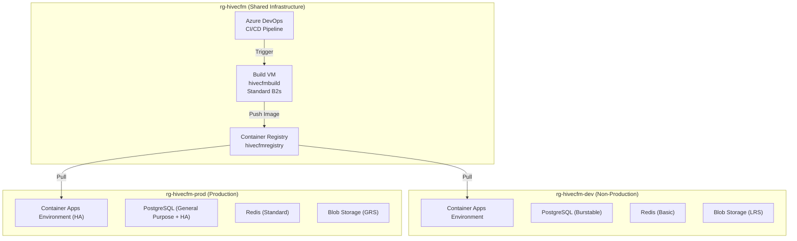
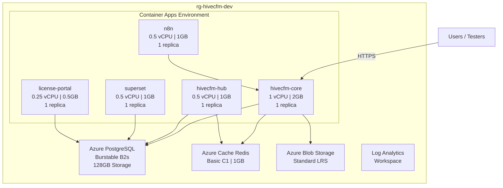
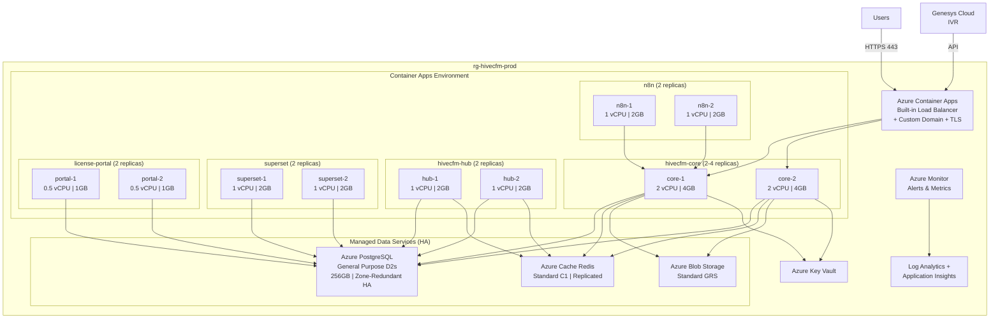
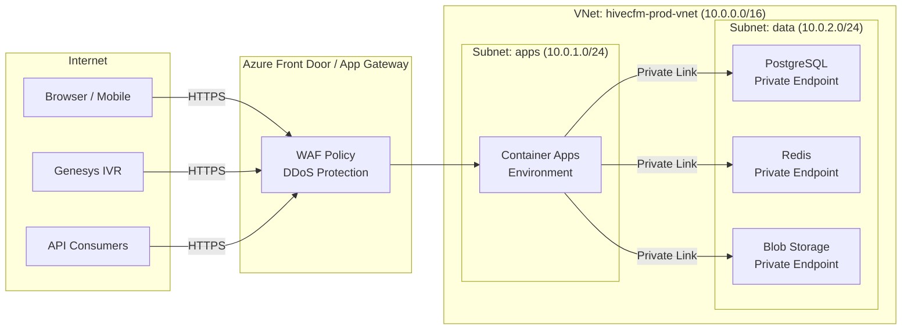
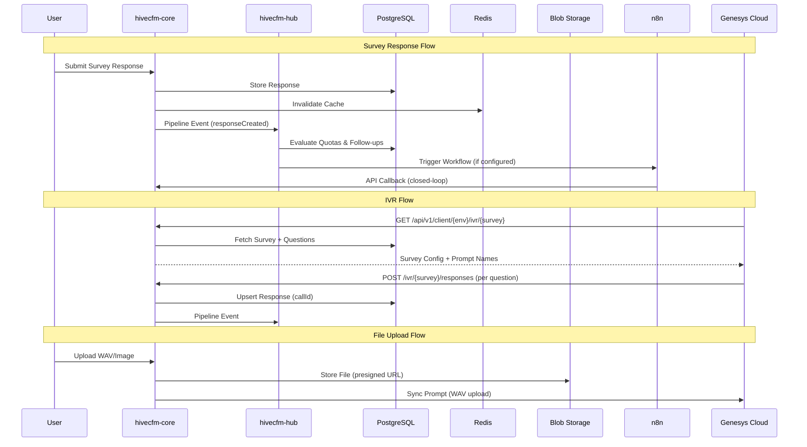
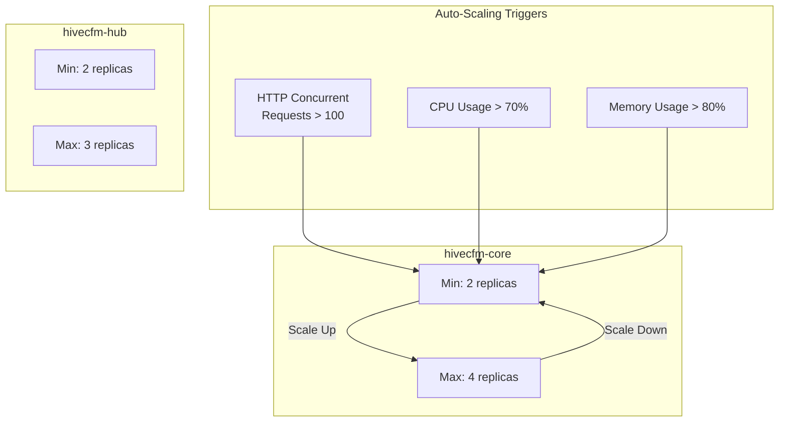
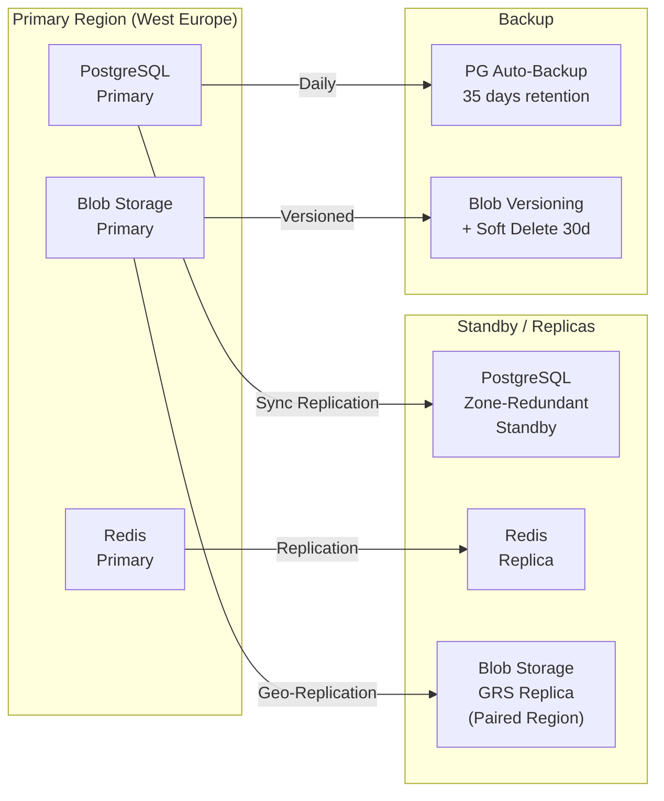

# HiveCFM Azure Environment Setup

## Architecture Overview



---

## Non-Production Environment



---

## Production Environment



---

## Network Architecture (Production)



---

## CI/CD Pipeline

```mermaid
graph LR
    DEV["Developer<br/>git push"] -->|Push| REPO["Azure DevOps<br/>Git Repo"]
    REPO -->|Trigger| PIPELINE["Pipeline"]

    subgraph "Build (rg-hivecfm)"
        PIPELINE --> CHECKOUT["Checkout Code"]
        CHECKOUT --> DOCKER["Docker Build<br/>on hivecfmbuild VM"]
        DOCKER --> PUSH["Push to ACR"]
    end

    subgraph "Deploy Non-Prod (rg-hivecfm-dev)"
        PUSH -->|Auto| DEV_DEPLOY["Update Container Apps"]
        DEV_DEPLOY --> SMOKE["Smoke Tests"]
    end

    subgraph "Deploy Production (rg-hivecfm-prod)"
        SMOKE -->|Manual Approval| PROD_DEPLOY["Update Container Apps"]
        PROD_DEPLOY --> HEALTH["Health Check"]
        HEALTH -->|Fail| ROLLBACK["Auto Rollback"]
    end
```



---

## Data Flow



---

## Environment Comparison

### Resource Specifications

| Resource | Non-Production | Production |
|---|---|---|
| **hivecfm-core** | 1 vCPU, 2GB, 1 replica | 2 vCPU, 4GB, 2-4 replicas |
| **hivecfm-hub** | 0.5 vCPU, 1GB, 1 replica | 1 vCPU, 2GB, 2 replicas |
| **n8n** | 0.5 vCPU, 1GB, 1 replica | 1 vCPU, 2GB, 2 replicas |
| **superset** | 0.5 vCPU, 1GB, 1 replica | 1 vCPU, 2GB, 2 replicas |
| **license-portal** | 0.25 vCPU, 0.5GB, 1 replica | 0.5 vCPU, 1GB, 2 replicas |
| **PostgreSQL** | Burstable B2s, 128GB, No HA | General Purpose D2s, 256GB, Zone-Redundant HA |
| **Redis** | Basic C1, 1GB | Standard C1, 1GB, Replicated |
| **Blob Storage** | Standard LRS | Standard GRS (Geo-Redundant) |
| **Key Vault** | - | Standard |
| **Monitoring** | Log Analytics only | Log Analytics + App Insights + Alerts |
| **Network** | Public endpoints | VNet + Private Endpoints + WAF |
| **Backup** | PG auto-backup (7 days) | PG auto-backup (35 days) + Blob versioning |

### Monthly Cost Estimate

| Resource | Non-Prod (rg-hivecfm-dev) | Production (rg-hivecfm-prod) |
|---|---|---|
| hivecfm-core | $23 | $140 |
| hivecfm-hub | $8 | $70 |
| n8n | $9 | $70 |
| superset | $8 | $70 |
| license-portal | $4 | $35 |
| PostgreSQL | $40 | $280 |
| Redis | $20 | $80 |
| Blob Storage | $5 | $15 |
| Key Vault | - | $5 |
| Monitoring / Logs | $2 | $25 |
| WAF / Front Door | - | $50 |
| **Total** | **~$119/mo** | **~$840/mo** |

> Shared infrastructure (ACR, Build VM, Azure DevOps) in `rg-hivecfm` costs ~$80/mo and is not included above.

---

## Step-by-Step Setup

### Phase 1: Non-Production (rg-hivecfm-dev)

```bash
# 1. Create Resource Group
az group create --name rg-hivecfm-dev --location westeurope

# 2. Create Log Analytics Workspace
az monitor log-analytics workspace create \
  --resource-group rg-hivecfm-dev \
  --workspace-name hivecfm-dev-logs

# 3. Create Container Apps Environment
az containerapp env create \
  --name hivecfm-dev-env \
  --resource-group rg-hivecfm-dev \
  --location westeurope \
  --logs-workspace-id <LOG_ANALYTICS_WORKSPACE_ID>

# 4. PostgreSQL
az postgres flexible-server create \
  --name hivecfm-dev-pg \
  --resource-group rg-hivecfm-dev \
  --location westeurope \
  --sku-name Standard_B2s \
  --tier Burstable \
  --storage-size 128 \
  --version 17 \
  --admin-user pgadmin \
  --admin-password '<STRONG_PASSWORD>' \
  --yes

# 5. Redis
az redis create \
  --name hivecfm-dev-redis \
  --resource-group rg-hivecfm-dev \
  --location westeurope \
  --sku Basic \
  --vm-size C1

# 6. Blob Storage
az storage account create \
  --name hivecfmdevstorage \
  --resource-group rg-hivecfm-dev \
  --location westeurope \
  --sku Standard_LRS \
  --kind StorageV2

az storage container create \
  --name hivecfm-uploads \
  --account-name hivecfmdevstorage

# 7. Container Apps (pull from shared ACR in rg-hivecfm)
az containerapp create \
  --name hivecfm-core \
  --resource-group rg-hivecfm-dev \
  --environment hivecfm-dev-env \
  --image hivecfmregistry.azurecr.io/hivecfm-core:latest \
  --registry-server hivecfmregistry.azurecr.io \
  --cpu 1.0 --memory 2Gi \
  --min-replicas 1 --max-replicas 3 \
  --ingress external --target-port 3000 \
  --env-vars \
    DATABASE_URL="<DEV_PG_CONNECTION_STRING>" \
    REDIS_URL="<DEV_REDIS_CONNECTION_STRING>" \
    NEXTAUTH_URL="https://dev.hivecfm.yourdomain.com" \
    NEXTAUTH_SECRET="<SECRET>" \
    WEBAPP_URL="https://dev.hivecfm.yourdomain.com" \
    ENCRYPTION_KEY="<KEY>" \
    STORAGE_PROVIDER="azureBlob" \
    AZURE_BLOB_CONNECTION_STRING="<DEV_BLOB_CONN>" \
    AZURE_BLOB_CONTAINER_NAME="hivecfm-uploads"

az containerapp create \
  --name hivecfm-hub \
  --resource-group rg-hivecfm-dev \
  --environment hivecfm-dev-env \
  --image hivecfmregistry.azurecr.io/hivecfm-hub:latest \
  --registry-server hivecfmregistry.azurecr.io \
  --cpu 0.5 --memory 1Gi \
  --min-replicas 1 --max-replicas 2 \
  --ingress external --target-port 3001 \
  --env-vars \
    DATABASE_URL="<DEV_PG_CONNECTION_STRING>" \
    REDIS_URL="<DEV_REDIS_CONNECTION_STRING>"

az containerapp create \
  --name n8n \
  --resource-group rg-hivecfm-dev \
  --environment hivecfm-dev-env \
  --image n8nio/n8n:latest \
  --cpu 0.5 --memory 1Gi \
  --min-replicas 1 --max-replicas 1 \
  --ingress external --target-port 5678 \
  --env-vars \
    DB_TYPE="postgresdb" \
    DB_POSTGRESDB_HOST="<DEV_PG_HOST>" \
    DB_POSTGRESDB_DATABASE="n8n" \
    DB_POSTGRESDB_USER="pgadmin" \
    DB_POSTGRESDB_PASSWORD="<PW>"

az containerapp create \
  --name superset \
  --resource-group rg-hivecfm-dev \
  --environment hivecfm-dev-env \
  --image apache/superset:3.1.0 \
  --cpu 0.5 --memory 1Gi \
  --min-replicas 1 --max-replicas 1 \
  --ingress external --target-port 8088 \
  --env-vars \
    SUPERSET_SECRET_KEY="<SECRET>" \
    SQLALCHEMY_DATABASE_URI="postgresql://superset:<PW>@<DEV_PG_HOST>:5432/superset_app"

az containerapp create \
  --name license-portal \
  --resource-group rg-hivecfm-dev \
  --environment hivecfm-dev-env \
  --image hivecfmregistry.azurecr.io/hivecfm-license-portal:latest \
  --registry-server hivecfmregistry.azurecr.io \
  --cpu 0.25 --memory 0.5Gi \
  --min-replicas 1 --max-replicas 1 \
  --ingress external --target-port 3003 \
  --env-vars \
    HIVECFM_DATABASE_URL="<DEV_PG_CONNECTION_STRING>" \
    NEXTAUTH_SECRET="<SECRET>"
```

### Phase 2: Production (rg-hivecfm-prod)

```bash
# 1. Create Resource Group
az group create --name rg-hivecfm-prod --location westeurope

# 2. Log Analytics + Application Insights
az monitor log-analytics workspace create \
  --resource-group rg-hivecfm-prod \
  --workspace-name hivecfm-prod-logs

# 3. Container Apps Environment
az containerapp env create \
  --name hivecfm-prod-env \
  --resource-group rg-hivecfm-prod \
  --location westeurope \
  --logs-workspace-id <PROD_LOG_WORKSPACE_ID>

# 4. PostgreSQL (General Purpose + HA)
az postgres flexible-server create \
  --name hivecfm-prod-pg \
  --resource-group rg-hivecfm-prod \
  --location westeurope \
  --sku-name Standard_D2s_v3 \
  --tier GeneralPurpose \
  --storage-size 256 \
  --version 17 \
  --high-availability ZoneRedundant \
  --admin-user pgadmin \
  --admin-password '<STRONG_PASSWORD>' \
  --yes

# 5. Redis (Standard = replicated)
az redis create \
  --name hivecfm-prod-redis \
  --resource-group rg-hivecfm-prod \
  --location westeurope \
  --sku Standard \
  --vm-size C1

# 6. Blob Storage (Geo-Redundant)
az storage account create \
  --name hivecfmprodstorage \
  --resource-group rg-hivecfm-prod \
  --location westeurope \
  --sku Standard_GRS \
  --kind StorageV2

az storage container create \
  --name hivecfm-uploads \
  --account-name hivecfmprodstorage

# 7. Key Vault
az keyvault create \
  --name hivecfm-prod-kv \
  --resource-group rg-hivecfm-prod \
  --location westeurope

# 8. Container Apps (HA with replicas)
az containerapp create \
  --name hivecfm-core \
  --resource-group rg-hivecfm-prod \
  --environment hivecfm-prod-env \
  --image hivecfmregistry.azurecr.io/hivecfm-core:latest \
  --registry-server hivecfmregistry.azurecr.io \
  --cpu 2.0 --memory 4Gi \
  --min-replicas 2 --max-replicas 4 \
  --ingress external --target-port 3000 \
  --env-vars \
    DATABASE_URL="<PROD_PG_CONNECTION_STRING>" \
    REDIS_URL="<PROD_REDIS_CONNECTION_STRING>" \
    NEXTAUTH_URL="https://hivecfm.yourdomain.com" \
    NEXTAUTH_SECRET="<SECRET>" \
    WEBAPP_URL="https://hivecfm.yourdomain.com" \
    ENCRYPTION_KEY="<KEY>" \
    STORAGE_PROVIDER="azureBlob" \
    AZURE_BLOB_CONNECTION_STRING="<PROD_BLOB_CONN>" \
    AZURE_BLOB_CONTAINER_NAME="hivecfm-uploads"

az containerapp create \
  --name hivecfm-hub \
  --resource-group rg-hivecfm-prod \
  --environment hivecfm-prod-env \
  --image hivecfmregistry.azurecr.io/hivecfm-hub:latest \
  --registry-server hivecfmregistry.azurecr.io \
  --cpu 1.0 --memory 2Gi \
  --min-replicas 2 --max-replicas 3 \
  --ingress external --target-port 3001 \
  --env-vars \
    DATABASE_URL="<PROD_PG_CONNECTION_STRING>" \
    REDIS_URL="<PROD_REDIS_CONNECTION_STRING>"

az containerapp create \
  --name n8n \
  --resource-group rg-hivecfm-prod \
  --environment hivecfm-prod-env \
  --image n8nio/n8n:latest \
  --cpu 1.0 --memory 2Gi \
  --min-replicas 2 --max-replicas 3 \
  --ingress external --target-port 5678 \
  --env-vars \
    DB_TYPE="postgresdb" \
    DB_POSTGRESDB_HOST="<PROD_PG_HOST>" \
    DB_POSTGRESDB_DATABASE="n8n" \
    DB_POSTGRESDB_USER="pgadmin" \
    DB_POSTGRESDB_PASSWORD="<PW>"

az containerapp create \
  --name superset \
  --resource-group rg-hivecfm-prod \
  --environment hivecfm-prod-env \
  --image apache/superset:3.1.0 \
  --cpu 1.0 --memory 2Gi \
  --min-replicas 2 --max-replicas 3 \
  --ingress external --target-port 8088 \
  --env-vars \
    SUPERSET_SECRET_KEY="<SECRET>" \
    SQLALCHEMY_DATABASE_URI="postgresql://superset:<PW>@<PROD_PG_HOST>:5432/superset_app"

az containerapp create \
  --name license-portal \
  --resource-group rg-hivecfm-prod \
  --environment hivecfm-prod-env \
  --image hivecfmregistry.azurecr.io/hivecfm-license-portal:latest \
  --registry-server hivecfmregistry.azurecr.io \
  --cpu 0.5 --memory 1Gi \
  --min-replicas 2 --max-replicas 2 \
  --ingress external --target-port 3003 \
  --env-vars \
    HIVECFM_DATABASE_URL="<PROD_PG_CONNECTION_STRING>" \
    NEXTAUTH_SECRET="<SECRET>"

# 9. Auto-scaling rules
az containerapp update \
  --name hivecfm-core \
  --resource-group rg-hivecfm-prod \
  --scale-rule-name http-scaling \
  --scale-rule-type http \
  --scale-rule-http-concurrency 100

# 10. Custom Domain + TLS
az containerapp hostname add \
  --name hivecfm-core \
  --resource-group rg-hivecfm-prod \
  --hostname hivecfm.yourdomain.com

az containerapp hostname bind \
  --name hivecfm-core \
  --resource-group rg-hivecfm-prod \
  --hostname hivecfm.yourdomain.com \
  --environment hivecfm-prod-env \
  --validation-method CNAME
```

### Phase 3: Production Network Hardening

```bash
# 11. VNet Integration
az network vnet create \
  --name hivecfm-prod-vnet \
  --resource-group rg-hivecfm-prod \
  --location westeurope \
  --address-prefix 10.0.0.0/16

az network vnet subnet create \
  --name apps-subnet \
  --resource-group rg-hivecfm-prod \
  --vnet-name hivecfm-prod-vnet \
  --address-prefix 10.0.1.0/24

az network vnet subnet create \
  --name data-subnet \
  --resource-group rg-hivecfm-prod \
  --vnet-name hivecfm-prod-vnet \
  --address-prefix 10.0.2.0/24

# 12. Private Endpoints for Data Services
az postgres flexible-server update \
  --name hivecfm-prod-pg \
  --resource-group rg-hivecfm-prod \
  --public-access Disabled
```

---

## Scaling Rules



---

## Backup & Disaster Recovery (Production)



---

## Monthly Cost Summary

| Resource | Non-Prod (rg-hivecfm-dev) | Production (rg-hivecfm-prod) |
|---|---|---|
| hivecfm-core | $23 | $140 |
| hivecfm-hub | $8 | $70 |
| n8n | $9 | $70 |
| superset | $8 | $70 |
| license-portal | $4 | $35 |
| PostgreSQL | $40 | $280 |
| Redis | $20 | $80 |
| Blob Storage | $5 | $15 |
| Key Vault | - | $5 |
| Monitoring / Logs | $2 | $25 |
| WAF / Front Door | - | $50 |
| **Total** | **~$119/mo** | **~$840/mo** |

> Shared infrastructure (ACR, Build VM, Azure DevOps) remains in `rg-hivecfm` (~$80/mo) and is not included above.

---

## Environment Variables Reference

| Variable                       | Required     | Description                              |
| ------------------------------ | ------------ | ---------------------------------------- |
| `DATABASE_URL`                 | Yes          | PostgreSQL connection string             |
| `REDIS_URL`                    | Yes          | Redis connection string                  |
| `NEXTAUTH_URL`                 | Yes          | Public app URL                           |
| `NEXTAUTH_SECRET`              | Yes          | NextAuth session secret                  |
| `WEBAPP_URL`                   | Yes          | Public app URL (same as NEXTAUTH_URL)    |
| `ENCRYPTION_KEY`               | Yes          | 32-char encryption key                   |
| `CRON_SECRET`                  | Yes          | Secret for cron job endpoints            |
| `STORAGE_PROVIDER`             | Yes          | `s3` or `azureBlob`                      |
| `AZURE_BLOB_CONNECTION_STRING` | If azureBlob | Blob storage connection string           |
| `AZURE_BLOB_CONTAINER_NAME`    | If azureBlob | Container name (e.g., `hivecfm-uploads`) |
| `S3_ACCESS_KEY`                | If s3        | S3/MinIO access key                      |
| `S3_SECRET_KEY`                | If s3        | S3/MinIO secret key                      |
| `S3_BUCKET_NAME`               | If s3        | Bucket name                              |
| `S3_ENDPOINT_URL`              | If s3        | S3 endpoint URL                          |
| `ENTERPRISE_LICENSE_KEY`       | No           | Enables SSO, SAML, RBAC                  |
| `AZUREAD_CLIENT_ID`            | No           | Azure AD SSO client ID                   |
| `AZUREAD_CLIENT_SECRET`        | No           | Azure AD SSO client secret               |
| `AZUREAD_TENANT_ID`            | No           | Azure AD tenant ID                       |
| `MAIL_FROM`                    | No           | Email sender address                     |
| `OPENAI_API_KEY`               | No           | AI translation feature                   |
