# HiveCFM Deployment Plan — dof-tp-subscription

## Overview

Deploy HiveCFM solution into the existing **dof-tp-subscription** infrastructure with **zero changes** to existing resources. Uses dedicated Container Apps Environments in the existing RESERVE subnets, dedicated new PostgreSQL servers, new Redis Cache, and existing Blob Storage.

**Target Capacity:**
- **NPRD:** 2,000 responses/day
- **PRD:** 50,000 responses/day (with HA replicas + load balancing)

**Domain:** `hivecfm.io` with `{env}-{region}-{service}` subdomain pattern

---

## What Gets Added (Nothing Existing Changes)

### Per Environment Summary

| Resource | NPRD | PRD |
|---|---|---|
| Container Apps Environment | 1 (in RESERVE01 subnet) | 1 (in Reserve01 subnet) |
| Containers | 5 (1 replica each) | 5 (2-4 replicas with LB) |
| PostgreSQL Flexible Server | 1 (NEW — Burstable B2s) | 1 (NEW — GP D2ds_v5, Zone-Redundant HA) |
| Azure Cache for Redis | 1 (Basic C1) | 1 (Standard C1 — replicated) |
| Blob container | 1 (on existing storage account) | 1 (on existing storage account) |
| Key Vault secrets | 10 (in existing vault) | 10 (in existing vault) |
| Private Endpoints | 2 (PostgreSQL + Redis) | 2 (PostgreSQL + Redis) |
| Private DNS Zone Links | 2 (PostgreSQL + Redis → VNet) | 2 (PostgreSQL + Redis → VNet) |

### What Stays Unchanged

- Virtual WAN / Hub / Azure Firewall
- VNets / Subnets / NSGs (except RESERVE01 used for Container Apps)
- Bastion Hosts
- Application Gateways / WAF Policies
- API Management instances
- Existing Web Apps (APP01-APP08)
- Existing SQL Servers / Elastic Pools / SQL Databases
- Existing PostgreSQL Servers (completely untouched)
- Existing Storage Accounts (container added only)
- Key Vaults (secrets added only)
- Log Analytics / Network Watcher / Flow Logs
- VMs / Disks / Extensions
- Private DNS Zones (links added only)

---

## DNS Plan — hivecfm.io

### Subdomain Pattern

```
{env}-{region}-{service}.hivecfm.io
```

| Component | Values |
|---|---|
| `{env}` | `nprd` or `prd` |
| `{region}` | `uae` |
| `{service}` | `app`, `hub`, `n8n`, `superset`, `river` |

### NPRD URLs

| URL | Container |
|---|---|
| `https://nprd-uae-app.hivecfm.io` | hivecfm-core |
| `https://nprd-uae-hub.hivecfm.io` | hivecfm-hub |
| `https://nprd-uae-n8n.hivecfm.io` | n8n |
| `https://nprd-uae-superset.hivecfm.io` | superset |
| `https://nprd-uae-river.hivecfm.io` | river |

### PRD URLs

| URL | Container |
|---|---|
| `https://prd-uae-app.hivecfm.io` | hivecfm-core |
| `https://prd-uae-hub.hivecfm.io` | hivecfm-hub |
| `https://prd-uae-n8n.hivecfm.io` | n8n |
| `https://prd-uae-superset.hivecfm.io` | superset |
| `https://prd-uae-river.hivecfm.io` | river |

### DNS Records

#### CNAME Records (10 total)

| Type | Name | Value |
|---|---|---|
| CNAME | `nprd-uae-app` | `hivecfm-core.{NPRD-CAE-domain}.azurecontainerapps.io` |
| CNAME | `nprd-uae-hub` | `hivecfm-hub.{NPRD-CAE-domain}.azurecontainerapps.io` |
| CNAME | `nprd-uae-n8n` | `n8n.{NPRD-CAE-domain}.azurecontainerapps.io` |
| CNAME | `nprd-uae-superset` | `superset.{NPRD-CAE-domain}.azurecontainerapps.io` |
| CNAME | `nprd-uae-river` | `river.{NPRD-CAE-domain}.azurecontainerapps.io` |
| CNAME | `prd-uae-app` | `hivecfm-core.{PRD-CAE-domain}.azurecontainerapps.io` |
| CNAME | `prd-uae-hub` | `hivecfm-hub.{PRD-CAE-domain}.azurecontainerapps.io` |
| CNAME | `prd-uae-n8n` | `n8n.{PRD-CAE-domain}.azurecontainerapps.io` |
| CNAME | `prd-uae-superset` | `superset.{PRD-CAE-domain}.azurecontainerapps.io` |
| CNAME | `prd-uae-river` | `river.{PRD-CAE-domain}.azurecontainerapps.io` |

> `{NPRD-CAE-domain}` and `{PRD-CAE-domain}` will be assigned when Container Apps Environments are created in Phase 1.

#### TXT Verification Records (10 total)

| Type | Name | Value |
|---|---|---|
| TXT | `asuid.nprd-uae-app` | `{NPRD CAE verification ID}` |
| TXT | `asuid.nprd-uae-hub` | `{NPRD CAE verification ID}` |
| TXT | `asuid.nprd-uae-n8n` | `{NPRD CAE verification ID}` |
| TXT | `asuid.nprd-uae-superset` | `{NPRD CAE verification ID}` |
| TXT | `asuid.nprd-uae-river` | `{NPRD CAE verification ID}` |
| TXT | `asuid.prd-uae-app` | `{PRD CAE verification ID}` |
| TXT | `asuid.prd-uae-hub` | `{PRD CAE verification ID}` |
| TXT | `asuid.prd-uae-n8n` | `{PRD CAE verification ID}` |
| TXT | `asuid.prd-uae-superset` | `{PRD CAE verification ID}` |
| TXT | `asuid.prd-uae-river` | `{PRD CAE verification ID}` |

> Verification IDs are per Container Apps Environment. One ID covers all containers within the same CAE.

---

## Architecture

```mermaid
graph TB
    Internet((Internet))

    subgraph "Shared Infrastructure (No Changes)"
        VWAN["Virtual WAN Hub<br/>172.31.4.0/23"]
        FW["Azure Firewall Premium"]
        PDNS["Private DNS Zones"]
        LAW["Log Analytics"]
    end

    subgraph "NPRD - 172.31.6.0/23"
        NPRD_AGW["Existing AGW WAF v2"]

        subgraph "RESERVE01 Subnet → Container Apps Env"
            NPRD_CORE["hivecfm-core<br/>0.5 vCPU | 1GB | 1 replica"]
            NPRD_HUB["hivecfm-hub<br/>0.25 vCPU | 0.5GB | 1 replica"]
            NPRD_N8N["n8n<br/>0.25 vCPU | 0.5GB | 1 replica"]
            NPRD_RIVER["river<br/>0.25 vCPU | 0.5GB | 1 replica"]
            NPRD_SS["superset<br/>0.5 vCPU | 1GB | 1 replica"]
        end

        subgraph "New Data Services"
            NPRD_PSQL["NEW: PostgreSQL Burstable B2s<br/>4 databases<br/>Private Endpoint"]
            NPRD_REDIS["NEW: Redis Basic C1<br/>Private Endpoint"]
            NPRD_BLOB["Existing st01<br/>+ hivecfm-uploads container"]
            NPRD_KV["Existing Key Vault<br/>+ 10 new secrets"]
        end
    end

    subgraph "PRD - 172.31.10.0/24"
        PRD_AGW["Existing AGW WAF v2"]

        subgraph "Reserve01 Subnet → Container Apps Env"
            subgraph "hivecfm-core x2-4"
                CORE1["core-1<br/>1 vCPU | 2GB"]
                CORE2["core-2<br/>1 vCPU | 2GB"]
            end
            subgraph "hivecfm-hub x2-3"
                HUB1["hub-1<br/>0.5 vCPU | 1GB"]
                HUB2["hub-2<br/>0.5 vCPU | 1GB"]
            end
            subgraph "n8n x2-3"
                N8N1["n8n-1<br/>0.5 vCPU | 1GB"]
                N8N2["n8n-2<br/>0.5 vCPU | 1GB"]
            end
            subgraph "superset x2-3"
                SS1["superset-1<br/>0.5 vCPU | 1GB"]
                SS2["superset-2<br/>0.5 vCPU | 1GB"]
            end
            subgraph "river x1"
                RIVER1["river-1<br/>0.25 vCPU | 0.5GB"]
            end
        end

        subgraph "New Data Services"
            PRD_PSQL["NEW: PostgreSQL GP D2ds_v5<br/>Zone-Redundant HA<br/>4 databases<br/>Private Endpoint"]
            PRD_REDIS["NEW: Redis Standard C1<br/>Replicated<br/>Private Endpoint"]
            PRD_BLOB["Existing st03 ZRS<br/>+ hivecfm-uploads container"]
            PRD_KV["Existing Key Vault<br/>+ 10 new secrets"]
        end
    end

    Internet --> NPRD_AGW & PRD_AGW
    NPRD_AGW --> NPRD_CORE
    PRD_AGW --> CORE1 & CORE2
    NPRD_CORE --> NPRD_PSQL & NPRD_REDIS & NPRD_BLOB
    NPRD_HUB --> NPRD_PSQL & NPRD_REDIS
    NPRD_N8N --> NPRD_PSQL
    NPRD_SS --> NPRD_PSQL
    NPRD_RIVER --> NPRD_PSQL
    CORE1 & CORE2 --> PRD_PSQL & PRD_REDIS & PRD_BLOB
    HUB1 & HUB2 --> PRD_PSQL & PRD_REDIS
    N8N1 & N8N2 --> PRD_PSQL
    SS1 & SS2 --> PRD_PSQL
    RIVER1 --> PRD_PSQL
    VWAN --- FW
    FW --- NPRD_AGW & PRD_AGW
```



---

## Container Specifications

### NPRD (Single Replica — Cost Optimized)

| Container        | Image                                          | vCPU | RAM   | Replicas | Port | URL                          |
| ---------------- | ---------------------------------------------- | ---- | ----- | -------- | ---- | ---------------------------- |
| **hivecfm-core** | hivecfmregistry.azurecr.io/hivecfm-core:latest | 0.5  | 1GB   | 1        | 3000 | nprd-uae-app.hivecfm.io      |
| **hivecfm-hub**  | hivecfmregistry.azurecr.io/hivecfm-hub:latest  | 0.25 | 0.5GB | 1        | 8080 | nprd-uae-hub.hivecfm.io      |
| **n8n**          | n8nio/n8n:latest                               | 0.25 | 0.5GB | 1        | 5678 | nprd-uae-n8n.hivecfm.io      |
| **superset**     | apache/superset:3.1.0                          | 0.5  | 1GB   | 1        | 8088 | nprd-uae-superset.hivecfm.io |
| **river**        | ghcr.io/riverqueue/riverui:latest              | 0.25 | 0.5GB | 1        | 8080 | nprd-uae-river.hivecfm.io    |

### PRD (Multi-Replica — HA with Auto-Scaling)

| Container        | Image                                          | vCPU | RAM   | Min   | Max   | Scale Rule           | URL                         |
| ---------------- | ---------------------------------------------- | ---- | ----- | ----- | ----- | -------------------- | --------------------------- |
| **hivecfm-core** | hivecfmregistry.azurecr.io/hivecfm-core:latest | 1.0  | 2GB   | **2** | **4** | HTTP: 100 concurrent | prd-uae-app.hivecfm.io      |
| **hivecfm-hub**  | hivecfmregistry.azurecr.io/hivecfm-hub:latest  | 0.5  | 1GB   | **2** | **3** | HTTP: 50 concurrent  | prd-uae-hub.hivecfm.io      |
| **n8n**          | n8nio/n8n:latest                               | 0.5  | 1GB   | **2** | **3** | HTTP: 50 concurrent  | prd-uae-n8n.hivecfm.io      |
| **superset**     | apache/superset:3.1.0                          | 0.5  | 1GB   | **2** | **3** | HTTP: 50 concurrent  | prd-uae-superset.hivecfm.io |
| **river**        | ghcr.io/riverqueue/riverui:latest              | 0.25 | 0.5GB | **1** | **1** | No scaling (admin)   | prd-uae-river.hivecfm.io    |

### Load Balancing (PRD)

| Layer | Method | Details |
|---|---|---|
| Internet → AGW | Existing WAF v2 | SSL termination, DDoS protection |
| AGW → Container Apps | Backend pool | Points to CAE internal IP |
| Container Apps → Replicas | **Built-in round-robin** | Automatic across all replicas |
| Redis | **Built-in failover** | Standard C1 primary + replica |
| PostgreSQL | **Zone-Redundant HA** | Automatic failover across zones |
| Blob Storage | **ZRS** | 3 copies across availability zones |

---

## PostgreSQL Servers (NEW — Dedicated)

### Server Specifications

| | NPRD | PRD |
|---|---|---|
| **Name** | AZISTNPRD-UAE-HIVE-PSQL02 | AZISTPRD-UAE-HIVE-PSQL02 |
| **SKU** | Burstable B2s (2 vCPU, 4GB) | **GP D2ds_v5 (2 vCPU, 8GB)** |
| **Storage** | 64 GB | 128 GB |
| **Version** | 17 | 17 |
| **HA** | None | **Zone-Redundant** |
| **Backup Retention** | 7 days | **35 days** |
| **Subnet** | AZISTNPRD-UAE-PSQL-SNET01 | AZISTPRD-UAE-PSQL-SNET01 |
| **Private Endpoint** | In AZISTNPRD-UAE-PVT-SNET01 | In AZISTPRD-UAE-PVT-SNET01 |
| **SSL** | Required | Required |
| **Capacity (TPS)** | ~1,000 | ~3,000 |
| **Required (TPS)** | ~0.07 | ~5.25 (peak ~17) |
| **Headroom** | **14,000x** | **570x** |

### Databases (4 per server)

| Database | Purpose | Size Estimate |
|---|---|---|
| `hivecfm` | Core app — surveys, responses, contacts, users, organizations, licenses | ~10-50 GB |
| `hivecfm_hub` | Hub — embeddings (pgvector), sentiment, feedback records | ~5-20 GB |
| `superset_app` | Superset metadata — dashboards, charts, datasets, users | ~1-2 GB |
| `n8n` | n8n — workflow definitions, execution history, credentials | ~1-5 GB |

### PostgreSQL Extensions Required

| Extension | Database | Purpose |
|---|---|---|
| `pgvector` | hivecfm_hub | Vector embeddings for semantic search |
| `uuid-ossp` | All | UUID generation |
| `pg_trgm` | hivecfm | Text search trigrams |

### Creation Commands

```bash
# NPRD PostgreSQL
az postgres flexible-server create \
  --name azistnprd-uae-hive-psql02 \
  --resource-group AZISTNPRD-UAE-HIVE-RG01 \
  --location uaenorth \
  --sku-name Standard_B2s \
  --tier Burstable \
  --storage-size 64 \
  --version 17 \
  --admin-user hivecfmadmin \
  --admin-password '<STRONG_PASSWORD>' \
  --subnet <AZISTNPRD-UAE-PSQL-SNET01-ID> \
  --private-dns-zone <privatelink.postgres.database.azure.com-ID> \
  --tags project=hivecfm environment=nprd owner=xic-platform cleanup-group=hivecfm-nprd cost-center=xic-hivecfm managed-by=manual created-date=$(date +%Y-%m-%d) \
  --yes

# PRD PostgreSQL (Zone-Redundant HA)
az postgres flexible-server create \
  --name azistprd-uae-hive-psql02 \
  --resource-group AZISTPRD-UAE-HIVE-RG01 \
  --location uaenorth \
  --sku-name Standard_D2ds_v5 \
  --tier GeneralPurpose \
  --storage-size 128 \
  --version 17 \
  --high-availability ZoneRedundant \
  --admin-user hivecfmadmin \
  --admin-password '<STRONG_PASSWORD>' \
  --subnet <AZISTPRD-UAE-PSQL-SNET01-ID> \
  --private-dns-zone <privatelink.postgres.database.azure.com-ID> \
  --backup-retention 35 \
  --tags project=hivecfm environment=prd owner=xic-platform cleanup-group=hivecfm-prd cost-center=xic-hivecfm managed-by=manual created-date=$(date +%Y-%m-%d) \
  --yes

# Create databases on each server
for DB in hivecfm hivecfm_hub superset_app n8n; do
  az postgres flexible-server db create \
    --resource-group <RG> \
    --server-name <SERVER> \
    --database-name $DB
done

# Enable pgvector extension
az postgres flexible-server parameter set \
  --resource-group <RG> \
  --server-name <SERVER> \
  --name azure.extensions \
  --value "VECTOR,UUID-OSSP,PG_TRGM"
```

---

## Redis Cache (NEW)

| | NPRD | PRD |
|---|---|---|
| **Name** | AZISTNPRD-UAE-HIVE-REDIS01 | AZISTPRD-UAE-HIVE-REDIS01 |
| **SKU** | Basic C1 (1GB) | **Standard C1 (1GB, replicated)** |
| **Replication** | None | **Primary + Replica** |
| **TLS** | Enabled | Enabled |
| **Private Endpoint** | In AZISTNPRD-UAE-PVT-SNET01 | In AZISTPRD-UAE-PVT-SNET01 |
| **Private DNS Zone** | privatelink.redis.cache.windows.net (existing) | Same |
| **Purpose** | Caching, sessions, rate limiting, queues | Same + HA |
| **Max ops/sec** | 10,000 | 10,000 |
| **Required ops/sec** | ~0.35 | ~8.75 (peak ~29) |

---

## Blob Storage (Existing Accounts — Add Container Only)

| | NPRD | PRD |
|---|---|---|
| **Account** | azistnprduaehivest01 | azistprduaehivest03 |
| **SKU** | Standard_LRS | **Standard_ZRS** |
| **New container** | `hivecfm-uploads` | `hivecfm-uploads` |
| **Purpose** | Survey images, IVR audio (WAV), file uploads | Same |

---

## Key Vault Secrets (in existing vaults)

| Secret Name | Used By | Both Envs |
|---|---|---|
| `hivecfm-database-url` | hivecfm-core | Yes |
| `hivecfm-nextauth-secret` | hivecfm-core | Yes |
| `hivecfm-encryption-key` | hivecfm-core | Yes |
| `hivecfm-cron-secret` | hivecfm-core | Yes |
| `hivecfm-hub-api-key` | hivecfm-hub, hivecfm-core | Yes |
| `azure-openai-key` | hivecfm-core (AI features) | Yes |
| `superset-secret-key` | superset | Yes |
| `superset-guest-token-secret` | superset, hivecfm-core | Yes |
| `hivecfm-license-public-key` | hivecfm-core (license verification) | Yes |
| `hivecfm-license-private-key` | hivecfm-core (license signing) | Yes |

---

## Networking

### Subnet Usage

| Subnet | NPRD | PRD | Usage |
|---|---|---|---|
| RESERVE01 / Reserve01 | **Container Apps Environment** | **Container Apps Environment** | NEW — dedicated for CAE |
| PSQL-SNET01 | + New PostgreSQL Server | + New PostgreSQL Server (HA) | Existing — add delegated server |
| PVT-SNET01 | + Redis PE + PostgreSQL PE | + Redis PE + PostgreSQL PE | Existing — add 2 PEs |
| All other subnets | No changes | No changes | — |

### Private DNS Zone Links (add to existing zones)

| Zone | New Links |
|---|---|
| `privatelink.redis.cache.windows.net` | + NPRD VNet link + PRD VNet link |
| `privatelink.postgres.database.azure.com` | Already linked (existing PostgreSQL uses it) |

### Traffic Flow

```
Internet
  → AGW WAF v2 (SSL termination, WAF inspection)
    → Azure Firewall (inter-spoke routing)
      → Container Apps Environment (RESERVE01 subnet)
        → hivecfm-core (round-robin across replicas)
          → PostgreSQL (delegated subnet, PSQL-SNET01)
          → Redis (private endpoint, PVT-SNET01)
          → Blob Storage (private endpoint, PVT-SNET01)
```

### Network Security

| Flow | Source | Destination | Port | NSG Rule |
|---|---|---|---|---|
| User → AGW | Internet | AGW Subnet | 443 | Allow HTTPS |
| AGW → Container Apps | AGW Subnet | RESERVE01 | 3000, 5678, 8080, 8088 | Allow |
| Containers → PostgreSQL | RESERVE01 | PSQL-SNET01 | 5432 | Allow |
| Containers → Redis | RESERVE01 | PVT-SNET01 (PE) | 6380 (TLS) | Allow |
| Containers → Blob | RESERVE01 | PVT-SNET01 (PE) | 443 | Allow |
| Containers → Azure OpenAI | RESERVE01 | Internet (via FW) | 443 | Allow (FW rule) |

---

## AGW Backend Configuration

### New Backend Pools

| Backend Pool | Target | Port |
|---|---|---|
| `hivecfm-core-pool` | Container Apps Environment internal IP | 3000 |
| `hivecfm-hub-pool` | Container Apps Environment internal IP | 8080 |
| `superset-pool` | Container Apps Environment internal IP | 8088 |
| `n8n-pool` | Container Apps Environment internal IP | 5678 |
| `river-pool` | Container Apps Environment internal IP | 8080 |

### Routing Rules

| Host Header | Backend Pool | Notes |
|---|---|---|
| `{env}-uae-app.hivecfm.io` | hivecfm-core-pool | Main application |
| `{env}-uae-hub.hivecfm.io` | hivecfm-hub-pool | Semantic search, sentiment API |
| `{env}-uae-superset.hivecfm.io` | superset-pool | Embedded analytics |
| `{env}-uae-n8n.hivecfm.io` | n8n-pool | Workflow automation UI |
| `{env}-uae-river.hivecfm.io` | river-pool | Job monitoring (admin) |

---

## Naming Convention

Following the existing `AZ{ENV}{REGION}{WORKLOAD}{RESOURCETYPE}{INSTANCE}` pattern:

| Resource | NPRD Name | PRD Name |
|---|---|---|
| Container Apps Environment | AZISTNPRD-UAE-HIVE-CAE01 | AZISTPRD-UAE-HIVE-CAE01 |
| PostgreSQL Server | AZISTNPRD-UAE-HIVE-PSQL02 | AZISTPRD-UAE-HIVE-PSQL02 |
| PostgreSQL PE | AZISTNPRD-UAE-HIVE-PSQL02-PE | AZISTPRD-UAE-HIVE-PSQL02-PE |
| Redis Cache | AZISTNPRD-UAE-HIVE-REDIS01 | AZISTPRD-UAE-HIVE-REDIS01 |
| Redis PE | AZISTNPRD-UAE-HIVE-REDIS01-PE | AZISTPRD-UAE-HIVE-REDIS01-PE |

Container app names (lowercase):
- `hivecfm-core`
- `hivecfm-hub`
- `n8n`
- `superset`
- `river`

---

## Resource Tagging Standard

**All** Azure resources created for HiveCFM **must** include the following tags. Tags enable cost tracking, ownership identification, and safe bulk cleanup/deletion.

### Required Tags

| Tag Key | Description | NPRD Value | PRD Value |
|---|---|---|---|
| `project` | Project identifier | `hivecfm` | `hivecfm` |
| `environment` | Deployment environment | `nprd` | `prd` |
| `owner` | Team or person responsible | `xic-platform` | `xic-platform` |
| `cleanup-group` | Group key for bulk delete/filter | `hivecfm-nprd` | `hivecfm-prd` |
| `cost-center` | Finance allocation code | `xic-hivecfm` | `xic-hivecfm` |
| `managed-by` | How the resource is managed | `manual` or `azure-devops` | `manual` or `azure-devops` |
| `created-date` | ISO date of creation | `2026-03-xx` | `2026-03-xx` |

### Tag CLI Snippet

Use this `--tags` block on every `az ... create` command:

```bash
# NPRD tags
NPRD_TAGS="project=hivecfm environment=nprd owner=xic-platform cleanup-group=hivecfm-nprd cost-center=xic-hivecfm managed-by=manual created-date=$(date +%Y-%m-%d)"

# PRD tags
PRD_TAGS="project=hivecfm environment=prd owner=xic-platform cleanup-group=hivecfm-prd cost-center=xic-hivecfm managed-by=manual created-date=$(date +%Y-%m-%d)"
```

### Resources That Must Be Tagged

| Resource Type | NPRD Resource | PRD Resource |
|---|---|---|
| Container Apps Environment | AZISTNPRD-UAE-HIVE-CAE01 | AZISTPRD-UAE-HIVE-CAE01 |
| Container App (x5 each) | hivecfm-core, hivecfm-hub, n8n, superset, river | Same |
| PostgreSQL Flexible Server | AZISTNPRD-UAE-HIVE-PSQL02 | AZISTPRD-UAE-HIVE-PSQL02 |
| Redis Cache | AZISTNPRD-UAE-HIVE-REDIS01 | AZISTPRD-UAE-HIVE-REDIS01 |
| Private Endpoint (PostgreSQL) | AZISTNPRD-UAE-HIVE-PSQL02-PE | AZISTPRD-UAE-HIVE-PSQL02-PE |
| Private Endpoint (Redis) | AZISTNPRD-UAE-HIVE-REDIS01-PE | AZISTPRD-UAE-HIVE-REDIS01-PE |
| Blob Storage (container on existing SA) | hivecfm-uploads on existing st01 | hivecfm-uploads on existing st03 |

> **Note:** Azure Blob Storage containers (within a Storage Account) do not support individual tags — they inherit tags from the parent Storage Account. Since these use existing shared Storage Accounts, do not modify their tags.

### Bulk Operations Using Tags

```bash
# List all HiveCFM resources
az resource list --tag project=hivecfm -o table

# List only NPRD resources
az resource list --tag cleanup-group=hivecfm-nprd -o table

# List only PRD resources
az resource list --tag cleanup-group=hivecfm-prd -o table

# Delete all NPRD HiveCFM resources (use with caution)
az resource list --tag cleanup-group=hivecfm-nprd --query "[].id" -o tsv | \
  xargs -I {} az resource delete --ids {}

# Cost analysis by tag
# Azure Portal → Cost Management → Cost Analysis → Group by: Tag → project:hivecfm
```

### Tagging Existing rg-hivecfm Resources

The existing resources under `rg-hivecfm` also need tags applied retroactively:

```bash
# Tag existing PostgreSQL
az postgres flexible-server update \
  --resource-group rg-hivecfm \
  --name hivecfm-pg \
  --tags project=hivecfm environment=dev owner=xic-platform cleanup-group=hivecfm-dev cost-center=xic-hivecfm managed-by=manual

# Tag existing Redis
az redis update \
  --resource-group rg-hivecfm \
  --name hivecfm-redis \
  --tags project=hivecfm environment=dev owner=xic-platform cleanup-group=hivecfm-dev cost-center=xic-hivecfm managed-by=manual

# Tag existing Container Apps
for APP in hivecfm-core hivecfm-hub superset n8n hivecfm-river novu-api novu-worker novu-ws novu-dashboard xcai-support xcai-mongodb xcai-redis; do
  az containerapp update \
    --resource-group rg-hivecfm \
    --name $APP \
    --tags project=hivecfm environment=dev owner=xic-platform cleanup-group=hivecfm-dev cost-center=xic-hivecfm managed-by=manual 2>/dev/null
done

# Tag existing Storage Account
az storage account update \
  --resource-group rg-hivecfm \
  --name hivecfmstorage \
  --tags project=hivecfm environment=dev owner=xic-platform cleanup-group=hivecfm-dev cost-center=xic-hivecfm managed-by=manual

# Tag ACR
az acr update \
  --resource-group rg-hivecfm \
  --name hivecfmregistry \
  --tags project=hivecfm environment=shared owner=xic-platform cleanup-group=hivecfm-shared cost-center=xic-hivecfm managed-by=azure-devops
```

---

## Capacity Analysis

### NPRD (2,000 responses/day)

| Component | Capacity | Required | Headroom |
|---|---|---|---|
| hivecfm-core (1 replica) | ~100 req/sec | 0.02 req/sec | 5,000x |
| PostgreSQL (B2s) | ~1,000 TPS | 0.07 TPS | 14,000x |
| Redis (Basic C1) | 10,000 ops/sec | 0.35 ops/sec | 28,000x |
| Blob Storage | 20,000 writes/sec | <0.01 writes/sec | >1,000,000x |

### PRD (50,000 responses/day)

| Component | Capacity | Required (avg) | Required (peak 3x) | Headroom |
|---|---|---|---|---|
| hivecfm-core (2-4 replicas) | 200-400 req/sec | 0.58 req/sec | 1.75 req/sec | **115-230x** |
| hivecfm-hub (2-3 replicas) | 100-150 req/sec | 0.29 req/sec | 0.87 req/sec | **115-170x** |
| PostgreSQL (D2ds_v5 HA) | ~3,000 TPS | 1.75 TPS | 5.25 TPS | **570x** |
| Redis (Standard C1) | 10,000 ops/sec | 2.9 ops/sec | 8.75 ops/sec | **1,140x** |
| Blob Storage (ZRS) | 20,000 writes/sec | <0.1 writes/sec | <0.3 writes/sec | **66,000x** |

**Result:** All components have **100x+ headroom**. Infrastructure handles **well beyond** 50K/day.

> **Note:** Azure OpenAI quotas (embeddings + sentiment) may need to be increased if AI features process all 50K responses. Current quota supports ~14,400 embedding calls/day. Increase to 30 capacity units when ready.

---

## Monthly Cost (Additional Only)

### NPRD

| Resource | Spec | Monthly Cost |
|---|---|---|
| Container Apps Environment | — | $0 (consumption) |
| hivecfm-core | 0.5 vCPU, 1GB, 1 replica | $25 |
| hivecfm-hub | 0.25 vCPU, 0.5GB, 1 replica | $12 |
| n8n | 0.25 vCPU, 0.5GB, 1 replica | $12 |
| superset | 0.5 vCPU, 1GB, 1 replica | $25 |
| river | 0.25 vCPU, 0.5GB, 1 replica | $5 |
| **PostgreSQL Burstable B2s** | 2 vCPU, 4GB, 64GB storage | **$45** |
| Redis Basic C1 | 1GB, no replica | $20 |
| Blob (new container) | On existing account | ~$2 |
| **NPRD Total** | | **~$146/mo** |

### PRD

| Resource | Spec | Monthly Cost |
|---|---|---|
| Container Apps Environment | — | $0 (consumption) |
| hivecfm-core | 1 vCPU, 2GB, 2-4 replicas | $100-200 |
| hivecfm-hub | 0.5 vCPU, 1GB, 2-3 replicas | $50-75 |
| n8n | 0.5 vCPU, 1GB, 2-3 replicas | $50-75 |
| superset | 0.5 vCPU, 1GB, 2-3 replicas | $50-75 |
| river | 0.25 vCPU, 0.5GB, 1 replica | $5 |
| **PostgreSQL GP D2ds_v5 HA** | 2 vCPU, 8GB, 128GB, Zone-Redundant | **$280** |
| Redis Standard C1 | 1GB, replicated | $80 |
| Blob (new container) | On existing account | ~$5 |
| **PRD Total** | | **~$620-795/mo** |

### Combined

| | Monthly | Annual |
|---|---|---|
| **NPRD** | ~$146 | ~$1,752 |
| **PRD** | ~$620-795 | ~$7,440-9,540 |
| **Total** | **~$766-941** | **~$9,192-11,292** |

---

## Implementation Phases

### Phase 1: Infrastructure Setup (Week 1)

1. **Create PostgreSQL Flexible Servers** (NPRD + PRD) in PSQL subnets with private endpoints
2. **Create databases** (hivecfm, hivecfm_hub, superset_app, n8n) on each server
3. **Enable extensions** (pgvector, uuid-ossp, pg_trgm)
4. **Create Redis Cache instances** (NPRD + PRD) with private endpoints
5. **Create Container Apps Environments** in RESERVE01 subnets
6. **Create blob containers** (hivecfm-uploads) on existing storage accounts
7. **Store secrets** in existing Key Vaults
8. **Add Private DNS Zone links** for Redis
9. **Create DNS records** — CNAME + TXT verification for all 10 subdomains
10. **Bind custom domains** to Container Apps with managed TLS certificates

### Phase 2: NPRD Deployment (Week 2)

1. Deploy 5 containers to NPRD Container Apps Environment
2. Configure container env vars (from Key Vault references)
3. Run database migrations (`prisma migrate deploy`)
4. Configure AGW backend pools and host-based routing rules
5. Test all endpoints via `nprd-uae-*.hivecfm.io`
6. Initialize Superset (create admin user, import dashboards)
7. Configure n8n workflows
8. Verify AI features (insights, survey builder, auto-tagging)
9. Verify semantic search and sentiment analysis

### Phase 3: PRD Deployment (Week 3)

1. Deploy 5 containers to PRD Container Apps Environment with **replicas**
2. Configure auto-scaling rules (HTTP concurrency-based)
3. Run database migrations
4. Configure AGW backend pools and host-based routing rules
5. Performance test at 50K responses/day simulated load
6. Verify HA — kill replica, verify auto-recovery
7. Verify Redis failover
8. Verify PostgreSQL zone failover (simulate zone outage)
9. Verify blob ZRS redundancy

### Phase 4: Data Migration & Cutover (Week 4)

1. Migrate existing survey data from old HiveCFM
2. Migrate user accounts and organizations
3. Configure license with Ed25519 tamper protection
4. Sign all licenses
5. DNS switch for production traffic
6. Monitor for 48 hours
7. Decommission old application components

---

## Rollback Plan

| Scenario | Action | Time |
|---|---|---|
| **Container issue** | `az containerapp update --image <previous-tag>` | 2 minutes |
| **DNS issue** | Switch CNAME back to old deployment | 5 minutes (+ TTL) |
| **Database issue** | PostgreSQL point-in-time restore | Within retention window |
| **Full rollback** | Delete CAE, PostgreSQL, Redis — existing infra untouched | 15 minutes |

---

## Security & Governance Checklist

- [ ] All resources tagged per **Resource Tagging Standard** (project, environment, owner, cleanup-group, cost-center, managed-by, created-date)
- [ ] All containers access data services via **private endpoints** only
- [ ] No public IP on Container Apps (internal-only, behind AGW)
- [ ] Secrets stored in **Key Vault** with managed identity access
- [ ] **Azure Firewall** inspects all outbound traffic
- [ ] **WAF v2** protects all inbound traffic
- [ ] **License integrity** protection with Ed25519 signatures
- [ ] **NSG rules** restrict traffic to necessary ports only
- [ ] **TLS 1.2+** enforced on all connections
- [ ] **PostgreSQL SSL** required (`sslmode=require`)
- [ ] **Redis TLS** enabled (port 6380)
- [ ] PostgreSQL admin password stored in **Key Vault** (not in env vars)
- [ ] Container images pulled from **private ACR** (hivecfmregistry)
- [ ] **RBAC** — containers use managed identity, no shared credentials
- [ ] **Network isolation** — all traffic routes through Firewall
- [ ] **Geo-redundant backups** — PostgreSQL PRD with 35-day retention
