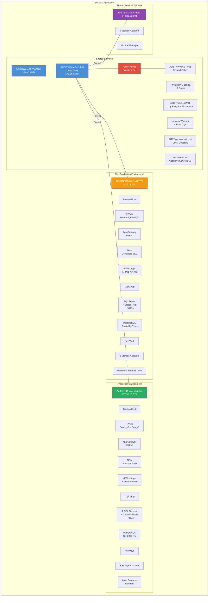
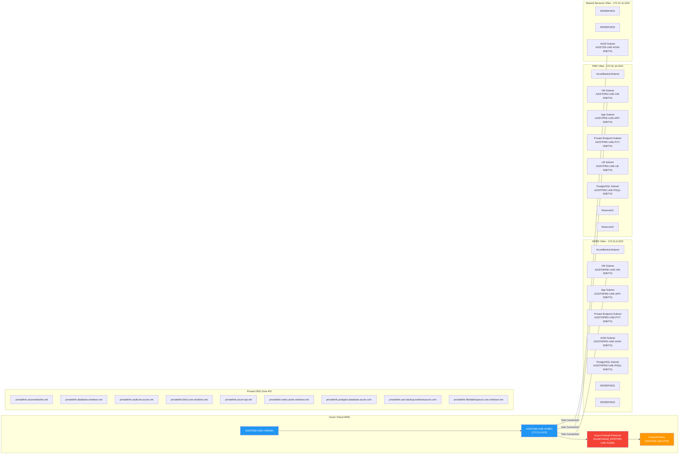
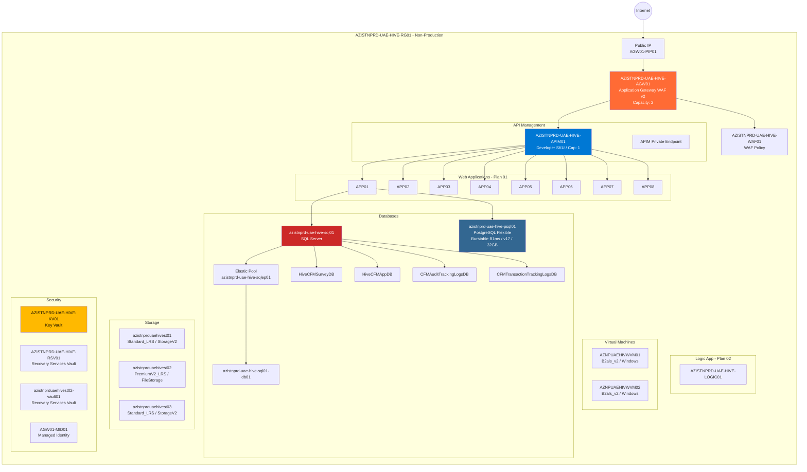
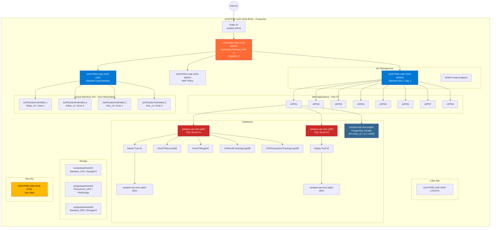
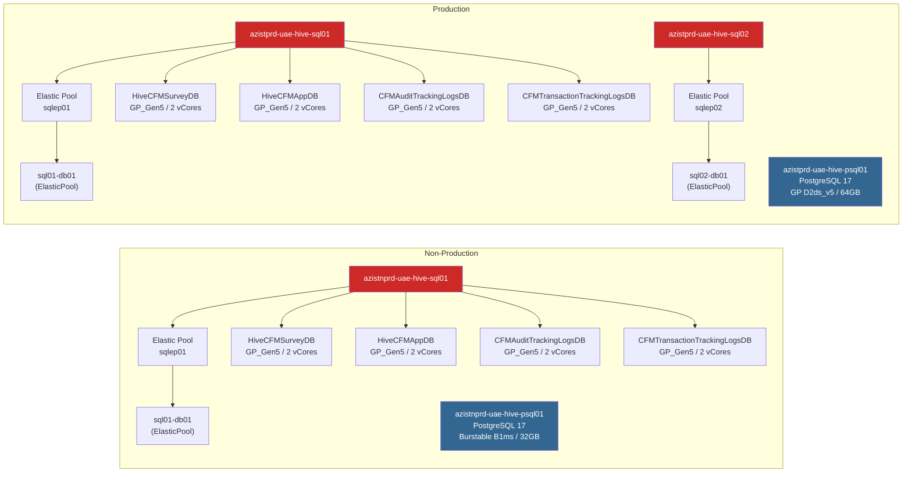

# DOF-TP-SUBSCRIPTION - Azure Infrastructure Inventory

**Subscription Name:** dof-tp-subscription
**Subscription ID:** ce8d1d77-7bc4-4e74-8795-0a75acbb20d5
**Primary Region:** UAE North
**Date Generated:** 2026-03-22
**Total Resources:** 234
**Total Resource Groups:** 16

---

## Table of Contents

1. [Executive Summary](#executive-summary)
2. [High-Level Architecture Diagram](#high-level-architecture-diagram)
3. [Network Architecture Diagram](#network-architecture-diagram)
4. [Non-Production (NPRD) Environment Diagram](#non-production-environment-diagram)
5. [Production (PRD) Environment Diagram](#production-environment-diagram)
6. [Resource Groups Overview](#resource-groups-overview)
7. [Detailed Resource Inventory by Resource Group](#detailed-resource-inventory-by-resource-group)
8. [Resource Summary by Type](#resource-summary-by-type)
9. [Networking Details](#networking-details)
10. [Compute Resources](#compute-resources)
11. [Database Resources](#database-resources)
12. [Application Services](#application-services)
13. [Security & Identity](#security--identity)
14. [Monitoring & Observability](#monitoring--observability)
15. [Failed Deployments](#failed-deployments)
16. [Naming Convention](#naming-convention)

---

## Executive Summary

The **dof-tp-subscription** hosts the **IST HIVE CFM** (Customer Feedback Management) platform across two environments:

- **Non-Production (NPRD):** Development/staging workloads with cost-optimized SKUs
- **Production (PRD):** Live workloads with higher-tier SKUs and zone-redundant storage

The infrastructure follows a **hub-and-spoke network topology** using Azure Virtual WAN, with centralized firewall inspection, private DNS resolution, and private endpoint connectivity for all PaaS services. All public-facing traffic flows through WAF v2 Application Gateways, and API management is handled via Azure APIM.

### Key Statistics

| Metric             | Count               |
| ------------------ | ------------------- |
| Resource Groups    | 16                  |
| Total Resources    | 234                 |
| Virtual Machines   | 6                   |
| Web Apps           | 16 (8 NPRD + 8 PRD) |
| SQL Servers        | 3                   |
| SQL Databases      | 14                  |
| PostgreSQL Servers | 2                   |
| Storage Accounts   | 8                   |
| Private Endpoints  | 36                  |
| Private DNS Zones  | 12                  |

---

## High-Level Architecture Diagram



**Explanation:** The subscription uses a **hub-and-spoke** model. The Virtual WAN hub (172.31.4.0/23) acts as the central routing point. Azure Firewall Premium inspects all inter-spoke and outbound traffic. Three spokes connect: Non-Production (172.31.6.0/23), Production (172.31.10.0/24), and Shared Services (172.31.11.0/24). All PaaS services are accessed through private endpoints, with DNS resolution handled by centralized Private DNS Zones.

---

## Network Architecture Diagram



**Explanation:** The network is segmented into purpose-specific subnets within each spoke VNet. NSGs are applied per subnet to enforce micro-segmentation. The NPRD VNet has 9 subnets (including 2 reserved for future use), and the PRD VNet has 8 subnets with a dedicated Load Balancer subnet. All VNets route through the Virtual Hub and Azure Firewall for centralized traffic inspection. Private DNS Zones ensure private endpoint name resolution across all spokes.

---

## Non-Production Environment Diagram



**Explanation:** Non-production traffic enters through a Public IP attached to the WAF v2 Application Gateway. The AGW terminates SSL and routes to APIM (Developer SKU - single instance, suitable for dev/test). APIM fronts 8 Web Apps running on App Service Plan 01. A Logic App on Plan 02 handles workflow automation. The SQL Server hosts 5 databases (4 HiveCFM application databases + 1 in elastic pool). PostgreSQL Flexible Server (Burstable B1ms) is cost-optimized for non-production. Two Windows VMs (B2als_v2) serve as jump boxes / utility servers. All services connect via private endpoints.

---

## Production Environment Diagram



**Explanation:** Production mirrors non-production but with higher-tier resources for reliability. Key differences: APIM uses Standard SKU (SLA-backed). VMs are deployed across **two Availability Zones** for HA (4 VMs vs. 2 in NPRD). VM sizes are larger (B4als_v2 and D4s_v3). There are **two SQL Servers** (vs. 1 in NPRD) for workload separation. PostgreSQL uses General Purpose D2ds_v5 (vs. Burstable in NPRD). Storage accounts use **ZRS** (Zone-Redundant Storage) for durability. A Standard Load Balancer distributes traffic to VMs.

---

## Resource Groups Overview

| #   | Resource Group                 | Location    | Resources | Purpose                                                 |
| --- | ------------------------------ | ----------- | --------- | ------------------------------------------------------- |
| 1   | **NetworkWatcherRG**           | uaenorth    | 4         | Network monitoring and flow logs                        |
| 2   | **IST-UAE-ID-RG01**            | europe      | 1         | Azure AD B2C / CIAM directory                           |
| 3   | **AZISTNPRD-UAE-VNET-RG01**    | uaenorth    | 10        | Non-production networking (VNet, Bastion, NSGs)         |
| 4   | **AZISTNW-UAE-VWAN-RG01**      | uaenorth    | 4         | Virtual WAN hub, Azure Firewall                         |
| 5   | **AZISTNPRD-UAE-HIVE-RG01**    | uaenorth    | 86        | Non-production HIVE workloads (VMs, Apps, DBs, Storage) |
| 6   | **DefaultResourceGroup-null**  | uaenorth    | 0         | System-created (empty)                                  |
| 7   | **AZIST-UAE-LAW-RG01**         | uaenorth    | 4         | Log Analytics and data collection                       |
| 8   | **AZISTNW-UAE-PDNS-RG01**      | global      | 27        | Centralized Private DNS Zones and VNet links            |
| 9   | **AZISTSS-UAE-VNET-RG01**      | uaenorth    | 7         | Shared services networking and storage                  |
| 10  | **AZISTPRD-UAE-VNET-RG01**     | uaenorth    | 7         | Production networking (VNet, Bastion, NSGs)             |
| 11  | **ucc-cognitiveservices**      | uaenorth    | 1         | Azure AI / Cognitive Services                           |
| 12  | **AZISTSS-UAE-UMGR-RG01**      | uaenorth    | 1         | Azure Update Manager config                             |
| 13  | **AZISTPRD-UAE-HIVE-RG01**     | uaenorth    | 81        | Production HIVE workloads (VMs, Apps, DBs, Storage)     |
| 14  | **VisualStudioOnline-2DA9...** | northeurope | 0         | Visual Studio Online (empty)                            |
| 15  | **VisualStudioOnline-954E...** | northeurope | 0         | Visual Studio Online (empty)                            |
| 16  | **VisualStudioOnline-66D7...** | northeurope | 1         | Visual Studio Online (TP-IST account)                   |

---

## Detailed Resource Inventory by Resource Group

### 1. NetworkWatcherRG (4 resources)

| Resource Name | Type |
|---|---|
| NetworkWatcher_uaenorth | Network Watcher |
| AZISTNPRD-UAE-VNET01 flow log | NSG Flow Log |
| AZISTSS-UAE-VNET01 flow log | NSG Flow Log |
| AZISTPRD-UAE-VNET01 flow log | NSG Flow Log |

> Network Watcher provides network monitoring, diagnostics, and flow logging for all three VNets.

### 2. IST-UAE-ID-RG01 (1 resource)

| Resource Name | Type |
|---|---|
| ISTTP.onmicrosoft.com | CIAM Directory (Azure AD B2C) |

> Customer Identity and Access Management directory for user authentication.

### 3. AZISTNPRD-UAE-VNET-RG01 (10 resources)

| Resource Name | Type |
|---|---|
| AZISTNPRD-UAE-VNET01 | Virtual Network (172.31.6.0/23) |
| AZISTNPRD-UAE-VNET-BASTION01 | Bastion Host |
| AZISTNPRD-UAE-VNET-BASTION01-PIP01 | Public IP Address |
| AZISTNPRD-UAE-VM-NSG01 | NSG - VM Subnet |
| AZISTNPRD-UAE-APP-NSG01 | NSG - App Subnet |
| AZISTNPRD-UAE-PVT-NSG01 | NSG - Private Endpoint Subnet |
| AZISTNPRD-UAE-PSQL-NSG01 | NSG - PostgreSQL Subnet |
| AZISTNPRD-UAE-AGW-SNET01 | NSG - App Gateway Subnet |
| RESERVE01-NSG01 | NSG - Reserve Subnet |
| AzureBastionSubnet-NSG01 | NSG - Bastion Subnet |

> **Subnets:** VM, App, Private Endpoint, AGW, PostgreSQL, Bastion, Reserve01, Reserve02 (9 total)

### 4. AZISTNW-UAE-VWAN-RG01 (4 resources)

| Resource Name | Type | Details |
|---|---|---|
| AZISTNW-UAE-VWAN01 | Virtual WAN | Hub-and-spoke backbone |
| AZISTNW-UAE-HUB01 | Virtual Hub | 172.31.4.0/23 |
| AzureFirewall_AZISTNW-UAE-HUB01 | Azure Firewall | **Premium** tier |
| AZISTNW-UAE-FP01 | Firewall Policy | Attached to firewall |

> The Virtual WAN provides managed hub routing. Azure Firewall Premium enables TLS inspection, IDPS, and URL filtering.

### 5. AZISTNPRD-UAE-HIVE-RG01 (86 resources)

#### Compute

| Resource Name | Type | Details |
|---|---|---|
| AZNPUAEHIVWVM01 | Virtual Machine | Standard_B2als_v2 / Windows |
| AZNPUAEHIVWVM02 | Virtual Machine | Standard_B2als_v2 / Windows |
| AZNPUAEHIVWVM01/MDE.Windows | VM Extension | Microsoft Defender for Endpoint |
| AZNPUAEHIVWVM02/MDE.Windows | VM Extension | Microsoft Defender for Endpoint |

#### Web Applications

| Resource Name              | Type                 | Plan              |
| -------------------------- | -------------------- | ----------------- |
| AZISTNPRD-UAE-HIVE-PLAN01  | App Service Plan     | Hosts APP01-APP08 |
| AZISTNPRD-UAE-HIVE-APP01   | Web App              | Running           |
| AZISTNPRD-UAE-HIVE-APP02   | Web App              | Running           |
| AZISTNPRD-UAE-HIVE-APP03   | Web App              | Running           |
| AZISTNPRD-UAE-HIVE-APP04   | Web App              | Running           |
| AZISTNPRD-UAE-HIVE-APP05   | Web App              | Running           |
| AZISTNPRD-UAE-HIVE-APP06   | Web App              | Running           |
| AZISTNPRD-UAE-HIVE-APP07   | Web App              | Running           |
| AZISTNPRD-UAE-HIVE-APP08   | Web App              | Running           |
| AZISTNPRD-UAE-HIVE-PLAN02  | App Service Plan     | Hosts Logic App   |
| AZISTNPRD-UAE-HIVE-LOGIC01 | Logic App (Standard) | Running           |

#### API Management

| Resource Name             | Type           | Details                        |
| ------------------------- | -------------- | ------------------------------ |
| AZISTNPRD-UAE-HIVE-APIM01 | API Management | **Developer** SKU, Capacity: 1 |

#### Application Gateway

| Resource Name                  | Type                   | Details                 |
| ------------------------------ | ---------------------- | ----------------------- |
| AZISTNPRD-UAE-HIVE-AGW01       | Application Gateway    | **WAF v2**, Capacity: 2 |
| AZISTNPRD-UAE-HIVE-WAF01       | WAF Policy             | Attached to AGW         |
| AZISTNPRD-UAE-HIVE-AGW01-PIP01 | Public IP              | AGW frontend            |
| AZISTNPRD-UAE-HIVE-AGW01-MID01 | User Assigned Identity | For AGW cert access     |

#### Databases

| Resource Name                 | Type                | Details                                             |
| ----------------------------- | ------------------- | --------------------------------------------------- |
| azistnprd-uae-hive-sql01      | SQL Server          | FQDN: azistnprd-uae-hive-sql01.database.windows.net |
| azistnprd-uae-hive-sqlep01    | Elastic Pool        | Contains db01                                       |
| azistnprd-uae-hive-sql01-db01 | SQL Database        | ElasticPool SKU, 268GB max                          |
| HiveCFMSurveyDB               | SQL Database        | GP_Gen5, 2 vCores, 32GB                             |
| HiveCFMAppDB                  | SQL Database        | GP_Gen5, 2 vCores, 32GB                             |
| CFMAuditTrackingLogsDB        | SQL Database        | GP_Gen5, 2 vCores, 32GB                             |
| CFMTransactionTrackingLogsDB  | SQL Database        | GP_Gen5, 2 vCores, 32GB                             |
| azistnprd-uae-hive-psql01     | PostgreSQL Flexible | **Burstable B1ms**, v17, 32GB storage               |

#### Storage

| Resource Name | Type | SKU | Kind |
|---|---|---|---|
| azistnprduaehivest01 | Storage Account | Standard_LRS | StorageV2 |
| azistnprduaehivest02 | Storage Account | PremiumV2_LRS | FileStorage |
| azistnprduaehivest03 | Storage Account | Standard_LRS | StorageV2 |

#### Security & Recovery

| Resource Name | Type |
|---|---|
| AZISTNPRD-UAE-HIVE-KV01 | Key Vault |
| AZISTNPRD-UAE-HIVE-RSV01 | Recovery Services Vault |
| azistnprduaehivest02-vault01 | Recovery Services Vault (storage backup) |

#### Private Endpoints (18 in this RG)

All PaaS services are connected via private endpoints with corresponding NICs:
- Storage accounts (x6 endpoints for blob, file, table, queue)
- Key Vault (x1)
- APIM (x1)
- Web Apps APP01-APP08 (x8)
- Logic App (x1)
- SQL (x2)
- Recovery Services Vault (x1)

### 6. AZIST-UAE-LAW-RG01 (4 resources)

| Resource Name | Type |
|---|---|
| AZIST-UAE-LAW01 | Log Analytics Workspace |
| AZIST-UAE-WDCR01 | Data Collection Rule |
| NWTA-...RLB988 | Data Collection Endpoint |
| NWTA-...20K7SW | Data Collection Rule (NW Traffic Analytics) |

> Centralized logging destination for all resources. Data Collection Rules configure what telemetry is sent.

### 7. AZISTNW-UAE-PDNS-RG01 (27 resources)

| Private DNS Zone | VNet Links |
|---|---|
| privatelink.azurewebsites.net | NPRD link, PRD link |
| privatelink.database.windows.net | NPRD link, PRD link |
| privatelink.vaultcore.azure.net | NPRD link, PRD link |
| privatelink.blob.core.windows.net | NPRD link |
| privatelink.file.core.windows.net | NPRD link, PRD link |
| privatelink.table.core.windows.net | NPRD link |
| privatelink.queue.core.windows.net | NPRD link, PRD link |
| privatelink.azure-api.net | NPRD link |
| privatelink.redis.cache.windows.net | NPRD link |
| privatelink.uan.backup.windowsazure.com | NPRD link |
| azistnprd-uae-hive-psql01.private.postgres... | NPRD link, PRD link |

> Centralized Private DNS ensures that when resources reference a PaaS FQDN (e.g., `*.database.windows.net`), the DNS query resolves to the private IP of the private endpoint rather than the public IP.

### 8. AZISTSS-UAE-VNET-RG01 (7 resources)

| Resource Name | Type |
|---|---|
| AZISTSS-UAE-VNET01 | Virtual Network (172.31.11.0/24) |
| AZISTSS-UAE-AGW-SNET01-RT01 | Route Table |
| AZISTSS-UAE-AGW-NSG01 | NSG |
| azistssuaetfsst01 | Storage Account (Standard_LRS) |
| azistssuaeflogst01 | Storage Account (Standard_LRS - Flow Logs) |

> Shared services VNet with storage for TFS/DevOps artifacts and NSG flow log retention.

### 9. AZISTPRD-UAE-VNET-RG01 (7 resources)

| Resource Name | Type |
|---|---|
| AZISTPRD-UAE-VNET01 | Virtual Network (172.31.10.0/24) |
| AZISTPRD-UAE-VNET-BASTION01 | Bastion Host |
| AZISTPRD-UAE-VNET-BASTION01-PIP01 | Public IP Address |
| AZISTPRD-UAE-VM-NSG01 | NSG - VM Subnet |
| AZISTPRD-UAE-APP-NSG01 | NSG - App Subnet |
| AZISTPRD-UAE-PVT-NSG01 | NSG - Private Endpoint Subnet |
| RESERVE-NSG01 | NSG - Reserve Subnet |

> **Subnets:** VM, App, Private Endpoint, LB, PostgreSQL, Bastion, Reserve01, Reserve02 (8 total)

### 10. AZISTPRD-UAE-HIVE-RG01 (81 resources)

#### Compute

| Resource Name      | Type            | Details                              |
| ------------------ | --------------- | ------------------------------------ |
| AZPRUAEHIVWVM01-1  | Virtual Machine | Standard_B4als_v2 / Windows / Zone 1 |
| AZPRUAEHIVWVM01-2  | Virtual Machine | Standard_B4als_v2 / Windows / Zone 2 |
| AZPRUAEHIVWVM02-1  | Virtual Machine | Standard_D4s_v3 / Windows / Zone 1   |
| AZPRUAEHIVWVM02-2  | Virtual Machine | Standard_D4s_v3 / Windows / Zone 2   |
| */MDE.Windows (x4) | VM Extension    | Microsoft Defender for Endpoint      |

#### Web Applications

| Resource Name             | Type                               | Plan              |
| ------------------------- | ---------------------------------- | ----------------- |
| AZISTPRD-UAE-HIVE-PLAN01  | App Service Plan                   | Hosts APP01-APP08 |
| AZISTPRD-UAE-HIVE-APP01   | Web App                            | Running           |
| AZISTPRD-UAE-HIVE-APP02   | Web App                            | Running           |
| AZISTPRD-UAE-HIVE-APP03   | Web App                            | Running           |
| AZISTPRD-UAE-HIVE-APP04   | Web App                            | Running           |
| AZISTPRD-UAE-HIVE-APP05   | Web App                            | Running           |
| AZISTPRD-UAE-HIVE-APP06   | Web App                            | Running           |
| AZISTPRD-UAE-HIVE-APP07   | Web App                            | Running           |
| AZISTPRD-UAE-HIVE-APP08   | Web App                            | Running           |
| AZISTPRD-UAE-HIVE-LOGIC01 | Logic App (Standard) + Server Farm | Running           |

#### API Management

| Resource Name | Type | Details |
|---|---|---|
| AZISTPRD-UAE-HIVE-APIM01 | API Management | **Standard** SKU, Capacity: 1 |

#### Application Gateway & Load Balancer

| Resource Name | Type | Details |
|---|---|---|
| AZISTPRD-UAE-HIVE-AGW01 | Application Gateway | **WAF v2**, Capacity: 2 |
| AZISTPRD-UAE-HIVE-WAF01 | WAF Policy | Attached to AGW |
| AZISTPRD-UAE-HIVE-AGW01-PIP01 | Public IP | AGW frontend |
| AZISTPRD-UAE-HIVE-LB01 | Load Balancer | **Standard** SKU |

#### Databases

| Resource Name                | Type                | Details                           |
| ---------------------------- | ------------------- | --------------------------------- |
| azistprd-uae-hive-sql01      | SQL Server          | Primary SQL Server                |
| azistprd-uae-hive-sqlep01    | Elastic Pool        | Contains db01                     |
| azistprd-uae-hive-sql01-db01 | SQL Database        | ElasticPool SKU                   |
| HiveCFMSurveyDB              | SQL Database        | GP_Gen5, 2 vCores                 |
| HiveCFMAppDB                 | SQL Database        | GP_Gen5, 2 vCores                 |
| CFMAuditTrackingLogsDB       | SQL Database        | GP_Gen5, 2 vCores                 |
| CFMTransactionTrackingLogsDB | SQL Database        | GP_Gen5, 2 vCores                 |
| azistprd-uae-hive-sql02      | SQL Server          | Secondary SQL Server              |
| azistprd-uae-hive-sqlep02    | Elastic Pool        | Contains db01                     |
| azistprd-uae-hive-sql02-db01 | SQL Database        | ElasticPool SKU                   |
| azistprd-uae-hive-psql01     | PostgreSQL Flexible | **GP D2ds_v5**, v17, 64GB storage |

#### Storage

| Resource Name | Type | SKU | Kind |
|---|---|---|---|
| azistprduaehivest01 | Storage Account | Standard_LRS | StorageV2 |
| azistprduaehivest02 | Storage Account | **PremiumV2_ZRS** | FileStorage |
| azistprduaehivest03 | Storage Account | **Standard_ZRS** | StorageV2 |

#### Security

| Resource Name | Type |
|---|---|
| AZISTPRD-UAE-HIVE-KV01 | Key Vault |

#### Private Endpoints (18 in this RG)

Storage, Key Vault, APIM, Web Apps, SQL servers, Logic App - all via private endpoints.

### 11. ucc-cognitiveservices (1 resource)

| Resource Name | Type | Details |
|---|---|---|
| ucc-aiservices | Cognitive Services | Kind: CognitiveServices, SKU: **S0** |

> Azure AI Services account for integrating AI capabilities into the HIVE platform.

### 12. AZISTSS-UAE-UMGR-RG01 (1 resource)

| Resource Name | Type |
|---|---|
| AZISTSS-UAE-UMGR-4SAT-430AM-AUM01 | Maintenance Configuration |

> Scheduled maintenance window (every 4th Saturday at 4:30 AM) for Azure Update Manager patching.

### 13. VisualStudioOnline RGs (3 groups, 1 resource total)

| Resource Name | Type | RG |
|---|---|---|
| TP-IST | Visual Studio Account | VisualStudioOnline-66D7... |

> DevOps / Visual Studio Online resources. Two RGs are empty.

---

## Resource Summary by Type

| Resource Type                 | Count | Environment             |
| ----------------------------- | ----- | ----------------------- |
| **Compute**                   |       |                         |
| Virtual Machines              | 6     | 2 NPRD + 4 PRD          |
| VM Disks                      | 6     | OS Disks                |
| VM Extensions (MDE)           | 6     | Defender for Endpoint   |
| **Networking**                |       |                         |
| Virtual Networks              | 3     | NPRD + PRD + SS         |
| Virtual WAN                   | 1     | Shared                  |
| Virtual Hub                   | 1     | Shared                  |
| Azure Firewall (Premium)      | 1     | Shared                  |
| Firewall Policy               | 1     | Shared                  |
| Application Gateways (WAF v2) | 2     | NPRD + PRD              |
| Load Balancer (Standard)      | 1     | PRD only                |
| Bastion Hosts                 | 2     | NPRD + PRD              |
| NSGs                          | 12    | NPRD + PRD + SS         |
| Public IPs                    | 4     | 2 Bastion + 2 AGW       |
| Route Tables                  | 1     | SS                      |
| Network Interfaces            | 42    | VMs + Private Endpoints |
| Private Endpoints             | 36    | All PaaS services       |
| Private DNS Zones             | 12    | Centralized             |
| Private DNS VNet Links        | 17    | Cross-VNet resolution   |
| **Data**                      |       |                         |
| SQL Servers                   | 3     | 1 NPRD + 2 PRD          |
| SQL Elastic Pools             | 3     | 1 NPRD + 2 PRD          |
| SQL Databases                 | 14    | 6 NPRD + 8 PRD          |
| PostgreSQL Flexible Servers   | 2     | NPRD + PRD              |
| **App Services**              |       |                         |
| App Service Plans             | 4     | 2 NPRD + 2 PRD          |
| Web Apps                      | 16    | 8 NPRD + 8 PRD          |
| Logic Apps                    | 2     | NPRD + PRD              |
| API Management                | 2     | NPRD (Dev) + PRD (Std)  |
| **Storage**                   |       |                         |
| Storage Accounts              | 8     | 3 NPRD + 3 PRD + 2 SS   |
| **Security**                  |       |                         |
| Key Vaults                    | 2     | NPRD + PRD              |
| Recovery Services Vaults      | 2     | NPRD                    |
| CIAM Directory                | 1     | Shared                  |
| Managed Identity              | 1     | NPRD                    |
| WAF Policies                  | 2     | NPRD + PRD              |
| **Monitoring**                |       |                         |
| Log Analytics Workspace       | 1     | Shared                  |
| Data Collection Rules         | 2     | Shared                  |
| Data Collection Endpoint      | 1     | Shared                  |
| Network Watcher               | 1     | Shared                  |
| NSG Flow Logs                 | 3     | Per VNet                |
| Event Grid System Topics      | 6     | Storage events          |
| **AI**                        |       |                         |
| Cognitive Services            | 1     | Shared                  |
| **DevOps**                    |       |                         |
| Visual Studio Account         | 1     | Shared                  |
| Web Certificate               | 1     | NPRD                    |

---

## Networking Details

### VNet Address Spaces

```
AZISTNW-UAE-HUB01 (Virtual Hub):  172.31.4.0/23   (512 IPs)
AZISTNPRD-UAE-VNET01 (NPRD):      172.31.6.0/23   (512 IPs)
AZISTPRD-UAE-VNET01 (PRD):        172.31.10.0/24  (256 IPs)
AZISTSS-UAE-VNET01 (SS):          172.31.11.0/24  (256 IPs)
```

### NPRD VNet Subnets (9)

| Subnet | Purpose |
|---|---|
| AzureBastionSubnet | Bastion Host |
| AZISTNPRD-UAE-VM-SNET01 | Virtual Machines |
| AZISTNPRD-UAE-APP-SNET01 | App Service VNet Integration |
| AZISTNPRD-UAE-PVT-SNET01 | Private Endpoints |
| AZISTNPRD-UAE-AGW-SNET01 | Application Gateway |
| AZISTNPRD-UAE-PSQL-SNET01 | PostgreSQL Delegated Subnet |
| AZISTNPRD-UAE-RESERVE01 | Reserved for future use |
| RESERVE01 | Reserved for future use |
| RESERVE02 | Reserved for future use |

### PRD VNet Subnets (8)

| Subnet | Purpose |
|---|---|
| AzureBastionSubnet | Bastion Host |
| AZISTPRD-UAE-VM-SNET01 | Virtual Machines |
| AZISTPRD-UAE-APP-SNET01 | App Service VNet Integration |
| AZISTPRD-UAE-PVT-SNET01 | Private Endpoints |
| AZISTPRD-UAE-LB-SNET01 | Load Balancer |
| AZISTPRD-UAE-PSQL-SNET01 | PostgreSQL Delegated Subnet |
| Reserve01 | Reserved for future use |
| Reserve02 | Reserved for future use |

---

## Compute Resources

### Virtual Machines

| VM Name           | RG   | VM Size                         | OS      | Zone   | MDE |
| ----------------- | ---- | ------------------------------- | ------- | ------ | --- |
| AZNPUAEHIVWVM01   | NPRD | Standard_B2als_v2 (2 vCPU, 4GB) | Windows | -      | Yes |
| AZNPUAEHIVWVM02   | NPRD | Standard_B2als_v2 (2 vCPU, 4GB) | Windows | -      | Yes |
| AZPRUAEHIVWVM01-1 | PRD  | Standard_B4als_v2 (4 vCPU, 8GB) | Windows | Zone 1 | Yes |
| AZPRUAEHIVWVM01-2 | PRD  | Standard_B4als_v2 (4 vCPU, 8GB) | Windows | Zone 2 | Yes |
| AZPRUAEHIVWVM02-1 | PRD  | Standard_D4s_v3 (4 vCPU, 16GB)  | Windows | Zone 1 | Yes |
| AZPRUAEHIVWVM02-2 | PRD  | Standard_D4s_v3 (4 vCPU, 16GB)  | Windows | Zone 2 | Yes |

> All VMs have Microsoft Defender for Endpoint (MDE) installed. PRD VMs are deployed across Availability Zones 1 and 2 for high availability.

---

## Database Resources

### SQL Databases



### PostgreSQL Flexible Servers

| Server | Environment | SKU | Tier | Version | Storage |
|---|---|---|---|---|---|
| azistnprd-uae-hive-psql01 | NPRD | Standard_B1ms | Burstable | 17 | 32 GB |
| azistprd-uae-hive-psql01 | PRD | Standard_D2ds_v5 | GeneralPurpose | 17 | 64 GB |

---

## Application Services

### App Service Plans

| Plan                      | Environment | Hosted Apps              |
| ------------------------- | ----------- | ------------------------ |
| AZISTNPRD-UAE-HIVE-PLAN01 | NPRD        | APP01-APP08 (8 web apps) |
| AZISTNPRD-UAE-HIVE-PLAN02 | NPRD        | LOGIC01 (logic app)      |
| AZISTPRD-UAE-HIVE-PLAN01  | PRD         | APP01-APP08 (8 web apps) |
| AZISTPRD-UAE-HIVE-LOGIC01 | PRD         | LOGIC01 (logic app)      |

### Web Apps (All Running)

| NPRD App | PRD App | Status |
|---|---|---|
| AZISTNPRD-UAE-HIVE-APP01 | AZISTPRD-UAE-HIVE-APP01 | Running |
| AZISTNPRD-UAE-HIVE-APP02 | AZISTPRD-UAE-HIVE-APP02 | Running |
| AZISTNPRD-UAE-HIVE-APP03 | AZISTPRD-UAE-HIVE-APP03 | Running |
| AZISTNPRD-UAE-HIVE-APP04 | AZISTPRD-UAE-HIVE-APP04 | Running |
| AZISTNPRD-UAE-HIVE-APP05 | AZISTPRD-UAE-HIVE-APP05 | Running |
| AZISTNPRD-UAE-HIVE-APP06 | AZISTPRD-UAE-HIVE-APP06 | Running |
| AZISTNPRD-UAE-HIVE-APP07 | AZISTPRD-UAE-HIVE-APP07 | Running |
| AZISTNPRD-UAE-HIVE-APP08 | AZISTPRD-UAE-HIVE-APP08 | Running |

### API Management

| Instance | Environment | SKU | Capacity |
|---|---|---|---|
| AZISTNPRD-UAE-HIVE-APIM01 | NPRD | **Developer** | 1 |
| AZISTPRD-UAE-HIVE-APIM01 | PRD | **Standard** | 1 |

> Developer SKU is for dev/test (no SLA). Standard SKU provides production SLA and features like multi-region, caching, and analytics.

---

## Security & Identity

### Key Vaults

| Name | Environment |
|---|---|
| AZISTNPRD-UAE-HIVE-KV01 | NPRD |
| AZISTPRD-UAE-HIVE-KV01 | PRD |

### Recovery Services

| Name | Environment | Purpose |
|---|---|---|
| AZISTNPRD-UAE-HIVE-RSV01 | NPRD | VM/resource backup |
| azistnprduaehivest02-vault01 | NPRD | Storage account backup |

### WAF Policies

| Name | Environment | Attached To |
|---|---|---|
| AZISTNPRD-UAE-HIVE-WAF01 | NPRD | AGW01 |
| AZISTPRD-UAE-HIVE-WAF01 | PRD | AGW01 |

### Network Security Groups (12 total)

| NSG | Subnet / Purpose | VNet |
|---|---|---|
| AZISTNPRD-UAE-VM-NSG01 | VM Subnet | NPRD |
| AZISTNPRD-UAE-APP-NSG01 | App Subnet | NPRD |
| AZISTNPRD-UAE-PVT-NSG01 | Private Endpoint Subnet | NPRD |
| AZISTNPRD-UAE-PSQL-NSG01 | PostgreSQL Subnet | NPRD |
| AZISTNPRD-UAE-AGW-SNET01 | App Gateway Subnet | NPRD |
| AzureBastionSubnet-NSG01 | Bastion Subnet | NPRD |
| RESERVE01-NSG01 | Reserve Subnet | NPRD |
| AZISTPRD-UAE-VM-NSG01 | VM Subnet | PRD |
| AZISTPRD-UAE-APP-NSG01 | App Subnet | PRD |
| AZISTPRD-UAE-PVT-NSG01 | Private Endpoint Subnet | PRD |
| RESERVE-NSG01 | Reserve Subnet | PRD |
| AZISTSS-UAE-AGW-NSG01 | App Gateway Subnet | SS |

---

## Monitoring & Observability

| Resource | Type | Purpose |
|---|---|---|
| AZIST-UAE-LAW01 | Log Analytics Workspace | Central log aggregation |
| AZIST-UAE-WDCR01 | Data Collection Rule | VM telemetry collection |
| NWTA DCE | Data Collection Endpoint | Network Traffic Analytics |
| NWTA DCR | Data Collection Rule | Network Traffic Analytics |
| NetworkWatcher_uaenorth | Network Watcher | Network diagnostics |
| 3x NSG Flow Logs | Flow Logs | Per-VNet network flow visibility |
| 6x Event Grid System Topics | Event Grid | Storage account event routing |

---

## Failed Deployments

Notable failed deployments across resource groups:

| Resource Group | Deployment Name | Date | Likely Cause |
|---|---|---|---|
| NetworkWatcherRG | CreateFlowLogTemplateBlade-20260224141638 | 2026-02-24 | Flow log config issue (succeeded on retry) |
| AZISTNPRD-UAE-VNET-RG01 | PrivateDns-0.44871031343067524 | 2026-02-10 | Private DNS zone linking failure |
| AZISTNPRD-UAE-VNET-RG01 | PrivateDns-pe-1a0fce9a... | 2026-02-13 | Private DNS zone linking failure |
| AZISTNW-UAE-VWAN-RG01 | PolicyDeployment_3000620251613885312 | 2026-03-12 | Azure Policy remediation failure |
| AZISTNPRD-UAE-HIVE-RG01 | Microsoft.APIM-Portal-6989ebee... | 2026-02-09 | APIM portal deployment failure |
| AZISTNPRD-UAE-HIVE-RG01 | azistnprduaehivest02-fs02 | 2026-02-10 | File share creation failure |
| AZISTNPRD-UAE-HIVE-RG01 | ApplicationGatewayUpdate (x5) | 2026-02-11 to 02-13 | AGW config update failures (resolved) |
| AZISTNPRD-UAE-HIVE-RG01 | Microsoft.Template (x2) | 2026-02-12 | ARM template deployment failures |
| AZISTNPRD-UAE-HIVE-RG01 | SQL Database creation | 2026-02-13 | Elastic pool DB creation issue |
| AZISTPRD-UAE-HIVE-RG01 | Microsoft.APIM-Portal-699efc1c... | 2026-02-25 | APIM portal deployment failure |
| AZISTPRD-UAE-HIVE-RG01 | PolicyDeployment (x3) | 2026-02-26 to 02-27 | Azure Policy remediation failures |

> Most failures were transient and subsequently resolved on retry. APIM portal failures are common when the APIM instance is still provisioning. Application Gateway update failures were resolved by 2026-02-13.

---

## Naming Convention

The subscription follows a consistent naming pattern:

```
AZ{ENV}{REGION}{WORKLOAD}{RESOURCETYPE}{INSTANCE}
```

| Component | Values | Description |
|---|---|---|
| `AZ` | AZ | Azure prefix |
| `{ENV}` | ISTNPRD / ISTPRD / ISTSS / ISTNW | Non-Prod / Prod / Shared Services / Network |
| `{REGION}` | UAE | UAE North region |
| `{WORKLOAD}` | HIVE / VNET / VWAN / PDNS / LAW / UMGR | Application or service tier |
| `{RESOURCETYPE}` | APP / SQL / PSQL / KV / AGW / APIM / VM / ST / NSG / PE / RSV / LB / FP / WAF | Resource abbreviation |
| `{INSTANCE}` | 01 / 02 / etc. | Instance number |

**Examples:**
- `AZISTNPRD-UAE-HIVE-APP01` = Azure / IST Non-Prod / UAE / HIVE workload / Web App / Instance 01
- `AZISTPRD-UAE-VNET01` = Azure / IST Prod / UAE / Virtual Network / Instance 01
- `AZISTNW-UAE-FP01` = Azure / IST Network / UAE / Firewall Policy / Instance 01

---

*Document generated on 2026-03-22 using Azure CLI against the dof-tp-subscription.*
