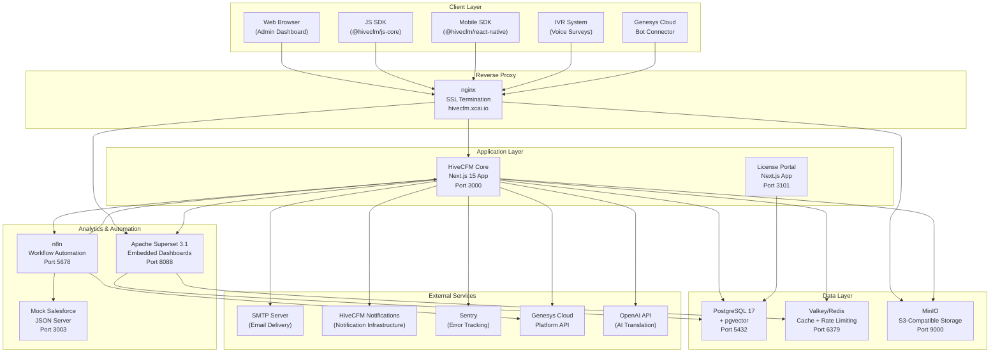
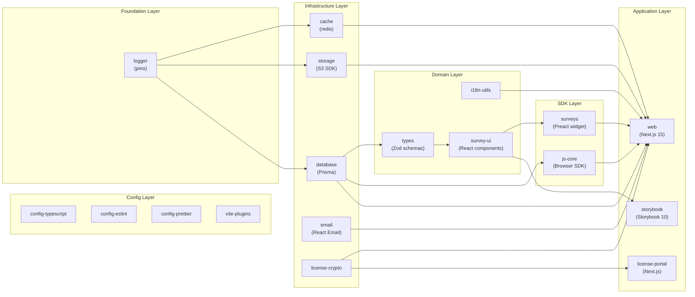
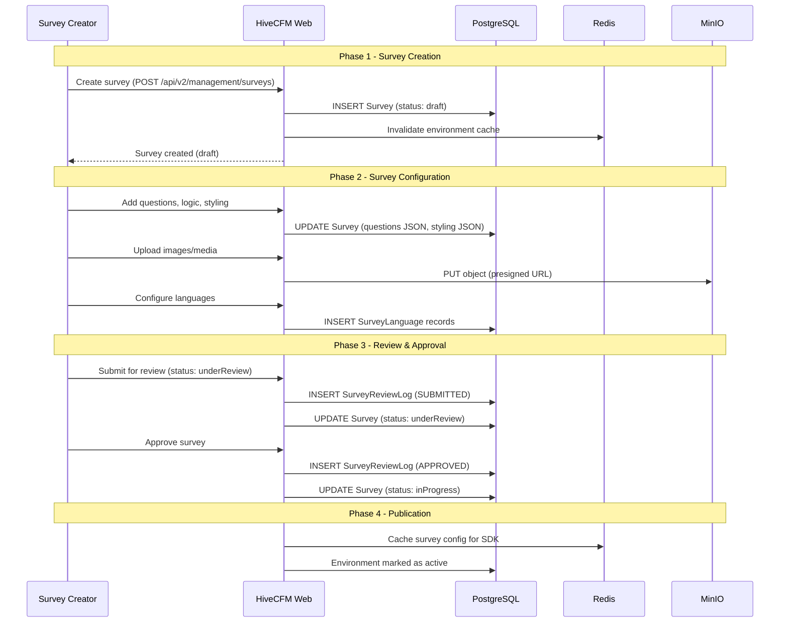
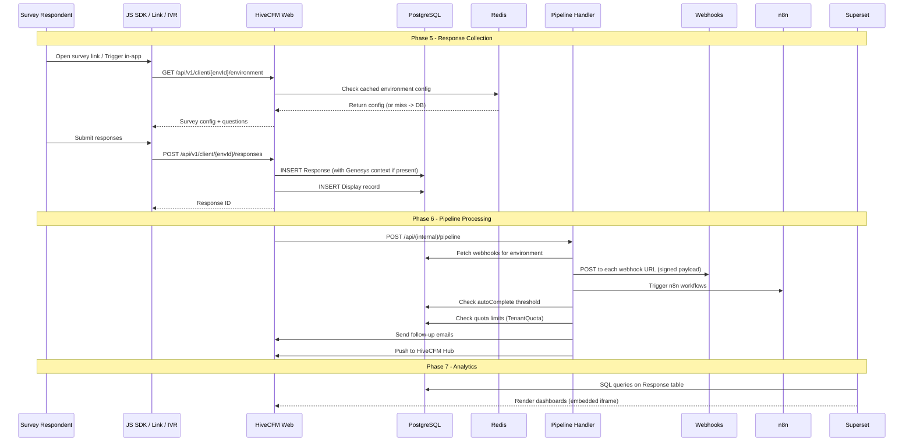
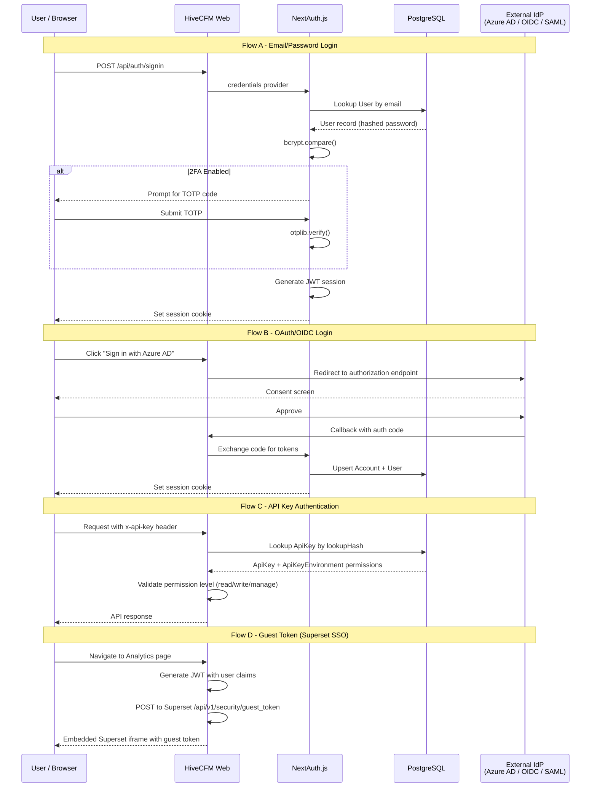
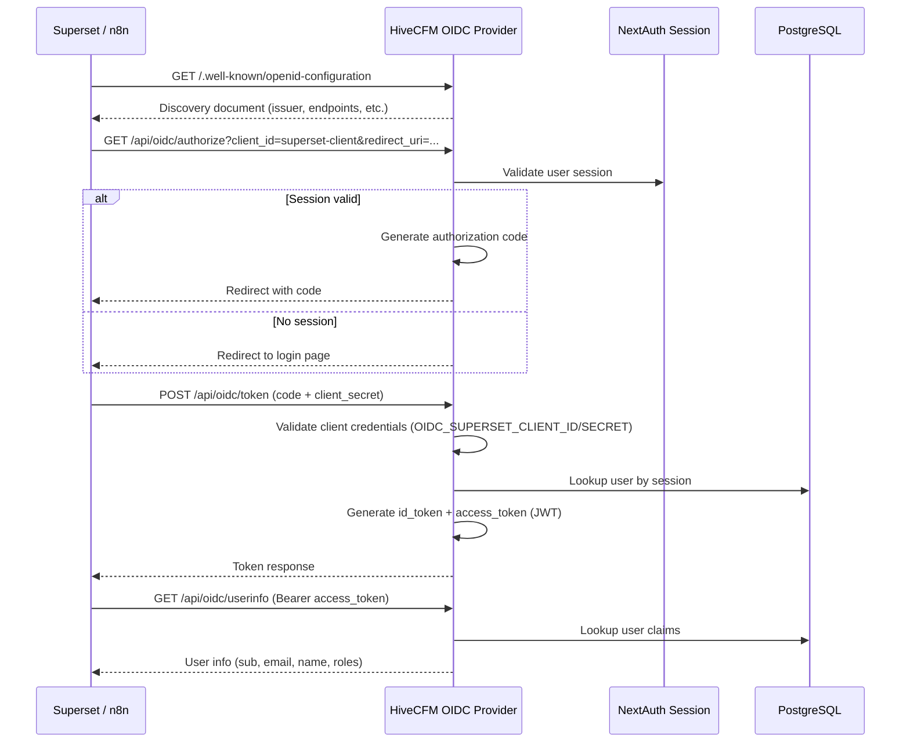
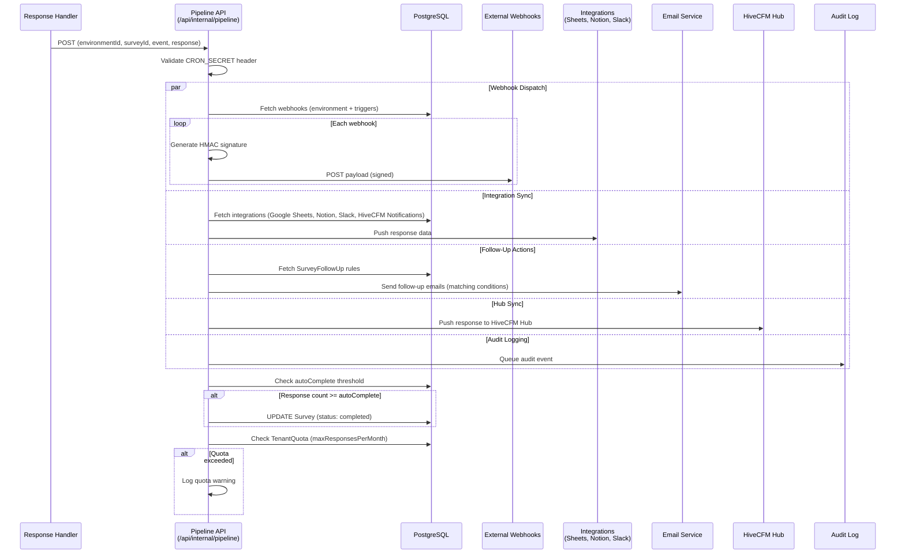
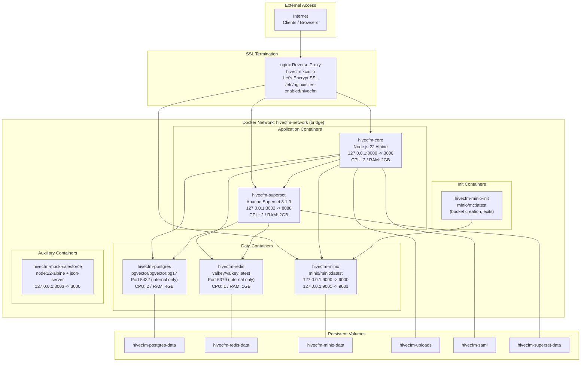
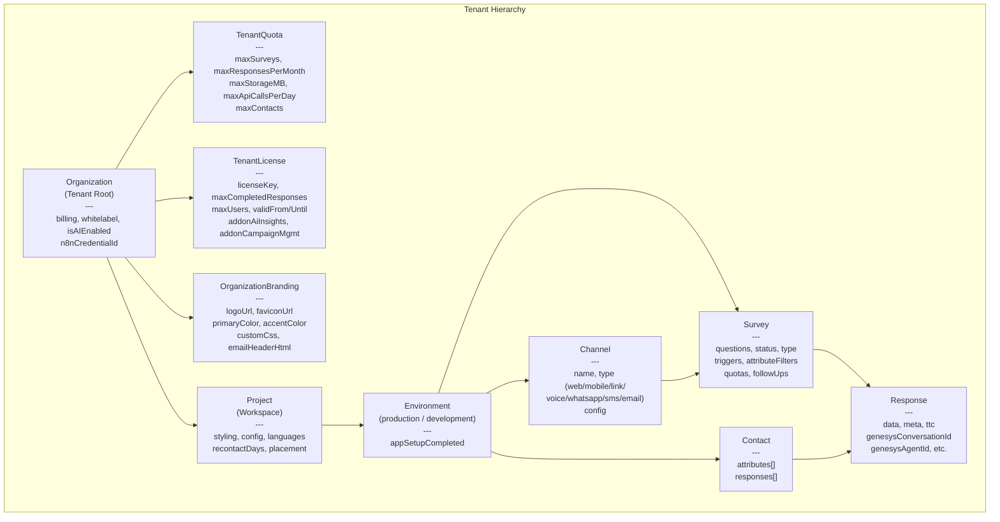
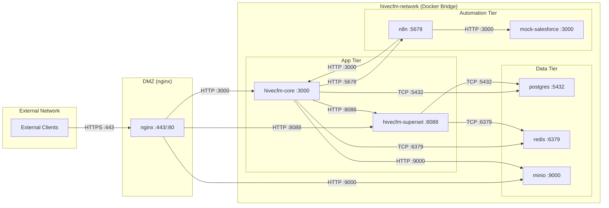

# HiveCFM Architecture Overview

## Table of Contents

1. [Executive Summary](#1-executive-summary)
2. [High-Level Architecture](#2-high-level-architecture)
3. [Monorepo Structure](#3-monorepo-structure)
4. [Technology Stack](#4-technology-stack)
5. [Data Flow Architecture](#5-data-flow-architecture)
6. [Infrastructure Architecture](#6-infrastructure-architecture)
7. [Multi-Tenancy Architecture](#7-multi-tenancy-architecture)
8. [Network Architecture](#8-network-architecture)

---

## 1. Executive Summary

### What is HiveCFM?

HiveCFM is an enterprise-grade **Customer Feedback Management (CFM)** platform extended with deep **Genesys Cloud** contact center integration. It enables organizations to design, distribute, and analyze customer surveys across multiple channels -- web, mobile, email, SMS, WhatsApp, voice IVR, and Genesys Cloud chat -- while capturing rich contact center context alongside every response.

### Purpose

HiveCFM serves as the survey and feedback pillar of the XIC (Experience Intelligence Cloud) platform. It provides:

- **Multi-channel survey distribution** -- link surveys, in-app widgets, email/SMS campaigns, IVR voice surveys, and Genesys bot-connector surveys.
- **Contact center context enrichment** -- every survey response can be automatically linked to a Genesys Cloud conversation, capturing agent ID, queue, handle time, wrap-up code, ANI/DNIS, and conversation timestamps.
- **Embedded analytics** -- Apache Superset dashboards embedded directly in the application, providing real-time visualizations of survey data, agent performance, and queue-level metrics.
- **Workflow automation** -- n8n integration for event-driven automation such as closed-loop feedback routing, CRM case creation, and alert escalation.
- **Multi-tenant architecture** -- Organization-level isolation with per-tenant quotas, licensing, branding, and Row-Level Security (RLS) at the database layer.
- **Built-in OIDC provider** -- HiveCFM acts as an OpenID Connect identity provider, enabling SSO into Superset and n8n using HiveCFM credentials.
- **License management** -- A separate license portal for tenant provisioning, quota management, and feature gating.

### Key Capabilities

| Capability | Description |
|---|---|
| Survey Design | Drag-and-drop editor with 15+ question types, conditional logic, branching, variables, quotas |
| Multi-Language | AI-powered auto-translation, ICU message format support, RTL language support |
| Contact Management | Contact attributes, segmentation, targeting rules for survey delivery |
| Campaign Management | Email/SMS campaign orchestration via HiveCFM notification service |
| Approval Workflow | Survey review/approval pipeline with audit logging |
| Embedded Analytics | Superset dashboards with guest-token SSO, per-tenant dataset isolation |
| Workflow Automation | n8n workflows triggered by survey events (response created/finished) |
| Genesys Cloud Integration | Bot connector for web messaging, IVR API for voice surveys, conversation context capture |
| API-First Design | RESTful API v1 (legacy) and v2 (current) with OpenAPI specs, management and client APIs |
| White-Labeling | Per-organization branding (logo, favicon, colors, CSS, email templates) |

---

## 2. High-Level Architecture

The following diagram illustrates all major components and their interactions:



### Component Responsibilities

| Component | Role |
|---|---|
| **HiveCFM Core** | Main application: survey CRUD, response collection, user auth, API gateway, OIDC provider, pipeline orchestration |
| **PostgreSQL 17 + pgvector** | Primary data store for all entities; pgvector extension for future embedding-based search |
| **Valkey/Redis** | Response caching, rate limiting, session storage, audit log buffering |
| **MinIO** | S3-compatible object storage for survey images, file upload responses, and exported files |
| **Apache Superset** | Embedded business intelligence dashboards for survey analytics, agent and queue performance reports |
| **n8n** | Low-code workflow automation engine for closed-loop feedback, CRM integration, and alert routing |
| **License Portal** | Standalone Next.js app for tenant provisioning, license key management, and quota configuration |
| **nginx** | SSL termination, reverse proxy, static asset serving, MinIO path-style routing |

---

## 3. Monorepo Structure

HiveCFM uses a **Turborepo** monorepo managed by **pnpm 9.15.9** workspaces. The workspace roots are `apps/*` and `packages/*`.

### Build Orchestration

Turborepo manages build ordering via the task dependency graph defined in `turbo.json`. Key dependency chains:

```
@hivecfm/logger (base)
  --> @hivecfm/cache
  --> @hivecfm/storage
  --> @hivecfm/database
      --> @hivecfm/js-core
      --> @hivecfm/types
          --> @hivecfm/survey-ui
              --> @hivecfm/surveys
                  --> @hivecfm/web
```

### Applications (`apps/`)

| Directory | Package Name | Description |
|---|---|---|
| `apps/web` | `@hivecfm/web` | **Main application.** Next.js 15 app serving the admin dashboard, API routes (v1 and v2), survey rendering pages (`/s/*`), contact survey pages (`/c/*`), OIDC provider endpoints, health/readiness probes, and the pipeline event processor. Runs on port **3000**. |
| `apps/license-portal` | `@hivecfm/license-portal` | **License management portal.** Standalone Next.js app for platform operators to provision tenants, generate license keys, manage quotas, and toggle feature add-ons (AI insights, campaign management). Runs on port **3101**. Has its own Dockerfile for independent deployment. |
| `apps/storybook` | `storybook` | **Component gallery.** Storybook 10 instance for developing and documenting `@hivecfm/survey-ui` components in isolation. Runs on port **6006**. |

### Packages (`packages/`)

#### Core Runtime Packages

| Directory | Package Name | Description |
|---|---|---|
| `packages/database` | `@hivecfm/database` | **Prisma ORM layer.** Contains the Prisma schema (1,260 lines), migration scripts, data seeding, Zod validation schemas, and TypeScript type exports. Uses Prisma Client 6.14 with PostgreSQL provider and pgvector extension. Exports both ESM and CJS via Vite build. |
| `packages/cache` | `@hivecfm/cache` | **Unified Redis cache.** Abstraction over the `redis` npm package (v5.8.1) providing typed cache operations with automatic serialization, TTL management, and cache invalidation patterns. Used for response caching, rate limiting, and session data. |
| `packages/storage` | `@hivecfm/storage` | **Storage controller.** Abstraction over AWS S3 SDK (v3.879.0) for file uploads, presigned URL generation, and presigned POST operations. Supports MinIO, AWS S3, and any S3-compatible provider. Handles dual-endpoint routing (internal SDK calls vs. public browser URLs). |
| `packages/logger` | `@hivecfm/logger` | **Structured logging.** Built on Pino (v10) with pino-pretty for development. Supports configurable log levels (debug/info/warn/error/fatal) via the `LOG_LEVEL` environment variable. All other packages depend on this. |
| `packages/email` | `@hivecfm/email` | **Email templates.** React Email (v5) components for transactional emails: invitations, password resets, survey follow-ups, verification emails. Includes a dev preview server on port **3456**. |

#### Survey Runtime Packages

| Directory | Package Name | Description |
|---|---|---|
| `packages/surveys` | `@hivecfm/surveys` | **Survey rendering engine.** Preact-based (v10.26) embeddable survey widget that renders surveys inside web pages and iframes. Supports i18n (i18next + ICU), DOMPurify sanitization, and responsive layouts. Built as UMD + ESM bundles for universal embedding. |
| `packages/survey-ui` | `@hivecfm/survey-ui` | **Survey UI components.** React 19 component library implementing all question types: NPS, CSAT, rating scales, open text, multi-select, file upload, date picker, address, ranking, matrix, and more. Built with Radix UI primitives and Tailwind CSS 4. Published with CSS bundle (`survey-ui.css`). |
| `packages/js-core` | `@hivecfm/js-core` | **JavaScript SDK core.** Client-side library loaded asynchronously by host websites. Handles environment initialization, contact identification, action tracking, survey triggering logic, and response submission. Built as UMD + ESM. |

#### Shared Utility Packages

| Directory | Package Name | Description |
|---|---|---|
| `packages/types` | `@hivecfm/types` | **Shared TypeScript types.** Zod schemas and TypeScript interfaces for all domain models (surveys, responses, contacts, organizations, etc.). Depends on `@prisma/client` for database type alignment and `zod-openapi` for API spec generation. |
| `packages/i18n-utils` | `@hivecfm/i18n-utils` | **Internationalization utilities.** Translation file scanning, validation, and generation tools. Supports the `lingo.dev` translation pipeline and provides the `scan-translations` command for CI/CD validation of translation completeness. |
| `packages/license-crypto` | `@hivecfm/license-crypto` | **License cryptography.** Shared cryptographic functions for license key generation, validation, and signature verification. Used by both the main app and the license portal. |

#### Configuration Packages

| Directory | Package Name | Description |
|---|---|---|
| `packages/config-typescript` | `@hivecfm/config-typescript` | Shared `tsconfig.json` base configurations for all TypeScript projects in the monorepo. |
| `packages/config-eslint` | `@hivecfm/eslint-config` | Shared ESLint configuration (ESLint 8.57) with TypeScript-aware rules. |
| `packages/config-prettier` | (config package) | Shared Prettier formatting rules applied via lint-staged on pre-commit. |
| `packages/vite-plugins` | (build package) | Custom Vite plugins used across the monorepo build pipeline. |

### Dependency Graph



---

## 4. Technology Stack

### Runtime & Framework

| Technology | Version | Purpose |
|---|---|---|
| **Node.js** | >= 22 (Alpine 3.22) | Server runtime (Dockerfile base image: `node:22-alpine3.22`) |
| **Next.js** | 15.5.9 | Full-stack React framework (App Router, Server Actions, standalone output) |
| **React** | 19.2.1 | UI component framework |
| **TypeScript** | ~5.8.x | Type-safe development across the monorepo |
| **Preact** | 10.26.6 | Lightweight React alternative for the embeddable survey widget |

### Build & Dev Tools

| Technology | Version | Purpose |
|---|---|---|
| **Turborepo** | 2.5.3 | Monorepo build orchestration with caching |
| **pnpm** | 9.15.9 | Package manager with workspace support |
| **Vite** | 6.4.1 | Build tool for library packages (ESM + CJS + UMD) |
| **Vitest** | 3.1.3 | Unit testing framework with V8 coverage |
| **Playwright** | 1.56.1 | End-to-end browser testing |
| **Storybook** | 10.0.8 | Component development and documentation |
| **ESLint** | 8.57.0 | Code linting |
| **Husky** | 9.1.7 | Git hooks for pre-commit formatting |

### Database & Storage

| Technology | Version | Purpose |
|---|---|---|
| **PostgreSQL** | 17 (pgvector image) | Primary relational database |
| **pgvector** | (bundled) | Vector similarity search extension |
| **Prisma** | 6.14.0 | ORM, schema management, migrations |
| **Valkey/Redis** | latest | Caching, rate limiting, session storage |
| **MinIO** | latest | S3-compatible object storage |
| **AWS S3 SDK** | 3.879.0 | S3 client library for storage operations |

### Authentication & Security

| Technology | Version | Purpose |
|---|---|---|
| **NextAuth.js** | 4.24.12 (patched) | Authentication framework (email, OAuth, OIDC, SAML, Azure AD) |
| **bcryptjs** | 3.0.2 | Password hashing |
| **jsonwebtoken** | 9.0.2 | JWT generation/verification for guest tokens and OIDC |
| **otplib** | 12.0.1 | Two-factor authentication (TOTP) |
| **SAML (BoxyHQ)** | 1.52.2 | SAML SSO via `@boxyhq/saml-jackson` |

### UI & Styling

| Technology | Version | Purpose |
|---|---|---|
| **Tailwind CSS** | 3.4.17 (web) / 4.1.17 (survey-ui) | Utility-first CSS framework |
| **Radix UI** | various | Accessible, unstyled UI primitives |
| **Lucide React** | 0.507.0 | Icon library |
| **Framer Motion** | 12.10.0 | Animation library |
| **Lexical** | 0.36.2 | Rich text editor (survey descriptions, email templates) |
| **@dnd-kit** | various | Drag-and-drop for survey question reordering |
| **cmdk** | 1.1.1 | Command palette |
| **React Hook Form** | 7.56.2 | Form state management |

### Analytics & BI

| Technology | Version | Purpose |
|---|---|---|
| **Apache Superset** | 3.1.0 | Embedded dashboards and data visualization |
| **@tanstack/react-table** | 8.21.3 | Data table rendering in the admin UI |
| **xlsx** | 0.20.3 (vendored) | Excel file export for survey responses |
| **@json2csv/node** | 7.0.6 | CSV export |
| **PapaParse** | 5.5.2 | CSV parsing for contact imports |

### Monitoring & Observability

| Technology | Version | Purpose |
|---|---|---|
| **Sentry** | 10.5.0 (@sentry/nextjs) | Error tracking, performance monitoring, source maps |
| **OpenTelemetry** | 0.203.0 | Distributed tracing and metrics |
| **Prometheus** | 2.0.0 (sdk-metrics) | Metrics export for infrastructure monitoring |
| **Pino** | 10.0.0 | Structured JSON logging |

### Integrations

| Technology | Version | Purpose |
|---|---|---|
| **HiveCFM Notifications** | (API) | Multi-channel notification orchestration (email, SMS campaigns) |
| **n8n** | (external) | Workflow automation engine |
| **Stripe** | 16.12.0 | Billing and subscription management |
| **Google APIs** | 148.0.0 | Google Sheets integration |
| **Nodemailer** | 7.0.11 | SMTP email sending |

### Internationalization

| Technology | Version | Purpose |
|---|---|---|
| **i18next** | 25.5.2 | Core i18n framework |
| **react-i18next** | 15.7.3 | React bindings for i18n |
| **i18next-icu** | 2.4.0 | ICU MessageFormat support (plurals, gender, etc.) |
| **lingo.dev** | (CLI) | Automated translation pipeline |

---

## 5. Data Flow Architecture

### 5.1 Survey Lifecycle: Creation to Analytics





### 5.2 Authentication Flows



### 5.3 OIDC Provider Flow (HiveCFM as IdP for Superset/n8n)



### 5.4 Webhook and Event Pipeline



---

## 6. Infrastructure Architecture

### 6.1 Docker Compose Deployment Topology

HiveCFM provides three Docker Compose configurations for different environments:

| File | Purpose |
|---|---|
| `docker-compose.dev.yml` | Local development (PostgreSQL, Valkey, MinIO, Mailhog) |
| `docker-compose.yml` | Standard deployment (all services with health checks) |
| `docker-compose.prod.yml` | Production overlay (resource limits, logging, port restrictions) |



### 6.2 Container Health Checks

All containers have configured health checks used by Docker to manage restart policies:

| Container | Health Check | Interval | Start Period | Retries |
|---|---|---|---|---|
| `hivecfm-core` | `curl -f http://localhost:3000/health` | 30s | 120s | 3 |
| `hivecfm-postgres` | `pg_isready -U postgres -d hivecfm` | 10s | 60s | 5 |
| `hivecfm-redis` | `valkey-cli ping` | 10s | 10s | 3 |
| `hivecfm-minio` | `mc ready local` | 10s | 30s | 3 |
| `hivecfm-superset` | `curl -f http://localhost:8088/health` | 30s | 120s | 5 |
| `hivecfm-mock-salesforce` | HTTP GET to `/cases` | 30s | 30s | 3 |

### 6.3 Production Resource Limits

The `docker-compose.prod.yml` overlay applies resource constraints:

| Container | CPU Limit | Memory Limit | CPU Reserved | Memory Reserved |
|---|---|---|---|---|
| hivecfm-core | 2 | 2 GB | 0.5 | 512 MB |
| postgres | 2 | 4 GB | 0.5 | 1 GB |
| redis | 1 | 1 GB | 0.25 | 256 MB |
| superset | 2 | 2 GB | 0.5 | 512 MB |

### 6.4 Production PostgreSQL Tuning

The production overlay applies performance-optimized PostgreSQL parameters:

```
shared_buffers = 1GB
effective_cache_size = 3GB
maintenance_work_mem = 256MB
checkpoint_completion_target = 0.9
wal_buffers = 64MB
random_page_cost = 1.1
effective_io_concurrency = 200
min_wal_size = 1GB
max_wal_size = 4GB
max_worker_processes = 4
max_parallel_workers = 4
max_parallel_workers_per_gather = 2
```

### 6.5 Docker Build Pipeline

The web application Dockerfile (`apps/web/Dockerfile`) uses a multi-stage build:

| Stage | Base Image | Purpose |
|---|---|---|
| `base` | `node:22-alpine3.22` | Common base with Node.js 22 |
| `installer` | `base` + build tools | Install dependencies, build all packages, generate Prisma client. Uses BuildKit cache mounts for pnpm store, turbo cache, and Next.js cache. Accepts build secrets for `DATABASE_URL`, `ENCRYPTION_KEY`, `REDIS_URL`, `SENTRY_AUTH_TOKEN`. |
| `runner` | `base` + curl + supercronic | Production runtime with standalone Next.js output, minimal footprint. Runs as `nextjs` user (UID 1001). Includes Prisma CLI for runtime migrations and the startup script (`next-start.sh`). |

Key build features:
- **BuildKit secret mounts** -- Sensitive values are injected via `--mount=type=secret` to avoid embedding in image layers.
- **Layer caching** -- Dependency installation is separated from source copying to maximize Docker layer cache hits.
- **RLS scripts** -- Row-Level Security SQL scripts are copied into the runner for database initialization.
- **Supercronic** -- Cron job scheduler installed in the runner for periodic tasks.

### 6.6 Database Initialization

The `scripts/init-db.sh` script runs as a PostgreSQL entrypoint init script to:
1. Create the `hivecfm` database (if not exists).
2. Create the `superset` database user with a separate password.
3. Create the `superset_app` database owned by the `superset` user.
4. Enable the `pgvector` extension.

---

## 7. Multi-Tenancy Architecture

### 7.1 Hierarchy Model

HiveCFM implements a four-level tenant isolation hierarchy:



### 7.2 Entity Ownership Rules

| Level | Entity | Isolation Boundary |
|---|---|---|
| **Organization** | Top-level tenant. All resources cascade delete from here. Each org has its own billing, branding, quotas, licenses, and n8n credentials. |
| **Membership** | Links Users to Organizations with roles: `owner`, `manager`, `member`, `billing`. |
| **Team** | Groups within an Organization for RBAC. Teams have `TeamUser` members with `admin` or `contributor` roles. |
| **ProjectTeam** | Links Teams to Projects with permissions: `read`, `readWrite`, `manage`. |
| **Project** | Logical grouping (workspace) within an Organization. Contains styling, languages, and project-level configuration. |
| **Environment** | Either `production` or `development`. Each Project has exactly two Environments. Most operational resources (surveys, contacts, webhooks, integrations, channels) belong to an Environment. |
| **Channel** | Delivery channel within an Environment: `web`, `mobile`, `link`, `voice`, `whatsapp`, `sms`, `email`. Surveys are optionally linked to a Channel. |
| **ApiKey** | Organization-level API keys with per-environment permissions (`read`, `write`, `manage`) via the `ApiKeyEnvironment` junction table. |

### 7.3 Quota Enforcement

Each Organization can have a `TenantQuota` record enforcing:

| Quota | Default | Enforcement |
|---|---|---|
| `maxSurveys` | 100 | Checked on survey creation |
| `maxResponsesPerMonth` | 10,000 | Checked in pipeline after each response |
| `maxStorageMB` | 5,120 (5 GB) | Checked on file upload |
| `maxApiCallsPerDay` | 50,000 | Checked via rate limiting middleware |
| `maxContacts` | 50,000 | Checked on contact creation/identification |

### 7.4 License Enforcement

The `TenantLicense` model provides feature gating:

| Field | Purpose |
|---|---|
| `licenseKey` | Unique key generated and signed by the License Portal |
| `maxCompletedResponses` | Hard limit on completed survey responses |
| `maxUsers` | Maximum number of user accounts in the organization |
| `addonAiInsights` | Enables AI-powered analytics features |
| `addonCampaignManagement` | Enables campaign management module |
| `validFrom` / `validUntil` | License validity window |
| `isActive` | Runtime toggle for immediate disable |

License keys are generated using the `@hivecfm/license-crypto` package which provides cryptographic signing and verification.

### 7.5 Row-Level Security (RLS)

The platform implements PostgreSQL Row-Level Security for database-level tenant isolation:

| Script | Purpose |
|---|---|
| `scripts/rls/enable-rls.sql` | Enables RLS on tenant-scoped tables |
| `scripts/rls/create-policies.sql` | Creates RLS policies restricting row access by organization/environment ID |
| `scripts/rls/test-rls.sql` | Validation queries to verify RLS is working correctly |

RLS scripts are copied into the Docker image and can be applied during deployment via the startup script.

### 7.6 White-Label Branding

Each Organization has an `OrganizationBranding` record controlling:

- **Visual Identity**: Logo URL, favicon URL, primary and accent colors
- **Custom CSS**: Arbitrary CSS injected into the application for deep visual customization
- **Email Branding**: Custom email header HTML for transactional emails
- **Organization Whitelabel** (JSON): Additional whitelabel configuration stored on the Organization model

### 7.7 Tenant Provisioning

Tenant lifecycle is managed through the License Portal and Management API:

| Endpoint | Purpose |
|---|---|
| `POST /api/v1/management/tenants` | Provision a new tenant (Organization + Project + Environments) |
| `POST /api/v1/management/tenants/{orgId}/credentials` | Create n8n credentials for the tenant |
| `POST /api/v1/management/tenants/{orgId}/workflows` | Deploy n8n workflows for the tenant |
| `GET /api/v1/management/tenants/{orgId}/workflows` | List tenant workflows |

The `TenantProvisioningLog` model tracks each step of the provisioning process with status and details for auditability.

---

## 8. Network Architecture

### 8.1 Service Communication Map



### 8.2 Port Allocation

| Port | Service | Protocol | Binding | Notes |
|---|---|---|---|---|
| 443 | nginx | HTTPS | Public | SSL termination, reverse proxy to all services |
| 80 | nginx | HTTP | Public | Redirects to HTTPS |
| 3000 | hivecfm-core | HTTP | 127.0.0.1 | Next.js application server |
| 3002 | superset (mapped) | HTTP | 127.0.0.1 | Maps to Superset internal :8088 |
| 3003 | mock-salesforce | HTTP | 127.0.0.1 | Development/testing only |
| 3101 | license-portal | HTTP | Internal | Deployed separately |
| 3456 | email dev server | HTTP | localhost | Development only (React Email preview) |
| 5432 | PostgreSQL | TCP | Internal only | No external binding in production |
| 5678 | n8n | HTTP | Internal | Workflow automation engine |
| 6006 | Storybook | HTTP | localhost | Development only |
| 6379 | Valkey/Redis | TCP | Internal only | No external binding in production |
| 8025 | Mailhog (web) | HTTP | localhost | Development only |
| 1025 | Mailhog (SMTP) | SMTP | localhost | Development only |
| 9000 | MinIO (S3 API) | HTTP | 127.0.0.1 | Accessed via nginx in production |
| 9001 | MinIO (Console) | HTTP | 127.0.0.1 | Admin console |

### 8.3 CORS Configuration

CORS headers are configured in `next.config.mjs` for specific route patterns:

| Route Pattern | CORS Policy | Purpose |
|---|---|---|
| `/api/(v1\|v2)/client/:path*` | `Access-Control-Allow-Origin: *` | Client SDK endpoints must be callable from any origin (customer websites) |
| `/api/capture/:path*` | `Access-Control-Allow-Origin: *` | Event capture endpoints for cross-origin SDK calls |
| `/js/*` | `Access-Control-Allow-Origin: *` | JavaScript SDK bundles served to customer websites |
| `/(s\|c)/:path*` | `frame-ancestors *` (CSP) | Survey pages embeddable in iframes on any domain |
| All other routes | `frame-ancestors 'self'` + `X-Frame-Options: SAMEORIGIN` | Admin dashboard protected from clickjacking |

Allowed CORS methods: `GET, OPTIONS, PATCH, DELETE, POST, PUT`

Allowed CORS headers: `X-CSRF-Token, X-Requested-With, Accept, Accept-Version, Content-Length, Content-MD5, Content-Type, Date, X-Api-Version, Cache-Control`

### 8.4 Security Headers

All routes receive the following security headers:

| Header | Value |
|---|---|
| `X-Content-Type-Options` | `nosniff` |
| `Strict-Transport-Security` | `max-age=63072000; includeSubDomains; preload` |
| `Referrer-Policy` | `strict-origin-when-cross-origin` |
| `Permissions-Policy` | `camera=(), microphone=(), geolocation=()` |
| `Content-Security-Policy` | Strict CSP with self/inline scripts, controlled `frame-src`, `connect-src` whitelist |

### 8.5 Content Security Policy

The CSP is constructed dynamically based on `NODE_ENV`:

```
default-src 'self';
script-src 'self' 'unsafe-inline' [+ 'unsafe-eval' in dev] https:;
style-src 'self' 'unsafe-inline' https:;
img-src 'self' blob: data: http://localhost:9000 https:;
font-src 'self' data: https:;
connect-src 'self' http://localhost:9000 https: wss:;
frame-src 'self' https://app.cal.com https:;
media-src 'self' https:;
object-src 'self' data: https:;
base-uri 'self';
form-action 'self';
```

### 8.6 API Route Structure

The web application exposes two API versions plus internal endpoints:

```
/api/
  auth/                          # NextAuth.js authentication endpoints
  billing/                       # Stripe webhook handler
  cron/                          # Scheduled task triggers
  google-sheet/                  # Google Sheets OAuth callback
  health/                        # Health check endpoint
  ready/                         # Readiness probe
  oidc/                          # OIDC Provider endpoints
    .well-known/openid-configuration/
    authorize/
    token/
    userinfo/
  (internal)/
    pipeline/                    # Event pipeline processor
  v1/
    auth.ts                      # API key authentication
    client/
      [environmentId]/           # Client-facing SDK endpoints
        environment/             # Environment config for SDK initialization
        responses/               # Response submission
        ivr/[surveyId]/responses # IVR voice survey responses
        identify/contacts/       # Contact identification
        contacts/                # Contact attribute updates
        og/                      # Open Graph image generation
    management/                  # Server-to-server management API
      action-classes/
      analytics/superset-token/
      bot-connector/turn/        # Genesys bot connector webhook
      channels/
      contact-attribute-keys/
      contact-attributes/
      contacts/
      license/
      me/
      responses/
      storage/
      surveys/
      tenants/                   # Multi-tenant provisioning
        [orgId]/credentials/     # n8n credential management
        [orgId]/workflows/       # n8n workflow management
    integrations/
      analytics/                 # Superset integration
        dashboards/
        superset-token/
    notifications/
      sms-inbound/              # Inbound SMS webhook from HiveCFM notification service
    webhooks/                    # Webhook CRUD
  v2/
    client/
      [environmentId]/
        responses/
    health/
    management/
      me/
      organizations/
      roles/
      webhooks/
        [webhookId]/
      responses/
        [responseId]/
```

### 8.7 Internal Service Communication Protocols

| Source | Destination | Protocol | Authentication |
|---|---|---|---|
| HiveCFM Core -> PostgreSQL | TCP | Username/password in connection string |
| HiveCFM Core -> Redis | TCP | No auth (internal network) |
| HiveCFM Core -> MinIO | HTTP | AWS Signature V4 (S3 SDK) |
| HiveCFM Core -> Superset | HTTP | Admin credentials + guest token JWT |
| HiveCFM Core -> n8n | HTTP | `N8N_API_KEY` header |
| HiveCFM Core -> SMTP | SMTP/TLS | `SMTP_USER` / `SMTP_PASSWORD` |
| Superset -> PostgreSQL | TCP | Separate `superset` DB user |
| Superset -> Redis | TCP | No auth (internal network) |
| n8n -> HiveCFM Core | HTTP | Webhook secret / API key |
| n8n -> Mock Salesforce | HTTP | No auth (development) |
| Client SDK -> HiveCFM Core | HTTPS | Environment ID (public) |
| Management API clients | HTTPS | API key (`x-api-key` header) |
| IVR systems -> HiveCFM Core | HTTPS | API key or guest token JWT |
| Genesys Bot Connector | HTTPS | Bot connector authentication |

### 8.8 S3 Dual-Endpoint Architecture

MinIO storage uses a dual-endpoint pattern to separate internal and external access:

| Endpoint | Environment Variable | Purpose |
|---|---|---|
| Internal | `S3_INTERNAL_ENDPOINT` (`http://minio:9000`) | Used by the S3 SDK inside Docker for server-side operations (upload, delete, list) |
| External | `S3_ENDPOINT_URL` (`https://hivecfm.xcai.io/storage`) | Used for generating presigned URLs that browsers can access through nginx |
| Public POST | `S3_PUBLIC_ENDPOINT_URL` (`https://hivecfm.xcai.io/storage`) | Used for rewriting presigned POST URLs so browsers can upload directly |

nginx rewrites `/storage/*` requests to the MinIO container, handling the path-style S3 addressing (`S3_FORCE_PATH_STYLE=1`).

---

## Appendix: Key File Reference

| File | Purpose |
|---|---|
| `/turbo.json` | Turborepo task configuration and dependency graph |
| `/pnpm-workspace.yaml` | pnpm workspace definitions (`apps/*`, `packages/*`) |
| `/package.json` | Root package configuration, scripts, shared dependencies |
| `/docker-compose.yml` | Primary Docker Compose with all services |
| `/docker-compose.prod.yml` | Production overlay (resource limits, security hardening) |
| `/docker-compose.dev.yml` | Development services (PostgreSQL, Valkey, MinIO, Mailhog) |
| `/apps/web/Dockerfile` | Multi-stage Docker build for the main application |
| `/apps/web/next.config.mjs` | Next.js configuration (headers, CSP, CORS, rewrites) |
| `/apps/web/package.json` | Web application dependencies |
| `/packages/database/schema.prisma` | Prisma schema (1,260 lines, all data models) |
| `/scripts/init-db.sh` | PostgreSQL initialization (databases, users, extensions) |
| `/scripts/rls/` | Row-Level Security SQL scripts |
| `/superset/superset_config.py` | Apache Superset configuration |
| `/scripts/n8n-workflow.json` | Template n8n workflow for tenant provisioning |
