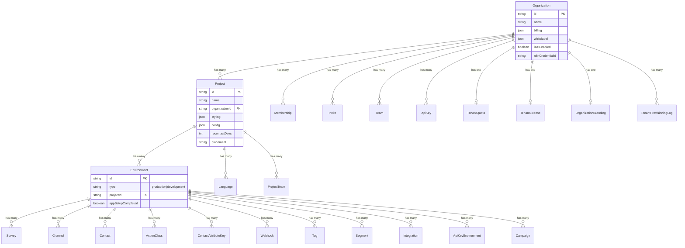
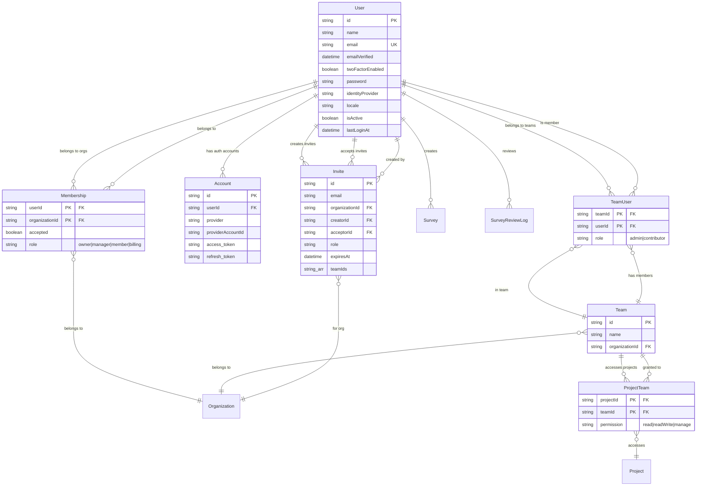
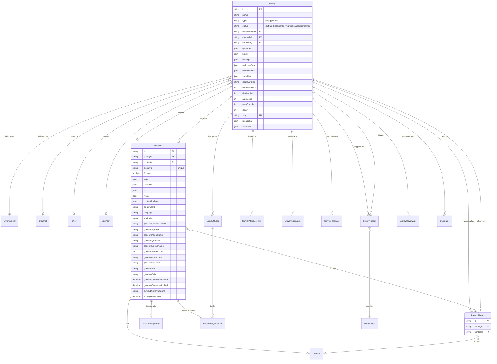
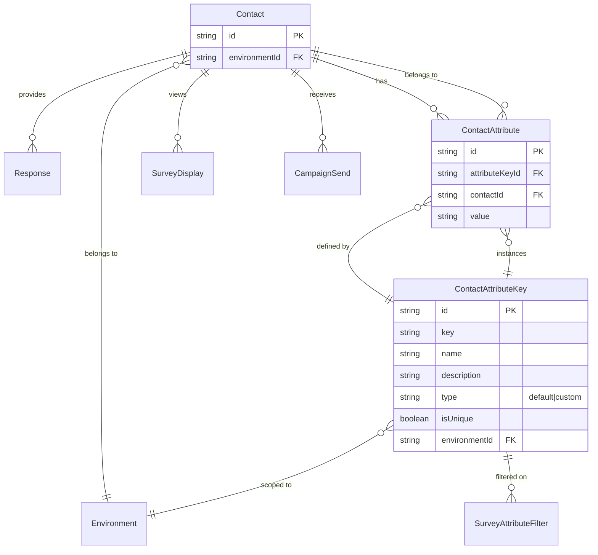
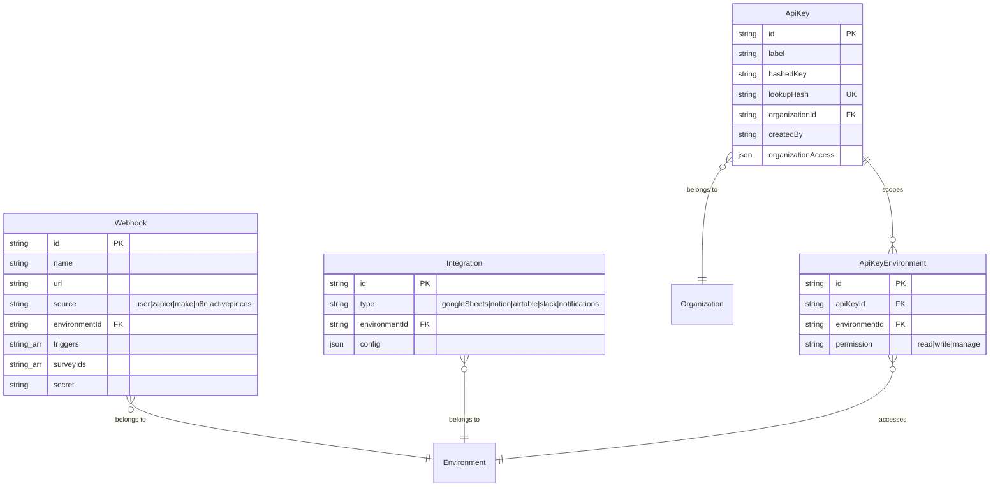
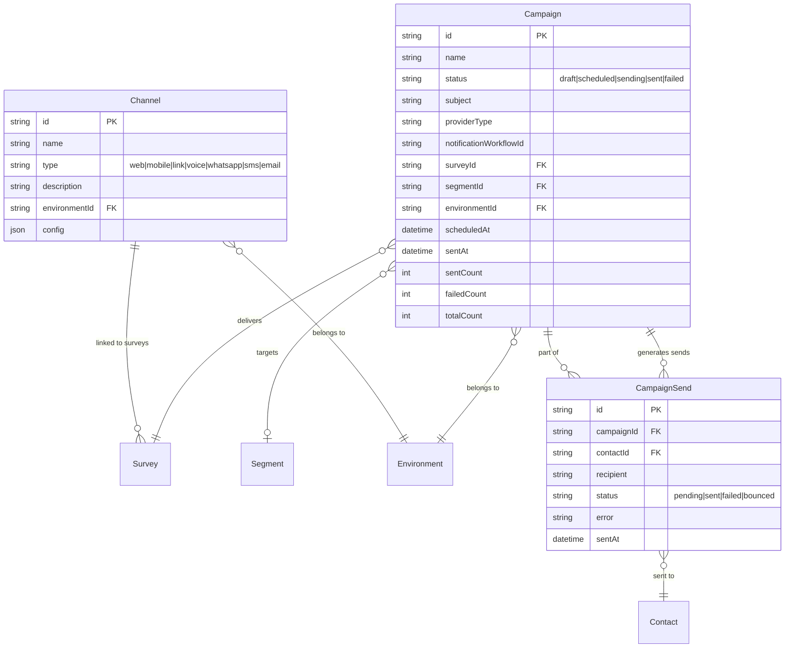
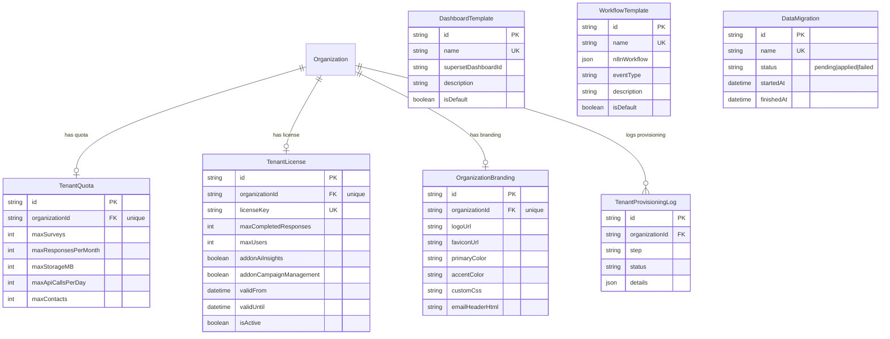
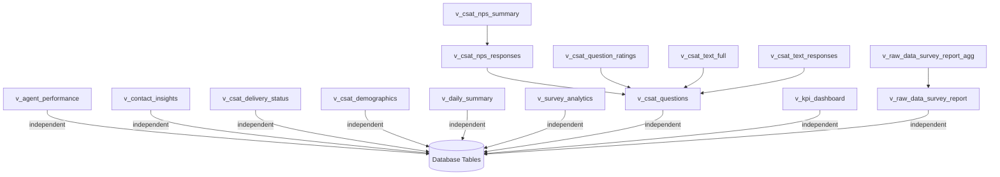

# Database Schema Reference

This document provides a comprehensive reference for the HiveCFM database schema, covering every model, enum, relationship, index, and analytics view defined in the system.

## 1. Overview

HiveCFM uses **PostgreSQL** as its primary relational database, managed through **Prisma ORM** (v6.14.0). The schema is defined in `packages/database/schema.prisma` and contains 35+ models organized around a multi-tenant hierarchy.

Key technical details:

- **Database**: PostgreSQL with the `pgvector` extension enabled for vector similarity operations.
- **ORM**: Prisma Client with the `postgresqlExtensions` preview feature.
- **Type generation**: `prisma-json-types-generator` generates TypeScript types for JSON columns.
- **ID strategy**: All primary keys use CUID strings (`@default(cuid())`), with the exception of `Invite` which uses UUID.
- **Timestamps**: Every model includes `createdAt` and `updatedAt` columns, mapped to snake_case (`created_at`, `updated_at`).
- **Cascade deletes**: Foreign keys cascade on delete throughout the tenant hierarchy (Organization -> Project -> Environment -> resources).
- **Analytics layer**: 15 PostgreSQL views (`v_*`) power Apache Superset dashboards for CSAT, NPS, and operational reporting.

---

## 2. Entity-Relationship Diagrams

### 2.1 Core Tenant Hierarchy

The foundational hierarchy follows: **Organization -> Project -> Environment**. Each organization can have multiple projects, and each project has development and production environments.



### 2.2 User and Membership Models

Users connect to organizations through memberships. Teams provide an additional grouping layer with project-level access control.



### 2.3 Survey and Response Models

Surveys are the core data collection mechanism. They live within environments and collect responses from contacts.



### 2.4 Contact and People Models

Contacts represent the people who receive and respond to surveys. They carry custom attributes and belong to a specific environment.



### 2.5 Integration, Webhook, and API Key Models

These models handle external connectivity -- webhooks for event notifications, API keys for authentication, and integrations for third-party services.



### 2.6 Campaign and Delivery Models

Campaigns enable proactive survey distribution to contact segments via email, SMS, WhatsApp, and other channels.



### 2.7 Multi-Tenant Management and Analytics Models

Models supporting tenant provisioning, licensing, branding, quotas, and analytics dashboard configuration.



---

## 3. Model Reference

This section documents every model in the Prisma schema with all fields, relationships, and constraints.

### 3.1 Organization

**Purpose**: Top-level tenant container. Each organization represents a customer or business unit that owns projects, users, and all downstream resources.

**Table name**: `Organization` (default Prisma mapping)

| Field | Type | Constraints | Description |
|-------|------|-------------|-------------|
| `id` | `String` | PK, CUID | Unique identifier |
| `createdAt` | `DateTime` | default `now()` | Creation timestamp |
| `updatedAt` | `DateTime` | auto-updated | Last modification timestamp |
| `name` | `String` | required | Display name |
| `billing` | `Json` | required | Billing configuration (`OrganizationBilling` type) |
| `whitelabel` | `Json` | default `{}` | Whitelabel settings (`OrganizationWhitelabel` type) |
| `isAIEnabled` | `Boolean` | default `false` | Controls AI feature access |
| `n8nCredentialId` | `String?` | optional | n8n workflow automation credential ID |

**Relations**: `memberships`, `projects`, `invites`, `teams`, `apiKeys`, `tenantQuota`, `organizationBranding`, `tenantLicense`, `provisioningLogs`

### 3.2 Project

**Purpose**: Groups environments and resources under an organization. Represents a distinct application or product being monitored.

**Table name**: `Project` (default Prisma mapping)

| Field | Type | Constraints | Description |
|-------|------|-------------|-------------|
| `id` | `String` | PK, CUID | Unique identifier |
| `createdAt` | `DateTime` | default `now()` | Creation timestamp |
| `updatedAt` | `DateTime` | auto-updated | Last modification timestamp |
| `name` | `String` | required | Display name |
| `organizationId` | `String` | FK -> Organization | Parent organization |
| `styling` | `Json` | default `{"allowStyleOverwrite":true}` | Project-wide styling config |
| `config` | `Json` | default `{}` | Project configuration |
| `recontactDays` | `Int` | default `7` | Default survey recontact delay |
| `linkSurveyBranding` | `Boolean` | default `true` | Show branding in link surveys |
| `inAppSurveyBranding` | `Boolean` | default `true` | Show branding in in-app surveys |
| `placement` | `WidgetPlacement` | default `bottomRight` | Widget position |
| `clickOutsideClose` | `Boolean` | default `true` | Close survey on outside click |
| `darkOverlay` | `Boolean` | default `false` | Dark background overlay |
| `logo` | `Json?` | optional | Project logo configuration |
| `customHeadScripts` | `String?` | optional | Custom HTML `<head>` scripts (self-hosted) |

**Unique constraints**: `@@unique([organizationId, name])`
**Indexes**: `@@index([organizationId])`
**Relations**: `organization`, `environments`, `languages`, `projectTeams`

### 3.3 Environment

**Purpose**: Represents a deployment context (production or development) within a project. Most resources (surveys, contacts, webhooks) are scoped to an environment.

| Field | Type | Constraints | Description |
|-------|------|-------------|-------------|
| `id` | `String` | PK, CUID | Unique identifier |
| `createdAt` | `DateTime` | default `now()` | Creation timestamp |
| `updatedAt` | `DateTime` | auto-updated | Last modification timestamp |
| `type` | `EnvironmentType` | required | `production` or `development` |
| `projectId` | `String` | FK -> Project | Parent project |
| `appSetupCompleted` | `Boolean` | default `false` | Whether SDK setup is complete |

**Indexes**: `@@index([projectId])`
**Relations**: `project`, `surveys`, `channels`, `contacts`, `actionClasses`, `attributeKeys`, `webhooks`, `tags`, `segments`, `integration`, `ApiKeyEnvironment`, `campaigns`

### 3.4 Survey

**Purpose**: Core data model representing a survey instrument. Contains question definitions, display rules, styling, and targeting configuration.

| Field | Type | Constraints | Description |
|-------|------|-------------|-------------|
| `id` | `String` | PK, CUID | Unique identifier |
| `createdAt` | `DateTime` | default `now()` | Creation timestamp |
| `updatedAt` | `DateTime` | auto-updated | Last modification timestamp |
| `name` | `String` | required | Survey display name |
| `redirectUrl` | `String?` | optional | Post-completion redirect URL |
| `type` | `SurveyType` | default `app` | Delivery type (`link`, `app`, `voice`) |
| `environmentId` | `String` | FK -> Environment | Parent environment |
| `channelId` | `String?` | FK -> Channel | Delivery channel |
| `createdBy` | `String?` | FK -> User | Creator user |
| `status` | `SurveyStatus` | default `draft` | Lifecycle status |
| `welcomeCard` | `Json` | default `{"enabled": false}` | Welcome screen configuration |
| `questions` | `Json` | default `[]` | Legacy question definitions |
| `blocks` | `Json[]` | default `[]` | Block-based question structure (current) |
| `endings` | `Json[]` | default `[]` | Survey ending screen configurations |
| `hiddenFields` | `Json` | default `{"enabled": false}` | Hidden field passthrough |
| `variables` | `Json` | default `[]` | Survey variable definitions |
| `displayOption` | `displayOptions` | default `displayOnce` | Display frequency control |
| `recontactDays` | `Int?` | optional | Override for recontact delay |
| `displayLimit` | `Int?` | optional | Maximum display count |
| `inlineTriggers` | `Json?` | optional | Inline trigger configuration |
| `autoClose` | `Int?` | optional | Auto-close after N seconds |
| `autoComplete` | `Int?` | optional | Auto-complete threshold |
| `delay` | `Int` | default `0` | Display delay in milliseconds |
| `surveyClosedMessage` | `Json?` | optional | Message shown when survey is closed |
| `segmentId` | `String?` | FK -> Segment | Target segment |
| `projectOverwrites` | `Json?` | optional | Project-level style overrides |
| `styling` | `Json?` | optional | Survey-specific styling |
| `singleUse` | `Json?` | default `{"enabled": false, "isEncrypted": true}` | Single-use link config |
| `isVerifyEmailEnabled` | `Boolean` | default `false` | Require email verification |
| `isSingleResponsePerEmailEnabled` | `Boolean` | default `false` | One response per email |
| `isBackButtonHidden` | `Boolean` | default `false` | Hide back navigation |
| `isCaptureIpEnabled` | `Boolean` | default `false` | Capture respondent IP |
| `pin` | `String?` | optional | Survey access PIN |
| `displayPercentage` | `Decimal?` | optional | Percentage of visitors to display to |
| `showLanguageSwitch` | `Boolean?` | optional | Show language selector |
| `recaptcha` | `Json?` | default `{"enabled": false, "threshold":0.1}` | reCAPTCHA configuration |
| `metadata` | `Json` | default `{}` | Link survey metadata |
| `slug` | `String?` | unique | URL-friendly identifier |
| `reviewNote` | `String?` | optional | Reviewer notes |
| `reviewedBy` | `String?` | optional | Reviewer user ID |
| `reviewedAt` | `DateTime?` | optional | Review timestamp |
| `customHeadScripts` | `String?` | optional | Custom HTML scripts |
| `customHeadScriptsMode` | `SurveyScriptMode?` | default `add` | Script merge strategy |

**Indexes**: `@@index([environmentId, updatedAt])`, `@@index([segmentId])`, `@@index([channelId])`
**Relations**: `environment`, `channel`, `creator`, `segment`, `responses`, `quotas`, `displays`, `triggers`, `attributeFilters`, `languages`, `followUps`, `reviewLogs`, `campaigns`

### 3.5 Response

**Purpose**: Stores an individual survey response with answer data, metadata, and optional Genesys Cloud contact center context.

| Field | Type | Constraints | Description |
|-------|------|-------------|-------------|
| `id` | `String` | PK, CUID | Unique identifier |
| `createdAt` | `DateTime` | default `now()` | Response submission time |
| `updatedAt` | `DateTime` | default `now()`, auto-updated | Last update time |
| `finished` | `Boolean` | default `false` | Whether survey was completed |
| `surveyId` | `String` | FK -> Survey | Parent survey |
| `contactId` | `String?` | FK -> Contact | Respondent contact |
| `endingId` | `String?` | optional | Which ending was shown |
| `data` | `Json` | default `{}` | Answer data keyed by question ID |
| `variables` | `Json` | default `{}` | Variable values captured |
| `ttc` | `Json` | default `{}` | Time-to-completion metrics per question |
| `meta` | `Json` | default `{}` | Request metadata (country, userAgent, source) |
| `contactAttributes` | `Json?` | optional | Snapshot of contact attributes at response time |
| `singleUseId` | `String?` | optional | Single-use link identifier |
| `language` | `String?` | optional | Response language code |
| `displayId` | `String?` | unique, FK -> Display | Associated display event |
| `genesysConversationId` | `String?` | indexed | Genesys conversation identifier |
| `genesysAgentId` | `String?` | indexed | Agent user ID |
| `genesysAgentName` | `String?` | optional | Agent display name |
| `genesysQueueId` | `String?` | indexed | Queue identifier |
| `genesysQueueName` | `String?` | optional | Queue display name |
| `genesysHandleTime` | `Int?` | optional | Handle time in seconds |
| `genesysWrapCode` | `String?` | optional | Wrap-up code |
| `genesysDirection` | `String?` | optional | Call direction (inbound/outbound) |
| `genesysAni` | `String?` | optional | Caller phone number |
| `genesysDnis` | `String?` | optional | Dialed number |
| `genesysConversationStart` | `DateTime?` | optional | Conversation start time |
| `genesysConversationEnd` | `DateTime?` | optional | Conversation end time |
| `surveyDeliveryChannel` | `String?` | optional | Delivery channel (sms, whatsapp, voice, chat) |
| `surveyDeliveredAt` | `DateTime?` | optional | When survey was delivered |

**Unique constraints**: `@@unique([surveyId, singleUseId])`
**Indexes**: `@@index([createdAt])`, `@@index([surveyId, createdAt])`, `@@index([contactId, createdAt])`, `@@index([surveyId])`, `@@index([genesysConversationId])`, `@@index([genesysAgentId, createdAt])`, `@@index([genesysQueueId, createdAt])`
**Relations**: `survey`, `contact`, `display`, `tags`, `quotaLinks`

### 3.6 Contact

**Purpose**: Represents a person who can receive and respond to surveys within an environment.

| Field | Type | Constraints | Description |
|-------|------|-------------|-------------|
| `id` | `String` | PK, CUID | Unique identifier |
| `createdAt` | `DateTime` | default `now()` | Creation timestamp |
| `updatedAt` | `DateTime` | auto-updated | Last modification timestamp |
| `environmentId` | `String` | FK -> Environment | Parent environment |

**Indexes**: `@@index([environmentId])`
**Relations**: `environment`, `responses`, `attributes`, `displays`, `campaignSends`

### 3.7 ContactAttributeKey

**Purpose**: Defines the schema for contact attributes within an environment. Acts as a registry of all possible attribute keys.

| Field | Type | Constraints | Description |
|-------|------|-------------|-------------|
| `id` | `String` | PK, CUID | Unique identifier |
| `createdAt` | `DateTime` | default `now()` | Creation timestamp |
| `updatedAt` | `DateTime` | auto-updated | Last modification timestamp |
| `isUnique` | `Boolean` | default `false` | Whether values must be unique across contacts |
| `key` | `String` | required | Attribute identifier |
| `name` | `String?` | optional | Display name |
| `description` | `String?` | optional | Description |
| `type` | `ContactAttributeType` | default `custom` | `default` or `custom` |
| `environmentId` | `String` | FK -> Environment | Parent environment |

**Unique constraints**: `@@unique([key, environmentId])`
**Indexes**: `@@index([environmentId, createdAt])`
**Relations**: `environment`, `attributes`, `attributeFilters`

### 3.8 ContactAttribute

**Purpose**: Stores the actual value of an attribute for a specific contact. Links a contact to an attribute key with a value.

| Field | Type | Constraints | Description |
|-------|------|-------------|-------------|
| `id` | `String` | PK, CUID | Unique identifier |
| `createdAt` | `DateTime` | default `now()` | Creation timestamp |
| `updatedAt` | `DateTime` | auto-updated | Last modification timestamp |
| `attributeKeyId` | `String` | FK -> ContactAttributeKey | Attribute definition |
| `contactId` | `String` | FK -> Contact | Parent contact |
| `value` | `String` | required | Attribute value |

**Unique constraints**: `@@unique([contactId, attributeKeyId])`
**Indexes**: `@@index([attributeKeyId, value])`
**Relations**: `attributeKey`, `contact`

### 3.9 Display

**Purpose**: Records when a survey is shown to a user. Used for display frequency tracking and response rate calculation.

| Field | Type | Constraints | Description |
|-------|------|-------------|-------------|
| `id` | `String` | PK, CUID | Unique identifier |
| `createdAt` | `DateTime` | default `now()` | Display timestamp |
| `updatedAt` | `DateTime` | auto-updated | Last modification timestamp |
| `surveyId` | `String` | FK -> Survey | Displayed survey |
| `contactId` | `String?` | FK -> Contact | Contact who saw the survey |

**Indexes**: `@@index([surveyId])`, `@@index([contactId, createdAt])`
**Relations**: `survey`, `contact`, `response` (one-to-one)

### 3.10 Tag & TagsOnResponses

**Purpose**: Tags enable categorical labeling of survey responses for organization and filtering.

**Tag**

| Field | Type | Constraints | Description |
|-------|------|-------------|-------------|
| `id` | `String` | PK, CUID | Unique identifier |
| `createdAt` | `DateTime` | default `now()` | Creation timestamp |
| `updatedAt` | `DateTime` | auto-updated | Last modification timestamp |
| `name` | `String` | required | Tag label |
| `environmentId` | `String` | FK -> Environment | Parent environment |

**Unique constraints**: `@@unique([environmentId, name])`
**Indexes**: `@@index([environmentId])`

**TagsOnResponses** (junction table)

| Field | Type | Constraints | Description |
|-------|------|-------------|-------------|
| `responseId` | `String` | PK, FK -> Response | Tagged response |
| `tagId` | `String` | PK, FK -> Tag | Applied tag |

**Composite PK**: `@@id([responseId, tagId])`
**Indexes**: `@@index([responseId])`

### 3.11 ActionClass & SurveyTrigger

**ActionClass** defines user actions (code or no-code) that can trigger surveys.

| Field | Type | Constraints | Description |
|-------|------|-------------|-------------|
| `id` | `String` | PK, CUID | Unique identifier |
| `createdAt` | `DateTime` | default `now()` | Creation timestamp |
| `updatedAt` | `DateTime` | auto-updated | Last modification timestamp |
| `name` | `String` | required | Action display name |
| `description` | `String?` | optional | Description |
| `type` | `ActionType` | required | `code` or `noCode` |
| `key` | `String?` | optional | Programmatic key |
| `noCodeConfig` | `Json?` | optional | No-code trigger configuration |
| `environmentId` | `String` | FK -> Environment | Parent environment |

**Unique constraints**: `@@unique([key, environmentId])`, `@@unique([name, environmentId])`
**Indexes**: `@@index([environmentId, createdAt])`

**SurveyTrigger** links surveys to the actions that trigger them.

| Field | Type | Constraints | Description |
|-------|------|-------------|-------------|
| `id` | `String` | PK, CUID | Unique identifier |
| `surveyId` | `String` | FK -> Survey | Triggered survey |
| `actionClassId` | `String` | FK -> ActionClass | Triggering action |

**Unique constraints**: `@@unique([surveyId, actionClassId])`
**Indexes**: `@@index([surveyId])`

### 3.12 SurveyAttributeFilter

**Purpose**: Defines targeting rules that restrict survey display to contacts matching specific attribute criteria.

| Field | Type | Constraints | Description |
|-------|------|-------------|-------------|
| `id` | `String` | PK, CUID | Unique identifier |
| `attributeKeyId` | `String` | FK -> ContactAttributeKey | Attribute to filter on |
| `surveyId` | `String` | FK -> Survey | Target survey |
| `condition` | `SurveyAttributeFilterCondition` | required | `equals` or `notEquals` |
| `value` | `String` | required | Value to compare against |

**Unique constraints**: `@@unique([surveyId, attributeKeyId])`
**Indexes**: `@@index([surveyId])`, `@@index([attributeKeyId])`

### 3.13 SurveyQuota & ResponseQuotaLink

**SurveyQuota** defines response limits and conditions for quota management within a survey.

| Field | Type | Constraints | Description |
|-------|------|-------------|-------------|
| `id` | `String` | PK, CUID | Unique identifier |
| `surveyId` | `String` | FK -> Survey | Parent survey |
| `name` | `String` | required | Quota display name |
| `limit` | `Int` | required | Maximum response count |
| `logic` | `Json` | default `{}` | Quota qualification logic |
| `action` | `SurveyQuotaAction` | required | `endSurvey` or `continueSurvey` |
| `endingCardId` | `String?` | optional | Ending card to show when reached |
| `countPartialSubmissions` | `Boolean` | default `false` | Whether partial responses count |

**Unique constraints**: `@@unique([surveyId, name])`
**Indexes**: `@@index([surveyId])`

**ResponseQuotaLink** tracks which responses counted toward which quotas.

| Field | Type | Constraints | Description |
|-------|------|-------------|-------------|
| `responseId` | `String` | PK, FK -> Response | Counted response |
| `quotaId` | `String` | PK, FK -> SurveyQuota | Target quota |
| `status` | `ResponseQuotaLinkStatus` | required | `screenedIn` or `screenedOut` |

**Composite PK**: `@@id([responseId, quotaId])`
**Indexes**: `@@index([quotaId, status])`

### 3.14 SurveyFollowUp

**Purpose**: Defines automated follow-up actions triggered by specific survey response conditions.

| Field | Type | Constraints | Description |
|-------|------|-------------|-------------|
| `id` | `String` | PK, CUID | Unique identifier |
| `surveyId` | `String` | FK -> Survey | Parent survey |
| `name` | `String` | required | Follow-up name |
| `trigger` | `Json` | required | Trigger conditions |
| `action` | `Json` | required | Actions to execute |

### 3.15 SurveyReviewLog

**Purpose**: Audit log for the survey approval workflow. Tracks submissions, approvals, rejections, and resubmissions.

| Field | Type | Constraints | Description |
|-------|------|-------------|-------------|
| `id` | `String` | PK, CUID | Unique identifier |
| `surveyId` | `String` | FK -> Survey | Reviewed survey |
| `userId` | `String` | FK -> User | Reviewing user |
| `action` | `SurveyReviewAction` | required | `SUBMITTED`, `APPROVED`, `REJECTED`, `RESUBMITTED` |
| `comment` | `String?` | optional | Review comment |
| `createdAt` | `DateTime` | default `now()` | Action timestamp |

**Indexes**: `@@index([surveyId])`, `@@index([userId])`

### 3.16 Segment

**Purpose**: Defines a group of contacts based on attribute filter rules. Used for survey targeting and campaign audience selection.

| Field | Type | Constraints | Description |
|-------|------|-------------|-------------|
| `id` | `String` | PK, CUID | Unique identifier |
| `title` | `String` | required | Segment display name |
| `description` | `String?` | optional | Description |
| `isPrivate` | `Boolean` | default `true` | Visibility control |
| `filters` | `Json` | default `[]` | Segment filter rules |
| `environmentId` | `String` | FK -> Environment | Parent environment |

**Unique constraints**: `@@unique([environmentId, title])`
**Indexes**: `@@index([environmentId])`
**Relations**: `environment`, `surveys`, `campaigns`

### 3.17 Language & SurveyLanguage

**Language** registers supported languages at the project level.

| Field | Type | Constraints | Description |
|-------|------|-------------|-------------|
| `id` | `String` | PK, CUID | Unique identifier |
| `code` | `String` | required | Language code (e.g., `en-US`) |
| `alias` | `String?` | optional | Friendly name |
| `projectId` | `String` | FK -> Project | Parent project |

**Unique constraints**: `@@unique([projectId, code])`

**SurveyLanguage** links surveys to available languages.

| Field | Type | Constraints | Description |
|-------|------|-------------|-------------|
| `languageId` | `String` | PK, FK -> Language | Language |
| `surveyId` | `String` | PK, FK -> Survey | Survey |
| `default` | `Boolean` | default `false` | Default language flag |
| `enabled` | `Boolean` | default `true` | Whether language is active |

**Composite PK**: `@@id([languageId, surveyId])`
**Indexes**: `@@index([surveyId])`, `@@index([languageId])`

### 3.18 Channel

**Purpose**: Represents a survey delivery channel within an environment. Channels define how surveys reach respondents (web, mobile, SMS, WhatsApp, voice, email).

**Table name**: `channels` (mapped via `@@map("channels")`)

| Field | Type | Constraints | Description |
|-------|------|-------------|-------------|
| `id` | `String` | PK, CUID | Unique identifier |
| `createdAt` | `DateTime` | default `now()` | Creation timestamp |
| `updatedAt` | `DateTime` | auto-updated | Last modification timestamp |
| `name` | `String` | required | Channel display name |
| `type` | `ChannelType` | required | Channel type enum |
| `description` | `String?` | optional | Description |
| `environmentId` | `String` | FK -> Environment | Parent environment |
| `config` | `Json` | default `{}` | Channel-specific configuration |

**Unique constraints**: `@@unique([environmentId, name])`
**Indexes**: `@@index([environmentId])`
**Relations**: `environment`, `surveys`

### 3.19 Webhook

**Purpose**: Configures HTTP webhook endpoints for receiving survey-related event notifications.

| Field | Type | Constraints | Description |
|-------|------|-------------|-------------|
| `id` | `String` | PK, CUID | Unique identifier |
| `name` | `String?` | optional | Display name |
| `url` | `String` | required | Endpoint URL |
| `source` | `WebhookSource` | default `user` | Origin platform |
| `environmentId` | `String` | FK -> Environment | Parent environment |
| `triggers` | `PipelineTriggers[]` | array | Event types to fire on |
| `surveyIds` | `String[]` | array | Monitored survey IDs |
| `secret` | `String?` | optional | Webhook signing secret |

**Indexes**: `@@index([environmentId])`

### 3.20 Integration

**Purpose**: Stores configuration for third-party service integrations (Google Sheets, Notion, Airtable, Slack, HiveCFM Notifications).

| Field | Type | Constraints | Description |
|-------|------|-------------|-------------|
| `id` | `String` | PK, CUID | Unique identifier |
| `type` | `IntegrationType` | required | Service type |
| `environmentId` | `String` | FK -> Environment | Parent environment |
| `config` | `Json` | required | Integration configuration |

**Unique constraints**: `@@unique([type, environmentId])`
**Indexes**: `@@index([environmentId])`

### 3.21 User

**Purpose**: Central user model for authentication and profile management. Users access the platform through organization memberships.

| Field | Type | Constraints | Description |
|-------|------|-------------|-------------|
| `id` | `String` | PK, CUID | Unique identifier |
| `createdAt` | `DateTime` | default `now()` | Registration timestamp |
| `updatedAt` | `DateTime` | auto-updated | Last modification timestamp |
| `name` | `String` | required | Display name |
| `email` | `String` | unique | Email address |
| `emailVerified` | `DateTime?` | optional | Email verification timestamp |
| `twoFactorSecret` | `String?` | optional | 2FA secret key |
| `twoFactorEnabled` | `Boolean` | default `false` | 2FA status |
| `backupCodes` | `String?` | optional | 2FA backup codes |
| `password` | `String?` | optional | Hashed password (null for OAuth users) |
| `identityProvider` | `IdentityProvider` | default `email` | Authentication method |
| `identityProviderAccountId` | `String?` | optional | External provider account ID |
| `groupId` | `String?` | optional | User group identifier |
| `notificationSettings` | `Json` | default `{}` | Notification preferences |
| `locale` | `String` | default `en-US` | UI locale |
| `lastLoginAt` | `DateTime?` | optional | Last login timestamp |
| `isActive` | `Boolean` | default `true` | Account active status |

**Indexes**: `@@index([email])`
**Relations**: `memberships`, `accounts`, `invitesCreated`, `invitesAccepted`, `surveys`, `surveyReviewLogs`, `teamUsers`

### 3.22 Account

**Purpose**: Stores OAuth/SSO authentication credentials. Supports multiple identity providers per user.

| Field | Type | Constraints | Description |
|-------|------|-------------|-------------|
| `id` | `String` | PK, CUID | Unique identifier |
| `userId` | `String` | FK -> User | Owner user |
| `type` | `String` | required | Account type |
| `provider` | `String` | required | OAuth provider name |
| `providerAccountId` | `String` | required | Provider user ID |
| `access_token` | `String?` | `@db.Text` | OAuth access token |
| `refresh_token` | `String?` | `@db.Text` | OAuth refresh token |
| `expires_at` | `Int?` | optional | Token expiration |
| `ext_expires_in` | `Int?` | optional | Extended expiry |
| `token_type` | `String?` | optional | Token type |
| `scope` | `String?` | optional | OAuth scopes |
| `id_token` | `String?` | `@db.Text` | OIDC ID token |
| `session_state` | `String?` | optional | Session state |

**Unique constraints**: `@@unique([provider, providerAccountId])`
**Indexes**: `@@index([userId])`

### 3.23 Membership

**Purpose**: Junction table linking users to organizations with role-based access. Composite primary key on `[userId, organizationId]`.

| Field | Type | Constraints | Description |
|-------|------|-------------|-------------|
| `userId` | `String` | PK, FK -> User | Member user |
| `organizationId` | `String` | PK, FK -> Organization | Target organization |
| `accepted` | `Boolean` | default `false` | Acceptance status |
| `role` | `OrganizationRole` | default `member` | Organization role |

**Indexes**: `@@index([userId])`, `@@index([organizationId])`

### 3.24 Invite

**Purpose**: Manages pending invitations to join an organization. Converted to memberships upon acceptance.

| Field | Type | Constraints | Description |
|-------|------|-------------|-------------|
| `id` | `String` | PK, UUID | Unique identifier |
| `email` | `String` | required | Invitee email |
| `name` | `String?` | optional | Invitee name |
| `organizationId` | `String` | FK -> Organization | Target organization |
| `creatorId` | `String` | FK -> User | Inviter |
| `acceptorId` | `String?` | FK -> User | Accepting user |
| `createdAt` | `DateTime` | default `now()` | Invitation timestamp |
| `expiresAt` | `DateTime` | required | Expiration time |
| `role` | `OrganizationRole` | default `member` | Intended role |
| `teamIds` | `String[]` | default `[]` | Teams to join on acceptance |

**Indexes**: `@@index([email, organizationId])`, `@@index([organizationId])`

### 3.25 ApiKey & ApiKeyEnvironment

**ApiKey** provides organization-level API authentication with granular environment permissions.

| Field | Type | Constraints | Description |
|-------|------|-------------|-------------|
| `id` | `String` | PK, CUID | Unique identifier |
| `createdAt` | `DateTime` | default `now()` | Creation timestamp |
| `createdBy` | `String?` | optional | Creator user ID |
| `lastUsedAt` | `DateTime?` | optional | Last usage timestamp |
| `label` | `String` | required | Descriptive label |
| `hashedKey` | `String` | required | SHA-256 hashed key |
| `lookupHash` | `String?` | unique | Partial hash for fast lookup |
| `organizationId` | `String` | FK -> Organization | Owner organization |
| `organizationAccess` | `Json` | default `{}` | Org-level permissions |

**Indexes**: `@@index([organizationId])`

**ApiKeyEnvironment** grants an API key specific permissions on an environment.

| Field | Type | Constraints | Description |
|-------|------|-------------|-------------|
| `id` | `String` | PK, CUID | Unique identifier |
| `apiKeyId` | `String` | FK -> ApiKey | Parent key |
| `environmentId` | `String` | FK -> Environment | Target environment |
| `permission` | `ApiKeyPermission` | required | `read`, `write`, or `manage` |

**Unique constraints**: `@@unique([apiKeyId, environmentId])`
**Indexes**: `@@index([environmentId])`

### 3.26 Team, TeamUser, ProjectTeam

**Team** organizes users within an organization for group-based access control.

| Field | Type | Constraints | Description |
|-------|------|-------------|-------------|
| `id` | `String` | PK, CUID | Unique identifier |
| `name` | `String` | required | Team name |
| `organizationId` | `String` | FK -> Organization | Parent organization |

**Unique constraints**: `@@unique([organizationId, name])`

**TeamUser** links users to teams with roles.

Composite PK: `@@id([teamId, userId])`. Roles: `admin`, `contributor`.

**ProjectTeam** grants team-level access to specific projects.

Composite PK: `@@id([projectId, teamId])`. Permissions: `read`, `readWrite`, `manage`.

### 3.27 Campaign & CampaignSend

**Campaign** manages proactive survey distribution campaigns.

See Section 2.6 for field details.

**Indexes**: `@@index([environmentId])`, `@@index([surveyId])`

**CampaignSend** tracks individual delivery attempts.

**Indexes**: `@@index([campaignId])`, `@@index([contactId])`

### 3.28 TenantQuota

**Purpose**: Defines resource limits for a tenant organization. One-to-one with Organization.

**Table name**: `tenant_quota`

| Field | Type | Constraints | Description |
|-------|------|-------------|-------------|
| `id` | `String` | PK, CUID | Unique identifier |
| `organizationId` | `String` | unique, FK -> Organization | Owner organization |
| `maxSurveys` | `Int` | default `100` | Maximum active surveys |
| `maxResponsesPerMonth` | `Int` | default `10000` | Monthly response cap |
| `maxStorageMB` | `Int` | default `5120` | Storage limit in MB |
| `maxApiCallsPerDay` | `Int` | default `50000` | Daily API call limit |
| `maxContacts` | `Int` | default `50000` | Maximum contacts |

### 3.29 TenantLicense

**Purpose**: Manages commercial license keys with feature flags and usage limits per tenant.

**Table name**: `tenant_license`

| Field | Type | Constraints | Description |
|-------|------|-------------|-------------|
| `id` | `String` | PK, CUID | Unique identifier |
| `organizationId` | `String` | unique, FK -> Organization | Licensed organization |
| `licenseKey` | `String` | unique | License key string |
| `maxCompletedResponses` | `Int` | default `10000` | Licensed response volume |
| `maxUsers` | `Int` | default `10` | Licensed user seats |
| `addonAiInsights` | `Boolean` | default `false` | AI insights feature flag |
| `addonCampaignManagement` | `Boolean` | default `false` | Campaign management feature flag |
| `validFrom` | `DateTime` | default `now()` | License start date |
| `validUntil` | `DateTime` | required | License expiry date |
| `isActive` | `Boolean` | default `true` | Active status |

### 3.30 OrganizationBranding

**Purpose**: Stores whitelabel branding configuration for the organization's UI.

**Table name**: `organization_branding`

| Field | Type | Constraints | Description |
|-------|------|-------------|-------------|
| `id` | `String` | PK, CUID | Unique identifier |
| `organizationId` | `String` | unique, FK -> Organization | Owner organization |
| `logoUrl` | `String?` | optional | Logo image URL |
| `faviconUrl` | `String?` | optional | Favicon URL |
| `primaryColor` | `String` | default `#0F172A` | Primary brand color |
| `accentColor` | `String` | default `#3B82F6` | Accent brand color |
| `customCss` | `String?` | optional | Custom CSS overrides |
| `emailHeaderHtml` | `String?` | optional | Email header HTML |

### 3.31 TenantProvisioningLog

**Purpose**: Audit log for tenant provisioning steps during onboarding.

**Table name**: `tenant_provisioning_log`

| Field | Type | Constraints | Description |
|-------|------|-------------|-------------|
| `id` | `String` | PK, CUID | Unique identifier |
| `organizationId` | `String` | FK -> Organization | Target organization |
| `step` | `String` | required | Provisioning step name |
| `status` | `String` | required | Step status |
| `details` | `Json?` | optional | Additional details |

**Indexes**: `@@index([organizationId, createdAt])`

### 3.32 DashboardTemplate

**Purpose**: Stores references to Apache Superset dashboard templates that are provisioned for each tenant.

**Table name**: `dashboard_template`

| Field | Type | Constraints | Description |
|-------|------|-------------|-------------|
| `id` | `String` | PK, CUID | Unique identifier |
| `name` | `String` | unique | Template name |
| `supersetDashboardId` | `String` | required | Superset dashboard ID |
| `description` | `String?` | optional | Description |
| `isDefault` | `Boolean` | default `true` | Provisioned by default |

### 3.33 WorkflowTemplate

**Purpose**: Stores n8n workflow templates that can be provisioned for tenant automation.

**Table name**: `workflow_template`

| Field | Type | Constraints | Description |
|-------|------|-------------|-------------|
| `id` | `String` | PK, CUID | Unique identifier |
| `name` | `String` | unique | Template name |
| `n8nWorkflow` | `Json` | required | Full n8n workflow definition |
| `eventType` | `String` | required | Triggering event type |
| `description` | `String?` | optional | Description |
| `isDefault` | `Boolean` | default `true` | Provisioned by default |

### 3.34 DataMigration

**Purpose**: Tracks the execution state of data migrations (distinct from schema migrations). Used by the custom migration runner to ensure idempotent data transformations.

| Field | Type | Constraints | Description |
|-------|------|-------------|-------------|
| `id` | `String` | PK, CUID | Unique identifier |
| `startedAt` | `DateTime` | default `now()` | Migration start time |
| `finishedAt` | `DateTime?` | optional | Migration completion time |
| `name` | `String` | unique | Migration name |
| `status` | `DataMigrationStatus` | required | `pending`, `applied`, or `failed` |

---

## 4. Enums

All enums defined in the Prisma schema, with their values and usage context.

### 4.1 PipelineTriggers

Webhook event types that trigger notifications.

| Value | Description |
|-------|-------------|
| `responseCreated` | Fired when a new response is submitted |
| `responseUpdated` | Fired when a response is modified |
| `responseFinished` | Fired when a response is marked as complete |

### 4.2 WebhookSource

Origin platform of a webhook configuration.

| Value | Description |
|-------|-------------|
| `user` | Manually configured by a user |
| `zapier` | Created via Zapier integration |
| `make` | Created via Make (Integromat) integration |
| `n8n` | Created via n8n integration |
| `activepieces` | Created via Activepieces integration |

### 4.3 ContactAttributeType

Classification of contact attribute definitions.

| Value | Description |
|-------|-------------|
| `default` | System-defined attribute (e.g., email, name) |
| `custom` | User-defined custom attribute |

### 4.4 SurveyStatus

Survey lifecycle states.

| Value | Description |
|-------|-------------|
| `draft` | Survey is being edited, not yet live |
| `underReview` | Submitted for approval review |
| `inProgress` | Actively collecting responses |
| `paused` | Temporarily stopped |
| `completed` | Data collection finished |

### 4.5 SurveyType

Survey delivery mechanism.

| Value | Description |
|-------|-------------|
| `link` | Standalone URL-based survey |
| `app` | Embedded in-app survey (SDK-triggered) |
| `voice` | Voice/IVR survey |

### 4.6 ChannelType

Delivery channel categories for surveys.

| Value | Description |
|-------|-------------|
| `web` | Web browser |
| `mobile` | Mobile application |
| `link` | Shareable link |
| `voice` | Voice/IVR call |
| `whatsapp` | WhatsApp message |
| `sms` | SMS text message |
| `email` | Email delivery |

### 4.7 CampaignStatus

Campaign lifecycle states.

| Value | Description |
|-------|-------------|
| `draft` | Campaign is being configured |
| `scheduled` | Queued for future sending |
| `sending` | Currently being dispatched |
| `sent` | Delivery completed |
| `failed` | Delivery failed |

### 4.8 CampaignSendStatus

Individual send attempt states.

| Value | Description |
|-------|-------------|
| `pending` | Awaiting delivery |
| `sent` | Successfully delivered |
| `failed` | Delivery failed |
| `bounced` | Message bounced |

### 4.9 displayOptions

Survey display frequency rules.

| Value | Description |
|-------|-------------|
| `displayOnce` | Show survey only once per contact |
| `displayMultiple` | Show survey on every trigger |
| `displaySome` | Show survey a limited number of times |
| `respondMultiple` | Allow multiple responses |

### 4.10 SurveyScriptMode

Controls how survey-level custom scripts merge with project-level scripts.

| Value | Description |
|-------|-------------|
| `add` | Merge survey scripts with project scripts |
| `replace` | Survey scripts override project scripts |

### 4.11 SurveyAttributeFilterCondition

Comparison operators for attribute-based survey targeting.

| Value | Description |
|-------|-------------|
| `equals` | Attribute value must match exactly |
| `notEquals` | Attribute value must not match |

### 4.12 SurveyQuotaAction

Action to take when a survey quota is reached.

| Value | Description |
|-------|-------------|
| `endSurvey` | Terminate the survey |
| `continueSurvey` | Allow the survey to continue |

### 4.13 ResponseQuotaLinkStatus

Screening result for a response against a quota.

| Value | Description |
|-------|-------------|
| `screenedIn` | Response qualifies for the quota |
| `screenedOut` | Response does not qualify |

### 4.14 ActionType

Classification of survey trigger actions.

| Value | Description |
|-------|-------------|
| `code` | Triggered programmatically via SDK |
| `noCode` | Triggered by URL/element/event rules without code |

### 4.15 EnvironmentType

Deployment environment classification.

| Value | Description |
|-------|-------------|
| `production` | Live production environment |
| `development` | Testing/development environment |

### 4.16 IntegrationType

Supported third-party integration services.

| Value | Description |
|-------|-------------|
| `googleSheets` | Google Sheets export |
| `notion` | Notion database sync |
| `airtable` | Airtable base sync |
| `slack` | Slack notifications |
| `notifications` | HiveCFM notification service |

### 4.17 DataMigrationStatus

Data migration execution states.

| Value | Description |
|-------|-------------|
| `pending` | Migration has started but not finished |
| `applied` | Migration completed successfully |
| `failed` | Migration encountered an error |

### 4.18 WidgetPlacement

In-app survey widget positioning.

| Value | Description |
|-------|-------------|
| `bottomLeft` | Bottom-left corner |
| `bottomRight` | Bottom-right corner |
| `topLeft` | Top-left corner |
| `topRight` | Top-right corner |
| `center` | Centered overlay |

### 4.19 OrganizationRole

User roles within an organization.

| Value | Description |
|-------|-------------|
| `owner` | Full control, can delete organization |
| `manager` | Can manage projects and users |
| `member` | Standard access to assigned projects |
| `billing` | Access to billing settings only |

### 4.20 IdentityProvider

Supported authentication providers.

| Value | Description |
|-------|-------------|
| `email` | Email/password authentication |
| `github` | GitHub OAuth |
| `google` | Google OAuth |
| `azuread` | Azure Active Directory |
| `openid` | Generic OpenID Connect |
| `saml` | SAML 2.0 SSO |

### 4.21 ApiKeyPermission

API key access levels.

| Value | Description |
|-------|-------------|
| `read` | Read-only access |
| `write` | Read and write access |
| `manage` | Full management access |

### 4.22 TeamUserRole

User roles within a team.

| Value | Description |
|-------|-------------|
| `admin` | Team administration rights |
| `contributor` | Standard team member |

### 4.23 ProjectTeamPermission

Team access levels for projects.

| Value | Description |
|-------|-------------|
| `read` | View project resources |
| `readWrite` | View and modify resources |
| `manage` | Full project management |

### 4.24 SurveyReviewAction

Survey approval workflow actions.

| Value | Description |
|-------|-------------|
| `SUBMITTED` | Survey submitted for review |
| `APPROVED` | Survey approved by reviewer |
| `REJECTED` | Survey rejected with feedback |
| `RESUBMITTED` | Survey resubmitted after changes |

---

## 5. Row-Level Security (RLS)

The HiveCFM database does **not** implement PostgreSQL Row-Level Security (RLS) policies. Access control is enforced at the application layer through:

1. **Organization membership checks**: Every API request validates that the authenticated user has an active membership in the target organization.
2. **Environment scoping**: Resources are always queried with an `environmentId` filter derived from the user's project context.
3. **API key permissions**: The `ApiKeyEnvironment` model provides per-environment permission levels (`read`, `write`, `manage`).
4. **Team-based project access**: The `ProjectTeam` model with `ProjectTeamPermission` controls which teams can access which projects.
5. **Cascade deletes**: Foreign key constraints with `onDelete: Cascade` ensure that deleting a parent entity (organization, project, environment) removes all child resources.

The Superset analytics views (Section 7) include `organization_name` and `environment_id` columns to enable row-level filtering at the BI layer.

---

## 6. Migrations

### 6.1 Migration Architecture

HiveCFM uses a custom migration runner built on top of Prisma Migrate, supporting both **schema migrations** (SQL) and **data migrations** (TypeScript).

**Key files**:

- Schema definition: `packages/database/schema.prisma`
- Migration directory: `packages/database/migration/` (custom, not the default Prisma `migrations/` directory)
- Migration runner: `packages/database/src/scripts/migration-runner.ts`
- Apply script: `packages/database/src/scripts/apply-migrations.ts`
- Create script: `packages/database/src/scripts/create-migration.ts`

### 6.2 Migration Directory Structure

Each migration lives in a timestamped directory under `packages/database/migration/`:

```
migration/
  20230329205933_init/
    migration.sql
  20260114220000_add_genesys_context_fields/
    migration.sql
  20260225110000_add_multi_tenant_models/
    migration.sql
  20260310000000_add_superset_views/
    migration.sql
  migration_lock.toml
```

- **Schema migrations** contain a `migration.sql` file with DDL statements.
- **Data migrations** contain a `migration.ts` (or `migration.js` in built output) file exporting a `MigrationScript` object with a `run()` function.
- A migration directory must contain exactly one of `migration.sql` or `migration.ts` -- never both.

### 6.3 How the Migration Runner Works

The migration runner (`migration-runner.ts`) operates as follows:

1. **Load**: Scans the `migration/` directory, sorts by timestamp, and loads all migrations.
2. **Classify**: Each migration is classified as either `schema` (has `migration.sql`) or `data` (has `migration.ts`).
3. **Execute schema migrations**: Copies the migration SQL to Prisma's `migrations/` directory and runs `prisma migrate deploy`.
4. **Execute data migrations**: Runs inside a Prisma `$transaction` with a 30-minute timeout. Uses the `DataMigration` table to track state (`pending` -> `applied` or `failed`).
5. **Idempotency**: Schema migrations are checked against Prisma's `_prisma_migrations` table. Data migrations are checked against the `DataMigration` table.
6. **Duplicate detection**: The runner rejects duplicate migration names within the same type (schema or data).

### 6.4 Available Commands

| Command | Purpose |
|---------|---------|
| `pnpm db:migrate:deploy` | Apply all pending migrations (production) |
| `pnpm db:migrate:dev` | Build, generate, and apply migrations (development) |
| `pnpm db:push` | Push schema changes directly (bypasses migrations, uses `--accept-data-loss`) |
| `pnpm db:seed` | Run database seed script |
| `pnpm db:seed:clear` | Clear and re-seed database |
| `pnpm db:setup` | Full setup: migrate + create SAML database + seed |
| `pnpm create-migration` | Interactive script to create a new migration |

### 6.5 Creating a New Migration

To create a new schema migration:

1. Modify `schema.prisma` with your changes.
2. Run `pnpm create-migration` (interactive prompt for migration name).
3. The script runs `prisma migrate dev --create-only`, moves the generated SQL from `migrations/` to `migration/`, and applies it.
4. Migration names must contain only letters, numbers, and spaces. They are converted to underscored format for the directory name.

### 6.6 Migration History

The project has accumulated 110+ migrations since the initial schema (`20230329205933_init`). Notable milestones include:

- `20230329205933_init` -- Initial schema creation
- `20241010133706_xm_user_identification` -- Contact model refactor
- `20241120150728_product_revamp` -- Project model restructure
- `20260114220000_add_genesys_context_fields` -- Genesys Cloud contact center integration
- `20260120000000_add_channels_and_review_log` -- Multi-channel support and survey review workflow
- `20260225110000_add_multi_tenant_models` -- Tenant quota, branding, provisioning
- `20260304000000_campaign_notification_refactor` -- Campaign delivery via HiveCFM notification service
- `20260306180000_add_voice_survey_type` -- Voice survey support
- `20260307000000_add_tenant_license` -- Commercial licensing model
- `20260310000000_add_superset_views` -- Analytics views for Superset dashboards

---

## 7. Superset Analytics Views

The file `packages/database/migration/20260310000000_add_superset_views/migration.sql` creates 15 PostgreSQL views that power Apache Superset dashboards. These views denormalize the relational data into analytics-ready structures.

### 7.1 View Dependency Graph



### 7.2 Independent Views (No View Dependencies)

#### v_agent_performance

**Purpose**: Agent-level performance metrics for contact center supervisors. Focuses on Genesys-enriched response data.

| Column | Source | Description |
|--------|--------|-------------|
| `genesys_agent_id` | Response | Agent identifier |
| `genesys_agent_name` | Response | Agent display name |
| `genesys_queue_id` | Response | Queue identifier |
| `genesys_queue_name` | Response | Queue display name |
| `response_date` | Response.created_at | Date of response |
| `call_direction` | Response | Inbound/outbound |
| `wrap_code` | Response | Agent wrap-up code |
| `survey_completed` | Response.finished | Completion flag |
| `handle_time_seconds` | Response | Call handle time |
| `conversation_duration_seconds` | Calculated | End minus start time |
| `survey_name` | Survey | Survey name |
| `project_name` | Project | Project name |
| `organization_name` | Organization | Org name (for RLS) |

**Filter**: Only rows where `genesys_agent_id IS NOT NULL`.

#### v_contact_insights

**Purpose**: Aggregated engagement metrics per contact. Shows response counts, participation breadth, and activity timeline.

| Column | Source | Description |
|--------|--------|-------------|
| `contact_id` | Contact | Contact identifier |
| `contact_created_at` | Contact | Registration date |
| `environment_id` | Environment | Environment context |
| `project_name` | Project | Project name |
| `organization_name` | Organization | Org name |
| `total_responses` | Calculated | Total response count |
| `completed_responses` | Calculated | Completed responses only |
| `first_response_date` | Calculated | Earliest response |
| `last_response_date` | Calculated | Latest response |
| `surveys_participated` | Calculated | Distinct survey count |

**Aggregation**: Groups by contact with LEFT JOIN to Response.

#### v_csat_delivery_status

**Purpose**: Survey delivery and completion funnel metrics. Shows display counts, response counts, and conversion rates.

| Column | Source | Description |
|--------|--------|-------------|
| `survey_id` | Survey | Survey identifier |
| `survey_name` | Survey | Survey name |
| `survey_status` | Survey | Current status |
| `display_count` | Display (aggregated) | Times survey was shown |
| `total_responses` | Response (aggregated) | Total responses |
| `completed_responses` | Response (aggregated) | Completed responses |
| `response_rate` | Calculated | `completed / displayed * 100` |
| `completion_rate` | Calculated | `completed / total * 100` |
| `project_name` | Project | Project name |
| `organization_name` | Organization | Org name |

**Filter**: Only surveys with at least one display or response.

#### v_csat_demographics

**Purpose**: Response-level demographics data including country, browser, OS, device type, language, and delivery channel.

Key calculated columns: `duration_seconds`, `duration_minutes` (time between created and updated).

#### v_daily_summary

**Purpose**: Daily aggregated response metrics grouped by survey and date. Includes completion rates, average completion time, unique contacts, and unique agents.

#### v_survey_analytics

**Purpose**: Flat denormalized view joining Survey, Response, Environment, Project, and Organization. One row per response with full survey context and metadata.

### 7.3 Base Question Extraction View

#### v_csat_questions

**Purpose**: Extracts individual questions from the survey `blocks` JSON array structure. This view is the foundation for all question-level analytics.

**How it works**: Uses `LATERAL unnest(s.blocks)` to expand the blocks array, then `jsonb_array_elements(block -> 'elements')` to extract each question element. Filters to question types: `nps`, `rating`, `openText`, `ranking`.

| Column | Source | Description |
|--------|--------|-------------|
| `survey_id` | Survey | Survey identifier |
| `survey_name` | Survey | Survey name |
| `question_id` | blocks JSON | Question element ID |
| `question_type` | blocks JSON | Question type |
| `question_text` | blocks JSON | Headline text (HTML stripped) |
| `question_range` | blocks JSON | Rating scale range (defaults to 10 for NPS) |
| `question_scale` | blocks JSON | Scale configuration |
| `project_name` | Project | Project name |
| `organization_name` | Organization | Org name |
| `environment_id` | Environment | Environment context |

### 7.4 Views Depending on v_csat_questions

#### v_csat_nps_responses

**Purpose**: Detailed NPS and rating response data with score normalization and NPS categorization.

Key computed columns:
- `raw_score`: The literal numeric answer
- `normalized_score`: Score normalized to 0-10 scale
- `nps_category`: Classified as `Promoter` (9-10), `Passive` (7-8), or `Detractor` (0-6). Rating questions with range >= 10 use proportional thresholds (90%/70%).

Also includes: duration metrics, geographic data, Genesys agent/queue context, and delivery channel.

#### v_csat_question_ratings

**Purpose**: Rating-based question responses with satisfaction level classification.

- `Satisfied`: >= 80% of scale range
- `Neutral`: >= 50% of scale range
- `Dissatisfied`: < 50% of scale range

#### v_csat_text_full

**Purpose**: Full open-text responses with metadata. Filters for non-empty strings (length > 1). Includes response text, text length, language, country, and device type.

#### v_csat_text_responses

**Purpose**: Word-level tokenization of open-text responses for word cloud and frequency analysis. Uses `regexp_split_to_table` to split text into individual words. Filters out common English stop words (60+ words) and words shorter than 2 characters.

### 7.5 View Depending on v_csat_nps_responses

#### v_csat_nps_summary

**Purpose**: Aggregated NPS summary per survey. Calculates the official NPS score formula: `(Promoters% - Detractors%)`.

| Column | Description |
|--------|-------------|
| `survey_id` | Survey identifier |
| `survey_name` | Survey name |
| `total_responses` | Count of NPS-categorized responses |
| `promoter_count` | Count of promoters |
| `passive_count` | Count of passives |
| `detractor_count` | Count of detractors |
| `avg_score` | Average raw score |
| `avg_duration_minutes` | Average completion time |
| `nps_score` | Calculated NPS score (-100 to +100) |
| `promoter_pct` | Promoter percentage |
| `passive_pct` | Passive percentage |
| `detractor_pct` | Detractor percentage |
| `first_response` | Earliest response timestamp |
| `last_response` | Latest response timestamp |

### 7.6 KPI Dashboard View

#### v_kpi_dashboard

**Purpose**: Comprehensive KPI view combining NPS, CSAT, and response metrics in a single aggregated dataset grouped by date, survey, channel, queue, and agent. This is the primary view for executive dashboards.

**Architecture**: Self-contained (no view dependencies). Uses three CTEs:

1. **question_mapping**: Extracts questions from survey blocks.
2. **response_scores**: Joins responses with surveys and question mappings, extracts numeric values.
3. **scored_data**: Computes NPS categories (1=Promoter, 0=Passive, -1=Detractor), NPS scores, CSAT scores (normalized to 5-point scale), and raw ratings.

| Column | Description |
|--------|-------------|
| `date` | Response date |
| `survey_name` | Survey name |
| `channel_name` | Delivery channel |
| `queue_name` | Genesys queue |
| `agent_name` | Genesys agent |
| `nps_responses` | Count of NPS responses |
| `nps_promoters` | Promoter count |
| `nps_passives` | Passive count |
| `nps_detractors` | Detractor count |
| `nps_score` | Calculated NPS score |
| `nps_avg_rating` | Average NPS rating |
| `csat_responses` | Count of CSAT responses |
| `csat_score` | Normalized CSAT score (1-5) |
| `csat_raw_avg` | Raw average rating |
| `csat_satisfied` | Count scoring >= 4 |
| `csat_dissatisfied` | Count scoring < 3 |
| `total_responses` | Total response count |
| `completed_responses` | Completed response count |
| `unique_agents` | Distinct agent count |

### 7.7 Raw Data Report Views

#### v_raw_data_survey_report

**Purpose**: Detailed row-per-question report with all response context. Designed for data export and granular analysis. Self-contained with two CTEs.

Key features:
- One row per response per question (cross-join with question mapping)
- Computes `nps_answer`, `nps_category`, `csat_answer`, `csat_raw_answer`, `ces_answer`, and `fcr_answer` columns
- FCR (First Call Resolution) is derived from consent/boolean question types
- Includes full Genesys context (interaction ID, agent, queue, call direction, handle time, phone numbers, conversation timestamps)
- Includes traffic source, country, browser, OS, device type from response metadata

#### v_raw_data_survey_report_agg

**Purpose**: Aggregated version of the raw data report, with one row per response (instead of per question). Depends on `v_raw_data_survey_report`.

Aggregation strategy:
- Uses `min()` for dimensional fields (survey name, agent, queue, etc.) since they are constant per response
- Uses `max()` for NPS/CES/FCR answers (one per response)
- Uses `avg()` for CSAT answers (averaged across rating questions)
- Uses `bool_or()` for `is_completed`
- Includes `questions_answered` count

---

## 8. Database Indexes and Performance

### 8.1 Complete Index Reference

All indexes defined in the Prisma schema, organized by model.

#### Response Indexes (highest query volume)

| Index | Purpose |
|-------|---------|
| `@@index([createdAt])` | Time-range queries on responses |
| `@@index([surveyId, createdAt])` | Monthly response count per survey |
| `@@index([contactId, createdAt])` | Monthly identified contact count |
| `@@index([surveyId])` | Survey-specific response lookups |
| `@@index([genesysConversationId])` | Genesys conversation correlation |
| `@@index([genesysAgentId, createdAt])` | Agent performance time-series |
| `@@index([genesysQueueId, createdAt])` | Queue performance time-series |

#### Survey Indexes

| Index | Purpose |
|-------|---------|
| `@@index([environmentId, updatedAt])` | Environment survey listing (sorted by last update) |
| `@@index([segmentId])` | Segment-based survey lookup |
| `@@index([channelId])` | Channel-based survey lookup |

#### Environment & Project Indexes

| Index | Purpose |
|-------|---------|
| `Environment: @@index([projectId])` | Project-environment lookup |
| `Project: @@index([organizationId])` | Organization-project lookup |

#### Contact & Attribute Indexes

| Index | Purpose |
|-------|---------|
| `Contact: @@index([environmentId])` | Environment-scoped contact listing |
| `ContactAttributeKey: @@index([environmentId, createdAt])` | Attribute key listing |
| `ContactAttribute: @@index([attributeKeyId, value])` | Value-based attribute lookup |

#### Display Indexes

| Index | Purpose |
|-------|---------|
| `@@index([surveyId])` | Survey display count |
| `@@index([contactId, createdAt])` | Contact display history |

#### Membership & Access Indexes

| Index | Purpose |
|-------|---------|
| `Membership: @@index([userId])` | User membership lookup |
| `Membership: @@index([organizationId])` | Organization member listing |
| `Invite: @@index([email, organizationId])` | Invite lookup by email |
| `Invite: @@index([organizationId])` | Organization invite listing |
| `TeamUser: @@index([userId])` | User team membership |
| `ProjectTeam: @@index([teamId])` | Team project access |

#### Integration Indexes

| Index | Purpose |
|-------|---------|
| `Webhook: @@index([environmentId])` | Environment webhook listing |
| `Integration: @@index([environmentId])` | Environment integration listing |
| `ApiKey: @@index([organizationId])` | Organization API key listing |
| `ApiKeyEnvironment: @@index([environmentId])` | Environment API key access |

#### Other Indexes

| Index | Purpose |
|-------|---------|
| `Tag: @@index([environmentId])` | Environment tag listing |
| `TagsOnResponses: @@index([responseId])` | Response tag lookup |
| `SurveyTrigger: @@index([surveyId])` | Survey trigger listing |
| `SurveyAttributeFilter: @@index([surveyId])` | Survey filter listing |
| `SurveyAttributeFilter: @@index([attributeKeyId])` | Attribute filter lookup |
| `SurveyQuota: @@index([surveyId])` | Survey quota listing |
| `ResponseQuotaLink: @@index([quotaId, status])` | Quota count by status |
| `ActionClass: @@index([environmentId, createdAt])` | Action listing |
| `SurveyLanguage: @@index([surveyId])` | Survey language lookup |
| `SurveyLanguage: @@index([languageId])` | Language survey lookup |
| `SurveyReviewLog: @@index([surveyId])` | Survey review history |
| `SurveyReviewLog: @@index([userId])` | User review history |
| `Campaign: @@index([environmentId])` | Environment campaign listing |
| `Campaign: @@index([surveyId])` | Survey campaign listing |
| `CampaignSend: @@index([campaignId])` | Campaign send listing |
| `CampaignSend: @@index([contactId])` | Contact send history |
| `Channel: @@index([environmentId])` | Environment channel listing |
| `Account: @@index([userId])` | User account listing |
| `User: @@index([email])` | Email-based user lookup |
| `Segment: @@index([environmentId])` | Environment segment listing |
| `TenantProvisioningLog: @@index([organizationId, createdAt])` | Provisioning log timeline |

### 8.2 Unique Constraints

Unique constraints serve as both data integrity rules and implicit unique indexes.

| Model | Constraint | Purpose |
|-------|-----------|---------|
| `ContactAttribute` | `[contactId, attributeKeyId]` | One value per attribute per contact |
| `ContactAttributeKey` | `[key, environmentId]` | Unique keys within environment |
| `Response` | `[surveyId, singleUseId]` | Prevent duplicate single-use responses |
| `Response` | `displayId` (unique field) | One-to-one with Display |
| `Tag` | `[environmentId, name]` | Unique tag names per environment |
| `SurveyTrigger` | `[surveyId, actionClassId]` | One trigger per action per survey |
| `SurveyAttributeFilter` | `[surveyId, attributeKeyId]` | One filter per attribute per survey |
| `Survey` | `slug` (unique field) | Unique URL slugs |
| `SurveyQuota` | `[surveyId, name]` | Unique quota names per survey |
| `ActionClass` | `[key, environmentId]` | Unique keys per environment |
| `ActionClass` | `[name, environmentId]` | Unique names per environment |
| `Integration` | `[type, environmentId]` | One integration per type per environment |
| `Channel` | `[environmentId, name]` | Unique channel names per environment |
| `Project` | `[organizationId, name]` | Unique project names per organization |
| `Team` | `[organizationId, name]` | Unique team names per organization |
| `Segment` | `[environmentId, title]` | Unique segment titles per environment |
| `Language` | `[projectId, code]` | One language code per project |
| `ApiKeyEnvironment` | `[apiKeyId, environmentId]` | One permission per key per environment |
| `Account` | `[provider, providerAccountId]` | One account per provider identity |
| `User` | `email` (unique field) | Unique email addresses |
| `ApiKey` | `lookupHash` (unique field) | Fast key lookup |
| `TenantQuota` | `organizationId` (unique field) | One quota per organization |
| `TenantLicense` | `organizationId` (unique field) | One license per organization |
| `TenantLicense` | `licenseKey` (unique field) | Globally unique license keys |
| `OrganizationBranding` | `organizationId` (unique field) | One branding config per org |
| `DashboardTemplate` | `name` (unique field) | Unique template names |
| `WorkflowTemplate` | `name` (unique field) | Unique template names |
| `DataMigration` | `name` (unique field) | Unique migration names |

### 8.3 Performance Considerations

1. **Composite indexes**: The schema uses composite indexes (e.g., `[surveyId, createdAt]`, `[genesysAgentId, createdAt]`) to optimize common time-range queries that are filtered by a foreign key.

2. **JSON column queries**: The analytics views use PostgreSQL JSON operators (`->>`, `->`, `?`, `jsonb_typeof`) to extract data from the `Response.data` and `Response.meta` JSON columns. These operations are not indexed and rely on sequential scans within the joined result set.

3. **Block/question extraction**: The `v_csat_questions` view uses `LATERAL unnest()` and `jsonb_array_elements()` to expand the `blocks` JSONB array. This is computationally expensive on large survey sets but is typically filtered by organization in Superset via RLS.

4. **Cascade deletes**: All foreign keys use `onDelete: Cascade`. Deleting an organization cascades through Project -> Environment -> all child resources. Large tenants should be deprovisioned carefully.

5. **View materialization**: The Superset views are standard (non-materialized) PostgreSQL views. For high-volume deployments, consider materializing `v_kpi_dashboard` and `v_raw_data_survey_report_agg` with periodic refresh.
