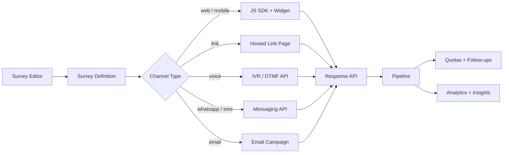
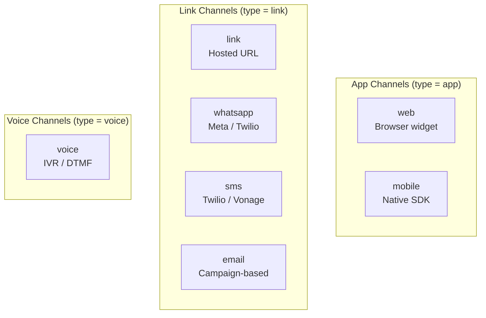
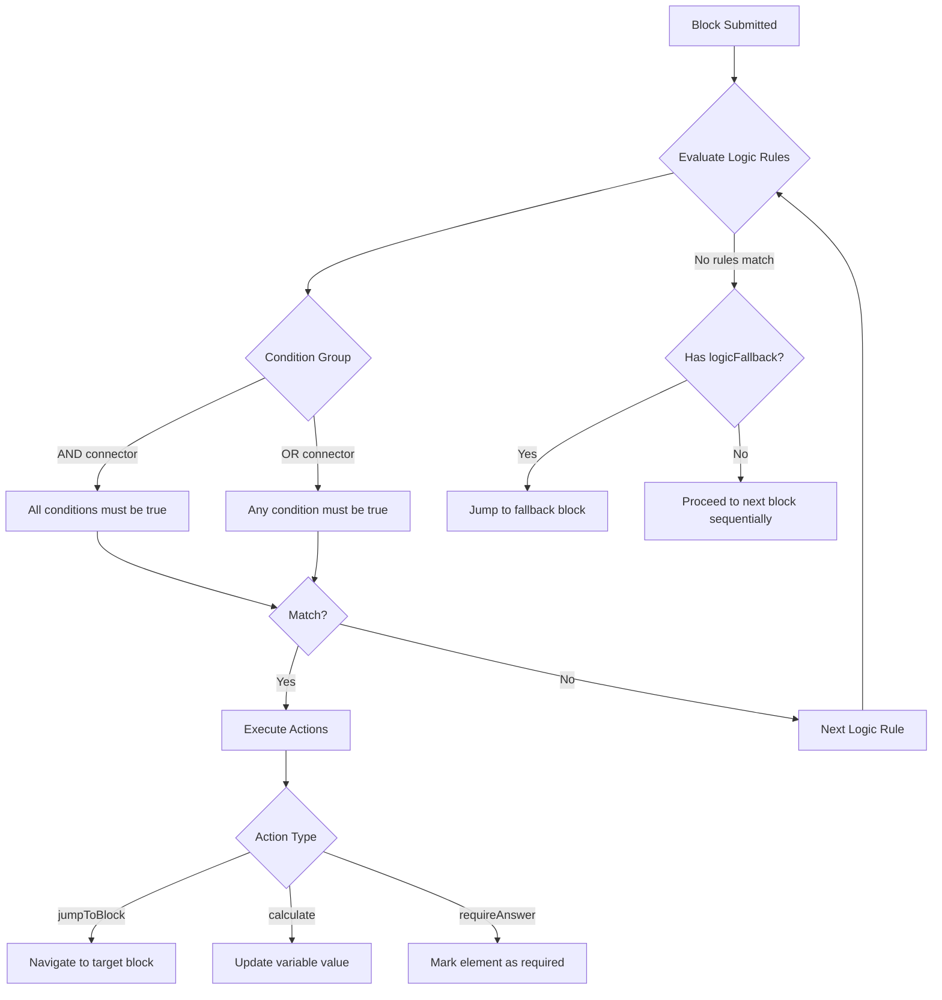
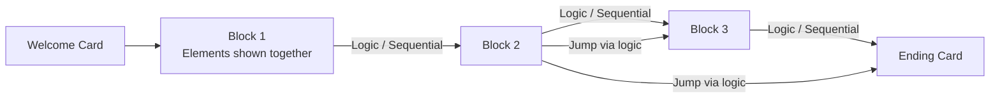
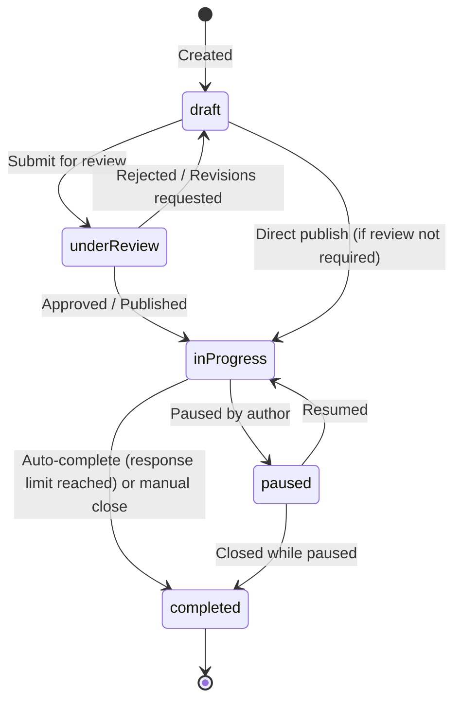
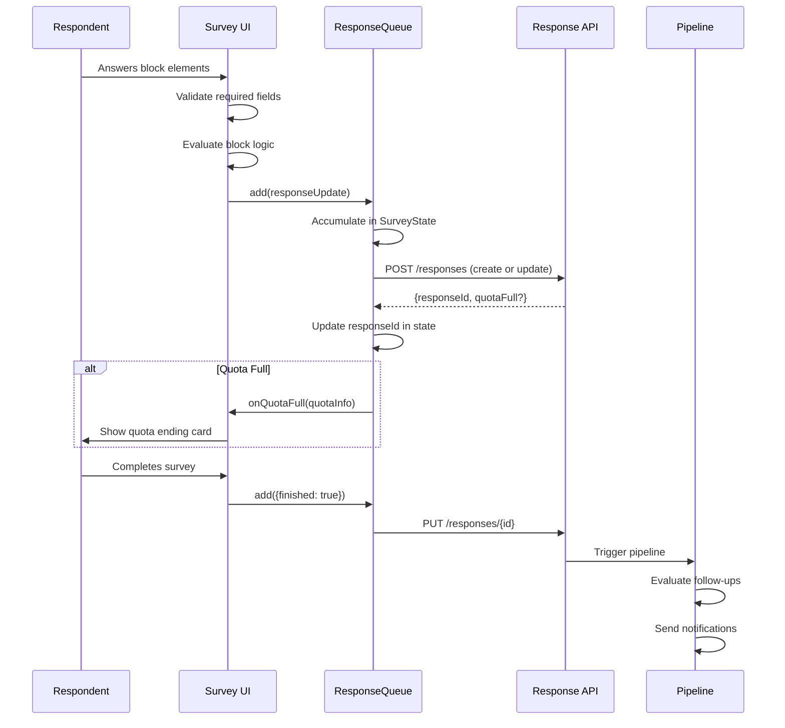
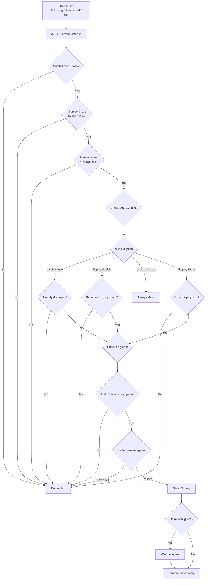
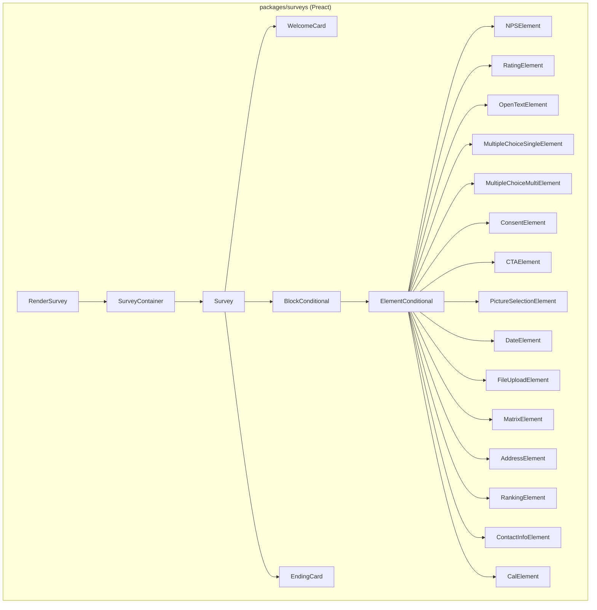

# 04 -- Survey Engine

This document provides a comprehensive technical reference for the HiveCFM Survey Engine: the core subsystem responsible for defining, rendering, distributing, and collecting survey responses across all supported channels.

---

## Table of Contents

1. [Survey Engine Overview](#1-survey-engine-overview)
2. [Survey Types & Channels](#2-survey-types--channels)
3. [Question / Element Types](#3-question--element-types)
4. [Survey Logic & Branching](#4-survey-logic--branching)
5. [Survey Blocks](#5-survey-blocks)
6. [Survey Lifecycle](#6-survey-lifecycle)
7. [Response Collection](#7-response-collection)
8. [Survey Triggers](#8-survey-triggers)
9. [Recontact Options](#9-recontact-options)
10. [Survey Rendering](#10-survey-rendering)
11. [i18n / Multi-Language](#11-i18n--multi-language)
12. [Survey Templates](#12-survey-templates)

---

## 1. Survey Engine Overview

The HiveCFM Survey Engine is an end-to-end system that manages the complete lifecycle of customer feedback collection. At its core, the engine operates through a pipeline of tightly integrated subsystems:

1. **Survey Definition** -- Authors create surveys in the web editor, defining blocks, elements (questions), logic rules, styling, and channel configuration.
2. **Channel Routing** -- Each survey is associated with a channel (`web`, `mobile`, `link`, `voice`, `whatsapp`, `sms`, `email`) that determines how the survey is distributed and rendered.
3. **Trigger Evaluation** -- For app-type surveys (web/mobile), the JS SDK evaluates action-class triggers and segment filters to determine when and to whom a survey should be shown.
4. **Survey Rendering** -- The `packages/surveys` Preact component library renders surveys in the browser (web widget, link pages), while voice/IVR and messaging channels use server-side rendering via API integrations.
5. **Response Collection** -- Responses are captured incrementally (per-block), queued in a `ResponseQueue`, and sent to the backend API with retry logic. Each response tracks time-to-complete (TTC) per element.
6. **Post-Processing** -- Responses flow through a pipeline that evaluates quotas, triggers follow-ups (email, Slack, webhooks), and updates analytics.



### Key Packages

| Package | Purpose |
|---|---|
| `packages/types/surveys/` | Zod schemas for elements, blocks, logic, and the root `ZSurvey` type |
| `packages/types/channel.ts` | Channel type definitions and compatibility matrices |
| `packages/types/responses.ts` | Response data shapes, filters, and meta schemas |
| `packages/surveys/` | Preact rendering components for all 15 element types |
| `packages/js-core/` | Browser SDK: trigger evaluation, state management, display tracking |
| `apps/web/` | Survey editor, API routes, template definitions |

---

## 2. Survey Types & Channels

### 2.1 Survey Types (Legacy)

The `TSurveyType` enum maps to three legacy categories:

| Survey Type | Description |
|---|---|
| `app` | In-app surveys triggered by user actions or page events (web + mobile channels) |
| `link` | Standalone surveys accessible via URL (link, whatsapp, sms, email channels) |
| `voice` | IVR surveys delivered via phone call with DTMF keypad input |

**Source:** `packages/types/surveys/types.ts` -- `ZSurveyType = z.enum(["link", "app", "voice"])`

### 2.2 Channel Types

The modern channel system (`packages/types/channel.ts`) provides seven distinct channel types, each with its own configuration schema:



#### 2.2.1 Web Channel

Configuration schema: `ZWebChannelConfig`

| Field | Type | Default | Description |
|---|---|---|---|
| `type` | `"web"` | -- | Discriminator |
| `integrationMethod` | `webJs \| api` | -- | How the survey is delivered |
| `widgetPlacement` | `bottomRight \| bottomLeft \| centerRight` | `bottomRight` | Widget position on screen |

Integration methods: `webJs` (JavaScript snippet embedded in the host page) or `api` (server-driven).

#### 2.2.2 Mobile Channel

Configuration schema: `ZMobileChannelConfig`

| Field | Type | Default | Description |
|---|---|---|---|
| `type` | `"mobile"` | -- | Discriminator |
| `integrationMethod` | `iosSdk \| androidSdk \| reactNativeSdk \| flutterSdk` | -- | Platform SDK |
| `sdkPlatform` | `ios \| android \| reactNative \| flutter` | -- | Target platform |

#### 2.2.3 Link Channel

Configuration schema: `ZLinkChannelConfig`

| Field | Type | Default | Description |
|---|---|---|---|
| `type` | `"link"` | -- | Discriminator |
| `customSlug` | `string?` | -- | Custom URL slug (e.g., `/s/my-survey`) |

Link surveys are rendered as full-page standalone forms hosted on the HiveCFM domain (or a custom domain). They support single-use tokens, PIN protection, email verification, and reCAPTCHA.

#### 2.2.4 Voice / IVR Channel

Configuration schema: `ZVoiceChannelConfig`

| Field | Type | Default | Description |
|---|---|---|---|
| `type` | `"voice"` | -- | Discriminator |
| `ttsEngine` | `mrcp \| polly \| google` | `mrcp` | Text-to-speech engine |
| `defaultVoice` | `string` | `en-US-Standard-A` | Voice profile |
| `defaultLanguage` | `string` | `en-US` | Speech language |
| `inputTimeout` | `number` (3-30) | `5` | Seconds to wait for DTMF input |
| `maxRetries` | `number` (1-5) | `3` | Retry count on invalid input |
| `bargeinEnabled` | `boolean` | `true` | Allow input during TTS playback |
| `welcomeMessage` | `string?` | -- | Greeting message |
| `thankYouMessage` | `string?` | -- | Closing message |
| `errorMessage` | `string?` | -- | Error/invalid input message |
| `audioBaseUrl` | `string?` | -- | Base URL for pre-recorded audio files |

**Compatible element types (DTMF-only):**
- `NPS` -- respondent presses 0-10 on keypad
- `Rating` -- respondent presses 1-5 or 1-10
- `MultipleChoiceSingle` -- max 9 options mapped to digits 1-9
- `CTA` -- press 1 to continue

#### 2.2.5 WhatsApp Channel

Configuration schema: `ZWhatsAppChannelConfig`

| Field | Type | Default | Description |
|---|---|---|---|
| `type` | `"whatsapp"` | -- | Discriminator |
| `provider` | `meta \| twilio \| messagebird` | `meta` | Messaging provider |
| `phoneNumberId` | `string?` | -- | WhatsApp Business phone number ID |
| `businessAccountId` | `string?` | -- | WhatsApp Business Account ID |
| `templateName` | `string?` | -- | Pre-approved message template name |
| `sessionWindowHours` | `number` (1-72) | `24` | Session window duration |
| `welcomeMessage` | `string?` | -- | Opening message |
| `thankYouMessage` | `string?` | -- | Closing message |

#### 2.2.6 SMS Channel

Configuration schema: `ZSmsChannelConfig`

| Field | Type | Default | Description |
|---|---|---|---|
| `type` | `"sms"` | -- | Discriminator |
| `provider` | `twilio \| vonage \| messagebird` | `twilio` | SMS provider |
| `senderId` | `string?` | -- | Sender ID / phone number |
| `maxMessageLength` | `number` (70-1600) | `160` | Max characters per message |
| `welcomeMessage` | `string?` | -- | Opening SMS |
| `thankYouMessage` | `string?` | -- | Closing SMS |

#### 2.2.7 Email Channel

Configuration schema: `ZEmailChannelConfig`

| Field | Type | Default | Description |
|---|---|---|---|
| `type` | `"email"` | -- | Discriminator |
| `fromName` | `string?` | -- | Sender display name |
| `replyTo` | `string?` (email) | -- | Reply-to address |

Email surveys are distributed through the Campaign system using the HiveCFM notification service as the notification provider. The campaign tracks send counts, delivery status, and per-recipient status (pending, sent, failed, bounced).

### 2.3 Channel Compatibility Matrix

Not all element types work on all channels. The codebase defines explicit compatibility lists:

| Element Type | Web | Mobile | Link | Voice | WhatsApp | SMS | Email |
|---|---|---|---|---|---|---|---|
| NPS | Yes | Yes | Yes | Yes | Yes | Yes | Yes |
| Rating | Yes | Yes | Yes | Yes | Yes | Yes | Yes |
| MultipleChoiceSingle | Yes | Yes | Yes | Yes (max 9) | Yes | Yes | Yes |
| MultipleChoiceMulti | Yes | Yes | Yes | No | Yes | Yes | Yes |
| OpenText | Yes | Yes | Yes | No | Yes | Yes | Yes |
| CTA | Yes | Yes | Yes | Yes | Yes | Yes | Yes |
| Consent | Yes | Yes | Yes | No | Yes | Yes | Yes |
| FileUpload | Yes | Yes | Yes | No | No | No | Yes |
| PictureSelection | Yes | Yes | Yes | No | No | No | Yes |
| Date | Yes | Yes | Yes | No | No | No | Yes |
| Matrix | Yes | Yes | Yes | No | No | No | Yes |
| Address | Yes | Yes | Yes | No | No | No | Yes |
| Ranking | Yes | Yes | Yes | No | No | No | Yes |
| ContactInfo | Yes | Yes | Yes | No | No | No | Yes |
| Cal | Yes | Yes | Yes | No | No | No | Yes |

Helper functions from `channel.ts`:
- `isElementVoiceCompatible(elementType)` -- checks against `VOICE_COMPATIBLE_ELEMENT_TYPES`
- `isElementMessagingCompatible(elementType)` -- checks against `MESSAGING_COMPATIBLE_ELEMENT_TYPES`
- `isMessagingChannelType(channelType)` -- returns `true` for `whatsapp` or `sms`
- `channelTypeToSurveyType(channelType)` -- maps modern channel types to legacy `app | link | voice`

---

## 3. Question / Element Types

The Survey Engine defines 15 element types (14 interactive types + CTA) in `packages/types/surveys/elements.ts`. Each element extends `ZSurveyElementBase` which provides the common fields.

### 3.0 Base Element Fields

All elements share these fields:

| Field | Type | Required | Description |
|---|---|---|---|
| `id` | `string` (alphanumeric, hyphens, underscores) | Yes | Unique, user-editable identifier. Cannot be a forbidden ID (`userId`, `source`, `suid`, `end`, `start`, `welcomeCard`, `hidden`, `verifiedEmail`, `multiLanguage`, `embed`, `verify`). |
| `type` | `TSurveyElementTypeEnum` | Yes | Element type discriminator |
| `headline` | `TI18nString` | Yes | Main question text (supports i18n) |
| `subheader` | `TI18nString?` | No | Secondary description text |
| `imageUrl` | `string?` | No | Image to display with the question |
| `videoUrl` | `string?` | No | Video to display with the question |
| `audioUrl` | `string?` | No | Audio file for voice channels |
| `required` | `boolean` | Yes | Whether a response is mandatory |
| `isDraft` | `boolean?` | No | Marks the element as incomplete in editor |

### 3.1 NPS (Net Promoter Score)

**Type:** `nps`

Captures a score from 0 to 10 on a horizontal scale. Standard NPS segmentation applies: Detractors (0-6), Passives (7-8), Promoters (9-10).

| Config Field | Type | Description |
|---|---|---|
| `lowerLabel` | `TI18nString?` | Label for the low end (e.g., "Not at all likely") |
| `upperLabel` | `TI18nString?` | Label for the high end (e.g., "Extremely likely") |
| `isColorCodingEnabled` | `boolean` | Color-code the scale (red to green) |

**Validation:** Value must be an integer from 0 to 10.

**Response format:** `number` (0-10)

### 3.2 Rating

**Type:** `rating`

A configurable rating scale with three display modes and multiple range options.

| Config Field | Type | Description |
|---|---|---|
| `scale` | `"number" \| "smiley" \| "star"` | Visual scale type |
| `range` | `3 \| 4 \| 5 \| 6 \| 7 \| 10` | Number of scale points |
| `lowerLabel` | `TI18nString?` | Label for the low end |
| `upperLabel` | `TI18nString?` | Label for the high end |
| `isColorCodingEnabled` | `boolean` | Color-code the scale |

**Validation:** Value must be an integer from 1 to `range`.

**Response format:** `number` (1 to range)

> **Note on CSAT and CES:** HiveCFM does not define separate CSAT (Customer Satisfaction) or CES (Customer Effort Score) element types. Instead, these are implemented as **Rating** elements with specific configurations:
> - **CSAT**: Rating with `scale: "smiley"` and `range: 5`
> - **CES**: Rating with `scale: "number"` and `range: 7`, with labels like "Very Difficult" / "Very Easy"

### 3.3 OpenText

**Type:** `openText`

Free-form text input with configurable input type and validation.

| Config Field | Type | Description |
|---|---|---|
| `placeholder` | `TI18nString?` | Input placeholder text |
| `longAnswer` | `boolean?` | Use textarea vs single-line input |
| `inputType` | `"text" \| "email" \| "url" \| "number" \| "phone"` | Input validation mode |
| `insightsEnabled` | `boolean` | Enable AI-powered insights on responses |
| `charLimit.enabled` | `boolean` | Enable character limit |
| `charLimit.min` | `number?` | Minimum characters |
| `charLimit.max` | `number?` | Maximum characters |

**Validation rules:**
- If `charLimit.enabled`, at least one of `min` or `max` must be set
- Both values must be positive
- `min` cannot exceed `max`
- Input type determines browser-level validation (email format, URL format, etc.)

**Response format:** `string`

### 3.4 Multiple Choice (Single)

**Type:** `multipleChoiceSingle`

Radio-button selection from a list of choices.

| Config Field | Type | Description |
|---|---|---|
| `choices` | `TSurveyElementChoice[]` (min 2) | Choice options with `{id, label}` |
| `shuffleOption` | `"none" \| "all" \| "exceptLast"` | Choice randomization |
| `otherOptionPlaceholder` | `TI18nString?` | Placeholder for "Other" free-text |

A choice with `id: "other"` activates the free-text "Other" option.

**Validation:** Exactly one choice must be selected if required.

**Response format:** `string` (the selected choice label)

### 3.5 Multiple Choice (Multi)

**Type:** `multipleChoiceMulti`

Checkbox selection allowing multiple choices.

Configuration is identical to MultipleChoiceSingle. The `type` field differentiates behavior.

**Validation:** At least one choice must be selected if required.

**Response format:** `string[]` (array of selected choice labels)

### 3.6 Consent

**Type:** `consent`

A checkbox element for obtaining explicit consent (e.g., terms acceptance, data processing).

| Config Field | Type | Description |
|---|---|---|
| `label` | `TI18nString` | Checkbox label text |

**Validation:** Must be accepted if required.

**Response format:** `"accepted"` or `"dismissed"`

### 3.7 CTA (Call to Action)

**Type:** `cta`

An informational/action element that can optionally link to an external URL.

| Config Field | Type | Description |
|---|---|---|
| `buttonExternal` | `boolean` | Whether the button opens an external URL |
| `buttonUrl` | `string?` | Target URL (required when `buttonExternal` is true) |
| `ctaButtonLabel` | `TI18nString?` | Button label (required when `buttonExternal` is true) |

**Validation:**
- When `buttonExternal` is true, both `buttonUrl` (valid URL) and `ctaButtonLabel` are required
- CTA elements do not block navigation even when marked as `required`

**Response format:** `"clicked"` or `""` (dismissed)

### 3.8 Picture Selection

**Type:** `pictureSelection`

Visual selection from a grid of images.

| Config Field | Type | Description |
|---|---|---|
| `allowMulti` | `boolean` | Allow selecting multiple images |
| `choices` | `TSurveyPictureChoice[]` (min 2) | Picture options with `{id, imageUrl}` |

**Response format:** `string[]` (array of selected picture IDs)

### 3.9 Date

**Type:** `date`

A date picker element.

| Config Field | Type | Description |
|---|---|---|
| `format` | `"M-d-y" \| "d-M-y" \| "y-M-d"` | Date display format |
| `html` | `TI18nString?` | Optional description HTML |

**Response format:** `string` (ISO date string)

### 3.10 File Upload

**Type:** `fileUpload`

File upload element supporting multiple files and extension restrictions.

| Config Field | Type | Description |
|---|---|---|
| `allowMultipleFiles` | `boolean` | Allow multiple file uploads |
| `maxSizeInMB` | `number?` | Maximum file size per file |
| `allowedFileExtensions` | `TAllowedFileExtension[]?` | Whitelist of permitted extensions |

Supported extensions: `heic`, `png`, `jpeg`, `jpg`, `webp`, `ico`, `pdf`, `eml`, `doc`, `docx`, `xls`, `xlsx`, `ppt`, `pptx`, `txt`, `csv`, `mp4`, `mov`, `avi`, `mkv`, `webm`, `wav`, `mp3`, `m4a`, `ogg`, `zip`, `rar`, `7z`, `tar`.

Files are uploaded to signed URLs (S3-compatible storage) with MIME type validation.

**Response format:** `string` or `string[]` (file URLs) or `"skipped"`

### 3.11 Matrix

**Type:** `matrix`

A grid/table question with rows and columns. Respondents select one column value per row.

| Config Field | Type | Description |
|---|---|---|
| `rows` | `TSurveyMatrixElementChoice[]` | Row labels |
| `columns` | `TSurveyMatrixElementChoice[]` | Column labels |
| `shuffleOption` | `"none" \| "all" \| "exceptLast"` | Row randomization |

**Validation:** When required, all rows must have a selected column value.

**Response format:** `Record<string, string>` (row label to column label mapping)

### 3.12 Address

**Type:** `address`

A structured address input with individually configurable fields.

| Config Field | Type | Description |
|---|---|---|
| `addressLine1` | `TToggleInputConfig` | First line (`{show, required, placeholder}`) |
| `addressLine2` | `TToggleInputConfig` | Second line |
| `city` | `TToggleInputConfig` | City |
| `state` | `TToggleInputConfig` | State/province |
| `zip` | `TToggleInputConfig` | Postal/ZIP code |
| `country` | `TToggleInputConfig` | Country |

Each sub-field can be independently shown/hidden, made required/optional, and given a custom placeholder.

**Response format:** `Record<string, string>` (field name to value mapping)

### 3.13 Ranking

**Type:** `ranking`

Drag-and-drop ordering of items.

| Config Field | Type | Description |
|---|---|---|
| `choices` | `TSurveyElementChoice[]` (2-25) | Items to rank |
| `shuffleOption` | `"none" \| "all" \| "exceptLast"` | Initial order randomization |
| `otherOptionPlaceholder` | `TI18nString?` | Placeholder for "Other" |

**Validation:** When required, all choices must be ranked (response array length must equal choices length). If optional and partially ranked, validation fails.

**Response format:** `string[]` (ordered array of choice labels)

### 3.14 Contact Info

**Type:** `contactInfo`

Structured contact information collection.

| Config Field | Type | Description |
|---|---|---|
| `firstName` | `TToggleInputConfig` | First name field |
| `lastName` | `TToggleInputConfig` | Last name field |
| `email` | `TToggleInputConfig` | Email field |
| `phone` | `TToggleInputConfig` | Phone number field |
| `company` | `TToggleInputConfig` | Company name field |

**Response format:** `Record<string, string>` (field name to value mapping)

### 3.15 Cal (Calendar Booking)

**Type:** `cal`

Embeds a Cal.com scheduling widget.

| Config Field | Type | Description |
|---|---|---|
| `calUserName` | `string` | Cal.com username (required) |
| `calHost` | `string?` | Custom Cal.com host URL |

**Response format:** `"booked"` or `""` (not booked)

---

## 4. Survey Logic & Branching

The Survey Engine supports a powerful conditional logic system that controls survey flow based on respondent answers, variables, and hidden fields. Logic is evaluated at the **block level** (modern system) or the **question level** (legacy v1 API).

### 4.1 Architecture Overview



### 4.2 Condition Structure

Conditions use a recursive tree structure with AND/OR connectors:

```
ConditionGroup {
  id: string (CUID)
  connector: "and" | "or"
  conditions: (SingleCondition | ConditionGroup)[]   // recursive nesting
}
```

A `SingleCondition` consists of:

| Field | Type | Description |
|---|---|---|
| `id` | `string` | Unique condition ID |
| `leftOperand` | `DynamicLogicFieldValue` | What to evaluate |
| `operator` | `TSurveyLogicConditionsOperator` | How to compare |
| `rightOperand` | `RightOperand?` | What to compare against (not required for unary operators) |

### 4.3 Left Operand Types

The left operand references the data source for evaluation:

| Type | Description | Example |
|---|---|---|
| `element` | Response value of a survey element | `{type: "element", value: "nps-question"}` |
| `variable` | Current value of a survey variable | `{type: "variable", value: "cljk2..."}` |
| `hiddenField` | Value of a hidden field | `{type: "hiddenField", value: "source"}` |

### 4.4 Operators

The system supports 30+ operators grouped by category:

**Comparison operators:**
`equals`, `doesNotEqual`, `isGreaterThan`, `isLessThan`, `isGreaterThanOrEqual`, `isLessThanOrEqual`

**String operators:**
`contains`, `doesNotContain`, `startsWith`, `doesNotStartWith`, `endsWith`, `doesNotEndWith`

**Set operators (for multi-choice):**
`equalsOneOf`, `includesAllOf`, `includesOneOf`, `doesNotIncludeOneOf`, `doesNotIncludeAllOf`, `isAnyOf`

**State operators (unary -- no right operand):**
`isSubmitted`, `isSkipped`, `isClicked`, `isNotClicked`, `isAccepted`, `isBooked`, `isPartiallySubmitted`, `isCompletelySubmitted`, `isSet`, `isNotSet`, `isEmpty`, `isNotEmpty`

**Date operators:**
`isBefore`, `isAfter`

### 4.5 Logic Actions

When a condition group evaluates to `true`, actions are executed in order:

#### `jumpToBlock`
Navigates to a specified block by ID. Only the first `jumpToBlock` action in an action list takes effect.

```typescript
{ id: string, objective: "jumpToBlock", target: string }  // target = block CUID
```

#### `calculate`
Performs arithmetic or string operations on survey variables.

For **number variables**: operators are `add`, `subtract`, `multiply`, `divide`, `assign`.
For **text variables**: operators are `assign`, `concat`.

Division by zero is validated at the schema level and returns `undefined` at runtime.

```typescript
{
  id: string,
  objective: "calculate",
  variableId: string,
  operator: "add" | "subtract" | "multiply" | "divide" | "assign" | "concat",
  value: { type: "static", value: number | string } | DynamicLogicFieldValue
}
```

#### `requireAnswer`
Dynamically marks an element as required for the current flow.

```typescript
{ id: string, objective: "requireAnswer", target: string }  // target = element ID
```

### 4.6 Logic Fallback

Each block has an optional `logicFallback` field (a block ID). If all logic rules fail to match, the survey jumps to the fallback block instead of proceeding sequentially. This enables default branching behavior.

### 4.7 Cyclic Logic Detection

The engine includes compile-time validation to prevent infinite loops. The `findBlocksWithCyclicLogic()` function in `packages/types/surveys/blocks-validation.ts` performs a depth-first traversal of the block graph, tracking visited and recursion-stack states to detect cycles. Blocks involved in cycles are reported as validation errors.

### 4.8 Variables

Surveys can define variables (`TSurveyVariable`) that persist across blocks and can be used in logic conditions and calculations:

| Variable Type | Default Value | Operations |
|---|---|---|
| `number` | `0` | `add`, `subtract`, `multiply`, `divide`, `assign` |
| `text` | `""` | `assign`, `concat` |

Variable names must contain only lowercase letters, numbers, and underscores. Both variable IDs and names must be unique within a survey.

---

## 5. Survey Blocks

Blocks are the primary structural unit in the modern survey architecture. They replace the legacy flat `questions[]` array with a hierarchical model.

### 5.1 Block Structure

```typescript
TSurveyBlock {
  id: string;            // CUID
  name: string;          // Required -- used in editor UI
  elements: TSurveyElement[];  // Min 1 element per block
  logic?: TSurveyBlockLogic[];
  logicFallback?: string;      // Block ID to jump to if no logic matches
  buttonLabel?: TI18nString;
  backButtonLabel?: TI18nString;
}
```

### 5.2 Block-Based Flow



Each block is rendered as a single page/step. All elements within a block are displayed simultaneously, and the respondent submits all element responses together when clicking the block's "Next" button.

### 5.3 Block Validation

At the block level:
- Element IDs must be unique **within** a block
- Block IDs must be unique **across** the survey
- Each block must have at least one element

At the survey level:
- A survey must have either `questions` (legacy) or `blocks`, not both
- Block IDs are validated for cyclic logic references

### 5.4 Dual Model (Migration Support)

The `ZSurvey` schema currently supports both:
- `questions: TSurveyQuestion[]` -- legacy flat question array (deprecated, v1 API compatibility)
- `blocks: TSurveyBlock[]` -- modern block-based structure

The survey validates that exactly one model is in use (`hasQuestions XOR hasBlocks`).

---

## 6. Survey Lifecycle

### 6.1 Status States

Surveys transition through five states defined by `ZSurveyStatus`:



| Status | Description |
|---|---|
| `draft` | Survey is being authored. Not visible to respondents. |
| `underReview` | Survey has been submitted for review. Includes `reviewNote`, `reviewedBy`, and `reviewedAt` fields. |
| `inProgress` | Survey is live and actively collecting responses. |
| `paused` | Survey is temporarily suspended. Existing response links show the closed message. |
| `completed` | Survey is finalized. No new responses accepted. Can be triggered by `autoComplete` threshold. |

### 6.2 Auto-Complete

The `autoComplete` field specifies a response count threshold. When the total number of responses reaches this value, the survey automatically transitions to `completed` status.

### 6.3 Survey Closed Message

When a survey is paused or completed, respondents who attempt to access it see a configurable closed message:

```typescript
TSurveyClosedMessage {
  enabled?: boolean;
  heading?: string;
  subheading?: string;
}
```

### 6.4 Scheduling

Surveys can be scheduled for future activation via the Campaign system (`ZCampaign`). Campaigns track:
- `scheduledAt` -- when to begin sending
- `status` -- `draft | scheduled | sending | sent | failed`
- `providerType` -- `email` or `sms`
- Send-level tracking: per-recipient `pending | sent | failed | bounced` status

---

## 7. Response Collection

### 7.1 Response Data Model

Each response is stored with the following structure (from `packages/types/responses.ts`):

```typescript
TResponse {
  id: string;                    // CUID
  createdAt: Date;
  updatedAt: Date;
  surveyId: string;
  displayId: string | null;      // Links response to display event
  contact: TResponseContact | null;
  contactAttributes: Record<string, string> | null;
  finished: boolean;             // Whether the survey was completed
  endingId: string | null;       // Which ending card was reached
  data: TResponseData;           // Element ID -> response value mapping
  variables: TResponseVariables; // Variable ID -> calculated value mapping
  ttc: TResponseTtc;             // Element ID -> milliseconds mapping
  tags: TTag[];
  meta: TResponseMeta;
  singleUseId: string | null;
  language: string | null;
}
```

### 7.2 Response Data Format

`TResponseData` is a `Record<string, TResponseDataValue>` where keys are element IDs and values can be:
- `string` -- for single-value elements (OpenText, NPS, Rating, etc.)
- `number` -- for numeric responses
- `string[]` -- for multi-value elements (MultipleChoiceMulti, PictureSelection, Ranking)
- `Record<string, string>` -- for structured elements (Matrix, Address, ContactInfo)

### 7.3 Response Pipeline



### 7.4 SurveyState

The `SurveyState` class (`packages/surveys/src/lib/survey-state.ts`) maintains client-side state during a survey session:

- `responseId` -- assigned after the first API call, reused for subsequent updates
- `displayId` -- tracks the display event
- `responseAcc` -- accumulated response data merged across all blocks
- `singleUseId` -- for single-use link surveys

The `accumulateResponse()` method merges new block responses into the accumulated data, preserving responses from previously completed blocks.

### 7.5 ResponseQueue

The `ResponseQueue` class (`packages/surveys/src/lib/response-queue.ts`) manages the asynchronous submission pipeline:

1. Responses are added to a FIFO queue
2. Processing is serialized (one request at a time)
3. Failed requests are retried with configurable retry attempts
4. reCAPTCHA tokens can be attached to the first response submission
5. Quota-full responses trigger special handling (redirect to quota-specific ending card)

### 7.6 Time-to-Complete (TTC) Tracking

Each element tracks the time a respondent spends on it in milliseconds. The TTC data is stored as `TResponseTtc = Record<string, number>` where keys are element IDs.

At the block level, TTC values are collected from all element forms and submitted together with the block's response data.

### 7.7 Response Meta

Each response captures metadata:

| Field | Description |
|---|---|
| `source` | How the survey was accessed |
| `url` | Page URL where the survey was shown (web channel) |
| `userAgent.browser` | Browser name |
| `userAgent.os` | Operating system |
| `userAgent.device` | Device type |
| `country` | Respondent's country (via IP geolocation) |
| `action` | The action class that triggered the survey |
| `ipAddress` | Raw IP address (when `isCaptureIpEnabled` is true) |

### 7.8 Quota System

Surveys can define quotas (`TSurveyQuota`) that limit response collection based on conditions:

```typescript
TSurveyQuota {
  id: string;
  name: string;
  limit: number;               // Maximum responses for this quota
  logic: TSurveyQuotaLogic;    // Condition group to match responses
  action: "endSurvey" | "continueSurvey";
  endingCardId: string | null; // Ending card to show when quota is full
  countPartialSubmissions: boolean;
}
```

When a response matches a quota's logic conditions and the quota limit is reached, the specified action is taken. The `ResponseQuotaLink` associates responses with quotas using `screenedIn` or `screenedOut` status.

---

## 8. Survey Triggers

App-type surveys (web and mobile channels) use a trigger system to determine when to show a survey. Triggers are defined as **Action Classes**.

### 8.1 Action Class Types

| Type | Description |
|---|---|
| `code` | Triggered programmatically via the SDK's `track()` method using a string key |
| `noCode` | Triggered automatically based on user behavior without any code changes |

### 8.2 No-Code Trigger Types

The `ZActionClassNoCodeConfig` schema defines four behavior-based trigger types:

#### Click Trigger
Fires when a user clicks a matching DOM element.

```typescript
{
  type: "click",
  elementSelector: {
    cssSelector?: string,  // CSS selector (e.g., "#submit-btn")
    innerHtml?: string     // Inner HTML content match
  },
  urlFilters: UrlFilter[],
  urlFiltersConnector?: "or" | "and"
}
```

At least one of `cssSelector` or `innerHtml` must be provided.

#### Page View Trigger
Fires when the user navigates to a matching URL.

```typescript
{
  type: "pageView",
  urlFilters: UrlFilter[],
  urlFiltersConnector?: "or" | "and"
}
```

#### Exit Intent Trigger
Fires when the user's cursor leaves the viewport (indicating they might leave the page).

```typescript
{
  type: "exitIntent",
  urlFilters: UrlFilter[],
  urlFiltersConnector?: "or" | "and"
}
```

#### 50% Scroll Trigger
Fires when the user scrolls past 50% of the page height.

```typescript
{
  type: "fiftyPercentScroll",
  urlFilters: UrlFilter[],
  urlFiltersConnector?: "or" | "and"
}
```

### 8.3 URL Filters

All no-code triggers include URL filters that restrict when the trigger fires:

| Rule | Description |
|---|---|
| `exactMatch` | URL must exactly match the value |
| `contains` | URL must contain the value |
| `startsWith` | URL must start with the value |
| `endsWith` | URL must end with the value |
| `notMatch` | URL must NOT match the value |
| `notContains` | URL must NOT contain the value |
| `matchesRegex` | URL must match the regex pattern |

Multiple URL filters can be combined with `and` or `or` connectors.

### 8.4 Inline Triggers

Surveys also support inline triggers (`TSurveyInlineTriggers`) that bypass action classes:

```typescript
{
  codeConfig?: { identifier: string },  // Direct code trigger
  noCodeConfig?: TActionClassNoCodeConfig  // Direct no-code trigger
}
```

### 8.5 Trigger Evaluation Flow



---

## 9. Recontact Options

Recontact settings control how frequently a survey can be shown to the same respondent.

### 9.1 Display Options

The `TSurveyDisplayOption` enum defines four display strategies:

| Option | Behavior |
|---|---|
| `displayOnce` | Show the survey at most once per contact, regardless of whether they responded |
| `displayMultiple` | Show the survey multiple times, respecting the `recontactDays` cooldown |
| `respondMultiple` | Show the survey every time the trigger fires, even if already responded |
| `displaySome` | Show the survey a limited number of times (up to `displayLimit`) |

### 9.2 Recontact Days

`recontactDays` (integer, 0-365) specifies the minimum number of days that must pass after a display before the survey is shown again to the same contact. This is set at both the project level (default) and the survey level (override).

### 9.3 Display Limit

When `displayOption` is `displaySome`, the `displayLimit` field specifies the maximum number of times the survey can be shown to a single contact.

### 9.4 Display Percentage

`displayPercentage` (0.01 to 100) controls what fraction of eligible audiences actually see the survey. This is evaluated as a random roll on each trigger event.

### 9.5 Segment Filtering

Surveys can target specific audience segments using the `TSegment` system. Segments define recursive filter trees with AND/OR connectors:

**Filter Types:**

| Filter Type | Description | Operators |
|---|---|---|
| `attribute` | Contact attribute values | equals, notEquals, lessThan, greaterThan, contains, startsWith, endsWith, isSet, isNotSet |
| `person` | Person-level properties | Same as attribute operators |
| `segment` | Membership in another segment | `userIsIn`, `userIsNotIn` |
| `device` | Device type targeting | `equals`, `notEquals` |

The JS SDK maintains a person state (`TJsPersonState`) that tracks:
- `segments` -- array of segment IDs the contact belongs to
- `displays` -- array of `{surveyId, createdAt}` for display history
- `responses` -- array of survey IDs the contact has responded to
- `lastDisplayAt` -- timestamp of the most recent survey display

---

## 10. Survey Rendering

### 10.1 Rendering Architecture



### 10.2 Component Hierarchy

| Component | File | Responsibility |
|---|---|---|
| `RenderSurvey` | `render-survey.tsx` | Entry point. Manages open/close state, RTL detection |
| `SurveyContainer` | `survey-container.tsx` | Wraps survey in modal or inline container |
| `Survey` | `survey.tsx` | Core orchestrator. Manages block navigation, logic evaluation, response queue |
| `BlockConditional` | `block-conditional.tsx` | Renders all elements in a block simultaneously with shared validation |
| `ElementConditional` | `element-conditional.tsx` | Routes to the correct element component based on `element.type` |
| `WelcomeCard` | `welcome-card.tsx` | Renders the optional welcome/intro screen |
| `EndingCard` | `ending-card.tsx` | Renders the completion screen or performs redirect |
| `StackedCardsContainer` | `stacked-cards-container.tsx` | Visual stacking effect for cards |
| `AutoCloseWrapper` | `auto-close-wrapper.tsx` | Auto-closes the survey after configurable seconds |

### 10.3 Rendering Modes

The Survey component supports two rendering modes:

| Mode | Description |
|---|---|
| `modal` | Floating overlay on top of the host page. Supports placement (`bottomLeft`, `bottomRight`, `topLeft`, `topRight`, `center`), dark overlay, and click-outside-to-close. |
| `inline` | Embedded directly within a container element on the host page. |

### 10.4 Web Widget Rendering

For web channels, the `packages/js-core` SDK manages the complete lifecycle:

1. **Initialization** -- SDK loads, syncs environment state (surveys, action classes, project settings)
2. **Event Listening** -- Registers listeners for clicks, page views, scroll events, exit intent
3. **Trigger Matching** -- When an event fires, checks against configured action classes
4. **Survey Selection** -- Evaluates display rules, segments, and recontact settings
5. **Rendering** -- Injects the Preact survey component into the DOM
6. **Response Handling** -- Captures responses and sends them via the API client

### 10.5 Link Survey Rendering

Link surveys are rendered as full-page standalone applications hosted at `/s/{surveyId}` or `/s/{customSlug}`. They support:

- **Single-use links** -- Each URL contains a unique token (`singleUseId`). Once used, the link is invalidated. Links can be encrypted for additional security.
- **PIN protection** -- A 4-digit PIN must be entered before the survey loads.
- **Email verification** -- Requires the respondent to verify their email before accessing the survey.
- **reCAPTCHA** -- Configurable spam protection with a threshold (0.1 to 0.9).
- **Custom metadata** -- SEO title, description, and Open Graph image for social sharing.
- **Custom head scripts** -- Inject tracking pixels or other scripts, either in addition to or replacing default scripts.

### 10.6 Voice / IVR Rendering

Voice surveys are not rendered visually. Instead, the voice channel configuration drives a server-side IVR flow:

1. **TTS Playback** -- Each element's `headline` is converted to speech using the configured TTS engine (`mrcp`, `polly`, or `google`)
2. **DTMF Collection** -- The system waits for DTMF keypad input with the configured `inputTimeout`
3. **Input Validation** -- Invalid inputs trigger the `errorMessage` and retry (up to `maxRetries`)
4. **Barge-in** -- When `bargeinEnabled` is true, respondents can begin entering input during TTS playback
5. **Audio files** -- When `audioBaseUrl` is configured, pre-recorded audio can be used instead of TTS

Element-to-DTMF mapping:
- **NPS**: Keys 0-9 for values 0-9, key combination `10` or `*0` for value 10
- **Rating**: Keys 1-N where N = range value
- **MultipleChoiceSingle**: Keys 1-9 for options 1-9 (max 9 options)
- **CTA**: Key 1 to continue

### 10.7 WhatsApp / SMS Rendering

Messaging channels deliver surveys as conversational text exchanges:

1. **Welcome message** -- Sent as the initial message
2. **Question delivery** -- Each element is rendered as a text message with options listed as numbered items
3. **Response parsing** -- Respondent replies are parsed (number for NPS/Rating, option number or text for multiple choice, free text for OpenText)
4. **Session management** -- WhatsApp has a configurable session window (1-72 hours, default 24)
5. **Thank-you message** -- Sent after survey completion

### 10.8 Email Rendering

Email surveys are distributed via the Campaign system. The first question can be rendered inline in the email body, with a link to complete the remaining questions in a hosted link survey.

---

## 11. i18n / Multi-Language

### 11.1 i18n String Format

All translatable text in HiveCFM uses the `TI18nString` type:

```typescript
TI18nString = Record<string, string>
// Must have a "default" key
// Additional keys are language codes (e.g., "ar", "fr", "de")
```

The `default` key holds the primary language text. Additional keys map to ISO language codes.

### 11.2 Language Configuration

Languages are configured at the **project level** and referenced at the **survey level**:

```typescript
// Project-level language definition
TLanguage {
  id: string;
  code: string;      // ISO language code (e.g., "ar", "fr")
  alias: string | null;  // Display name override
  projectId: string;
}

// Survey-level language reference
TSurveyLanguage {
  language: TLanguage;
  default: boolean;   // Is this the default language?
  enabled: boolean;   // Is this language active for this survey?
}
```

### 11.3 Localized Value Resolution

The `getLocalizedValue()` function in `packages/surveys/src/lib/i18n.ts` resolves i18n strings:

```typescript
getLocalizedValue(value: TI18nString, languageId: string): string
```

Resolution order:
1. Try `value[languageId]` -- exact match for the requested language
2. Fall back to `value["default"]` -- default language

### 11.4 Survey UI Localization

The survey rendering components (`packages/surveys`) use a separate i18n system for UI chrome (button labels, progress text, etc.):

Supported UI locales: `ar`, `de`, `en`, `es`, `fr`, `hi`, `it`, `ja`, `nl`, `pt`, `ro`, `ru`, `sv`, `uz`, `zh-Hans`.

Locale files are stored in `packages/surveys/locales/{code}.json`.

### 11.5 RTL Support

The rendering system detects right-to-left languages and applies `dir="rtl"` to the survey container. The `checkIfSurveyIsRTL()` utility function determines directionality based on the active language code.

### 11.6 Language Switcher

When a survey has multiple enabled languages, a `LanguageSwitch` component is rendered (controlled by the `showLanguageSwitch` survey property). Respondents can switch languages at any point during the survey.

### 11.7 Multi-Language Validation

The survey schema validates that all i18n strings are complete for all enabled languages:

- `validateElementLabels()` -- checks element headlines, subheaders, placeholders, and labels
- `validateCardFieldsForAllLanguages()` -- checks welcome card and ending card fields
- `findLanguageCodesForDuplicateLabels()` -- detects duplicate choice labels within a language

Validation errors reference both the element/card index and the specific language code(s) with missing translations.

---

## 12. Survey Templates

### 12.1 Template System

HiveCFM provides pre-built survey templates to accelerate survey creation. Templates are defined in `apps/web/app/lib/templates.ts` and `apps/web/app/(app)/(onboarding)/environments/[environmentId]/xm-templates/lib/xm-templates.ts`.

### 12.2 Template Schema

```typescript
TTemplate {
  name: string;
  description: string;
  icon?: any;
  role?: "productManager" | "customerSuccess" | "marketing" | "sales" | "peopleManager";
  channels?: ("link" | "app" | "website" | "voice" | "whatsapp" | "sms")[];
  industries?: ("eCommerce" | "saas" | "banking" | "telecom" | "other")[];
  preset: {
    name: string;
    welcomeCard: TSurveyWelcomeCard;
    blocks: TSurveyBlock[];
    endings: TSurveyEnding[];
    hiddenFields: TSurveyHiddenFields;
  };
}
```

### 12.3 XM Templates

The experience management (XM) template system (`TXMTemplate`) provides streamlined templates optimized for customer experience measurement:

```typescript
TXMTemplate {
  name: string;
  blocks: TSurveyBlock[];
  endings: TSurveyEnding[];
  styling: TSurveyStyling;
}
```

XM templates include pre-configured NPS, star rating, and CSAT surveys with best-practice question ordering and logic.

### 12.4 Template Filtering

Templates can be filtered by:

| Filter | Values |
|---|---|
| Channel | `link`, `app`, `website`, `voice`, `whatsapp`, `sms` |
| Industry | `eCommerce`, `saas`, `banking`, `telecom`, `other` |
| Role | `productManager`, `customerSuccess`, `marketing`, `sales`, `peopleManager` |

### 12.5 Template Builder Utilities

The codebase provides builder functions (`apps/web/app/lib/survey-block-builder.ts`) for programmatic template creation:

| Function | Description |
|---|---|
| `buildBlock()` | Creates a block with elements, button labels, and optional logic |
| `buildNPSElement()` | Creates an NPS element with standard configuration |
| `buildRatingElement()` | Creates a rating element with configurable scale and range |
| `buildOpenTextElement()` | Creates an open text element with input type |
| `buildMultipleChoiceElement()` | Creates a single or multi-select choice element |
| `buildCTAElement()` | Creates a CTA element |
| `buildConsentElement()` | Creates a consent checkbox element |
| `createBlockJumpLogic()` | Creates a block-level jump logic rule |
| `createBlockChoiceJumpLogic()` | Creates jump logic based on choice selection |

### 12.6 Ending Cards

Every template includes at least one ending card. There are two types:

#### End Screen
```typescript
TSurveyEndScreenCard {
  type: "endScreen";
  headline?: TI18nString;
  subheader?: TI18nString;
  buttonLabel?: TI18nString;
  buttonLink?: string;
  imageUrl?: string;
  videoUrl?: string;
}
```

#### Redirect to URL
```typescript
TSurveyRedirectUrlCard {
  type: "redirectToUrl";
  url?: string;
  label?: string;
}
```

---

## Appendix A: Survey Configuration Reference

The complete `ZSurvey` schema includes the following top-level fields:

| Field | Type | Description |
|---|---|---|
| `id` | `string` | Survey CUID |
| `name` | `string` | Survey name |
| `type` | `link \| app \| voice` | Legacy survey type |
| `channelId` | `string?` | Associated channel ID |
| `environmentId` | `string` | Environment scope |
| `status` | `TSurveyStatus` | Current lifecycle state |
| `displayOption` | `TSurveyDisplayOption` | Recontact strategy |
| `autoClose` | `number?` | Auto-close timer (seconds) after completion |
| `triggers` | `{actionClass: TActionClass}[]` | Action classes that trigger display |
| `recontactDays` | `number?` | Minimum days between displays |
| `displayLimit` | `number?` | Maximum display count (for `displaySome`) |
| `welcomeCard` | `TSurveyWelcomeCard` | Welcome/intro card configuration |
| `questions` | `TSurveyQuestion[]` | Legacy flat question array |
| `blocks` | `TSurveyBlock[]` | Modern block-based structure |
| `endings` | `TSurveyEnding[]` | Completion/redirect cards |
| `hiddenFields` | `TSurveyHiddenFields` | Hidden field definitions |
| `variables` | `TSurveyVariable[]` | Calculated variables |
| `followUps` | `TSurveyFollowUp[]` | Post-response actions |
| `delay` | `number` | Display delay in milliseconds |
| `autoComplete` | `number?` | Auto-complete at N responses |
| `projectOverwrites` | `TSurveyProjectOverwrites?` | Per-survey styling overrides |
| `styling` | `TSurveyStyling?` | Survey-specific styling |
| `showLanguageSwitch` | `boolean?` | Show language switcher |
| `surveyClosedMessage` | `TSurveyClosedMessage?` | Message when survey is closed |
| `segment` | `TSegment?` | Target audience segment |
| `singleUse` | `TSurveySingleUse?` | Single-use link configuration |
| `isVerifyEmailEnabled` | `boolean` | Require email verification |
| `recaptcha` | `TSurveyRecaptcha?` | reCAPTCHA configuration |
| `isSingleResponsePerEmailEnabled` | `boolean` | One response per email |
| `isBackButtonHidden` | `boolean` | Hide the back button |
| `isCaptureIpEnabled` | `boolean` | Capture respondent IP address |
| `pin` | `string?` | 4-digit PIN for access control |
| `displayPercentage` | `number?` | Show to N% of eligible audience |
| `languages` | `TSurveyLanguage[]` | Enabled languages |
| `metadata` | `TSurveyMetadata` | SEO title, description, OG image |
| `slug` | `string?` | Custom URL slug |
| `customHeadScripts` | `string?` | Custom HTML `<head>` scripts |
| `customHeadScriptsMode` | `add \| replace` | Script injection mode |
| `reviewNote` | `string?` | Review/approval notes |
| `reviewedBy` | `string?` | Reviewer user ID |
| `reviewedAt` | `Date?` | Review timestamp |

## Appendix B: Styling System

Surveys support a layered styling system:

1. **Project-level styling** (`TProjectStyling`) -- Base theme for all surveys in a project
2. **Survey-level styling** (`TSurveyStyling`) -- Per-survey overrides when `overwriteThemeStyling` is true
3. **Survey project overwrites** (`TSurveyProjectOverwrites`) -- Selective field overrides (brandColor, placement, etc.)

Configurable styling properties:

| Property | Description |
|---|---|
| `brandColor` | Primary action color (light + dark mode) |
| `questionColor` | Question text color |
| `inputColor` | Input field text color |
| `inputBorderColor` | Input field border color |
| `cardBackgroundColor` | Card background color |
| `cardBorderColor` | Card border color |
| `highlightBorderColor` | Active/focus border color |
| `isDarkModeEnabled` | Enable dark mode support |
| `roundness` | Corner radius value |
| `cardArrangement` | Card stacking style (`casual`, `straight`, `simple`) for both link and app surveys |
| `background` | Background configuration (color, image, animation, uploaded image + brightness) |
| `hideProgressBar` | Hide the progress bar |
| `isLogoHidden` | Hide the project logo |
| `logo` | Logo URL and background color |
