# 05 -- Integrations

This document covers every external integration in HiveCFM, including architecture, data flows, API endpoints, configuration, and error handling.

---

## 1. Integration Architecture Overview

HiveCFM connects to a broad set of external services for analytics, notifications, workflow automation, voice/chat survey delivery, data export, billing, and webhook-based event distribution.

```mermaid
graph TB
    subgraph HiveCFM Core
        API[Next.js API Routes]
        Pipeline[Internal Pipeline]
        Provisioner[TenantProvisioner]
        BotConnector[Bot Connector API]
    end

    subgraph Analytics
        Superset[Apache Superset]
        Hub[HiveCFM Hub]
    end

    subgraph Notifications
        Notif[HiveCFM Notifications API]
    end

    subgraph Workflow Automation
        N8N[n8n Workflow Engine]
    end

    subgraph Contact Center
        Genesys[Genesys Cloud]
    end

    subgraph Data Export
        Airtable[Airtable]
        Notion[Notion]
        Slack[Slack]
        GSheets[Google Sheets]
    end

    subgraph Billing
        Stripe[Stripe]
    end

    subgraph Event Distribution
        Webhooks[Webhook Endpoints]
    end

    API --> Superset
    API --> Notif
    API --> Hub
    Pipeline --> Airtable
    Pipeline --> Notion
    Pipeline --> Slack
    Pipeline --> GSheets
    Pipeline --> Webhooks
    Pipeline --> Hub
    Provisioner --> Superset
    Provisioner --> N8N
    Provisioner --> Notif
    Provisioner --> Hub
    BotConnector --> Genesys
    API --> Stripe
```

### Tenant Provisioning Orchestration

When a new tenant is created (`POST /api/v1/management/tenants`), the `TenantProvisioner` class executes a saga-style sequence of provisioning steps with compensating transactions on failure:

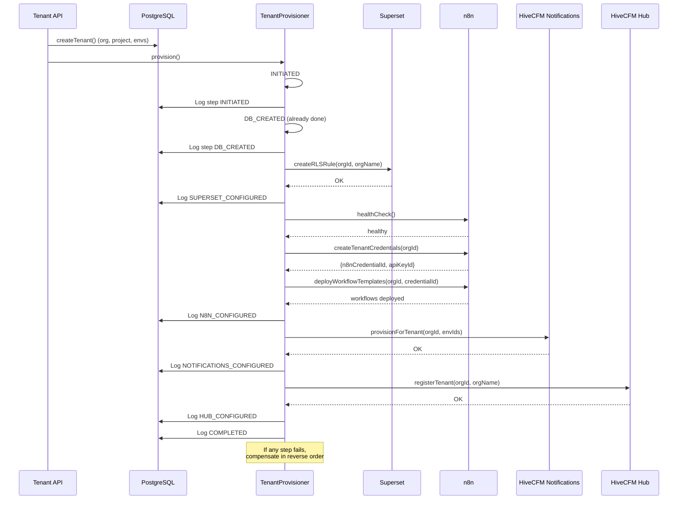

Provisioning steps, in order:

| Step | Service | Action | Compensation |
|------|---------|--------|--------------|
| `INITIATED` | -- | Log start | -- |
| `DB_CREATED` | PostgreSQL | Org/project/envs already created | Log compensation |
| `SUPERSET_CONFIGURED` | Superset | Create RLS rule | Delete RLS rule |
| `N8N_CONFIGURED` | n8n | Create credentials + deploy workflows | Remove workflows + revoke credentials |
| `NOTIFICATIONS_CONFIGURED` | HiveCFM Notifications | Create Integration records per environment | Delete Integration records |
| `HUB_CONFIGURED` | HiveCFM Hub | Register tenant | Deregister tenant |
| `COMPLETED` | -- | Log completion | -- |

n8n and HiveCFM Notifications provisioning use **graceful degradation**: if the service is unreachable, provisioning logs a warning but does not fail.

---

## 2. Superset Analytics Integration

Apache Superset provides embedded analytics dashboards for tenant users. HiveCFM communicates with Superset through two channels: the Superset REST API (for admin token management and guest token minting) and direct PostgreSQL database views (for analytics data).

### Key Files

| File | Purpose |
|------|---------|
| `apps/web/lib/superset/client.ts` | `SupersetAdminClient` singleton -- admin login, guest token minting, generic API requests |
| `apps/web/lib/superset/service.ts` | RLS rule creation/deletion for tenant provisioning |
| `apps/web/lib/superset/guest-token.ts` | Guest token minting with dashboard template lookup and embedded UUID resolution |
| `superset/superset_config.py` | Superset server configuration (CORS, embedding, guest tokens) |
| `packages/database/migration/20260310000000_add_superset_views/migration.sql` | 15 PostgreSQL views for analytics |

### 2.1 SupersetAdminClient

The `SupersetAdminClient` class manages authentication and API communication with Superset. It is exported as a singleton (`supersetClient`).

**Authentication flow:**
1. Login to Superset with `POST /api/v1/security/login` using admin credentials
2. Cache the JWT access token for 1 hour
3. On subsequent calls, reuse the cached token
4. If a 401 is received during guest token minting, force-refresh the token and retry once

**Constructor:**

```
constructor(baseUrl?: string)
```

Defaults to `process.env.SUPERSET_BASE_URL` or `http://hivecfm-superset:8088`.

**Methods:**

| Method | Description |
|--------|-------------|
| `getAdminToken()` | Returns a valid admin JWT (logs in if needed) |
| `mintGuestToken(dashboardId, rlsClause)` | Mints a guest token scoped to a dashboard with RLS |
| `apiRequest(method, endpoint, body?)` | Generic authenticated API call to Superset |

### 2.2 Guest Token Minting Flow

Guest tokens allow embedding Superset dashboards in the HiveCFM UI with row-level security per tenant.

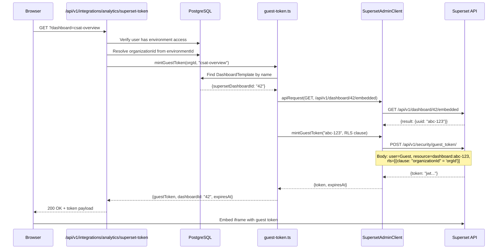

**Token lifetime:** 15 minutes (set at mint time; the browser must refresh before expiry).

**Retry logic:** If the admin token has expired (401), the client force-refreshes and retries the guest token request once.

### 2.3 Row-Level Security (RLS)

Each tenant gets an RLS rule in Superset created during provisioning:

```sql
"organizationId" = '<organizationId>'
```

This clause is applied at guest token mint time so every Superset query is scoped to the tenant's data. The RLS rule is also registered in Superset's own RLS API so that direct Superset UI access is also scoped.

**Service functions:**

| Function | Endpoint | Description |
|----------|----------|-------------|
| `createRLSRule(orgId, orgName)` | `POST /api/v1/rowlevelsecurity/` | Creates an RLS rule named `tenant_<orgId>` |
| `deleteRLSRule(orgId)` | `GET` + `DELETE /api/v1/rowlevelsecurity/<id>` | Finds and deletes the RLS rule by name |

### 2.4 DashboardTemplate Model

```prisma
model DashboardTemplate {
  id                  String   @id @default(cuid())
  name                String   @unique
  supersetDashboardId String   @map("superset_dashboard_id")
  description         String?
  isDefault           Boolean  @default(true) @map("is_default")
  createdAt           DateTime @default(now()) @map("created_at")
  updatedAt           DateTime @updatedAt @map("updated_at")
}
```

The `name` field is used as a lookup key (e.g., `"csat-overview"`). The `supersetDashboardId` is the integer dashboard ID in Superset. The embedded UUID is resolved at runtime via the Superset API.

**API endpoints:**

| Endpoint | Method | Description |
|----------|--------|-------------|
| `/api/v1/integrations/analytics/dashboards` | GET | List all default dashboard templates |
| `/api/v1/integrations/analytics/superset-token` | GET | Mint a guest token for a named dashboard |
| `/api/v1/management/analytics/superset-token` | GET | Management API variant for guest token minting |

### 2.5 Superset Database Views (15 Views)

These PostgreSQL views are created by migration `20260310000000_add_superset_views` and provide denormalized analytics data for Superset dashboards. They include `organization_name` in every view to support RLS filtering.

**Independent views (no view dependencies):**

| View | Purpose |
|------|---------|
| `v_agent_performance` | Agent-level metrics: handle time, conversation duration, wrap codes, call direction |
| `v_contact_insights` | Contact engagement: total/completed responses, surveys participated, date ranges |
| `v_csat_delivery_status` | Survey delivery funnel: display count, response rate, completion rate |
| `v_csat_demographics` | Response demographics: country, browser, OS, device, traffic source, duration |
| `v_daily_summary` | Daily aggregates: total/completed/partial responses, completion rate, avg time |
| `v_survey_analytics` | Survey-response detail: per-response metadata with survey context |

**Base view (used by dependent views):**

| View | Purpose |
|------|---------|
| `v_csat_questions` | Extracts question metadata from JSONB `blocks[].elements[]`: question ID, type, headline, range, scale. Filters for NPS, rating, openText, and ranking types. |

**Dependent views (require `v_csat_questions`):**

| View | Purpose |
|------|---------|
| `v_csat_nps_responses` | NPS/rating responses with normalized scores, NPS category (Promoter/Passive/Detractor), duration, demographics |
| `v_csat_question_ratings` | Rating breakdown with satisfaction levels (Satisfied/Neutral/Dissatisfied) |
| `v_csat_text_full` | Full open-text responses with metadata |
| `v_csat_text_responses` | Word-level tokenization of open-text responses with stop-word filtering for word cloud analysis |

**Higher-level aggregation (depends on `v_csat_nps_responses`):**

| View | Purpose |
|------|---------|
| `v_csat_nps_summary` | Per-survey NPS summary: total responses, promoter/passive/detractor counts & percentages, NPS score, avg duration |

**Self-contained complex views:**

| View | Purpose |
|------|---------|
| `v_kpi_dashboard` | Daily KPI rollup: NPS score, CSAT score, promoters/passives/detractors, response counts, by survey/channel/queue/agent |
| `v_raw_data_survey_report` | Flat per-question response report with all Genesys metadata (interaction ID, agent, queue, handle time, wrap code, direction, phone numbers) |
| `v_raw_data_survey_report_agg` | Aggregated version of the raw data report |

### 2.6 Superset Server Configuration

The `superset_config.py` file configures Superset for embedded use:

| Setting | Value | Purpose |
|---------|-------|---------|
| `GUEST_ROLE_NAME` | `'Public'` | Role assigned to guest token users |
| `GUEST_TOKEN_JWT_SECRET` | env var or `SECRET_KEY` | JWT signing secret |
| `EMBEDDED_SUPERSET` | `True` | Enable dashboard embedding feature |
| `DASHBOARD_CROSS_FILTERS` | `True` | Enable cross-filter support in dashboards |
| `ENABLE_CORS` | `True` | Required for iframe embedding |
| `TALISMAN_ENABLED` | `False` | Disable CSP headers (conflicts with embedding) |
| `WTF_CSRF_ENABLED` | `False` | Disable CSRF for server-to-server API calls |
| Redis cache | DB 1, prefix `superset_` | 5-minute default cache TTL |

### 2.7 Environment Variables

| Variable | Required | Default | Description |
|----------|----------|---------|-------------|
| `SUPERSET_BASE_URL` | No | `http://hivecfm-superset:8088` | Superset API base URL |
| `SUPERSET_ADMIN_USERNAME` | No | `admin` | Admin username for API login |
| `SUPERSET_ADMIN_PASSWORD` | Yes | `""` | Admin password for API login |
| `SUPERSET_DB_URL` | No | -- | Direct PostgreSQL connection for user provisioning |
| `SUPERSET_SECRET_KEY` | Yes (Superset) | `changeme` | Superset's Flask secret key |
| `GUEST_TOKEN_JWT_SECRET` | No (Superset) | `SECRET_KEY` | JWT secret for guest tokens |

### 2.8 External User Provisioning (Superset)

When a user signs up or is created, `provisionExternalUser()` in `apps/web/lib/user/external-provisioning.ts` provisions them in Superset by inserting directly into Superset's Flask-AppBuilder database tables (`ab_user`, `ab_user_role`) using a direct PostgreSQL connection. Passwords are hashed in werkzeug `pbkdf2:sha256` format with 600,000 iterations.

---

## 3. HiveCFM Notification Integration

The HiveCFM notification service provides multi-channel notification delivery (email, SMS) for campaigns and contact engagement.

### Key Files

| File | Purpose |
|------|---------|
| `apps/web/lib/notifications/service.ts` | Core notification API client: workflow CRUD, trigger, bulk trigger, SMS, message analytics |
| `apps/web/lib/notifications/tenant-provisioning.ts` | Provision/deprovision notification integration records per tenant environment |
| `apps/web/modules/ee/contacts/lib/notification-sync.ts` | Contact-to-subscriber synchronization |
| `apps/web/app/api/v1/notifications/sms-inbound/route.ts` | Inbound SMS webhook handler for conversational surveys |
| `packages/types/integration/notifications.ts` | Notification integration type definitions |

### 3.1 Configuration Resolution

HiveCFM notification service configuration follows a two-tier lookup:

1. **Database integration record** (`Integration` table with `type = "notifications"`) -- per-environment config stored as `{key: {apiKey, apiUrl}}`
2. **Environment variable fallback** -- `HIVECFM_NOTIFICATIONS_API_KEY` and `HIVECFM_NOTIFICATIONS_API_URL`

This allows per-tenant notification service instances while supporting a shared global instance.

### 3.2 Workflow Management

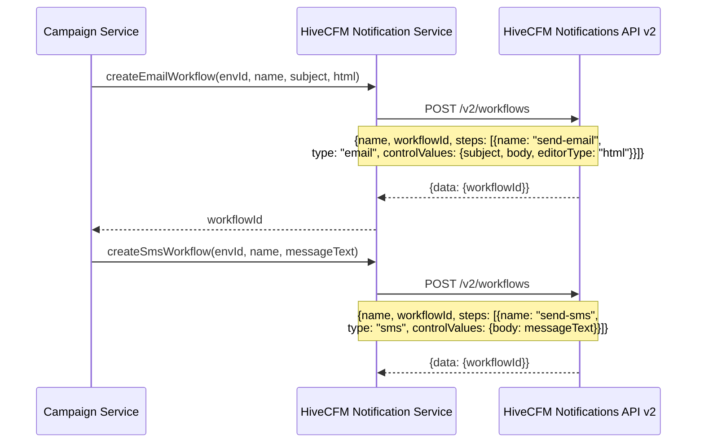

**Available workflow operations:**

| Function | Notifications API | Description |
|----------|----------|-------------|
| `createEmailWorkflow()` | `POST /v2/workflows` | Create email workflow with HTML body |
| `createSmsWorkflow()` | `POST /v2/workflows` | Create SMS workflow |
| `deleteWorkflow()` | `DELETE /v2/workflows/:id` | Delete a workflow |
| `triggerWorkflow()` | `POST /v1/events/trigger` | Trigger for single subscriber |
| `triggerBulkWorkflow()` | `POST /v1/events/trigger/bulk` | Trigger for multiple subscribers (batched) |
| `sendSmsMessage()` | `POST /v1/events/trigger` | Send SMS via `campaign-sms-outbound` workflow |
| `listActiveIntegrations()` | `GET /v1/integrations/active` | List active notification providers |

### 3.3 Campaign Message Analytics

The service fetches message delivery data from the notification service for campaign analytics:

| Function | Description |
|----------|-------------|
| `getWorkflowMessages()` | Paginated fetch of all messages for a workflow (max 5000, 100/page). Client-side filters by `templateIdentifier` due to unreliable server-side filtering. |
| `getWorkflowStats()` | Aggregates message stats: total, sent, failed, delivered, seen, read |

### 3.4 Contact-to-Subscriber Sync

When contacts are created/updated in HiveCFM, they are synchronized to the notification service as subscribers:

| Function | Endpoint | Batch Size | Description |
|----------|----------|------------|-------------|
| `syncContactToNotifications()` | `POST /v1/subscribers` | 1 | Single contact sync |
| `syncBulkContactsToNotifications()` | `POST /v1/subscribers/bulk` | 500 | Bulk contact upload sync |
| `syncCSVContactsToNotifications()` | `POST /v1/subscribers/bulk` | 500 | CSV import sync |
| `deleteSubscriberFromNotifications()` | `DELETE /v1/subscribers/:id` | 1 | Remove subscriber |

The subscriber mapping converts contact attributes:
- `userId` or `email` becomes the `subscriberId`
- Standard fields (`email`, `firstName`, `lastName`, `phone`, `avatar`, `locale`, `timezone`) map directly
- All other attributes go into the subscriber's `data` object

### 3.5 Inbound SMS Survey Flow

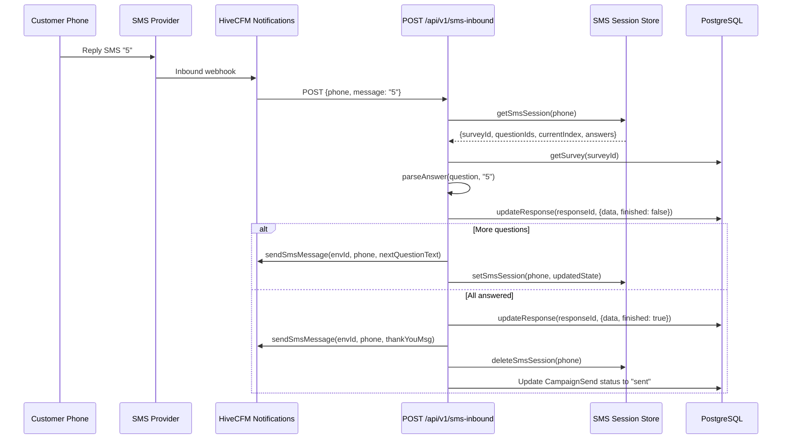

### 3.6 Tenant Provisioning

During tenant creation, `provisionNotificationsForTenant()` creates an `Integration` record of type `"notifications"` for each environment, storing the global notification service API credentials. During deprovisioning, these records are deleted.

### 3.7 Environment Variables

| Variable | Required | Default | Description |
|----------|----------|---------|-------------|
| `HIVECFM_NOTIFICATIONS_API_KEY` | No | -- | Notification service API key |
| `HIVECFM_NOTIFICATIONS_API_URL` | No | `https://notifications-api.graypond-ce0467a0.westeurope.azurecontainerapps.io/api` | Notification service API base URL |

---

## 4. n8n Workflow Integration

n8n provides workflow automation for event-driven processing (response created, low CSAT alerts, contact sync).

### Key Files

| File | Purpose |
|------|---------|
| `apps/web/lib/n8n/client.ts` | `N8nClient` singleton -- workflow/credential/tag CRUD, health check |
| `apps/web/lib/n8n/service.ts` | Tenant-scoped workflow deployment, credential management, rotation |
| `apps/web/lib/n8n/templates.ts` | Default workflow templates and parameterization |
| `apps/web/app/api/v1/management/tenants/[orgId]/workflows/route.ts` | Management API for per-tenant workflow deployment |
| `apps/web/app/api/v1/management/tenants/[orgId]/credentials/route.ts` | Management API for credential rotation |

### 4.1 N8nClient

The `N8nClient` communicates with n8n's REST API using an API key (`X-N8N-API-KEY` header).

**Methods:**

| Category | Method | n8n Endpoint |
|----------|--------|--------------|
| Workflow | `createWorkflow()` | `POST /api/v1/workflows` |
| Workflow | `getWorkflow()` | `GET /api/v1/workflows/:id` |
| Workflow | `updateWorkflow()` | `PATCH /api/v1/workflows/:id` |
| Workflow | `deleteWorkflow()` | `DELETE /api/v1/workflows/:id` |
| Workflow | `activateWorkflow()` | `PATCH /api/v1/workflows/:id` (active: true) |
| Workflow | `deactivateWorkflow()` | `PATCH /api/v1/workflows/:id` (active: false) |
| Workflow | `listWorkflows(tags?)` | `GET /api/v1/workflows?tags=...` |
| Credential | `createCredential()` | `POST /api/v1/credentials` |
| Credential | `updateCredential()` | `PATCH /api/v1/credentials/:id` |
| Credential | `deleteCredential()` | `DELETE /api/v1/credentials/:id` |
| Tag | `createTag()` | `POST /api/v1/tags` |
| Health | `healthCheck()` | `GET /healthz` (5s timeout) |
| Execution | `getExecution()` | `GET /api/v1/executions/:id` |

### 4.2 Workflow Templates

Three default workflow templates are defined in code, with a database-first override via the `WorkflowTemplate` model:

```prisma
model WorkflowTemplate {
  id          String   @id @default(cuid())
  name        String   @unique
  n8nWorkflow Json     @map("n8n_workflow")
  eventType   String   @map("event_type")
  description String?
  isDefault   Boolean  @default(true) @map("is_default")
  createdAt   DateTime @default(now()) @map("created_at")
  updatedAt   DateTime @updatedAt @map("updated_at")
}
```

**Default templates:**

| Template | Event Type | Description |
|----------|-----------|-------------|
| `response-created-handler` | `responseCreated` | Webhook trigger on new response, fetches response details, processes data |
| `low-csat-alert` | `lowCsatAlert` | Webhook trigger, IF node checks CSAT score <= 2, generates alert |
| `contact-sync` | `contactSync` | Webhook trigger, fetches contacts from HiveCFM API |

### 4.3 Template Parameterization

Templates contain placeholder tokens that are replaced at deployment time:

| Token | Replaced With |
|-------|--------------|
| `{{ORGANIZATION_ID}}` | Tenant's organization ID |
| `{{WEBHOOK_BASE_URL}}` | `N8N_WEBHOOK_BASE_URL` env var |
| `{{HIVECFM_URL}}` | `WEBAPP_URL` env var |
| `{{CREDENTIAL_ID}}` | n8n credential ID for this tenant |

### 4.4 Tenant Credential Lifecycle

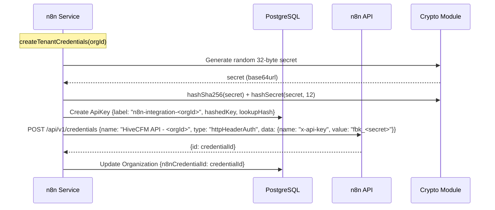

**Credential operations:**

| Function | Description |
|----------|-------------|
| `createTenantCredentials()` | Generate API key, create n8n credential, link to org |
| `rotateTenantCredentials()` | Generate new key, update n8n credential, revoke old key |
| `revokeTenantCredentials()` | Delete n8n credential and API key |

### 4.5 Workflow Deployment Flow

During provisioning:
1. Fetch templates from `WorkflowTemplate` table (or fall back to code defaults)
2. Create a tag `tenant-<orgId>` in n8n for grouping
3. For each template: parameterize, create workflow, activate

Per-tenant API endpoints:
- `POST /api/v1/management/tenants/:orgId/workflows` -- Deploy a specific workflow template
- `DELETE /api/v1/management/tenants/:orgId/workflows/:workflowId` -- Remove a specific workflow

### 4.6 External User Provisioning (n8n)

Like Superset, n8n user accounts are provisioned by direct database insertion into n8n's `user` table via Prisma raw queries. This ensures the same credentials work for SSO-like access across HiveCFM, Superset, and n8n.

### 4.7 Environment Variables

| Variable | Required | Default | Description |
|----------|----------|---------|-------------|
| `N8N_BASE_URL` | No | `http://hivecfm-n8n:5678` | n8n API base URL |
| `N8N_API_KEY` | Yes | `""` | n8n API key for authentication |
| `N8N_WEBHOOK_BASE_URL` | No | `https://n8n.hivecfm.io` | Public URL for n8n webhooks |

---

## 5. Genesys Cloud Integration

HiveCFM integrates with Genesys Cloud as a Bot Connector to deliver post-conversation IVR/chat surveys via the Genesys Architect flow system.

### Key Files

| File | Purpose |
|------|---------|
| `apps/web/app/api/v1/management/bot-connector/turn/route.ts` | Main turn-by-turn conversation handler |
| `apps/web/app/api/v1/management/bot-connector/bots/route.ts` | Bot discovery endpoint |
| `apps/web/app/api/v1/management/bot-connector/lib/types.ts` | Request/response types and Zod schemas |
| `apps/web/app/api/v1/management/bot-connector/lib/question-formatter.ts` | Survey question to Genesys message formatter |
| `docs/genesys-bot-connector-implementation.md` | Implementation documentation |
| `docs/genesys-architect-flow-setup.md` | Architect flow setup guide |

### 5.1 Bot Connector API

HiveCFM implements the Genesys Cloud Bot Connector v1 API specification. Genesys Architect flows invoke the bot connector to deliver surveys in chat/messaging channels.

**Endpoints:**

| Endpoint | Method | Description |
|----------|--------|-------------|
| `/api/v1/management/bot-connector/bots` | GET | Returns available bots for Genesys integration config |
| `/api/v1/management/bot-connector/turn` | POST | Processes each turn of the conversation |

**Bot definition returned by `/bots`:**

```json
{
  "bots": [{
    "id": "hivecfm-survey-bot",
    "name": "HiveCFM Survey Bot",
    "description": "Post-conversation customer feedback survey",
    "versions": [{
      "version": "1.0",
      "intents": [
        {"name": "survey_in_progress"},
        {"name": "survey_complete"},
        {"name": "survey_opted_out"},
        {"name": "survey_error"}
      ]
    }]
  }]
}
```

### 5.2 Conversation Flow

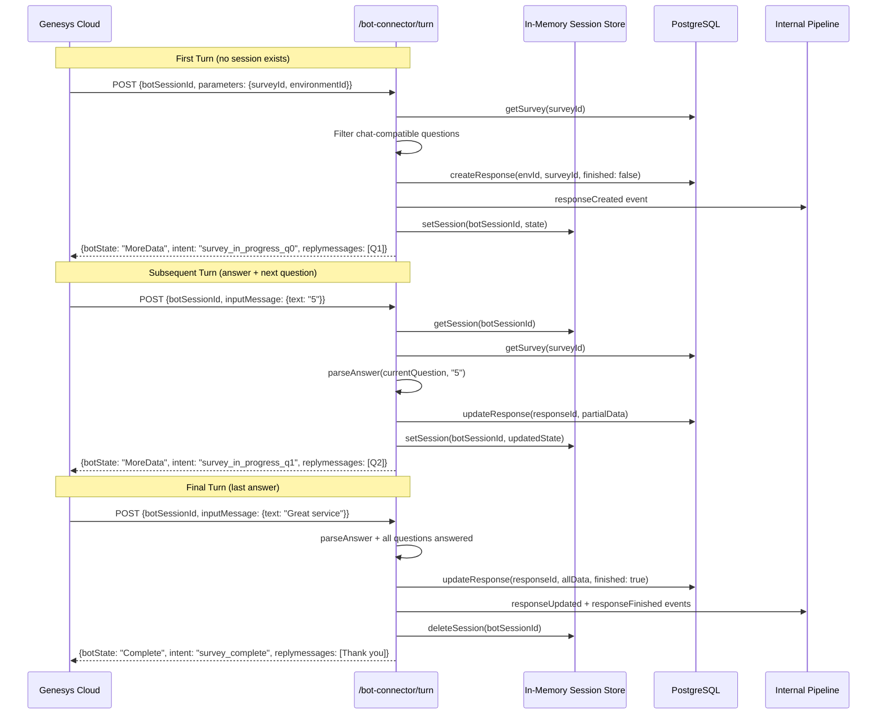

### 5.3 Session Management

Sessions are stored in an **in-memory Map** keyed by `botSessionId`:

- **TTL:** 1 hour
- **Cleanup:** Periodic cleanup every 10 minutes removes expired sessions
- **State tracked:** `responseId`, `surveyId`, `environmentId`, `currentQuestionIndex`, `questionIds[]`, `answers{}`, `genesysConversationId`

### 5.4 Input Parsing

The bot connector handles two types of customer input:

| Input Type | Extraction Logic |
|------------|-----------------|
| Plain text | `inputMessage.text` |
| Quick Reply button click | `inputMessage.content[0].buttonResponse.payload` (or `.text` fallback) |

### 5.5 Question Formatting

Survey questions are converted to Genesys Bot Connector `Structured` messages with `QuickReply` buttons:

| Question Type | Button Format |
|--------------|---------------|
| Rating | Buttons 1 through N (range) |
| NPS | Buttons 0-10 |
| MultipleChoiceSingle/Multi | One button per choice (label as text, ID as payload) |
| CTA | Continue / Dismiss buttons |
| Consent | Yes / No buttons |
| OpenText, Date, Address, ContactInfo | No buttons (free text input) |
| Ranking | Text instruction to type comma-separated order |

**Unsupported question types** (filtered out): FileUpload, PictureSelection, Cal, Matrix.

### 5.6 Intent Cycling

Genesys Cloud has a safety limit: 4 consecutive turns with the same intent causes a `Failed` state. To avoid this, HiveCFM appends a question index suffix to each turn's intent:

```
survey_in_progress_q0, survey_in_progress_q1, survey_in_progress_q2, ...
```

### 5.7 Opt-Out Handling

The bot recognizes opt-out keywords: `stop`, `quit`, `cancel`, `unsubscribe`, `opt out`, `optout`, `no thanks`. When detected, the session is deleted and the bot returns `Complete` with `survey_opted_out` intent.

### 5.8 Architect Flow Parameters

Genesys Architect flows pass parameters to the bot connector in the `parameters` object:

| Parameter | Required | Description |
|-----------|----------|-------------|
| `surveyId` | Yes | HiveCFM survey ID to deliver |
| `environmentId` | Yes | HiveCFM environment ID |
| `conversationId` | No | Genesys conversation ID for tracking |

---

## 6. Airtable Integration

Airtable integration enables automatic export of survey responses to Airtable bases/tables.

### Key Files

| File | Purpose |
|------|---------|
| `apps/web/lib/airtable/service.ts` | Airtable API client: OAuth, bases, tables, field creation, record writing |
| `apps/web/app/api/v1/integrations/airtable/route.ts` | OAuth initiation |
| `apps/web/app/api/v1/integrations/airtable/callback/route.ts` | OAuth callback |
| `apps/web/app/api/v1/integrations/airtable/tables/route.ts` | Table listing |

### 6.1 OAuth Flow

Airtable uses OAuth 2.0 with refresh token rotation:

1. User initiates OAuth via `/api/v1/integrations/airtable`
2. Callback at `/api/v1/integrations/airtable/callback` exchanges code for tokens
3. Tokens stored as `Integration` record with `type = "airtable"`
4. Before each API call, `getAirtableToken()` checks token expiry and refreshes if needed

### 6.2 Data Writing Flow

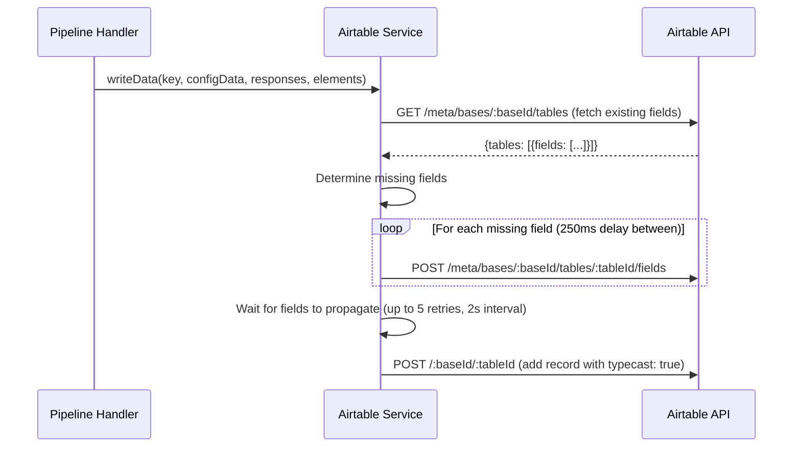

**Rate limiting:** 250ms delay between field creation requests (staying under Airtable's 5 req/sec per base limit).

**Message limit:** `AIRTABLE_MESSAGE_LIMIT` -- responses exceeding this limit are truncated.

### 6.3 Environment Variables

| Variable | Required | Default | Description |
|----------|----------|---------|-------------|
| `AIRTABLE_CLIENT_ID` | Yes | -- | Airtable OAuth client ID |

---

## 7. Notion Integration

Notion integration exports survey responses as pages in a Notion database, with field mapping to Notion property types.

### Key Files

| File | Purpose |
|------|---------|
| `apps/web/lib/notion/service.ts` | Notion API client: database listing, page creation |
| `apps/web/app/api/v1/integrations/notion/route.ts` | OAuth initiation |
| `apps/web/app/api/v1/integrations/notion/callback/route.ts` | OAuth callback |

### 7.1 Authentication

Notion uses OAuth 2.0. The access token is **encrypted at rest** using `symmetricEncrypt` with the `ENCRYPTION_KEY`. On each API call, the token is decrypted before use. All requests include `Notion-Version: 2022-06-28`.

### 7.2 Data Writing

Survey responses are written as Notion pages with per-column type mapping:

| Notion Column Type | Value Mapping |
|-------------------|---------------|
| `select` | `{name: value}` (commas stripped) |
| `multi_select` | Array of `{name: value}` |
| `title` | `[{text: {content: value}}]` |
| `rich_text` | `[{text: {content: value}}]` (truncated to `NOTION_RICH_TEXT_LIMIT`) |
| `status` | `{name: value}` |
| `checkbox` | `true` if "accepted" or "clicked" |
| `date` | `{start: value}` |
| `email` | Raw value |
| `number` | `parseInt(value)` |
| `phone_number` | Raw value |
| `url` | Raw value or joined array |

**Unsupported types:** rollup, created_by, created_time, last_edited_by, last_edited_time.

### 7.3 Environment Variables

| Variable | Required | Default | Description |
|----------|----------|---------|-------------|
| `NOTION_OAUTH_CLIENT_ID` | Yes | -- | Notion OAuth client ID |
| `NOTION_OAUTH_CLIENT_SECRET` | Yes | -- | Notion OAuth client secret |

---

## 8. Slack Integration

Slack integration posts survey responses as formatted block messages to configured Slack channels.

### Key Files

| File | Purpose |
|------|---------|
| `apps/web/lib/slack/service.ts` | Slack API client: channel listing, message posting |
| `apps/web/app/(app)/environments/[environmentId]/workspace/integrations/slack/` | UI components for channel mapping |

### 8.1 Channel Discovery

`fetchChannels()` paginates through `https://slack.com/api/users.conversations` (200 per page, both public and private channels) using cursor-based pagination. Returns `{name, id}[]`.

**Token expiry handling:** If the Slack API returns `token_expired`, the integration record is deleted to force re-authentication.

### 8.2 Message Posting

`writeDataToSlack()` posts block-formatted messages via `https://slack.com/api/chat.postMessage`:

```
Survey Name
---
*Question 1*
Answer 1

*Question 2*
Answer 2
```

Messages exceeding `SLACK_MESSAGE_LIMIT` characters per response are truncated.

### 8.3 Environment Variables

| Variable | Required | Default | Description |
|----------|----------|---------|-------------|
| `SLACK_CLIENT_ID` | Yes | -- | Slack OAuth client ID |
| `SLACK_CLIENT_SECRET` | Yes | -- | Slack OAuth client secret |

---

## 9. Google Sheets Integration

Google Sheets integration appends survey responses as rows in a configured spreadsheet.

### Key Files

| File | Purpose |
|------|---------|
| `apps/web/lib/googleSheet/service.ts` | Google Sheets API client: auth, data writing, spreadsheet metadata |
| `apps/web/app/api/google-sheet/route.ts` | OAuth initiation |
| `apps/web/app/api/google-sheet/callback/route.ts` | OAuth callback |

### 9.1 Authentication

Google Sheets uses OAuth 2.0 with automatic token refresh:

1. Create `OAuth2Client` with client ID, secret, and redirect URI
2. Set `refresh_token` from stored integration credentials
3. Call `refreshAccessToken()` before each operation
4. Update stored credentials with new tokens

### 9.2 Data Writing

Two operations per response:

1. **Update row A1** with question headers (element names)
2. **Append row A2+** with response values

Responses exceeding `GOOGLE_SHEET_MESSAGE_LIMIT` are truncated.

### 9.3 Environment Variables

| Variable | Required | Default | Description |
|----------|----------|---------|-------------|
| `GOOGLE_SHEETS_CLIENT_ID` | Yes | -- | Google OAuth client ID |
| `GOOGLE_SHEETS_CLIENT_SECRET` | Yes | -- | Google OAuth client secret |
| `GOOGLE_SHEETS_REDIRECT_URL` | Yes | -- | OAuth redirect URL |

---

## 10. Stripe Billing Integration

Stripe handles subscription billing for the SaaS cloud offering.

### Key Files

| File | Purpose |
|------|---------|
| `apps/web/modules/ee/billing/api/lib/stripe-webhook.ts` | Stripe webhook event handler |
| `apps/web/modules/ee/billing/api/lib/create-subscription.ts` | Checkout session creation |
| `apps/web/modules/ee/billing/api/lib/checkout-session-completed.ts` | Handles successful checkout |
| `apps/web/modules/ee/billing/api/lib/invoice-finalized.ts` | Handles invoice finalization |
| `apps/web/modules/ee/billing/api/lib/subscription-deleted.ts` | Handles subscription cancellation |
| `apps/web/modules/ee/billing/api/route.ts` | Stripe webhook POST route |

### 10.1 Pricing Plans

| Plan | Monthly | Yearly | Responses/mo | Contacts | Workspaces |
|------|---------|--------|-------------|----------|------------|
| Free | $0 | $0 | 1,000 | 2,000 | 1 |
| Startup | $49 | $490 | 5,000 | 7,500 | 3 |
| Custom | Contact | Contact | Custom | Custom | Custom |

### 10.2 Checkout Flow

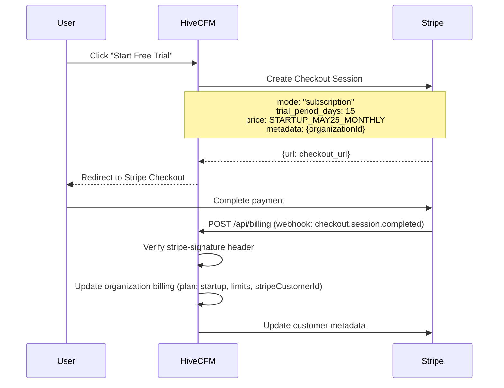

### 10.3 Webhook Events Handled

| Event | Handler | Action |
|-------|---------|--------|
| `checkout.session.completed` | `handleCheckoutSessionCompleted` | Upgrade org to Startup plan, set billing limits, save Stripe customer ID |
| `invoice.finalized` | `handleInvoiceFinalized` | Process finalized invoices |
| `customer.subscription.deleted` | `handleSubscriptionDeleted` | Handle subscription cancellation |

**Webhook security:** Stripe signature verification via `stripe.webhooks.constructEvent()` using `STRIPE_WEBHOOK_SECRET`.

### 10.4 Environment Variables

| Variable | Required | Default | Description |
|----------|----------|---------|-------------|
| `STRIPE_SECRET_KEY` | Yes | -- | Stripe secret API key |
| `STRIPE_WEBHOOK_SECRET` | Yes | -- | Stripe webhook signing secret |

**Stripe API version:** `2024-06-20`

---

## 11. Webhook System

HiveCFM supports custom webhooks that notify external systems about survey response events.

### Key Files

| File | Purpose |
|------|---------|
| `apps/web/modules/integrations/webhooks/lib/webhook.ts` | Webhook CRUD operations |
| `apps/web/modules/integrations/webhooks/types/webhooks.ts` | Webhook input schema |
| `apps/web/modules/integrations/webhooks/lib/utils.ts` | URL validation, Discord detection |
| `apps/web/modules/integrations/webhooks/actions.ts` | Server actions (with audit logging) |
| `apps/web/app/api/(internal)/pipeline/route.ts` | Pipeline route that dispatches webhooks |
| `apps/web/lib/crypto.ts` | Standard Webhooks signature generation |

### 11.1 Webhook Model

```prisma
model Webhook {
  id            String             @id @default(cuid())
  name          String?
  url           String
  source        WebhookSource      @default(user)
  environmentId String
  triggers      PipelineTriggers[]
  surveyIds     String[]
  secret        String?
}

enum WebhookSource {
  user
  zapier
  make
  n8n
  activepieces
}

enum PipelineTriggers {
  responseCreated
  responseUpdated
  responseFinished
}
```

### 11.2 Event Types

| Trigger | Fired When |
|---------|-----------|
| `responseCreated` | A new response is created (may be partial) |
| `responseUpdated` | An existing response is updated |
| `responseFinished` | A response is marked as finished/complete |

### 11.3 Webhook Registration

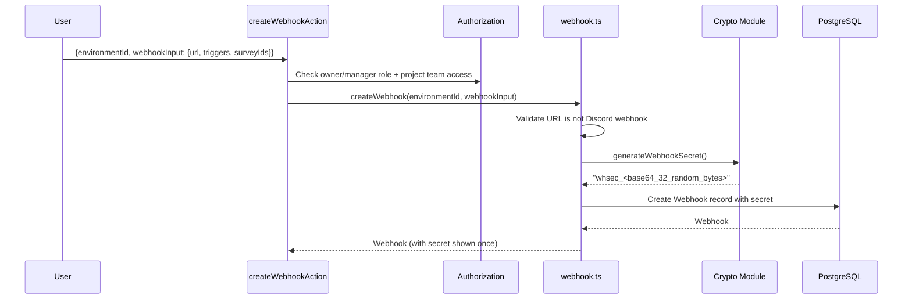

### 11.4 Webhook Dispatch

When the internal pipeline processes a response event:

1. Query all webhooks matching the environment, event trigger, and survey ID (or all surveys if `surveyIds` is empty)
2. For each webhook, construct the payload and sign it
3. Fire all webhook requests in parallel with a 5-second timeout
4. Use `Promise.allSettled()` so one failure does not block others

**Payload format:**

```json
{
  "webhookId": "<webhook_id>",
  "event": "responseFinished",
  "data": {
    "id": "<response_id>",
    "surveyId": "<survey_id>",
    "data": { "question1": "answer1" },
    "finished": true,
    "survey": {
      "title": "Customer Satisfaction",
      "type": "link",
      "status": "inProgress",
      "createdAt": "2025-01-01T00:00:00Z",
      "updatedAt": "2025-01-15T00:00:00Z"
    }
  }
}
```

### 11.5 Standard Webhooks Signature

HiveCFM implements the [Standard Webhooks](https://github.com/standard-webhooks/standard-webhooks) specification:

**Headers sent with every webhook:**

| Header | Value |
|--------|-------|
| `Content-Type` | `application/json` |
| `webhook-id` | UUIDv7 message identifier |
| `webhook-timestamp` | Unix epoch seconds |
| `webhook-signature` | `v1,<base64_hmac_sha256>` |

**Signature computation:**

```
signed_content = "{webhook-id}.{webhook-timestamp}.{body}"
signature = "v1," + base64(HMAC-SHA256(decode_secret(whsec_...), signed_content))
```

The secret is generated as `whsec_` + base64(32 random bytes) and stored per webhook.

### 11.6 URL Validation

- URL must use `https://` protocol
- Must have a valid domain with TLD (no IP addresses, no localhost)
- No consecutive slashes in path
- Discord webhook URLs are explicitly blocked

### 11.7 Endpoint Testing

`testEndpoint()` sends a test POST with `{"event": "testEndpoint"}` to the configured URL using a temporary secret and signature. Aborts after 5 seconds. Returns true if status 2xx.

---

## 12. HiveCFM Hub Integration

HiveCFM Hub is a centralized feedback analytics service that receives response data for AI-powered semantic search and sentiment analysis.

### Key Files

| File | Purpose |
|------|---------|
| `apps/web/lib/hivecfm-hub/service.ts` | Hub API client: push responses, semantic search, tenant registration |

### 12.1 Response Push

On every `responseFinished` event, the pipeline pushes individual feedback records to the Hub:

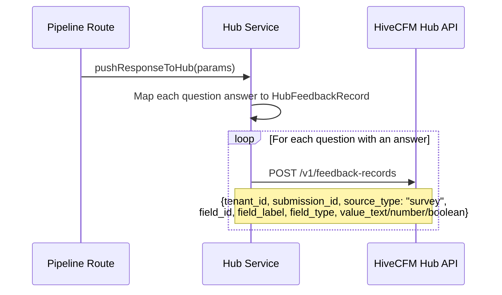

**Field type mapping:**

| Survey Question Type | Hub Field Type |
|---------------------|---------------|
| OpenText | `text` |
| MultipleChoiceSingle/Multi | `categorical` |
| NPS | `nps` |
| Rating | `rating` |
| CTA, Consent | `boolean` |
| Date | `date` |

### 12.2 Semantic Search

Two search endpoints are available:

| Function | Hub Endpoint | Description |
|----------|-------------|-------------|
| `searchFeedbackSemantic()` | `POST /v1/feedback-records/search/semantic` | Vector similarity search by query text |
| `getSimilarFeedback()` | `GET /v1/feedback-records/:id/similar` | Find similar feedback to a given record |

### 12.3 Tenant Registration

| Function | Hub Endpoint | Description |
|----------|-------------|-------------|
| `registerHubTenant()` | `POST /v1/tenants` | Register a new tenant |
| `deregisterHubTenant()` | `DELETE /v1/tenants/:id` | Deregister a tenant |

### 12.4 Environment Variables

| Variable | Required | Default | Description |
|----------|----------|---------|-------------|
| `HIVECFM_HUB_URL` | No | -- | Hub API base URL |
| `HIVECFM_HUB_API_KEY` | No | -- | Hub API bearer token |

---

## 13. External User Provisioning

When users sign up or are created in HiveCFM, they are provisioned across external systems via `provisionExternalUser()`. All operations run in parallel via `Promise.allSettled()` and are non-blocking (failures are logged, not thrown).

### Provisioning Targets

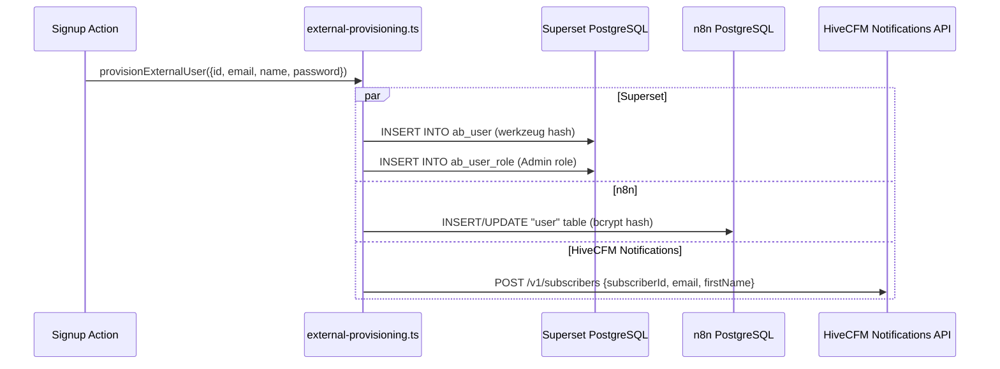

| Target | Method | Password Hash | Notes |
|--------|--------|--------------|-------|
| Superset | Direct SQL via `pg` client | werkzeug `pbkdf2:sha256:600000` | Creates user with Admin role |
| n8n | Raw Prisma queries | bcrypt (12 rounds) | Updates existing empty owner or creates new |
| HiveCFM Notifications | REST API | N/A | Creates subscriber for notifications |

---

## 14. Integration Pipeline

The internal pipeline (`POST /api/(internal)/pipeline`) is the central dispatch point for all integration-triggered data flows. It is called internally (authenticated via `CRON_SECRET`) after response events.

### Pipeline Flow for `responseFinished`

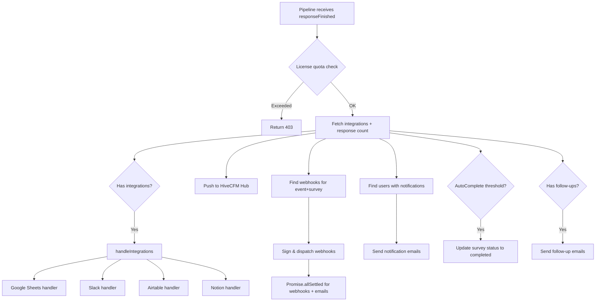

### Integration Data Processing

All four data-export integrations (Google Sheets, Slack, Airtable, Notion) share common data processing logic via `processDataForIntegration()`:

1. Extract response values for configured element IDs
2. Optionally include hidden fields, metadata, variables, and creation timestamp
3. Format question headlines with recall info parsing
4. Handle special question types (PictureSelection returns image URLs)

Each integration config stored in the `Integration` table contains a `data[]` array where each entry specifies:
- `surveyId` -- which survey this mapping applies to
- `elementIds` -- which questions to include
- `includeVariables`, `includeMetadata`, `includeHiddenFields`, `includeCreatedAt` -- optional extras

---

## 15. Complete Environment Variable Reference

| Variable | Integration | Required | Description |
|----------|------------|----------|-------------|
| `SUPERSET_BASE_URL` | Superset | No | Superset API URL |
| `SUPERSET_ADMIN_USERNAME` | Superset | No | Admin login username |
| `SUPERSET_ADMIN_PASSWORD` | Superset | Yes | Admin login password |
| `SUPERSET_DB_URL` | Superset | No | Direct DB connection for user provisioning |
| `HIVECFM_NOTIFICATIONS_API_KEY` | HiveCFM Notifications | No | Notification service API key |
| `HIVECFM_NOTIFICATIONS_API_URL` | HiveCFM Notifications | No | Notification service API base URL |
| `N8N_BASE_URL` | n8n | No | n8n API URL |
| `N8N_API_KEY` | n8n | Yes | n8n API key |
| `N8N_WEBHOOK_BASE_URL` | n8n | No | Public webhook URL |
| `AIRTABLE_CLIENT_ID` | Airtable | Yes | OAuth client ID |
| `NOTION_OAUTH_CLIENT_ID` | Notion | Yes | OAuth client ID |
| `NOTION_OAUTH_CLIENT_SECRET` | Notion | Yes | OAuth client secret |
| `SLACK_CLIENT_ID` | Slack | Yes | OAuth client ID |
| `SLACK_CLIENT_SECRET` | Slack | Yes | OAuth client secret |
| `GOOGLE_SHEETS_CLIENT_ID` | Google Sheets | Yes | OAuth client ID |
| `GOOGLE_SHEETS_CLIENT_SECRET` | Google Sheets | Yes | OAuth client secret |
| `GOOGLE_SHEETS_REDIRECT_URL` | Google Sheets | Yes | OAuth redirect URL |
| `STRIPE_SECRET_KEY` | Stripe | Yes | Stripe secret key |
| `STRIPE_WEBHOOK_SECRET` | Stripe | Yes | Webhook signing secret |
| `HIVECFM_HUB_URL` | HiveCFM Hub | No | Hub API base URL |
| `HIVECFM_HUB_API_KEY` | HiveCFM Hub | No | Hub API bearer token |
| `ENCRYPTION_KEY` | Notion (token encryption) | Yes | Symmetric encryption key |
