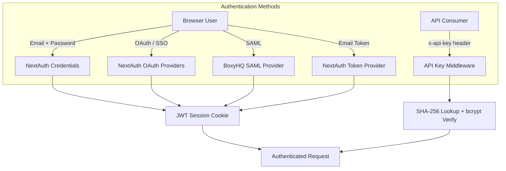
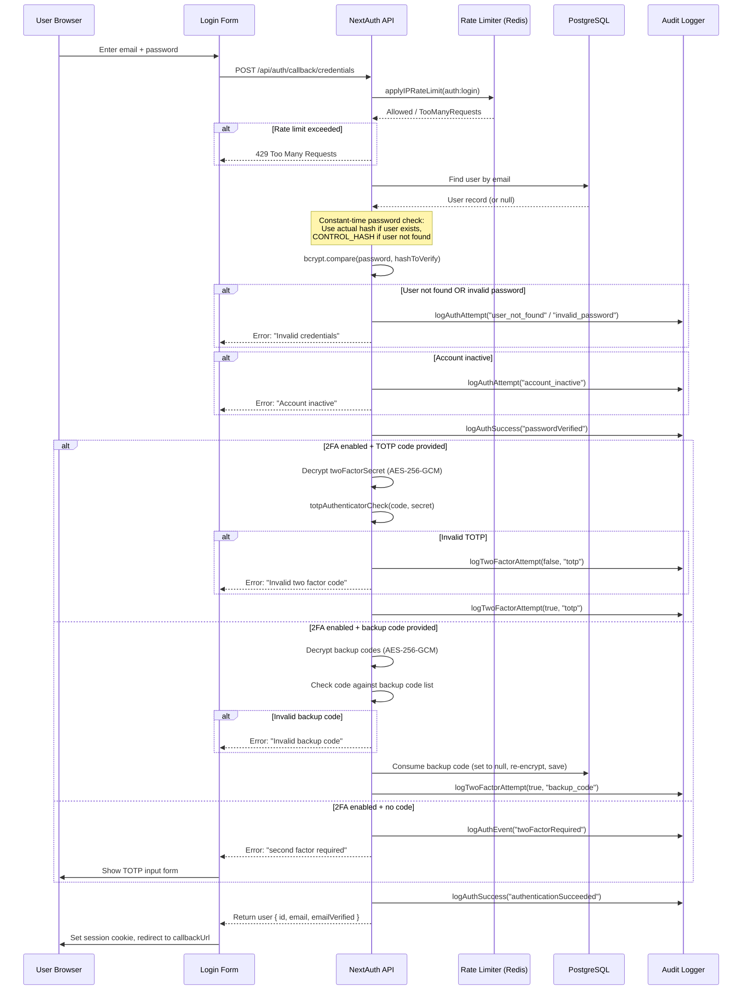
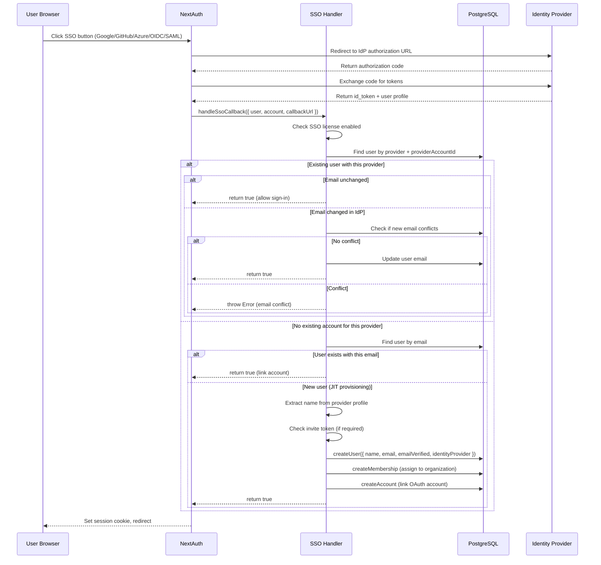
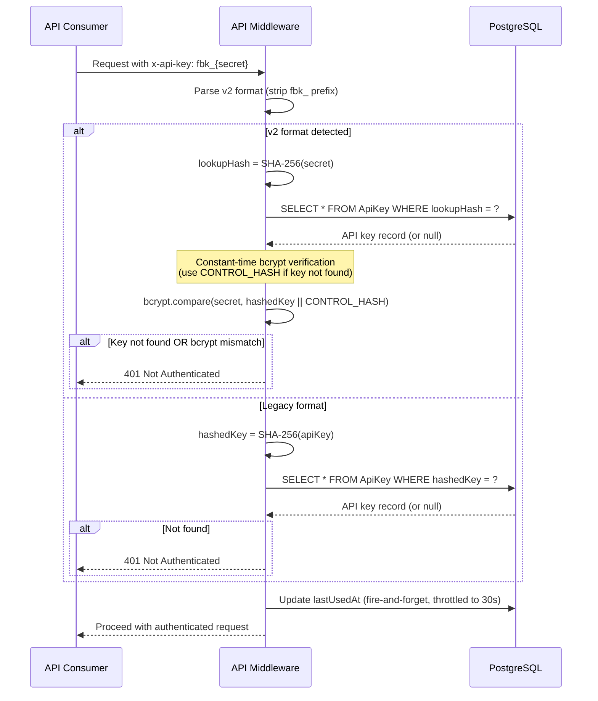
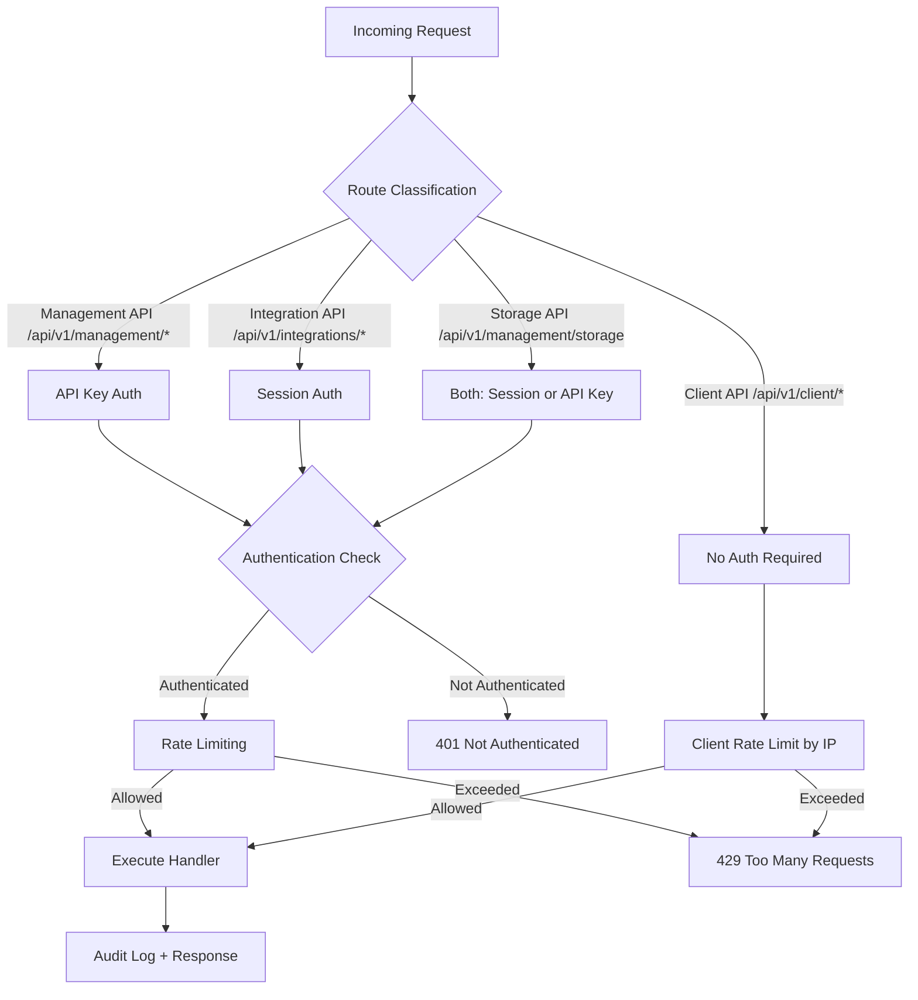
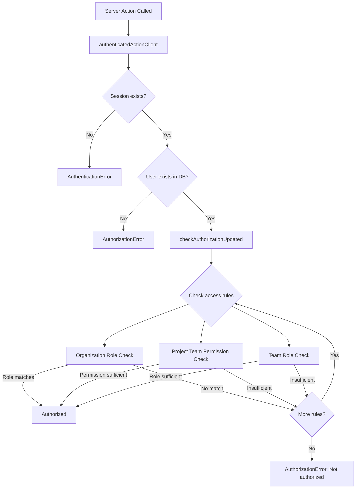
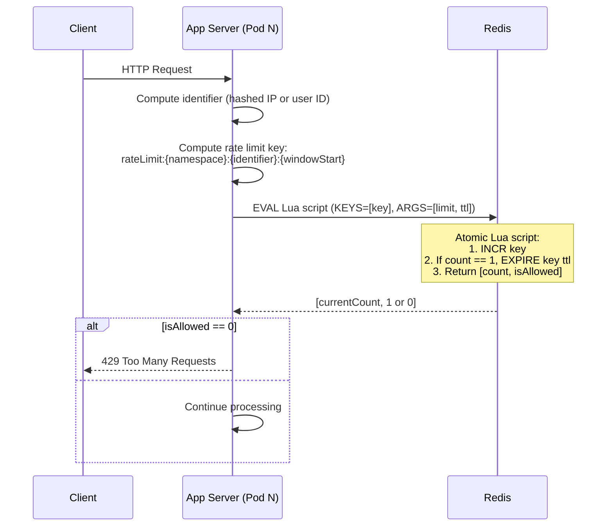
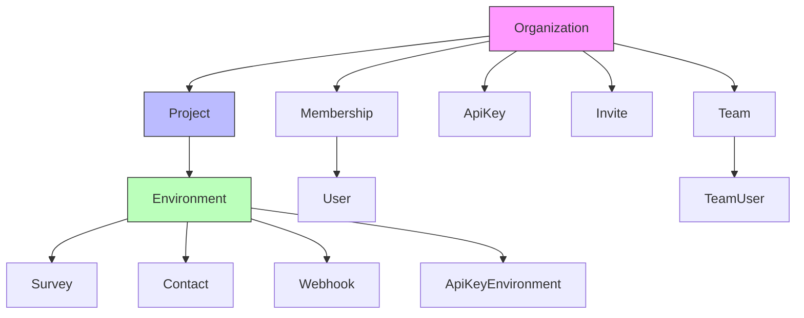
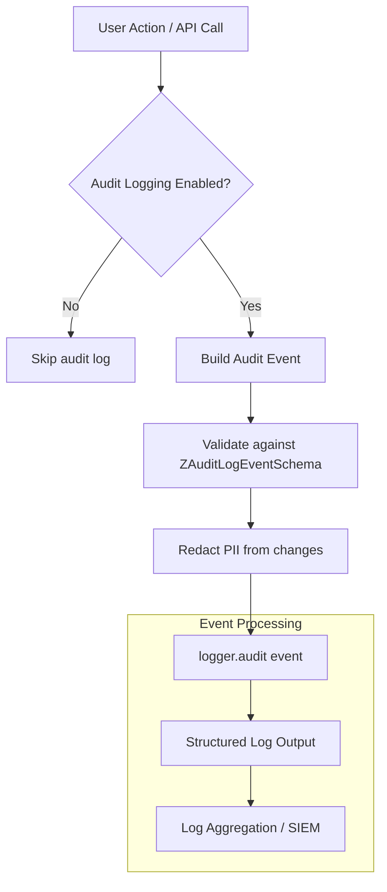

# 06 - Authentication & Security

This document provides a comprehensive reference for every authentication and security mechanism in HiveCFM. It covers credential-based login, SSO/SAML, API key authentication, role-based access control, rate limiting, CSRF protection, CORS policy, encryption, input validation, security headers, and audit logging.

---

## Table of Contents

1. [Authentication Overview](#1-authentication-overview)
2. [NextAuth Configuration](#2-nextauth-configuration)
3. [Credentials Authentication](#3-credentials-authentication)
4. [SAML / SSO](#4-saml--sso)
5. [API Key Authentication](#5-api-key-authentication)
6. [Role-Based Access Control](#6-role-based-access-control)
7. [Rate Limiting](#7-rate-limiting)
8. [CSRF Protection](#8-csrf-protection)
9. [CORS Configuration](#9-cors-configuration)
10. [Data Encryption](#10-data-encryption)
11. [Row-Level Security & Multi-Tenancy Isolation](#11-row-level-security--multi-tenancy-isolation)
12. [Input Validation](#12-input-validation)
13. [Security Headers](#13-security-headers)
14. [Audit Logging](#14-audit-logging)

---

## 1. Authentication Overview

HiveCFM supports multiple authentication methods depending on the context (browser session vs. API call) and the deployment configuration (self-hosted vs. cloud, enterprise license vs. community).

| Method | Use Case | Transport | Backed By |
|---|---|---|---|
| Email + Password (credentials) | Interactive web login | Session cookie (JWT) | NextAuth `CredentialsProvider` |
| Email Verification Token | Post-signup email link | Session cookie (JWT) | NextAuth `CredentialsProvider` (id: `token`) |
| Google OAuth | Interactive web login (SSO) | Session cookie (JWT) | NextAuth `GoogleProvider` |
| GitHub OAuth | Interactive web login (SSO) | Session cookie (JWT) | NextAuth `GitHubProvider` |
| Azure AD OAuth | Interactive web login (SSO) | Session cookie (JWT) | NextAuth `AzureAD` |
| OpenID Connect | Interactive web login (SSO) | Session cookie (JWT) | Custom OIDC provider |
| SAML 2.0 (BoxyHQ) | Enterprise SSO | Session cookie (JWT) | Custom SAML provider via BoxyHQ |
| API Key (`x-api-key` header) | REST API (Management API) | HTTP header | SHA-256 lookup + bcrypt verification |
| Cloudflare Turnstile | Bot protection on signup | Verification token | Server-side token validation |



### Key Environment Variables

| Variable | Purpose |
|---|---|
| `NEXTAUTH_SECRET` | Signs JWT session tokens and verification tokens |
| `NEXTAUTH_URL` | Base URL for NextAuth callbacks |
| `ENCRYPTION_KEY` | AES-256-GCM symmetric key (32 bytes) for encrypting TOTP secrets, backup codes, and JWT payloads |
| `ENTERPRISE_LICENSE_KEY` | Enables SSO providers (GitHub, Google, Azure AD, OIDC, SAML) |
| `EMAIL_VERIFICATION_DISABLED` | When `"1"`, skip email verification requirement at sign-in |
| `SESSION_MAX_AGE` | JWT session lifetime in seconds (default: 86400 = 24 hours) |
| `RATE_LIMITING_DISABLED` | When `"1"`, disables Redis-based rate limiting |
| `AUDIT_LOG_ENABLED` | When `"1"`, enables structured audit logging |
| `AUDIT_LOG_GET_USER_IP` | When `"1"`, records client IP addresses in audit logs |

---

## 2. NextAuth Configuration

**Source:** `apps/web/modules/auth/lib/authOptions.ts`

NextAuth is configured as the central authentication framework. The configuration is exported as `authOptions: NextAuthOptions` and consumed by both the API route handler (`/api/auth/[...nextauth]`) and server-side session checks (`getServerSession(authOptions)`).

### 2.1 Providers

Three categories of providers are registered:

1. **Credentials Provider (id: `"credentials"`)** -- Standard email/password login with optional TOTP two-factor authentication.
2. **Token Provider (id: `"token"`)** -- Email verification flow where a signed JWT token is exchanged for a session.
3. **Enterprise SSO Providers** -- Conditionally added when `ENTERPRISE_LICENSE_KEY` is set. These include GitHub, Google, Azure AD, OpenID Connect, and SAML 2.0 via BoxyHQ.

```typescript
providers: [
  CredentialsProvider({ id: "credentials", ... }),
  CredentialsProvider({ id: "token", ... }),
  // Conditionally add enterprise SSO providers
  ...(ENTERPRISE_LICENSE_KEY ? getSSOProviders() : []),
]
```

### 2.2 Session Strategy

HiveCFM uses **JWT-based sessions** (the NextAuth default when no database adapter is configured for sessions). The session token is stored in an HTTP-only cookie.

```typescript
session: {
  maxAge: SESSION_MAX_AGE,  // Default: 86400 seconds (24 hours)
}
```

The `maxAge` is configurable via the `SESSION_MAX_AGE` environment variable. There is no database session table; session state is entirely carried in the JWT.

### 2.3 Callbacks

#### `jwt` Callback

Enriches the JWT token with the user's database profile on every token refresh. Queries the database by email to attach the user ID and `isActive` flag.

```typescript
async jwt({ token }) {
  const existingUser = await getUserByEmail(token?.email!);
  if (!existingUser) return token;
  return {
    ...token,
    profile: { id: existingUser.id },
    isActive: existingUser.isActive,
  };
}
```

#### `session` Callback

Maps JWT token fields into the session object that is accessible on the client.

```typescript
async session({ session, token }) {
  session.user = token.profile;
  session.user.isActive = token.isActive;
  return session;
}
```

#### `signIn` Callback

Performs post-authentication checks:

- For **credentials** and **token** providers: verifies that the user's email is verified (unless `EMAIL_VERIFICATION_DISABLED` is set), then updates `lastLoginAt`.
- For **SSO providers**: delegates to `handleSsoCallback()` which handles user creation, organization assignment, and invite token validation.

### 2.4 Custom Pages

```typescript
pages: {
  signIn: "/auth/login",
  signOut: "/auth/logout",
  error: "/auth/login",  // Error code passed as ?error= query param
}
```

---

## 3. Credentials Authentication

### 3.1 Login Flow

The credentials login flow includes rate limiting, constant-time password verification (to prevent timing-based user enumeration), optional TOTP or backup code verification, and comprehensive audit logging.



### 3.2 Password Security

- **Hashing algorithm:** bcrypt with cost factor 12
- **Maximum password length:** 128 characters (enforced server-side to prevent bcrypt CPU DoS; bcrypt itself processes up to 72 bytes)
- **Minimum password length:** 8 characters (enforced client-side via Zod schema `ZLoginForm`)
- **Constant-time verification:** A pre-computed `CONTROL_HASH` (a valid bcrypt hash) is used when the user does not exist, ensuring that `bcrypt.compare` always runs in constant time regardless of whether the user was found

```
CONTROL_HASH = "$2b$12$fzHf9le13Ss9UJ04xzmsjODXpFJxz6vsnupoepF5FiqDECkX2BH5q"
```

### 3.3 Two-Factor Authentication (TOTP)

- **Library:** `@otplib/core` with `@otplib/plugin-crypto` and `@otplib/plugin-thirty-two`
- **Secret storage:** 32-character base32 secret encrypted with AES-256-GCM using `ENCRYPTION_KEY`, stored in `User.twoFactorSecret`
- **Verification window:** `[1, 0]` -- accepts the current code and the previous code (30-second window tolerance for clock drift)
- **Backup codes:** JSON array encrypted with AES-256-GCM, stored in `User.backupCodes`. Consumed codes are set to `null` in the array and the array is re-encrypted and saved

### 3.4 Email Verification Token Flow

The `token` credentials provider handles email verification by:

1. Rate-limiting by IP (`auth:verify`, 10 per hour)
2. Verifying the JWT token signature (`NEXTAUTH_SECRET` + HS256)
3. Decrypting the embedded user ID from the JWT payload
4. Looking up the user in the database
5. Setting `emailVerified` to the current timestamp
6. Returning the user object to establish a session

### 3.5 Signup and Password Hashing

**Source:** `apps/web/modules/auth/signup/actions.ts`

The signup flow includes:

1. IP-based rate limiting (`auth:signup`, 30 per hour)
2. Cloudflare Turnstile verification (when configured via `TURNSTILE_SITE_KEY` / `TURNSTILE_SECRET_KEY`)
3. Password hashing via bcrypt (cost 12)
4. User creation in PostgreSQL
5. Invite acceptance or organization creation
6. Email verification email dispatch

---

## 4. SAML / SSO

**Source:** `apps/web/modules/ee/sso/lib/providers.ts`, `apps/web/modules/ee/sso/lib/sso-handlers.ts`

SSO providers are enterprise features gated by `ENTERPRISE_LICENSE_KEY`.

### 4.1 Supported Providers

| Provider | Config Variables | Notes |
|---|---|---|
| GitHub | `GITHUB_ID`, `GITHUB_SECRET` | Standard OAuth 2.0 |
| Google | `GOOGLE_CLIENT_ID`, `GOOGLE_CLIENT_SECRET` | `allowDangerousEmailAccountLinking: true` |
| Azure AD | `AZUREAD_CLIENT_ID`, `AZUREAD_CLIENT_SECRET`, `AZUREAD_TENANT_ID` | Enterprise directory integration |
| OpenID Connect | `OIDC_CLIENT_ID`, `OIDC_CLIENT_SECRET`, `OIDC_ISSUER`, `OIDC_SIGNING_ALGORITHM` | Custom display name via `OIDC_DISPLAY_NAME`; uses PKCE + state checks |
| SAML 2.0 | `SAML_DATABASE_URL` | Via BoxyHQ; uses custom authorize/token/userinfo endpoints |

### 4.2 SAML Provider Configuration

The SAML provider uses BoxyHQ as a SAML-to-OAuth bridge:

```typescript
{
  id: "saml",
  name: "BoxyHQ SAML",
  type: "oauth",
  version: "2.0",
  checks: ["pkce", "state"],
  authorization: {
    url: `${WEBAPP_URL}/api/auth/saml/authorize`,
    params: { scope: "", response_type: "code", provider: "saml" },
  },
  token: `${WEBAPP_URL}/api/auth/saml/token`,
  userinfo: `${WEBAPP_URL}/api/auth/saml/userinfo`,
  options: { clientId: "dummy", clientSecret: "dummy" },
  allowDangerousEmailAccountLinking: true,
}
```

BoxyHQ translates SAML assertions into OAuth-compatible responses. The IdP metadata is configured in the BoxyHQ database (`SAML_DATABASE_URL`). SAML XML connection files are stored in the `./saml-connection` directory.

### 4.3 SSO Callback Flow (JIT Provisioning)



### 4.4 Attribute Mapping

- **OIDC:** Maps `profile.sub` to `id`, `profile.name` to `name`, `profile.email` to `email`. Falls back to `given_name + family_name` or `preferred_username` for the display name.
- **SAML:** Maps `profile.id` to `id`, `profile.email` to `email`, `[profile.firstName, profile.lastName]` to `name`.

### 4.5 Security Checks for SSO

For self-hosted instances without auto-provisioning (`SKIP_INVITE_FOR_SSO` is not set) and without multi-org enabled:

1. Callback URL must be present
2. Invite token must be present in the callback URL
3. Invite token email must match the SSO user's email
4. Invite must still be valid (not expired, not already accepted)

---

## 5. API Key Authentication

**Source:** `apps/web/modules/organization/settings/api-keys/lib/api-key.ts`, `apps/web/app/api/v1/auth.ts`, `apps/web/lib/crypto.ts`

### 5.1 Key Format and Generation

API keys use a **v2 format** with a `fbk_` prefix:

```
fbk_{base64url-encoded-32-random-bytes}
```

Generation process:

1. Generate 32 cryptographically random bytes
2. Encode as base64url to produce the `secret`
3. Compute `lookupHash = SHA-256(secret)` for fast database lookup (indexed, unique)
4. Compute `hashedKey = bcrypt(secret, cost=12)` for cryptographic verification
5. Store `lookupHash` and `hashedKey` in the `ApiKey` table
6. Return `fbk_{secret}` to the user (shown once, never stored in plaintext)

### 5.2 Key Verification (Hybrid Approach)



The hybrid approach provides:
- **Performance:** SHA-256 lookup is O(1) via unique index (no full-table scan)
- **Security:** bcrypt verification prevents rainbow table attacks even if the database is compromised
- **Timing attack resistance:** `CONTROL_HASH` ensures bcrypt always runs, preventing enumeration

### 5.3 API Key Permissions

Each API key has two layers of permissions:

#### Environment-Level Permissions (`ApiKeyEnvironment`)

| Permission | Allowed Methods |
|---|---|
| `read` | GET |
| `write` | GET, POST, PUT, PATCH |
| `manage` | GET, POST, PUT, PATCH, DELETE |

The permission check maps HTTP methods to required permission levels:

```typescript
const methodPermissionMap = {
  GET: "read",
  POST: "write",
  PUT: "write",
  PATCH: "write",
  DELETE: "manage",
};
```

#### Organization-Level Access (`organizationAccess`)

Stored as a JSON field on the `ApiKey` model with an `accessControl` object:

```typescript
hasOrganizationAccess(authentication, OrganizationAccessType.Read)
// Checks: accessControl.read === true || accessControl.write === true

hasOrganizationAccess(authentication, OrganizationAccessType.Write)
// Checks: accessControl.write === true
```

### 5.4 Key Management

- **Creation:** Requires `owner` role in the organization. Wrapped with `withAuditLogging`.
- **Deletion:** Requires `owner` role. Wrapped with `withAuditLogging`.
- **Update:** Only the `label` field can be updated. Requires `owner` role.
- **Rotation:** Delete the old key and create a new one. The system does not support in-place rotation.

### 5.5 API Authentication Middleware

**Source:** `apps/web/app/lib/api/with-api-logging.ts`

The `withV1ApiWrapper` function provides unified authentication, rate limiting, and audit logging for all V1 API routes:



---

## 6. Role-Based Access Control

**Source:** `packages/database/schema.prisma`, `apps/web/lib/utils/action-client/action-client-middleware.ts`

### 6.1 Organization Roles

HiveCFM defines four organization-level roles via the `OrganizationRole` enum:

| Role | Description | Typical Permissions |
|---|---|---|
| `owner` | Organization administrator | Full access, manage billing, API keys, members |
| `manager` | Team lead / department head | Manage projects, surveys, team members |
| `member` | Regular user | Create and manage own surveys, view responses |
| `billing` | Finance / billing contact | Access billing and subscription settings |

### 6.2 Project-Level Permissions (Teams)

Projects have team-based access control with three permission levels:

| Permission | Weight | Capabilities |
|---|---|---|
| `read` | 1 | View project resources |
| `readWrite` | 2 | View and modify project resources |
| `manage` | 3 | Full project management including deletion |

### 6.3 Team Roles

Teams within organizations have:

| Role | Weight | Capabilities |
|---|---|---|
| `contributor` | 1 | Participate in team activities |
| `admin` | 2 | Manage team settings and members |

### 6.4 Authorization Middleware

The `checkAuthorizationUpdated` function provides a flexible authorization check used across all server actions:



Access rules are composable. A single action can require *any one of* multiple access conditions:

```typescript
await checkAuthorizationUpdated({
  userId: ctx.user.id,
  organizationId,
  access: [
    { type: "organization", roles: ["owner"] },
    { type: "projectTeam", minPermission: "readWrite", projectId },
    { type: "team", minPermission: "admin", teamId },
  ],
});
```

---

## 7. Rate Limiting

**Source:** `apps/web/modules/core/rate-limit/rate-limit.ts`, `apps/web/modules/core/rate-limit/rate-limit-configs.ts`, `apps/web/modules/core/rate-limit/helpers.ts`

### 7.1 Architecture

HiveCFM uses **Redis-based rate limiting** with an **atomic Lua script** to prevent race conditions in multi-pod Kubernetes deployments.



### 7.2 Lua Script (Atomic Sliding Window)

The rate limiter uses a fixed-window algorithm with atomic increment-and-check:

```lua
local key = KEYS[1]
local limit = tonumber(ARGV[1])
local ttl = tonumber(ARGV[2])

-- Atomically increment and get current count
local current = redis.call('INCR', key)

-- Set TTL only if this is the first increment (avoids extending windows)
if current == 1 then
  redis.call('EXPIRE', key, ttl)
end

-- Return current count and whether it's within limit
return {current, current <= limit and 1 or 0}
```

This prevents TOCTOU (time-of-check/time-of-use) race conditions that can occur with separate INCR and GET operations.

### 7.3 Rate Limit Configuration Tiers

| Category | Endpoint | Limit | Window | Namespace |
|---|---|---|---|---|
| **Auth** | Login | 10 requests | 15 minutes | `auth:login` |
| **Auth** | Signup | 30 requests | 1 hour | `auth:signup` |
| **Auth** | Forgot Password | 5 requests | 1 hour | `auth:forgot` |
| **Auth** | Verify Email | 10 requests | 1 hour | `auth:verify` |
| **API** | Management API (v1) | 100 requests | 1 minute | `api:v1` |
| **API** | Management API (v2) | 100 requests | 1 minute | `api:v2` |
| **API** | Client API | 100 requests | 1 minute | `api:client` |
| **API** | Sync User Identification | 5 requests | 1 minute | `api:sync-user-identification` |
| **Actions** | Email Update | 3 requests | 1 hour | `action:email` |
| **Actions** | Survey Follow-up | 50 requests | 1 hour | `action:followup` |
| **Actions** | Link Survey Email | 10 requests | 1 hour | `action:send-link-survey-email` |
| **Storage** | Upload | 5 requests | 1 minute | `storage:upload` |
| **Storage** | Delete | 5 requests | 1 minute | `storage:delete` |

### 7.4 Rate Limit Identifiers

| Context | Identifier | Method |
|---|---|---|
| Unauthenticated (auth endpoints) | SHA-256 hash of client IP | `getClientIdentifier()` |
| API Key authenticated | API key ID | From `authentication.apiKeyId` |
| Session authenticated | User ID | From `authentication.user.id` |
| Sync endpoint | User ID from URL | Extracted via regex |

### 7.5 Client IP Extraction

**Source:** `apps/web/lib/utils/client-ip.ts`

IP addresses are extracted from request headers in priority order:

1. `cf-connecting-ip` (Cloudflare)
2. `x-forwarded-for` (first IP in comma-separated list)
3. `x-real-ip` (Nginx)
4. Fallback: `::1` (localhost)

### 7.6 Failure Behavior

The rate limiter **fails open** -- if Redis is unavailable or the Lua script execution fails, the request is allowed through. This design prioritizes availability over perfect rate limiting. Failures are logged to the application logger and reported to Sentry.

---

## 8. CSRF Protection

HiveCFM relies on NextAuth's built-in CSRF protection mechanism:

1. **CSRF Token Cookie:** NextAuth issues a `__Host-next-auth.csrf-token` (in production) or `next-auth.csrf-token` (in development) cookie containing a signed CSRF token.
2. **Token Verification:** For all POST requests to NextAuth endpoints (`/api/auth/*`), the CSRF token from the request body or headers is validated against the cookie value.
3. **SameSite Cookie Policy:** Session cookies use `SameSite=Lax` by default, preventing cross-site request forgery from third-party origins for most request types.
4. **Server Actions:** Next.js server actions have built-in CSRF protection via the `serverActions.allowedOrigins` configuration:

```javascript
nextConfig.experimental.serverActions = {
  allowedOrigins: [process.env.WEBAPP_URL.replace(/https?:\/\//, "")],
  bodySizeLimit: "2mb",
};
```

### Callback URL Validation

**Source:** `apps/web/lib/utils/url.ts`

To prevent open-redirect attacks, callback URLs in the authentication flow are validated:

```typescript
export const isValidCallbackUrl = (url: string, WEBAPP_URL: string): boolean => {
  const parsedUrl = new URL(url);
  const parsedWebAppUrl = new URL(WEBAPP_URL);
  const allowedSchemes = ["https:", "http:"];
  const allowedDomains = [parsedWebAppUrl.hostname];
  return allowedSchemes.includes(parsedUrl.protocol)
    && allowedDomains.includes(parsedUrl.hostname);
};
```

The middleware enforces this check for any request containing a `callbackUrl` parameter.

---

## 9. CORS Configuration

**Source:** `apps/web/next.config.mjs`

CORS headers are configured at two levels:

### 9.1 Client API Routes (`/api/v1/client/*` and `/api/v2/client/*`)

These routes serve the JavaScript SDK and are accessed from customer websites, so they allow all origins:

```
Access-Control-Allow-Origin: *
Access-Control-Allow-Credentials: true
Access-Control-Allow-Methods: GET,OPTIONS,PATCH,DELETE,POST,PUT
Access-Control-Allow-Headers: X-CSRF-Token, X-Requested-With, Accept,
  Accept-Version, Content-Length, Content-MD5, Content-Type, Date,
  X-Api-Version, Cache-Control
```

### 9.2 Capture Routes (`/api/capture/*`)

Same permissive CORS policy as client API routes (serves event capture from embedded scripts).

### 9.3 JavaScript SDK Bundle (`/js/*`)

```
Access-Control-Allow-Origin: *
Content-Type: application/javascript; charset=UTF-8
Cache-Control: public, max-age=3600, s-maxage=2592000
```

### 9.4 Management and Internal Routes

No explicit CORS headers are set, meaning the browser's same-origin policy applies. Only requests from the same domain are permitted.

### 9.5 Domain-Aware Routing

**Source:** `apps/web/middleware.ts`

When `PUBLIC_URL` is configured (separate public and admin domains), the middleware enforces domain-based route access:

- **Public domain:** Only whitelisted routes (surveys, client APIs) are accessible.
- **Admin domain:** Only admin routes are accessible; public-only routes return 404.

---

## 10. Data Encryption

**Source:** `apps/web/lib/crypto.ts`

### 10.1 Symmetric Encryption (AES-256-GCM)

Used for encrypting sensitive fields stored in the database:

| Data | Storage Location | Encryption |
|---|---|---|
| TOTP two-factor secrets | `User.twoFactorSecret` | AES-256-GCM |
| Backup codes | `User.backupCodes` | AES-256-GCM |
| JWT token payloads (user IDs, emails) | JWT claims | AES-256-GCM |
| Invite token payloads | JWT claims | AES-256-GCM |

**Encryption format:** `{iv_hex}:{ciphertext_hex}:{auth_tag_hex}`

```typescript
export const symmetricEncrypt = (text: string, key: string) => {
  const _key = Buffer.from(key, BUFFER_ENCODING);
  const iv = randomBytes(16);  // 128-bit IV
  const cipher = createCipheriv("aes-256-gcm", _key, iv);
  let ciphered = cipher.update(text, "utf8", "hex");
  ciphered += cipher.final("hex");
  const tag = cipher.getAuthTag().toString("hex");
  return `${iv.toString("hex")}:${ciphered}:${tag}`;
};
```

**Key characteristics:**
- Algorithm: AES-256-GCM (authenticated encryption)
- IV: 16 bytes, randomly generated per encryption
- Authentication tag: GCM produces a 128-bit tag to detect tampering
- Key: 32-byte `ENCRYPTION_KEY` environment variable

### 10.2 Legacy Encryption Support (AES-256-CBC)

The `symmetricDecrypt` function supports both V2 (GCM) and V1 (CBC) formats for backward compatibility. V1 payloads are detected by having exactly one `:` separator. New encryptions always use GCM.

### 10.3 Password and API Key Hashing (bcrypt)

```typescript
export const hashSecret = async (secret: string, cost: number = 12): Promise<string> => {
  return await hash(secret, cost);
};
```

- **Cost factor:** 12 (industry standard for production workloads)
- **Used for:** User passwords, API key `hashedKey` fields

### 10.4 Deterministic Hashing (SHA-256)

```typescript
export const hashSha256 = (input: string): string => {
  return createHash("sha256").update(input).digest("hex");
};
```

- **Used for:** API key `lookupHash` (fast indexed lookup), legacy API key verification, audit log identifier hashing

### 10.5 Webhook Signature (HMAC-SHA256)

**Standard Webhooks specification** compliance:

```typescript
export const generateStandardWebhookSignature = (
  webhookId: string,
  timestamp: number,
  payload: string,
  secret: string
): string => {
  const signedContent = `${webhookId}.${timestamp}.${payload}`;
  const secretBytes = getWebhookSecretBytes(secret);
  return `v1,${createHmac("sha256", secretBytes).update(signedContent).digest("base64")}`;
};
```

Webhook secrets use the `whsec_` prefix format with 32 random bytes (256 bits of entropy).

### 10.6 JWT Token Security

**Source:** `apps/web/lib/jwt.ts`

All JWT tokens are:
- Signed with `NEXTAUTH_SECRET` using HS256
- Contain encrypted payloads (user IDs, emails encrypted with AES-256-GCM)
- Verified with explicit algorithm pinning (`{ algorithms: ["HS256"] }`) to prevent algorithm confusion attacks
- Include legacy fallback verification for backward compatibility during upgrades

### 10.7 Encryption in Transit

- HSTS header enforced: `max-age=63072000; includeSubDomains; preload` (2 years)
- All production traffic over TLS (enforced at infrastructure level)

---

## 11. Row-Level Security & Multi-Tenancy Isolation

HiveCFM uses **application-level multi-tenancy isolation** rather than PostgreSQL Row-Level Security (RLS) policies. Data isolation is enforced through:

### 11.1 Organization-Scoped Queries

Every data access operation is scoped to the authenticated user's organization membership. The typical pattern is:

1. Authenticate the user (session or API key)
2. Determine the user's organization membership and role
3. Filter all database queries by `organizationId`

### 11.2 Data Model Hierarchy



All entities below `Organization` in the hierarchy are accessed through foreign key relationships, ensuring that cross-tenant data access requires an explicit organization context.

### 11.3 API Key Isolation

API keys are scoped to a single organization. Each key has explicit `ApiKeyEnvironment` entries specifying which environments (within the organization's projects) the key can access. The `hasPermission` function validates environment access on every API request.

### 11.4 Cascade Deletes

The Prisma schema uses `onDelete: Cascade` on all organization-child relationships, ensuring that when an organization is deleted, all associated data is automatically removed:

```prisma
model Project {
  organization   Organization @relation(fields: [organizationId], references: [id], onDelete: Cascade)
}

model Membership {
  organization   Organization @relation(fields: [organizationId], references: [id], onDelete: Cascade)
  user           User         @relation(fields: [userId], references: [id], onDelete: Cascade)
}
```

---

## 12. Input Validation

### 12.1 Zod Schema Validation

HiveCFM uses Zod schemas extensively for input validation at multiple layers:

#### Server Actions (via `next-safe-action`)

Every server action defines a Zod schema that is automatically validated before the handler executes:

```typescript
export const createApiKeyAction = authenticatedActionClient
  .schema(ZCreateApiKeyAction)
  .action(handler);
```

#### API Routes

Request bodies are parsed and validated using Zod schemas (`ZActionClassInput`, `ZApiKeyCreateInput`, etc.).

#### Service Layer

The `validateInputs` utility validates function arguments against Zod schemas:

```typescript
export const updateUser = async (id: string, data: TUserUpdateInput) => {
  validateInputs([id, ZId], [data, ZUserUpdateInput.partial()]);
  // ...
};
```

### 12.2 Common Validation Schemas

| Schema | Validates | Constraints |
|---|---|---|
| `ZId` | Entity IDs | CUID format |
| `ZUserEmail` | Email addresses | Valid email format |
| `ZUserPassword` | Passwords | Min 8 chars, max 128 chars |
| `ZUserName` | Display names | Non-empty string |
| `ZApiKeyCreateInput` | API key creation | Label, environment permissions, organization access |
| `ZRateLimitConfig` | Rate limit settings | Positive integers for interval and limit |
| `ZAuditLogEventSchema` | Audit log entries | Actor, action, target, status, timestamp |

### 12.3 Password Validation

- **Client-side:** Min 8, max 128 characters (Zod schema in login form)
- **Server-side:** Max 128 characters enforced before bcrypt to prevent CPU DoS
- **Password strength:** Checked via `password-checks` component during signup

### 12.4 Callback URL Validation

All callback URLs are validated against the `WEBAPP_URL` domain to prevent open redirects. Only `http:` and `https:` schemes are allowed, and the hostname must match the configured webapp hostname.

### 12.5 API Key Format Validation

The `parseApiKeyV2` function validates API key format:
- Must start with `fbk_`
- Secret portion must contain only `[A-Za-z0-9_-]` (base64url charset)
- Secret must not be empty

---

## 13. Security Headers

**Source:** `apps/web/next.config.mjs`

### 13.1 Global Headers (All Routes)

| Header | Value | Purpose |
|---|---|---|
| `X-Content-Type-Options` | `nosniff` | Prevents MIME type sniffing |
| `Strict-Transport-Security` | `max-age=63072000; includeSubDomains; preload` | Forces HTTPS for 2 years |
| `Referrer-Policy` | `strict-origin-when-cross-origin` | Controls referrer information leakage |
| `Permissions-Policy` | `camera=(), microphone=(), geolocation=()` | Disables device API access |

### 13.2 Content Security Policy

#### Default Routes (non-survey)

```
default-src 'self';
script-src 'self' 'unsafe-inline' https:;
style-src 'self' 'unsafe-inline' https:;
img-src 'self' blob: data: http://localhost:9000 https:;
font-src 'self' data: https:;
connect-src 'self' http://localhost:9000 https: wss:;
frame-src 'self' https://app.cal.com https:;
media-src 'self' https:;
object-src 'self' data: https:;
base-uri 'self';
form-action 'self';
frame-ancestors 'self'
```

In development, `'unsafe-eval'` is added to `script-src` for hot reloading.

#### Survey/Embed Routes (`/s/*`, `/c/*`)

Same CSP as above, but with `frame-ancestors *` to allow embedding surveys in customer websites via iframes.

### 13.3 X-Frame-Options

- **Non-survey routes:** `X-Frame-Options: SAMEORIGIN` -- prevents clickjacking
- **Survey routes:** No `X-Frame-Options` header (controlled via CSP `frame-ancestors *` instead)

### 13.4 Additional Headers

- `poweredByHeader: false` -- Removes the `X-Powered-By: Next.js` header

---

## 14. Audit Logging

**Source:** `apps/web/modules/ee/audit-logs/lib/handler.ts`, `apps/web/modules/ee/audit-logs/lib/service.ts`, `apps/web/modules/ee/audit-logs/types/audit-log.ts`

### 14.1 Architecture

Audit logging is an enterprise feature controlled by `AUDIT_LOG_ENABLED`. Events are validated against a Zod schema and emitted via a structured logger (`logger.audit()`).



### 14.2 Audit Event Schema

Every audit event contains:

```typescript
{
  actor: { id: string, type: "user" | "api" | "system" },
  action: TAuditAction,
  target: { id: string, type: TAuditTarget },
  status: "success" | "failure",
  timestamp: string,       // ISO 8601 datetime
  organizationId: string,
  ipAddress?: string,      // Only when AUDIT_LOG_GET_USER_IP is enabled
  changes?: Record<string, any>,  // Diff of old vs new object
  eventId?: string,        // Correlation ID for failures
  apiUrl?: string,         // For API-originated events
}
```

### 14.3 Audited Actions

| Action | Description |
|---|---|
| `created` | Resource creation |
| `updated` | Resource modification |
| `deleted` | Resource deletion |
| `signedIn` | User sign-in |
| `authenticationAttempted` | Failed authentication attempt |
| `authenticationSucceeded` | Successful authentication |
| `passwordVerified` | Password verification step |
| `twoFactorVerified` | Successful 2FA verification |
| `twoFactorAttempted` | Failed 2FA attempt |
| `twoFactorRequired` | 2FA challenge presented |
| `emailVerified` | Email verification completed |
| `emailVerificationAttempted` | Failed email verification |
| `userSignedOut` | User sign-out |
| `passwordReset` | Password reset action |
| `jwtTokenCreated` | JWT token generation |

### 14.4 Audited Targets

Resources tracked by audit logs include: `segment`, `survey`, `webhook`, `user`, `organization`, `project`, `apiKey`, `membership`, `invite`, `team`, `response`, `contact`, `integration`, `language`, `tag`, `actionClass`, `twoFactorAuth`, `file`, `quota`, `tenant`, `tenantQuota`, `tenantBranding`, `tenantLicense`, `workflow`, `channel`.

### 14.5 PII Protection in Audit Logs

- **Email hashing:** User emails in audit logs are replaced with SHA-256 hashed identifiers (`email_{hash32}`) via `createAuditIdentifier()`
- **Change diffing:** The `deepDiff` function computes the difference between old and new objects, and `redactPII` removes sensitive fields before storage
- **IP address opt-in:** Client IP addresses are only recorded when `AUDIT_LOG_GET_USER_IP=1` is set; otherwise replaced with `"unknown"`

### 14.6 Audit Log Rate Limiting

To prevent audit log flooding during brute-force attacks, authentication failure logging is rate-limited:

- **First 3 failures** in a 5-minute window: always logged
- **After 3 failures:** log every 10th attempt OR after a 1-minute gap since last log
- **Implementation:** Uses Redis sorted sets for distributed tracking across pods
- **Failure behavior:** If Redis is unavailable, audit logs for failures are **not** emitted (fail closed for audit integrity)

### 14.7 Two Execution Modes

1. **`queueAuditEventBackground`** -- Uses `setImmediate()` to run audit logging asynchronously. Used in server actions where blocking is undesirable.
2. **`queueAuditEvent`** -- Runs synchronously (blocking). Used in API route handlers where the response may depend on audit completion.

### 14.8 Server Action Audit Wrapper

The `withAuditLogging` higher-order function wraps any server action handler to automatically:

1. Execute the handler
2. Capture success/failure status
3. Resolve organization context from various sources (`auditLoggingCtx`, `parsedInput`, environment lookup)
4. Map target types to target IDs
5. Emit the audit event asynchronously via `setImmediate`

---

## Appendix: Security-Related File Reference

| File | Purpose |
|---|---|
| `apps/web/modules/auth/lib/authOptions.ts` | NextAuth configuration (providers, callbacks, session) |
| `apps/web/modules/auth/lib/user.ts` | User CRUD operations |
| `apps/web/modules/auth/lib/utils.ts` | Password hashing, auth event logging, audit rate limiting |
| `apps/web/modules/auth/lib/totp.ts` | TOTP verification |
| `apps/web/modules/auth/signup/actions.ts` | User registration with Turnstile and rate limiting |
| `apps/web/modules/ee/sso/lib/providers.ts` | SSO provider configuration |
| `apps/web/modules/ee/sso/lib/sso-handlers.ts` | SSO callback and JIT provisioning |
| `apps/web/modules/organization/settings/api-keys/lib/api-key.ts` | API key CRUD and verification |
| `apps/web/modules/organization/settings/api-keys/lib/utils.ts` | API key permission checking |
| `apps/web/app/api/v1/auth.ts` | API request authentication middleware |
| `apps/web/app/lib/api/with-api-logging.ts` | V1 API wrapper (auth + rate limit + audit) |
| `apps/web/middleware.ts` | Edge middleware (auth redirect, domain routing, request ID) |
| `apps/web/app/middleware/endpoint-validator.ts` | Route classification and auth method determination |
| `apps/web/lib/crypto.ts` | Encryption, hashing, webhook signatures |
| `apps/web/lib/jwt.ts` | JWT creation and verification |
| `apps/web/lib/utils/url.ts` | Callback URL validation |
| `apps/web/lib/utils/client-ip.ts` | Client IP extraction |
| `apps/web/lib/utils/action-client/index.ts` | Server action client with auth middleware |
| `apps/web/lib/utils/action-client/action-client-middleware.ts` | Authorization checks (RBAC) |
| `apps/web/modules/core/rate-limit/rate-limit.ts` | Redis rate limiter with Lua script |
| `apps/web/modules/core/rate-limit/rate-limit-configs.ts` | Rate limit tiers |
| `apps/web/modules/core/rate-limit/helpers.ts` | Rate limit helpers (IP-based, user-based) |
| `apps/web/modules/ee/audit-logs/lib/handler.ts` | Audit event construction and dispatch |
| `apps/web/modules/ee/audit-logs/lib/service.ts` | Audit event validation and logging |
| `apps/web/modules/ee/audit-logs/types/audit-log.ts` | Audit log Zod schemas and types |
| `apps/web/next.config.mjs` | Security headers, CSP, CORS configuration |
| `packages/database/schema.prisma` | Data model (User, ApiKey, Membership, Organization) |
