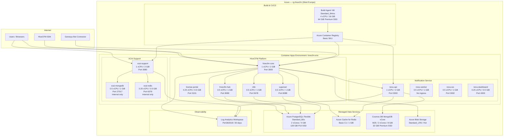
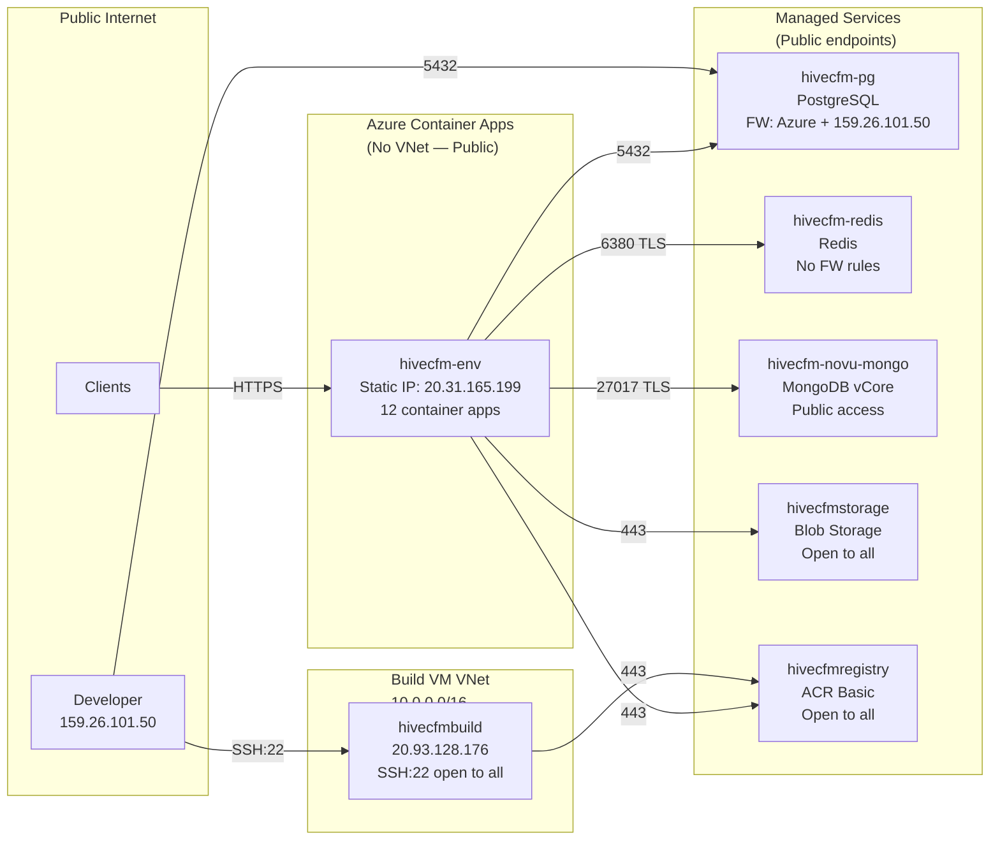
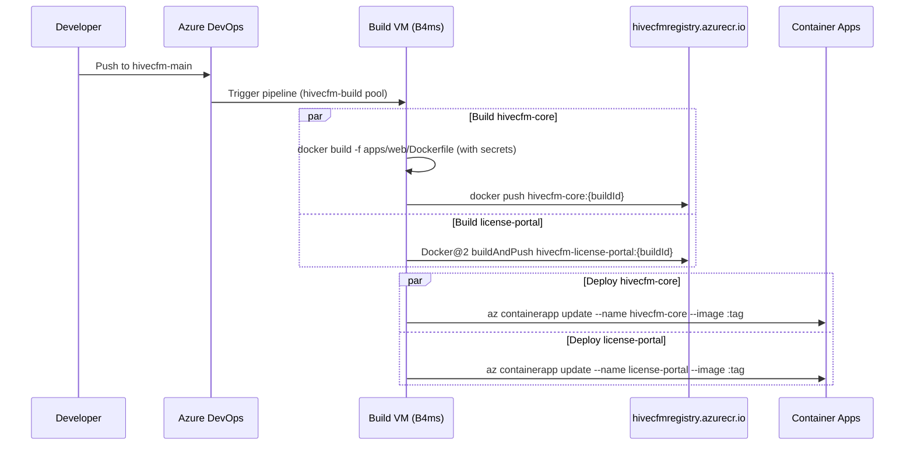
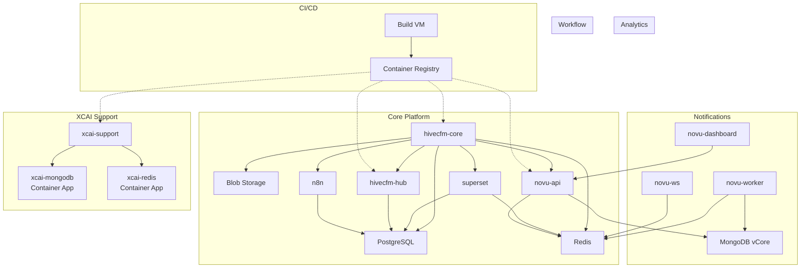

# HiveCFM Azure Infrastructure — Current Production Setup

**Resource Group**: `rg-hivecfm`
**Region**: West Europe
**Azure Subscription**: ISTCognitiveServices (Tenant: IST Networks / `istnetworks.com`)
**Azure DevOps Org**: `istnetworksrnd` — Project: `HiveCFM`

---

## 1. Architecture Diagram

---

## 2. Container Apps Environment

| Setting | Value |
|---------|-------|
| **Name** | `hivecfm-env` |
| **Plan** | Consumption (serverless) |
| **Workload Profile** | Consumption |
| **Default Domain** | `graypond-ce0467a0.westeurope.azurecontainerapps.io` |
| **Static IP** | `20.31.165.199` |
| **VNet Integration** | None (public environment) |
| **Log Destination** | Log Analytics (`7984a9a9-8530-4f42-ba7d-b2d9a9d6b1ab`) |

### 2.1 Container Apps Inventory

| # | App Name | Image | vCPU | Memory | Port | Ingress | Min/Max Replicas |
|---|----------|-------|------|--------|------|---------|:---:|
| 1 | `hivecfm-core` | `hivecfmregistry.azurecr.io/hivecfm-core:42` | 1.0 | 2 GiB | 3000 | External | 1 / 3 |
| 2 | `xcai-support` | `hivecfmregistry.azurecr.io/xcai-support:60` | 1.0 | 2 GiB | 3080 | External | 1 / 1 |
| 3 | `novu-api` | `hivecfmregistry.azurecr.io/novu-api:latest` | 1.0 | 2 GiB | 3000 | External | 1 / 2 |
| 4 | `hivecfm-hub` | `hivecfmregistry.azurecr.io/hivecfm-hub:latest` | 0.5 | 1 GiB | 8080 | External | 1 / 2 |
| 5 | `novu-worker` | `hivecfmregistry.azurecr.io/novu-worker:latest` | 0.5 | 1 GiB | — | **None** | 1 / 2 |
| 6 | `novu-ws` | `hivecfmregistry.azurecr.io/novu-ws:latest` | 0.5 | 1 GiB | 3002 | External | 1 / 2 |
| 7 | `superset` | `apache/superset:3.1.0` | 0.5 | 1 GiB | 8088 | External | 1 / 1 |
| 8 | `n8n` | `n8nio/n8n:latest` | 0.5 | 1 GiB | 5678 | External | 1 / 1 |
| 9 | `xcai-mongodb` | `mongo:8.0` | 0.5 | 1 GiB | 27017 | **Internal** | 1 / 1 |
| 10 | `novu-dashboard` | `hivecfmregistry.azurecr.io/novu-dashboard:latest` | 0.25 | 0.5 GiB | 4000 | External | 1 / 1 |
| 11 | `license-portal` | `hivecfmregistry.azurecr.io/hivecfm-license-portal:42` | 0.25 | 0.5 GiB | 3101 | External | 1 / 1 |
| 12 | `xcai-redis` | `redis:7-alpine` | 0.25 | 0.5 GiB | 6379 | **Internal** | 1 / 1 |
| | **TOTALS** | | **6.75** | **14 GiB** | | | |

### 2.2 Ingress & Networking

All external-ingress apps get a public FQDN under `*.graypond-ce0467a0.westeurope.azurecontainerapps.io`.

| App | FQDN | Visibility |
|-----|------|------------|
| `hivecfm-core` | `hivecfm-core.graypond-ce0467a0.westeurope.azurecontainerapps.io` | Public |
| `xcai-support` | `xcai-support.graypond-ce0467a0.westeurope.azurecontainerapps.io` | Public |
| `novu-api` | `novu-api.graypond-ce0467a0.westeurope.azurecontainerapps.io` | Public |
| `hivecfm-hub` | `hivecfm-hub.graypond-ce0467a0.westeurope.azurecontainerapps.io` | Public |
| `novu-ws` | `novu-ws.graypond-ce0467a0.westeurope.azurecontainerapps.io` | Public |
| `novu-dashboard` | `novu-dashboard.graypond-ce0467a0.westeurope.azurecontainerapps.io` | Public |
| `superset` | `superset.graypond-ce0467a0.westeurope.azurecontainerapps.io` | Public |
| `n8n` | `n8n.graypond-ce0467a0.westeurope.azurecontainerapps.io` | Public |
| `license-portal` | `license-portal.graypond-ce0467a0.westeurope.azurecontainerapps.io` | Public |
| `xcai-mongodb` | `xcai-mongodb.internal.graypond-ce0467a0.westeurope.azurecontainerapps.io` | **Internal** |
| `xcai-redis` | `xcai-redis.internal.graypond-ce0467a0.westeurope.azurecontainerapps.io` | **Internal** |
| `novu-worker` | — (no ingress) | None |

**Custom Domains**: None configured. All apps use the default Azure-generated FQDNs.
**TLS**: Automatic managed certificates via Azure Container Apps (HTTPS only).
**Scale Rules**: No custom scale rules configured — scaling is based on default HTTP concurrent requests.

### 2.3 Container Apps — Environment Variables

#### hivecfm-core (33 env vars)

| Category | Variables |
|----------|-----------|
| **Database** | `DATABASE_URL`, `SUPERSET_DB_URL` |
| **Cache** | `REDIS_URL` |
| **Auth** | `NEXTAUTH_URL`, `NEXTAUTH_SECRET`, `ENCRYPTION_KEY`, `CRON_SECRET` |
| **App** | `WEBAPP_URL`, `NODE_ENV`, `MAIL_FROM`, `MAIL_FROM_NAME`, `EMAIL_VERIFICATION_DISABLED`, `PASSWORD_RESET_DISABLED` |
| **Storage (S3/Blob)** | `S3_ACCESS_KEY`, `S3_SECRET_KEY`, `S3_REGION`, `S3_BUCKET_NAME`, `S3_ENDPOINT_URL`, `S3_PUBLIC_ENDPOINT_URL`, `S3_FORCE_PATH_STYLE` |
| **AI** | `OPENAI_API_KEY` |
| **Superset** | `SUPERSET_BASE_URL`, `SUPERSET_ADMIN_USERNAME`, `SUPERSET_ADMIN_PASSWORD`, `GUEST_TOKEN_JWT_SECRET`, `NEXT_PUBLIC_SUPERSET_BASE_URL` |
| **n8n** | `N8N_BASE_URL` |
| **HiveCFM Hub** | `HIVECFM_HUB_URL`, `HIVECFM_HUB_API_KEY` |
| **Notifications** | `NOVU_API_URL`, `NOVU_API_KEY` |
| **Licensing** | `HIVECFM_LICENSE_PUBLIC_KEY`, `MANAGEMENT_API_KEY` |

#### novu-api (28 env vars)

| Category | Variables |
|----------|-----------|
| **Database** | `MONGO_URL`, `MONGO_MAX_POOL_SIZE`, `MONGO_AUTO_CREATE_INDEXES` |
| **Cache** | `REDIS_HOST`, `REDIS_PORT`, `REDIS_PASSWORD`, `REDIS_TLS`, `REDIS_DB_INDEX`, `REDIS_CACHE_SERVICE_HOST`, `REDIS_CACHE_SERVICE_PORT` |
| **Auth** | `JWT_SECRET`, `STORE_ENCRYPTION_KEY`, `NOVU_SECRET_KEY` |
| **App** | `NODE_ENV`, `PORT`, `API_ROOT_URL`, `FRONT_BASE_URL`, `IS_SELF_HOSTED`, `NOVU_ENTERPRISE`, `DISABLE_USER_REGISTRATION` |
| **Features** | `IS_API_IDEMPOTENCY_ENABLED`, `IS_API_RATE_LIMITING_ENABLED`, `IS_V2_ENABLED`, `IS_NEW_MESSAGES_API_RESPONSE_ENABLED`, `SUBSCRIBER_WIDGET_JWT_EXPIRATION_TIME` |
| **Other** | `EE_AUTH_PROVIDER`, `NEW_RELIC_ENABLED`, `STEP_RESOLVER_DISPATCH_URL` |

#### xcai-support (38 env vars)

| Category | Variables |
|----------|-----------|
| **Database** | `MONGO_URI` |
| **Cache** | `USE_REDIS`, `REDIS_URI` |
| **Server** | `HOST`, `PORT`, `DOMAIN_CLIENT`, `DOMAIN_SERVER`, `NO_INDEX`, `TRUST_PROXY` |
| **Auth** | `JWT_SECRET`, `JWT_REFRESH_SECRET`, `CREDS_KEY`, `CREDS_IV`, `ALLOW_EMAIL_LOGIN`, `ALLOW_REGISTRATION`, `ALLOW_SOCIAL_LOGIN`, `ALLOW_SOCIAL_REGISTRATION`, `ALLOW_PASSWORD_RESET`, `ALLOW_UNVERIFIED_EMAIL_LOGIN` |
| **AI** | `KIMI_API_KEY`, `ANTHROPIC_API_KEY`, `ANTHROPIC_REVERSE_PROXY`, `ANTHROPIC_MODELS`, `KIMI_ANTHROPIC_BASE_URL`, `KIMI_BASE_URL`, `GLM_API_KEY` |
| **Zendesk** | `ZENDESK_SUBDOMAIN`, `ZENDESK_EMAIL`, `ZENDESK_API_TOKEN`, `ZENDESK_WEBHOOK_SECRET` |
| **Features** | `SEARCH`, `ENDPOINTS`, `ALLOW_SHARED_LINKS`, `ALLOW_SHARED_LINKS_PUBLIC`, `APP_TITLE` |
| **Logging** | `DEBUG_LOGGING`, `DEBUG_CONSOLE`, `CONSOLE_JSON` |

#### superset (7 env vars)

`SUPERSET_SECRET_KEY`, `SQLALCHEMY_DATABASE_URI`, `SUPERSET_CONFIG_PATH`, `REDIS_HOST`, `REDIS_PORT`, `REDIS_PASSWORD`, `GUEST_TOKEN_JWT_SECRET`

#### n8n (14 env vars)

`GENERIC_TIMEZONE`, `TZ`, `WEBHOOK_URL`, `N8N_HOST`, `N8N_PROTOCOL`, `N8N_PORT`, `DB_TYPE`, `DB_POSTGRESDB_HOST`, `DB_POSTGRESDB_PORT`, `DB_POSTGRESDB_DATABASE`, `DB_POSTGRESDB_USER`, `DB_POSTGRESDB_PASSWORD`, `DB_POSTGRESDB_SSL_REJECT_UNAUTHORIZED`, `NODE_ENV`

#### hivecfm-hub (8 env vars)

`API_KEY`, `DATABASE_URL`, `PORT`, `LOG_LEVEL`, `EMBEDDING_PROVIDER`, `EMBEDDING_PROVIDER_API_KEY`, `EMBEDDING_MODEL`, `EMBEDDING_NORMALIZE`

### 2.4 Image Registry Secrets

All container apps that pull from ACR share a single registry credential:
- **Secret Name**: `hivecfmregistryazurecrio-hivecfmregistry`
- **Registry**: `hivecfmregistry.azurecr.io`

---

## 3. Azure Database for PostgreSQL Flexible Server

| Setting | Value |
|---------|-------|
| **Name** | `hivecfm-pg` |
| **FQDN** | `hivecfm-pg.postgres.database.azure.com` |
| **Version** | PostgreSQL 17 |
| **SKU** | Standard_B2s (Burstable) |
| **Compute** | 2 vCores, 4 GiB RAM |
| **Storage** | 128 GiB, P10 Premium SSD, 500 IOPS |
| **Auto-grow** | Disabled |
| **Availability Zone** | 2 |
| **High Availability** | Disabled |
| **Backup Retention** | 7 days |
| **Geo-Redundant Backup** | Disabled |
| **Extensions** | `pg_cron`, `pg_stat_statements` |
| **Public Network Access** | **Enabled** |

### 3.1 PostgreSQL Databases

| Database | Used By |
|----------|---------|
| `hivecfm` | HiveCFM Core, HiveCFM Hub, n8n |
| `superset_app` | Apache Superset metadata + dashboards |
| `n8n` | n8n workflow engine |

### 3.2 PostgreSQL Firewall Rules

| Rule Name | Start IP | End IP | Description |
|-----------|----------|--------|-------------|
| `AllowAllAzureServicesAndResourcesWithinAzureIps` | `0.0.0.0` | `0.0.0.0` | Allows all Azure internal services |
| `AllowLocalDev` | `159.26.101.50` | `159.26.101.50` | Developer workstation access |

> **Note**: The `0.0.0.0 → 0.0.0.0` rule allows any Azure service to connect. This is convenient but broad — it means any service in any Azure subscription can reach the database if it has credentials.

---

## 4. Azure Cosmos DB for MongoDB vCore

| Setting | Value |
|---------|-------|
| **Name** | `hivecfm-novu-mongo` |
| **Connection String** | `mongodb+srv://<user>:<password>@hivecfm-novu-mongo.mongocluster.cosmos.azure.com/...` |
| **Compute Tier** | M25 (2 vCores, 8 GiB RAM) |
| **Storage** | 32 GiB Premium SSD |
| **High Availability** | Disabled |
| **Public Network Access** | **Enabled** |
| **Admin User** | `novu` |
| **Used By** | `novu-api`, `novu-worker` |
| **Auth** | SCRAM-SHA-256 with TLS |

---

## 5. Azure Cache for Redis

| Setting | Value |
|---------|-------|
| **Name** | `hivecfm-redis` |
| **Hostname** | `hivecfm-redis.redis.cache.windows.net` |
| **SKU** | Basic C1 (1 GiB) |
| **Port** | 6379 (non-SSL), 6380 (SSL) |
| **Non-SSL Port** | **Enabled** |
| **Minimum TLS** | 1.2 |
| **Public Network Access** | **Enabled** |
| **Firewall Rules** | None (open to all) |
| **Used By** | `hivecfm-core`, `novu-api`, `superset` |

---

## 6. Azure Container Registry

| Setting | Value |
|---------|-------|
| **Name** | `hivecfmregistry` |
| **Login Server** | `hivecfmregistry.azurecr.io` |
| **SKU** | Basic (10 GiB included storage) |
| **Admin User** | Enabled |
| **Public Network Access** | **Enabled** |
| **Network Rules** | None |
| **Created** | 2026-03-10 |

### 6.1 Repositories

| Repository | Description |
|------------|-------------|
| `hivecfm-core` | Main HiveCFM application |
| `hivecfm-license-portal` | License management portal |
| `hivecfm-hub` | Semantic search and analytics hub |
| `novu-api` | Notification service API |
| `novu-worker` | Notification background worker |
| `novu-ws` | Notification WebSocket gateway |
| `novu-dashboard` | Notification management UI |
| `xcai-support` | XCAI Support agent (LibreChat fork) |

---

## 7. Azure Blob Storage

| Setting | Value |
|---------|-------|
| **Name** | `hivecfmstorage` |
| **SKU** | Standard_LRS (locally redundant) |
| **Kind** | StorageV2 (general purpose v2) |
| **Access Tier** | Hot |
| **Public Blob Access** | **Enabled** |
| **Minimum TLS** | TLS 1.0 |
| **Network Rules** | Default action: **Allow** (open to all) |
| **Bypass** | Azure Services |

### 7.1 Containers

| Container | Purpose |
|-----------|---------|
| `hivecfm-uploads` | Survey file uploads, images, attachments |

---

## 8. Build Agent Virtual Machine

| Setting | Value |
|---------|-------|
| **Name** | `hivecfmbuild` |
| **Size** | Standard_B4ms (4 vCPU, 16 GiB RAM) |
| **OS** | Ubuntu 24.04 LTS |
| **OS Disk** | 64 GiB, Premium_LRS SSD |
| **Admin User** | `azureuser` |
| **Public IP** | `20.93.128.176` (Standard SKU, static) |
| **Purpose** | Azure DevOps self-hosted build agent for CI/CD pipeline |

### 8.1 Networking

| Resource | Value |
|----------|-------|
| **VNet** | `hivecfmbuildVNET` |
| **Address Space** | `10.0.0.0/16` |
| **Subnet** | `hivecfmbuildSubnet` (`10.0.0.0/24`) |
| **NIC** | `hivecfmbuildVMNic` |
| **NSG** | `hivecfmbuildNSG` |

### 8.2 NSG Firewall Rules

| Rule | Priority | Direction | Protocol | Source | Dest Port | Action |
|------|:---:|-----------|----------|--------|:---------:|--------|
| `default-allow-ssh` | 1000 | Inbound | TCP | `*` (any) | 22 | Allow |

> **Note**: SSH is open to all source IPs. Consider restricting to specific IP ranges.

---

## 9. Log Analytics Workspace

| Setting | Value |
|---------|-------|
| **Name** | `hivecfm-logs` |
| **SKU** | PerGB2018 (pay-per-GB) |
| **Retention** | 30 days |
| **Customer ID** | `7984a9a9-8530-4f42-ba7d-b2d9a9d6b1ab` |
| **Connected To** | Container Apps Environment `hivecfm-env` |

---

## 10. Network Topology

### 10.1 Service Connectivity Matrix

| From → To | hivecfm-core | novu-api | xcai-support | PostgreSQL | Redis | MongoDB | Blob |
|-----------|:---:|:---:|:---:|:---:|:---:|:---:|:---:|
| **hivecfm-core** | — | Yes | — | Yes | Yes | — | Yes |
| **novu-api** | — | — | — | — | Yes | Yes | — |
| **novu-worker** | — | — | — | — | Yes | Yes | — |
| **xcai-support** | — | — | — | — | — | — | — |
| **superset** | — | — | — | Yes | Yes | — | — |
| **n8n** | — | — | — | Yes | — | — | — |
| **hivecfm-hub** | — | — | — | Yes | — | — | — |

> `xcai-support` connects to its own internal `xcai-mongodb` and `xcai-redis` container apps, not to managed services.

---

## 11. CI/CD Pipeline

**Source**: Azure DevOps — `https://dev.azure.com/istnetworksrnd/HiveCFM/_git/hivecfm-core`
**Pipeline**: `azure-pipelines.yml`
**Trigger**: Push to `hivecfm-main` branch
**Agent Pool**: `hivecfm-build` (self-hosted on `hivecfmbuild` VM)

### 11.1 Pipeline Stages

| Stage | Job | What it does |
|-------|-----|--------------|
| **Build** | `BuildCore` | Docker build with BuildKit secrets (DATABASE_URL, ENCRYPTION_KEY, REDIS_URL, SENTRY_AUTH_TOKEN) → push to ACR |
| **Build** | `BuildLicensePortal` | Docker@2 buildAndPush → push to ACR |
| **Deploy** | `DeployCore` | `az containerapp update` with managed identity |
| **Deploy** | `DeployLicensePortal` | `az containerapp update` with managed identity |

> **Note**: Only `hivecfm-core` and `license-portal` are in the automated pipeline. Other apps (novu-*, superset, n8n, xcai-support, hivecfm-hub) are deployed manually.

---

## 12. Monthly Cost Breakdown

| Resource | SKU / Spec | Monthly Cost |
|----------|-----------|-------------:|
| **Container Apps** (12 apps, 6.75 vCPU, 14 GiB) | Consumption plan | ~$738 |
| **Build VM** | Standard_B4ms + 64 GiB P6 + Public IP | ~$148 |
| **Cosmos DB MongoDB vCore** | M25, 32 GiB | ~$116 |
| **PostgreSQL Flexible** | Standard_B2s, 128 GiB P10 | ~$71 |
| **Azure Cache for Redis** | Basic C1 | ~$27 |
| **Container Registry** | Basic | ~$5 |
| **Blob Storage** | Standard_LRS Hot | ~$2-5 |
| **Log Analytics** | PerGB2018, ~5 GB/mo | ~$10-15 |
| **Public IP** (build VM) | Standard Static | ~$4 |
| **TOTAL** | | **~$1,120 - $1,130** |

---

## 13. Security Assessment & Recommendations

### 13.1 Current Security Posture

| Area | Current State | Risk Level |
|------|--------------|:---:|
| PostgreSQL public access | Enabled, FW allows all Azure services | Medium |
| Redis public access | Enabled, no firewall rules | **High** |
| Redis non-SSL port | Enabled (6379) | **High** |
| MongoDB public access | Enabled | Medium |
| Storage TLS minimum | TLS 1.0 | **High** |
| Storage public blob access | Enabled | Medium |
| Build VM SSH | Open to all IPs (`*`) | **High** |
| ACR admin user | Enabled (password-based) | Medium |
| Container Apps VNet | Not configured (public environment) | Medium |
| Custom domains | None (using Azure-generated FQDNs) | Low |

### 13.2 Recommended Improvements

1. **Redis**: Disable non-SSL port, add firewall rules to restrict to Container Apps outbound IPs only
2. **Storage**: Upgrade minimum TLS to 1.2, disable public blob access unless required
3. **Build VM SSH**: Restrict NSG rule to specific developer IPs or use Azure Bastion
4. **PostgreSQL**: Remove `AllowAllAzureServices` rule, add specific Container Apps outbound IPs
5. **ACR**: Switch from admin user to managed identity for Container Apps image pulls
6. **Container Apps**: Add VNet integration for private service-to-service communication
7. **Custom Domains**: Configure custom domains with managed certificates for production URLs

---

## 14. Resource Dependencies

**Critical Path**: If PostgreSQL goes down, the following apps are affected: `hivecfm-core`, `superset`, `n8n`, `hivecfm-hub`.

**Independent Stacks**:
- Notification service (novu-*) depends only on MongoDB + Redis
- XCAI Support depends only on its internal MongoDB + Redis containers
